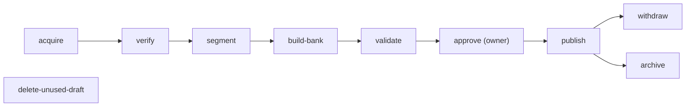

# Qatra — API Specification (`/api`)

Version 1.8 · 2026-10-06 · Version 1.8 is an amendment record (D91, owner, 5 October 2026; numbered 1.8 at the merge with main, whose versions 1.6 and 1.7 record D92): the web admin under `/api/admin` is specified in [Content-admin.md](Content-admin.md) and amends §0 and §5 below; no other section changes. Status: Approved: D74, 4 October 2026 (owner: «approve best practice», «q7 approved») for the v1.1 content; Approved: D75, A1 (owner, 4 October 2026: «A1 approved , best practice») for the D75 additions of version 1.2 (E31–E34, §4.10); the version 1.3, 1.4 and 1.5 additions are implementation clarifications (implementation record, no new owner approval); the version 1.6 and 1.7 additions record D92 (Approved: owner, 5 October 2026)

Owner of this draft: Solutions Architect (Role 3), for the root coordinator. This is design documentation only: no endpoint exists, every application path is Planned (D61), and implementation is not authorized until the architecture deliverables are presented and explicitly approved (D69).

**Version 1.7 (5 October 2026).** Records the D92 Lessons endpoints (Approved: owner, 5 October 2026): E35 `GET /api/lessons` and E36 `GET /api/lessons/:sectionId` (§4.11; E35 is the next free number after E34), the read-only Lessons tab. Both are GET only, Session read class, `no-store`; no table, migration, DTO field of an existing operation or limit is added. Reading time is credited through the existing E21 events (§4.11). Implemented locally on branch `question-bank-fixes` (local tests only, not deployed, not Verified).

**Version 1.6 (5 October 2026).** Records D92 (Approved: owner, 5 October 2026; additive changes only): the E20 daily-session order (new material first, then due reviews, quick drills and the end test), the whole-passage `QuestionBase.context` with `ayahEnds` (replacing ±6 words), `referenceAr` on `SourceRef` and `PassageView` (the source line is shown only after the answer), `Estimate.dailyNew` in E15 (whole-unit daily pace) and the plan-card and reply-guard wording of the plan conversation; §5 gains a one-line note on the `propose-questions` CLI step. No endpoint, error code or limit is added. Implemented locally on branch `question-bank-fixes` (local tests only, not deployed, not Verified). The read-only Lessons tab approved in D92 is documented in version 1.7 (§4.11).

**Version 1.5 (5 October 2026).** Clarifications, no new behaviour; implementation record, no new owner approval. It adds §5.5, which records what the operator CLI implementation (commit bde8bd1, merge 3d40a3e, on main by PR #14) settled for the scope of D83: `verify` has an optional source-only mode for that one scope, `segment`, `build-bank` and `validate` follow the scope of the first `acquire`, `approve` takes the owner's words typed in the chat as its confirmation, and `publish` exists in SQL-file mode (one transactional file that the owner applies; the upload to the private bucket is deferred). No endpoint, DTO field, error code, limit or status is added or changed, and the text of §5.1 to §5.4 and of every other section is unchanged; the lead of §5 gains a one-line pointer to §5.5. Implemented locally (local tests only); nothing is published and this version records no deployment of this code.

**Version 1.4 (5 October 2026).** Clarifications, no new behaviour; implementation record, no new owner approval. It records what the B6 checkpoint 2 implementation (merge d145f0c) and the W-INT wiring (merge ce86d04) settled where this file was silent: the reason codes in use and the handling of a few cases of E21, the 30-minute bound of `durationMs`, the dating of `daily`, the meaning of the E22 summary counts, and the exact meaning of several fields of E18 and E19. It also adds the two proxy-chain measures of the access log to the logging rules (§1.12; commit 66f9743, W-OPS2, verified by the coordinator and merged as 76a25bd). No endpoint, DTO field, error code, limit or status is added or changed, and the existing text and examples are unchanged apart from that §1.12 line. Implemented locally (local tests only); this version records no deployment of this code.

**Version 1.3 (4 October 2026).** Implementation record, no new owner approval. It records what the B13 and B6 implementations clarified: the `422 validation_error` of E34 for a proposal rule that no longer holds, the `404` of E34 for a vanished placement session, the `503` that E31 and E34 answer on a cross-process race on the open-conversation index, the meaning of `PlanChat.modelTurnsLeft` (§4.10.1), and the difference C-17 (§8.1) between S-4 and A-08/O-32, resolved as: E21 accepts events for sessions of `active` and `completed` plans. No endpoint, DTO field or limit is added. Nothing is deployed; local tests only.

**Version 1.2 (4 October 2026).** Adds the plan conversation (D75; [Plan-conversation.md](Plan-conversation.md) v1.1): operations E31–E34 (§2.2, new §4.10), the rate class "Chat write" and the shared free-model budget note (§1.8), the conversation limits (§1.7), the conversation entries of the logging rules (§1.12), the `details` reasons `proposal_stale` and `chat_closed` (§1.5), `PlanProgress.currentVersion` on E19 and `Today.openPlanChatId` on E18, the difference C-16 (§8.1) and the open points O-31 and O-32 (§8.2). One configuration change is a coordinator decision outside D75: the `targetScope.sectionOrdinals` default is raised from 40 to 60 entries (§1.7, §4.5; the Forty has 41–42 sections; A-12 configuration, not an approved number). Every D75 addition is marked **Approved — D75, A1 (owner, 4 October 2026)**; the v1.1 content remains Approved — D74. Owner decision A2 stays declined: takhrij is not a memorization path (`Path` keeps its four values). Nothing is built or tested.

**Version 1.1 (4 October 2026).** The coordinator consistency pass resolved differences C-02..C-15 and the open points per §8, and the items formerly marked "owner confirms" (Q1–Q7) are confirmed by D74 (4 October 2026; owner: «approve best practice», «q7 approved»). Approval covers this document as a design only; nothing is built or tested.

**Contents:** [0 Scope and authority](#0-scope-authority-and-how-to-read-this-file) · [1 Conventions](#1-conventions) · [2 Access matrix](#2-access-matrix) · [3 Common session validation](#3-server-side-validation-rules-common-to-sessions) · [4 Endpoints E01–E36](#4-endpoint-specifications) · [5 Operator CLI](#5-operator-cli-interface-no-http) · [6 Keep-awake job](#6-keep-awake-job-interface-d72) · [7 Traceability](#7-traceability) · [8 Differences and open points](#8-differences-between-sources-and-open-points)

## 0. Scope, authority and how to read this file

**Purpose.** This file specifies every HTTP operation of the Qatra backend (FastAPI on Render, reached same-origin through Next.js rewrites), the operator CLI (no HTTP) and the keep-awake job. It refines [Implementation-contract.md](Implementation-contract.md) §7 (v1.4; the D75 additions are in v1.5, §14); it does not replace it.

**Authority order** (a later explicit owner decision wins over an earlier document):

1. Owner decisions D66–D72 and the architect directives 1–7; D75 with its approval A1 (plan conversation) for E31–E34.
2. Implementation-contract v1.3: §6 authentication, §7 DTOs and endpoint table, §8 configuration.
3. [Architecture-and-data.md](Architecture-and-data.md) («عقود API المخططة»), [Authentication-and-privacy.md](Authentication-and-privacy.md), [PWA-design.md](PWA-design.md), [AI-agent.md](AI-agent.md).
4. [PRD.md](PRD.md) v14 (modules M1–M12, NFR-01..14, roles matrix; Approved by D71).
5. [Programming-guide.md](Programming-guide.md) (endpoint → router → service map).

Where sources differ, the contract plus the D-decisions are followed and the difference is listed in §8.1 (`C-xx`). [Database-schema.md](Database-schema.md) (the physical schema, v1.1, approved by D74) is this file's companion: where it fixes a database fact (catalog views, `srv_*` functions, value sets, deletion order) this file cites it.

**Status vocabulary.** This file is `Approved` as a design by D74 (4 October 2026); the owner-confirm items of the earlier draft (Q1–Q7) are confirmed by D74. Nothing in it is `Implemented` or `Verified`.

**Numbers.** A number appears only if it is in an approved document or the contract. Anything else is marked `[O-xx]` and listed in §8.2. A gap-filling choice by the architect is labelled **Proposed** and always carries an `[O-xx]`. In version 1.1 the architect decisions on these points are recorded in §8.2 as **Decided (A-xx; approved by D74)**; the numbers among them are configuration defaults, not approved numbers, and only the owner can approve them.

**Notation.** `E01`–`E30` identify operations. DTO type names (`Profile`, `Plan`, `SessionSnapshot`, …) are the contract §7 names. A response shape that has no contract type name is written inline. Paths are always written in full, with the `/api` prefix.

**Inventory.** 30 HTTP operations: the 28 operations of contract §7 (GET and PATCH `/me` counted separately), plus `GET /api/health/ready` (directive 1), plus E30 `POST /api/plans/:id/resume` (contract v1.4 amendment, D74). Version 1.2 adds E31–E34 (D75, plan conversation): 34 HTTP operations in total. Version 1.7 adds E35–E36 (D92, Lessons): 36 HTTP operations in total. Under the same proposed amendment E13 is `POST /api/account/delete` (§8.3).

**Not specified here.**

- The conditional D45 feedback endpoints (Architecture-and-data «عقد الملاحظات الشرطي», Programming-guide §6). They depend on the Day-1 gate (D43–D45) and are outside contract §7 [C-14].
- Any HTTP content-management endpoint. None exists by design (D43/D44; Programming-guide §6: no public CRUD for CLI operations). Content work is the operator CLI (§5). **D91 amendment (5 October 2026):** a content-manager web admin under `/api/admin` now exists as an owner-approved exception, specified in [Content-admin.md](Content-admin.md) (read, display-metadata edit, delete of unused items, withdraw and hide/show; no create, no account management). The CLI remains the only path for acquire, verify, segment, build-bank, validate, approve and publish.

## 1. Conventions

### 1.1 Transport and versioning

- **Base path** `/api`, unversioned (directive 6). Paths are exactly those of contract §7. A breaking change needs a new path; an existing path never changes meaning silently. Additive changes (a new optional response field) are non-breaking, so clients must ignore unknown response fields. Offline payloads carry `protocolVersion` (and `schemaVersion` on snapshots).
- **Same origin.** The browser talks only to the frontend origin. Next.js `rewrites()` forward `/api/*` to `BACKEND_ORIGIN` (Render). There is **no CORS**: the backend sets no `Access-Control-*` header and serves no preflight. No Next.js route handler or Server Action implements API logic (contract §1).
- **Client IP** used by the auth throttle comes from the value the trusted proxy adds, never from a header the client controls. A test proves this before the build (Architecture-and-data).
- **Free-server cold start** behaviour is in §1.11.

### 1.2 Representation

- Request and response bodies are JSON, UTF-8, **camelCase** keys. Content type `application/json; charset=utf-8`. Endpoints with no response body return `204`.
- Request bodies are validated **strictly**: a missing required field, a wrong type or an unknown property is a `422 validation_error` (Programming-guide: reject unknown or untrusted authority flags).
- Endpoints documented as "no body" ignore an empty body or `{}`.
- Identifiers are UUID strings (canonical lowercase 8-4-4-4-12). `TokenRef` is the string `"<unitOrdinal>:<tokenIndex>"` (contract §2.2). Percentages are integers (the overall percentage is floored, contract §4.7; the rounding of the daily percentage is open [O-24]). Durations are integer milliseconds.
- Religious text is returned **exactly as stored** (NFC; publisher zero-width characters preserved). The API never trims, normalizes or rewrites it (D03/D20). HadeethEnc commentary and QuranEnc translations or tafsir are never stored or returned (D68).
- Dates and times: see §1.10.

### 1.3 Authentication, session cookie and Origin check

- **Session cookie** `__Host-qatra_session`: `Secure; HttpOnly; SameSite=Strict; Path=/`, no `Domain` attribute (contract §6). In local http development the cookie is `qatra_session` without the prefix and without `Secure`.
- The cookie value is 32 random bytes. The server stores only `HMAC-SHA256(QATRA_SESSION_HMAC_KEY, token)` and, encrypted with AES-256-GCM (`QATRA_SESSION_KEY`), the Supabase access/refresh tokens. `expires_at = creation + 30 days`. No sliding renewal is defined.
- **Every Session and Demo endpoint** resolves the cookie through the limited database role, then rejects the request with `401 unauthenticated` if the session is missing, revoked or expired, or if its `auth_epoch` differs from the account's current epoch (a password change or reset increments it). Access tokens are refreshed server-side; a failed refresh ends the session.
- **The browser never receives Supabase tokens** and never sends an `Authorization` header. Learner data calls use the user's access token so row-level security applies; `service_role` never serves a learner request (contract §3.2).
- **Origin check.** Every state-changing request (POST, PATCH, DELETE), including anonymous ones (register, login, recovery, demo account), must carry `Origin` equal to `FRONTEND_ORIGIN`. Otherwise `403 forbidden_origin`, evaluated before authentication and body processing. A missing `Origin` counts as a mismatch. GET requests never change state and are exempt.
- **No client authority.** No endpoint accepts `userId`, `isDemo`, `mode`, `correct`, mastery or daily totals from the client (contract §7 server-side rules). Identity and demo status come only from the session.

### 1.4 Authorization and ownership

- A resource addressed by id is resolved **inside the caller's own rows**. An unknown id and another learner's id both return `404 not_found` and are indistinguishable (never `403`, never an existence leak).
- Row-level security (`user_id = (select auth.uid())`, composite parent foreign keys) is the second layer. The API checks scope, plan, edition and ownership itself regardless of RLS (Architecture-and-data «RLS والحدود»).
- A role-based denial (a learner calling a demo-only endpoint, or a demo account calling a learner-only endpoint) returns `403`. Contract v1.3 has no code for it: the code is `forbidden` (decided, A-12; contract v1.4 amendment (D74), item 5; approved by D74) [O-05].

**Database roles** (directive 7; contract §3.2, §8):

| Role | Used for | Operations |
|---|---|---|
| `anon` | published catalog metadata only (a `public.catalog_*` view or column-level grants); no access to units, passages, parts, lessons or questions | E14 |
| `authenticated` (the user's JWT, held only by the backend) | the learner's own rows under RLS | learner data of every Session endpoint |
| `qatra_server` (separate limited login role, secret `QATRA_SERVER_DB`) | `EXECUTE` on `srv_*` SECURITY DEFINER functions only: account lookup, session lookup and verification, logout, password change, recovery-code rotation, throttling, and the other `private.*` access in register, recovery and delete | E02 (`select 1`), E03–E10, E13, E26, and session validation on every Session/Demo endpoint |
| `service_role` | Supabase Auth Admin API (create user, reset password by recovery, delete account) and content publishing only | E03, E07, E13, E26; CLI `publish` and `withdraw`; never `srv_*` functions except `srv_redact_revoked_content` (CLI `withdraw`, A-04), never learner requests |

### 1.5 Error envelope and error codes

Every error from the application uses one envelope (contract §7):

```json
{ "error": { "code": "snake_case", "message": "safe text", "details": {} } }
```

- `message` is a short generic English sentence for developers. It never contains submitted values (passwords, recovery codes, answers), tokens, secrets, SQL or stack traces. Clients render their own Arabic/English UI text from `code`.
- Clients branch on `error.code`, **not on status alone**: `401` has two codes and only `unauthenticated` means the session ended.

**Codes defined by the contract (closed list):**

| Status | Code | Used when |
|---|---|---|
| 400 | `terms_required` | registration (normal or demo) or consent without `termsAccepted === true` and the current `TERMS_VERSION` |
| 401 | `unauthenticated` | no, invalid, expired or revoked session, or `auth_epoch` mismatch |
| 401 | `invalid_credentials` | wrong username/password or recovery code (generic; never says which part); also a wrong current password on a re-authentication endpoint [O-11] |
| 403 | `forbidden_origin` | `Origin` differs from `FRONTEND_ORIGIN` on a mutation |
| 404 | `not_found` | unknown or not-owned resource |
| 409 | `username_taken` | the normalized username already exists |
| 409 | `version_conflict` | an `expectedVersion` or `expectedPlanVersion` mismatch (including a stale plan version on an offline snapshot, C-11), an idempotent id reused with different input, a plan that is not active, a race on the one-active-plan rule; always with `details.reason` |
| 422 | `validation_error` | schema or rule violation, forbidden field, invalid reference, scope or edition |
| 429 | `throttled` | auth throttle or another rate limit |
| 500 | `internal` | unexpected failure (safe message, no details) |
| 503 | `unavailable` | database, Supabase Auth or another dependency unavailable; readiness failure |

**Not in contract v1.3 — decided (A-12, 4 Oct 2026; contract v1.4 amendment (D74), item 5; approved by D74) [O-05]:** `forbidden` (403, role-based denial) and `payload_too_large` (413, body above the 64 KiB cap of §1.7).

**`details` shapes — decided (A-12; contract v1.4 amendment (D74), item 5) [O-05]** (contract v1.3 defines only `{}`):

| Code | `details` |
|---|---|
| `validation_error` | `{"fields":[{"field":"events[3].correct","rule":"forbidden_field"}]}`; values are never echoed |
| `version_conflict` | `{"reason":"plan_version","currentVersion":3}`; reasons used in this file: `plan_version`, `idempotency_input`, `plan_not_active`, `estimate_changed`, `active_plan_conflict`; and, from v1.2 (D75), `proposal_stale` and `chat_closed` (E32, E34; §4.10) |
| `throttled` | `{"retryAfterSec":900}` and a `Retry-After` header on every `429` (A-12) |
| `terms_required` | `{"requiredVersion":"2026-10-04"}` |

Framework-generated errors (unknown route, wrong method, wrong content type, unparsable JSON) are converted into the envelope (`not_found` for 404/405, `validation_error` for 415 and for unparsable JSON). Errors produced by Vercel or Render themselves (gateway timeouts, 502/503 from a sleeping free server) are **not** in the envelope; the client treats them as connectivity (§1.11).

### 1.6 Idempotency and concurrency

| Mechanism | Where | Behaviour |
|---|---|---|
| `clientEventId` (UUID) | E21 | unique per account (`attempts` and `session_activity_intervals`: `unique(user_id, client_event_id)`); a repeat is listed in `duplicate` and has no second effect |
| `clientOperationId` (UUID) | E23 | `unique(user_id, client_operation_id)`; same input → `200` with the same snapshot; changed input → `409 version_conflict` (`idempotency_input`) |
| get-or-create | E20 `kind=daily` | atomic (A-01): returns the open session of today's learning date (`200`) or creates one (`201`) |
| naturally idempotent | E05 (same version), E10, E22 | a repeat returns the same result; no second effect |
| optimistic version | E17 `expectedVersion`; E20, E23 `expectedPlanVersion` | mismatch → `409 version_conflict` with `details.currentVersion`; E25 reports `stale` in its body instead |
| `Idempotency-Key` header | none required | contract §7 says mutations accept it "where noted" but notes no endpoint; E22 accepts an optional UUID header only (PWA-design §5: stable operation id; contract v1.4 amendment (D74), item 6); no required key in v1 stays open, deferred [O-06] |
| none | E03, E16, E20 (`game`, `placement`), E26, E28 | each call creates; the client must not retry automatically [O-20] |

Database constraints are the final arbiter (partial unique index on `master_plans(user_id) where status='active'`, unique event ids, unique `(user_id, client_operation_id)`); a service never relies on read-then-write alone.

### 1.7 Limits

**Approved numbers used in this file**

| Item | Value | Source |
|---|---|---|
| `events` per E21 request | ≤ 100 | contract §7 |
| Username length | 3–24 characters | contract §6 |
| Password | ≥ 15 Unicode characters and ≤ 72 bytes in UTF-8 | contract §6 |
| Recovery code | 16 random bytes (128 bits) = 32 hex characters, displayed in groups of four separated by `-` | contract §6 |
| Reset grant lifetime | 10 minutes (`expiresInSec` = 600) | contract §6 |
| App session lifetime | 30 days | contract §6 |
| Auth throttle | 5 failures in 15 min → progressive delay; 20 failures → `429` for 15 min | contract §6, NFR-06 |
| `private.auth_throttle` rows | deleted after 24 hours | Authentication-and-privacy |
| `sessionMinutes` | 5, 10 or 15 | contract §3.2, §5 |
| Capacity (new words per learning day) | 5 min → 12, 10 min → 25, 15 min → 40 | contract §5 |
| Estimate | `days = ceil((totalWords − knownWords) / capacity × 1.15)` | contract §5 |
| Placement session | up to 8 passages | D66, contract §5 |
| Game session | up to 10 questions | D66, contract §5 |
| Daily session | review questions capped at 6/10/14 and end test of 3/5/7 for 5/10/15 min | contract §5 |
| Activity event bounds | `endedAt ≤ serverNow + 60 s`; `startedAt ≥ session.createdAt − 60 s`; `activeMs ≤ endedAt − startedAt + 1000 ms`; ≤ 30 min per event | contract §7 |
| Teaching Agent timeout | 8 s | contract §5 |
| Wake-up (client) | message ≤ 1 s; polling 1, 2, 4, 8 s capped at 10 s; ≤ 90 s total | NFR-02, D70 |
| API ready after first wake request | ≤ 60 s at p95 | NFR-02, D70 |
| Warm latency targets | p95 ≤ 500 ms (read), ≤ 800 ms (write); targets, not SLAs | NFR-03 |
| Users | at most 10 in total, hence ≤ 10 concurrent | D67, D72, NFR-04 |

**Configuration defaults (A-12), not approved numbers.** These values are architect decisions (approved by D74), held as tunable configuration and not as code constants. They are not approvals of numbers by the owner.

| Item | Default | Source |
|---|---|---|
| Request body size | 64 KiB globally; larger → `413 payload_too_large` | A-12 [O-01] |
| `downloadTargetRefs` (E23) | ≤ 60 entries | A-12 [O-25] |
| `passageIds` (E20 `game`) | ≤ 60 entries | A-12 [O-01] |
| `targetScope.sectionOrdinals` | ≤ 60 entries (raised from 40 in v1.2: the Forty has 41–42 sections; coordinator decision, 4 October 2026) | A-12 [O-01] |
| `durationMs` of an answer event | ≤ 30 minutes; the 30-minute bound applies to `endedAt − startedAt` of an activity event | A-12 [O-22], [O-23] |
| Prepared sessions per snapshot (E23) | at most 7 | A-12 [O-25] |
| `ProgressResponse.history` (E19) | the last 30 learning days | A-12 [O-09] |
| Auth throttle detail | one-minute buckets, so "5 failures in 15 minutes" is a sliding sum; after the 5th failure the delay is 1, 2, 4, 8 s, then 10 s per failure (cap 60 s); a successful login clears the username key; failed password checks on E08, E09 and E13 count under the same username key; registrations do not count | A-03 [O-04] |
| Throttle row purge | opportunistic and bounded (`DELETE … LIMIT 100` via a ctid subselect) inside `srv_throttle_record`, for rows with `window_start < now() - interval '24 hours'`; no scheduled job | A-03 [O-04] |
| Keep-awake retry | 1, 2, 4, 8 s, then 10 s steps, up to 90 s | A-06 [O-29] |
| Per-IP rate limits | see §1.8 | A-12 [O-03] |

**Plan conversation limits (D75; Approved — D75, A1 (owner, 4 October 2026)).** Configuration defaults taken from Plan-conversation §1.2 (NFR-15 to NFR-18), §2.1, §2.3, §2.4 and §2.5; they are tunable settings, not promises (A4: «use best practice as mentioned in open router»). The OpenRouter figures are the coordinator's reading of OpenRouter's published limits for free models without purchased credits and are verified at provisioning [O-31].

| Item | Default | Source |
|---|---|---|
| `goalText` (E31), `text` (E32) | ≤ 500 characters (`goalText` after trimming) | Plan-conversation §2.3 |
| Stored message text | ≤ 2 000 characters | Plan-conversation §2.1 |
| Model reply shown to the learner | ≤ 600 characters, after the output guard | Plan-conversation §2.4 |
| Messages sent to the model | the last 10 | Plan-conversation §2.4 |
| Model timeout | 8 s (`QATRA_CHAT_MODEL_TIMEOUT_SEC`) | Plan-conversation §2.5; contract §5 |
| Model output size | 400 tokens (`QATRA_CHAT_MAX_TOKENS`) | Plan-conversation §2.5 |
| Model turns per conversation | 6 (`QATRA_CHAT_MODEL_TURNS_PER_CHAT`) | Plan-conversation §2.5 |
| Model calls per account per day | 10 (`QATRA_CHAT_MODEL_CALLS_PER_ACCOUNT_PER_DAY`) | Plan-conversation §2.5 |
| Model requests, whole deployment (shared with E28) | 50 per day (`QATRA_OPENROUTER_FREE_REQUESTS_PER_DAY`) and 20 per minute (`QATRA_OPENROUTER_FREE_REQUESTS_PER_MINUTE`) | Plan-conversation §2.5 |
| Guard version | `guard-v1` (`QATRA_CHAT_GUARD_VERSION`) | Plan-conversation §2.5 |
| Open conversations per account | 1 | Plan-conversation §2.1 |
| Abandoned conversation | superseded by a newer conversation, or older than 7 days (configuration) | Plan-conversation §2.1 |
| Learning record sent for a revision | the daily-time history of the last 30 learning days and the last 50 attempts | Plan-conversation §2.4 |
| Assistant latency (targets, not SLAs) | p95 ≤ 10 s with the model; p95 ≤ 1 s for rules replies | NFR-15 |

**Still open:** request timeouts [O-02], deferred to B0 (verify during the build).

### 1.8 Rate-limit classes

Only the auth throttle has approved numbers. The per-IP values below are configuration defaults (A-12), not approved numbers; they count requests per client IP per minute [O-03].

| Class | Operations | Limit |
|---|---|---|
| Auth throttle | E04, E06, and failed password checks on E08, E09, E13 under the same username key (A-03) | 5 failures in 15 min → progressive delay (1, 2, 4, 8 s, then 10 s per failure, cap 60 s); 20 failures → `429` for 15 min; a successful login clears the username key; registrations do not count; keys = `HMAC(QATRA_THROTTLE_HMAC_KEY, normalized username)` and `HMAC(…, IP /24 or /48 prefix from the trusted proxy)`; values stored are hashes, never the name or the IP |
| Liveness | E01 | no database, no authentication; A-12 sets no separate number |
| Readiness | E02 | 6 per client IP per minute (configuration default, A-12) |
| Public read | E14 | 60 per client IP per minute (configuration default, A-12) |
| Anonymous entry | E03, E26 | 10 per client IP per minute (configuration default, A-12) |
| Session read | E11, E15, E18, E19, E24, E33, E35, E36 | 120 per client IP per minute (configuration default, A-12) |
| Session write | E05, E08, E09, E10, E12, E13, E16, E17, E20, E21, E22, E23, E25, E30 | 60 per client IP per minute (configuration default, A-12) |
| Chat write | E31, E32, E34 | 20 per client IP per minute (configuration default; D75, Approved — D75, A1 (owner, 4 October 2026)) |
| Demo | E27, E28, E29, plus the usage and budget limit of D29 | A-09 (confirmed by D74, Q6): at most 5 demo accounts per client IP per day (E26); at most 10 `POST /demo/plans` per demo account per day (E28); demo Teaching-Agent calls draw on a configured daily free budget and fall back to the rules engine when it is exhausted (D54/D60). Values are configuration, not code |

Every `429 throttled` carries a `Retry-After` header (seconds; A-12). Capacity assumption: at most 10 users (NFR-04); a limit that is reached never triggers a paid fallback (D60).

**Shared model budget (D75; Approved — D75, A1 (owner, 4 October 2026)).** The demo planner (E28, the Demo row above) and the plan conversation (E31, E32) draw on one daily free budget of the whole deployment: `QATRA_OPENROUTER_FREE_REQUESTS_PER_DAY` default 50 and `QATRA_OPENROUTER_FREE_REQUESTS_PER_MINUTE` default 20 (OpenRouter's published limits for free models without purchased credits, as read by the coordinator; verified at provisioning [O-31]). In addition each account has 10 model calls per day and each conversation 6 model turns (§1.7). Reaching any of these caps is **not** an error and never a `429`: the conversation answers with a rules reply (`kind = 'fallback'`) and E28 falls back to the rules engine; only the per-IP classes above produce `429 throttled`. A cap never triggers a paid fallback (D60).

### 1.9 Cache-Control

| Responses | `Cache-Control` |
|---|---|
| All Anonymous-entry, Session and Demo operations (E03–E13 and E15–E36) | `no-store` (personal and offline data; Authentication-and-privacy, PWA-design §5) |
| E24 (snapshot download) | `no-store` (contract §7) |
| E01, E02 | `no-store`: they are wake-up and keep-alive probes and must always reach the origin |
| E14 (catalog metadata) | `no-store`; public catalog caching is deferred |

`Cache-Control: no-store` applies everywhere in v1 (A-12, decision on [O-07]).

The service worker never caches `/api/*` (network-only, PWA-design §3) and no CDN caches API responses.

### 1.10 Date and time formats

| Type | Format | Rules |
|---|---|---|
| `ISODate` | `YYYY-MM-DD` | a **learning date**, expressed in the account time zone in effect on that day (D57); local midnight starts a new learning day |
| `ISODateTime` | RFC 3339 UTC, e.g. `2026-10-04T08:15:00Z` | every timestamp in requests and responses |
| time zone | IANA name, e.g. `Asia/Dubai` | must be a member of the IANA database |
| durations | integer milliseconds | `activeMs`, `durationMs`, `dailyGoalMs`, `dailyActiveMs`, `extraActiveMs` |

The server clock is the only clock the server trusts. `occurredAt`, `startedAt`, `endedAt` and `localSequence` are inputs to be checked, never proof of time (D59). A time zone or `sessionMinutes` change takes effect from the **next learning day** (D57); until then the current values stay in force and the change is reported in `Profile.pendingSettings`.

### 1.11 Wake-up behaviour of the free server (NFR-02, D70, D48)

- The Render free web service stops after 15 minutes without requests and wakes in about one minute (Architecture-and-data §التشغيل; limits to be re-checked before deployment).
- **Server side.** `GET /api/health` stays cheap: no database, no authentication, minimal body, answered as soon as the process is up. The API is expected to be ready within 60 s (p95) after the first wake request.
- **Client side (contract for the frontend).**
  1. Show «جارٍ تشغيل الخادم المجاني، قد يستغرق ذلك دقيقة.» within 1 s of the first slow or failed request.
  2. Poll `GET /api/health` with short requests (never one long request) with backoff 1, 2, 4, 8 s, then every 10 s, for up to 90 s in total.
  3. After 90 s show a retry button.
  4. When health answers: `GET /api/me` → revalidate (E25) → replay events (E21) (PWA-design §6).
- A wake-up timeout, an un-enveloped 5xx or a gateway error is a **connectivity state**. It never marks a snapshot `stale`, `revoked` or `expired`, never clears the outbox and never asks for a new login (D48, D70).
- Requests that create rows without an idempotency mechanism (§1.6) are never retried automatically.
- **Unverified risk:** the Vercel rewrite timeout might cut a request that waits for Render to wake. Wake requests are therefore short, and the behaviour must be checked during the build [O-02].
- `GET /api/health/ready` touches the database and is **not** part of the wake-up loop; only the keep-awake job (§6) and operators call it.

### 1.12 Logging and privacy rules for the API

- Logs are structured and carry no personal data: method, route template, status, latency, error code (NFR-13). From v1.4 the access log also carries two proxy-chain measures: `xff_entries`, the number of non-empty `X-Forwarded-For` entries that arrived (0 when the header is absent), and `via_vercel`, whether an `x-vercel-id` header was present. Each is a count or a flag only: no header value, address or hash of one is ever logged. They exist to choose `QATRA_TRUSTED_XFF_DEPTH` (Implementation-contract §8) from production logs. Implemented in commit 66f9743 (W-OPS2, merged as 76a25bd; local tests only).
- Never logged: request or response bodies, cookies, tokens, passwords, recovery codes, answer text, usernames, raw IP addresses (NFR-07; Authentication-and-privacy).
- The bodies of E03, E04, E06, E07, E08, E09, E13 and E21 must be excluded from any body logging, including host-level logging where it is configurable; from v1.2 (D75) the bodies of E31, E32 and E34 are on the same list.
- A recall answer (`answer.text`) is transient: graded and discarded. Only `attempts.wrong_token_ref` (a reference) may be kept (Architecture-and-data).
- Conversation text and model output are never logged (D75; Approved — D75, A1 (owner, 4 October 2026)): the goal text, the learner and assistant messages, the model prompts and the raw model output of E31, E32 and E34 appear in no log, error detail or `ai_usage` row; `ai_usage` records provider, model, prompt version, token counts, cost and status only.
- Account identifiers never reach an external model (D17, narrowed by D75). Model calls are E28, whose input is synthetic (§4.9), and the plan conversation E31/E32, whose payload is the allowed list of §4.10.2 under a temporary conversation id.

### 1.13 Lists, pagination and filtering

The contract defines no query parameters on any endpoint. Version 1 therefore has **no pagination, filtering or sorting parameters**. Every list is bounded by content or fixtures: 2 editions in this build, 37 surah sections (78–114) and 42 hadith sections, and the demo fixtures. Editions (E14) are ordered by category display order, then `editionKey`, and `ProgressResponse.history` holds the last 30 learning days (A-12, decision on [O-09]).

## 2. Access matrix

### 2.1 Access levels

| Level | Meaning | Operations |
|---|---|---|
| **P — Public** | no session; read-only `GET`; no personal data. Visitors (unregistered) get the catalog **metadata only** (D71) | E01, E02, E14 |
| **A — Anonymous entry** | no session yet; state-changing; Origin check and auth throttle apply. Needed because PRD v14 lets a visitor register, log in, recover an account and create a demo account [C-13] | E03, E04, E06, E07, E26 |
| **S — Session** | a valid `__Host-qatra_session`; any account, learner or demo account (D71 "same as learners") unless the notes say otherwise | E05, E08–E13, E15–E25, E30, E31–E36 |
| **D — Demo session** | a valid session whose account has `is_demo = true`, set by the server only; anything else gets `403` | E27, E28, E29 |
| **O — Operator CLI** | no HTTP at all. Developer tools run by the content manager (the owner) and the reviewer (the owner, D71); `service_role` limited to publishing | the CLI commands of §5 |

### 2.2 Operation matrix

`yes` allowed · `401` = `unauthenticated` · `403` = role denial with the code `forbidden` (decided, A-12; contract v1.4 amendment (D74), item 5) [O-05] · `—` not applicable. Rows E31–E34 (D75) are Approved — D75, A1 (owner, 4 October 2026); paths use `:id` as elsewhere in this file (the source document writes `{id}`).

| ID | Operation | Level | Visitor | Learner | Demo account | Notes |
|---|---|---|---|---|---|---|
| E01 | `GET /api/health` | P | yes | yes | yes | liveness; no database |
| E02 | `GET /api/health/ready` | P | yes | yes | yes | readiness; trivial database query; rate-limited |
| E03 | `POST /api/auth/register` | A | yes | — | — | consent box mandatory (D52) |
| E04 | `POST /api/auth/login` | A | yes | — | — | auth throttle |
| E05 | `POST /api/auth/consent` | S | 401 | yes | yes | re-consent after a terms change |
| E06 | `POST /api/auth/recovery/verify` | A | yes | — | — | auth throttle |
| E07 | `POST /api/auth/recovery/reset` | A | yes | — | — | needs a valid reset grant |
| E08 | `POST /api/auth/recovery/rotate` | S | 401 | yes | yes | needs the current password |
| E09 | `POST /api/auth/password` | S | 401 | yes | yes | D71: demo accounts allowed |
| E10 | `POST /api/auth/logout` | S | yes | yes | yes | tolerates a missing or invalid session [O-14] |
| E11 | `GET /api/me` | S | 401 | yes | yes | |
| E12 | `PATCH /api/me` | S | 401 | yes | yes | `isDemo` is read-only |
| E13 | `POST /api/account/delete` | S | 401 | yes | yes | D71: demo accounts allowed; replaces `DELETE /api/account` (A-10, contract v1.4 amendment (D74)) |
| E14 | `GET /api/catalog` | P | yes | yes | yes | metadata only for everyone (D71) |
| E15 | `POST /api/plans/estimate` | S | 401 | yes | yes | read-only; demo accounts allowed (C-15) |
| E16 | `POST /api/plans` | S | 401 | yes | 403 | a demo plan is created only through E28 (PRD roles matrix); from v1.2 also through E34 (D75) |
| E17 | `POST /api/plans/:id/revise` | S | 401 | yes | yes | D71: demo accounts may revise |
| E18 | `GET /api/today` | S | 401 | yes | yes | own rows only |
| E19 | `GET /api/progress` | S | 401 | yes | yes | own rows only |
| E20 | `POST /api/sessions` | S | 401 | yes | yes | `placement` needs no plan; `daily` and `game` need an active plan |
| E21 | `POST /api/sessions/:id/events` | S | 401 | yes | yes | own sessions only |
| E22 | `POST /api/sessions/:id/complete` | S | 401 | yes | yes | own sessions only |
| E23 | `POST /api/plans/:id/offline-snapshots` | S | 401 | yes | yes | |
| E24 | `GET /api/offline-snapshots/:id` | S | 401 | yes | yes | |
| E25 | `POST /api/offline/revalidate` | S | 401 | yes | yes | |
| E26 | `POST /api/demo/accounts` | A | yes | — | — | the public demo link; the server sets `is_demo` |
| E27 | `GET /api/demo/scenarios` | D | 401 | 403 | yes | |
| E28 | `POST /api/demo/plans` | D | 401 | 403 | yes | synthetic data only; E34 also creates demo plans in `synthetic_demo` mode (D75) |
| E29 | `GET /api/demo/simulations` | D | 401 | 403 | yes | read-only fixtures |
| E30 | `POST /api/plans/:id/resume` | S | 401 | yes | 403 | learner only; demo plans are managed through E28; contract v1.4 (D74) |
| E31 | `POST /api/plan-chats` | S | 401 | yes | yes | D75: creates the plan conversation and its first assistant turn; Chat write class |
| E32 | `POST /api/plan-chats/:id/messages` | S | 401 | yes | yes | D75: one learner turn (text or quick reply) and one assistant turn; Chat write class |
| E33 | `GET /api/plan-chats/:id` | S | 401 | yes | yes | D75: reload and resume; Session read class |
| E34 | `POST /api/plan-chats/:id/confirm` | S | 401 | yes | yes | D75: saves the plan (E16 or E17 semantics) and closes the conversation; a demo account's creation runs in `synthetic_demo` mode; Chat write class |
| E35 | `GET /api/lessons` | S | 401 | yes | yes | D92: read-only list of the sections of the active plan; own plan only; Session read class |
| E36 | `GET /api/lessons/:sectionId` | S | 401 | yes | yes | D92: read-only verbatim passages of one section inside the active plan's scope; Session read class |
| — | CLI `acquire` … `delete-unused-draft` (§5) | O | no HTTP | no HTTP | no HTTP | content manager and reviewer only |

### 2.3 Cross-check against the PRD v14 roles matrix

| PRD capability | Operations | Result |
|---|---|---|
| Register, login, recovery | E03, E04, E06, E07 (visitor); E05, E08, E10 (session); E26 (demo link) | matches: visitor allowed, throttled server-side; only the server sets `is_demo` |
| Terms and privacy page | none (static UI page) | no API |
| Catalog | E14 | matches: visitor gets metadata only (titles, section names and references, word and passage counts, available paths); no text, lessons or questions; only published, non-revoked, non-hidden editions |
| Placement session | E20 `kind=placement` | matches: visitor `401`; learner and demo allowed; never counted in daily time |
| Create and revise a plan | E15, E16, E17, E28 | matches: demo accounts create only from a scenario (E28) and may revise (D71) |
| Plan conversation (D75; Plan-conversation §1.3) | E31–E34 | matches: visitor `401`; learner and demo account allowed (a demo account's creation runs in `synthetic_demo` mode); one open conversation per account (a new E31 abandons the previous one); the content manager and the reviewer have no HTTP surface |
| Daily sessions and games | E20, E21, E22 | matches: active plan, inside `targetScope` and edition, no lesson required (D42) |
| Own progress | E18, E19 | matches: own rows only |
| Settings, password, delete | E11, E12, E09, E13 (E08 for the recovery code) | matches: demo accounts included (D71); `isDemo` read-only |
| Demo scenarios, plans, simulations | E26 (visitor, public link), E27–E29 (`is_demo` only) | matches: a learner is denied; no mode flag is accepted from the client |
| Import, verify, publish, withdraw content | CLI only (§5) | matches: no HTTP; the reviewer's approval is a CLI step |
| Read other accounts' data | none | no operation exists; RLS and `404` |
| Feedback and manager inbox (conditional) | not specified (§0) | outside this version |

Deviations to review: the extra level **A** [C-13]; the `forbidden` code [O-05] and E15 for demo accounts [O-19] (decided, A-12 and C-15; approved by D74); E30 (contract v1.4, D74); E31–E34 (D75, Approved — D75, A1 (owner, 4 October 2026)).

## 3. Server-side validation rules common to sessions

These rules apply to E20 (session creation), E21 (events), E22 (completion) and, where stated, E15, E16, E23. They implement contract §7 "Server-side rules" and §4.

**S-1 No client authority.**
- The server never accepts `userId`, `isDemo`, `mode`, `correct`, mastery or passage status, streaks, daily totals (`dailyActiveMs`, `dailyPercent`, `dailyCompleted`) or `confirmedAt` from the client. A body that contains one of them (or any unknown property) fails with `422 validation_error`, rule `forbidden_field`; it is never silently ignored.
- The processing mode is set by the server: `shared_catalog` for E14, `synthetic_demo` for E26–E29 (accounts with `is_demo` only) and `private_learner` for everything else (AI-agent.md). No operation reads a mode from the request.

**S-2 Edition, bank version and scope.**
- Every passage and question that is addressed must belong to (a) the session's `editionId`, (b) its pinned `bankVersion`, and (c) for `daily` and `game` sessions, the active plan's `targetScope.sectionOrdinals` and selected `paths`; for `placement`, the requested `editionId` and `targetScope`.
- Option and distractor references from the same edition may lie outside the scope (technical distractors, D31) but are never test targets.
- New plans, placement sessions and snapshots require an edition that is `published`, not revoked and not hidden. Sessions of an existing plan stay valid while the edition is published and not revoked (hiding only stops new selection, D44); learners read editions with status `published` or `superseded` and the `bank_version` pinned by their plan version (A-02, decision on [O-30]). A revoked edition is never served, even inside a pinned plan or a device snapshot (D44, D58).
- A violation is `422 validation_error` (rule `out_of_scope` or `edition_not_available`) at creation, and a per-event `rejected` entry in E21 [O-21].

**S-3 Question identity.** A session is an immutable snapshot (`learning_sessions.steps`). An answer event's `questionId` must be a question step of that very session. The bank is never consulted for ids outside the snapshot.

**S-4 Plan state.**
- E20 (`daily`, `game`) and E23 require the plan to be `active` (an E20 `daily` session on a `completed` plan serves maintenance reviews only, no new passages, A-08) and `expectedPlanVersion` to equal the plan's `current_version`; otherwise `409 version_conflict`. Online events of E21 (events without the offline envelope) require the session's plan to be `active`; otherwise the event is rejected individually. **Clarification (v1.3, C-17):** online events of E21 are also accepted for sessions of a `completed` plan (its maintenance sessions, A-08), and events of a `paused` plan are rejected with `plan_not_active`.
- Starting another plan pauses the current one; a paused plan accepts no new session until it is resumed (E30).
- Events replayed with the offline envelope are validated in their **original** plan and version, never moved to another plan (D59). An event that cannot be verified stays `pending` without credit.

**S-5 Answer grading.**
- The server grades every submitted answer from stored references. Shape rules: `word_order` — `order` must be a permutation of the question's token refs; `word_choice` and `similar_distinction` — `optionId` must be one of the question's options; `word_recall` — `text`, trimmed, must be exactly one word, graded with `arabic-norm-v1` against the target token's `n` or `a` (contract §2.5), `scoringPolicyVersion` `v1`.
- An unsupported or missing policy version makes grading unavailable: the event stays `pending`; correctness is never guessed.
- `hintUsed` is client-reported and is used only as the *assisted* flag.
- **Accepted MVP risk (D72, contract §11):** answer keys travel to the device (needed for the approved offline feedback) and hint use is client-reported, so a modified client can inflate its own progress. This is a self-study app without certificates. The controls that remain are server grading of every answer, the scope/edition/bank checks above, the activity bounds, idempotency, one evidence record per part, and the rule that correctness and mastery are never read from the client.

**S-6 Effect of a validated attempt** (contract §4, summarized; the contract is authoritative).
- Correct and unassisted: `consecutive_correct + 1`, and every covered part gains evidence once. Incorrect: streak reset, covered parts added to `error_part_ids`. Assisted: no streak change and no evidence; training time only.
- Initial evidence is 3 consecutive correct answers for the passage; then the review ladder (intervals 1, 2, 4 days; round of 1, 2 or 3 questions; a round passes only if every question is correct, unassisted and at the first attempt; at most one stage per learning date); confirmation needs stage 3 and full part coverage; maintenance at +14, +30 and then every +60 days; a failed maintenance review sets `needs_refresh`.
- Overall progress is `floor(100 × confirmed words ÷ total words)` of the active plan scope for the selected paths. Daily progress (D40) is independent and time-based.

**S-7 Activity events** (contract §7).
- `endedAt ≤ serverNow + 60 s`; `startedAt ≥ session.createdAt − 60 s`; `activeMs ≤ endedAt − startedAt + 1000 ms`; at most 30 minutes per event [O-23].
- Placement sessions are excluded from daily totals.
- The learning date comes from `startedAt` in the account time zone in effect that day. Overlapping intervals of the same account and date are merged (union) before totals. `daily_completions` is written once, when `activeMs ≥ goalMs`.
- E22 never adds time.

**S-8 Idempotency.** `clientEventId` is unique per account (§1.6). The first accepted event wins; a repeat is reported in `duplicate` [O-22].

**S-9 Ownership.** A session that is not the caller's is `404 not_found`.

**S-10 Offline envelope** (`OfflineEnvelope`, contract §7).
- All envelope fields or none; a partial envelope is `422` (rule `envelope_incomplete`). Online events omit it.
- Required checks: `protocolVersion = 1`; `snapshotId` is an owned snapshot linked to the session; `planVersion`, `editionId` and `bankVersion` match the session's pinned values; `normalizationPolicyVersion = arabic-norm-v1`; `scoringPolicyVersion = v1`.
- `localSequence` orders events inside one `clientRunId`; it is never a clock (D59) [O-23].

**S-11 Privacy.** Raw recall text is never stored or logged (only `wrong_token_ref`). Responses never contain text of a revoked edition, HadeethEnc commentary or QuranEnc translation.

## 4. Endpoint specifications

Each operation lists purpose and module, auth level, request schema with validation rules, success status and response DTO, errors, side effects (tables written), idempotency/concurrency, and one synthetic example. Modules and requirement ids are from PRD v14 (M1–M12, R01–R23); E31–E34 also cite R24–R29 and NFR-15 to NFR-18 of Plan-conversation v1.1 (the PRD v15 amendment, D75); the full table is in §7. All examples are synthetic: placeholders such as «نص الآية كما ورد» stand for text, ids are fake UUIDs, and no real name, secret or religious text appears. Every response of an Anonymous-entry, Session or Demo operation carries `Cache-Control: no-store` (§1.9).

Compact `Profile` used in examples (illustrative values; the initial `sessionMinutes` is open [O-13]):

```json
{"username":"sample_user_01","language":"ar","timeZone":"Asia/Dubai","sessionMinutes":10,"reminderSettings":{"inApp":true},"isDemo":false,"termsVersion":"2026-10-04","termsAcceptedAt":"2026-10-04T08:15:00Z","createdAt":"2026-10-04T08:15:00Z","pendingSettings":null}
```

### 4.1 Health

#### E01 · `GET /api/health`

| | |
|---|---|
| Purpose, module | liveness probe; first call of the free-server wake-up loop (D48, D70) and the keep-awake ping (§6). M7 (R23); NFR-01, NFR-02, NFR-13 |
| Auth | P — Public; no cookie is read |
| Success | `200` `{status, version, time}` (contract §7) |
| Data access | none — no database, no Auth, no Storage |

**Request:** none; no query parameters.

**Response fields:** `status` is the literal `"ok"`; `version` is the application version string [O-08]; `time` is the server time as `ISODateTime`. No account data, secrets or internal details.

**Errors:** none are defined for a running process. If the process or the gateway fails, the response is not an application envelope and clients treat it as connectivity (§1.11).

**Side effects:** none. **Idempotency:** safe and repeatable. **Limit:** [O-03].

```json
{"status":"ok","version":"example-build-1","time":"2026-10-04T08:15:00Z"}
```

#### E02 · `GET /api/health/ready`

| | |
|---|---|
| Purpose, module | readiness probe that touches the database; used by the weekly keep-awake check so the free database project is not paused (D70, D72) and by operators. M7; NFR-01, NFR-02 |
| Auth | P — Public; rate-limited (directive 1) |
| Success | `200` `{status: 'ok'}` — minimal body (contract v1.3) |
| Data access | `select 1` over the `qatra_server` connection; it needs no table privilege and no function (Database-schema §8.1); never `service_role` |

**Request:** none.

**Errors**

| Status | Code | When |
|---|---|---|
| 429 | `throttled` | the rate limit [O-03] is exceeded |
| 503 | `unavailable` | the trivial query fails or times out; no detail is exposed |
| 500 | `internal` | unexpected |

**Side effects:** none written. Whether this query counts as database activity for Supabase's inactivity pause is unverified [O-08]. **Idempotency:** safe and repeatable.

```json
{"status":"ok"}
```

### 4.2 Authentication

#### E03 · `POST /api/auth/register`

| | |
|---|---|
| Purpose, module | create a learner account and its first session; M1 (R10, R17; D14, D15, D52) |
| Auth | A — Anonymous entry; Origin check |
| Success | `201` `{profile: Profile, recoveryCode: string}` and `Set-Cookie` |
| Data access | Auth Admin API (`service_role`) to create the user; `srv_*` functions (`qatra_server`) for `private.*` and the profile |

**Request body**

| Field | Type | Required | Rules |
|---|---|---|---|
| `username` | string | yes | 3–24 characters; only Arabic or English letters, digits and underscore; spaces and invisible characters rejected; uniqueness is checked on the NFKC-normalized name with Latin letters lowercased; no other folding (no Arabic letter folding; `arabic-norm-v1` is for grading only). Classes (A-12, decision on [O-11]): Arabic letters U+0621–U+064A and English letters, digits 0–9 and Arabic-Indic digits ٠–٩ (mapped to ASCII before storage), underscore; the 3–24 length is counted after NFKC |
| `password` | string | yes | at least 15 Unicode characters and at most 72 bytes in UTF-8; checked by server and UI; never truncated or normalized; pasting and password managers allowed; no composition rules and no periodic rotation. Characters are counted as Unicode code points (A-12, decision on [O-11]) |
| `timeZone` | string | yes | IANA time zone name (taken from the browser) |
| `language` | `ar` or `en` | yes | UI language |
| `termsAccepted` | boolean | yes | must be exactly `true` |
| `termsVersion` | string | yes | must equal the current `TERMS_VERSION` (`2026-10-04`) |

**Validation order:** Origin → schema (types, required, unknown fields; `422`) → terms (`400`) → field rules (`422`) → username uniqueness (`409`).

**Response:** `profile` (`isDemo: false`; `termsVersion` and `termsAcceptedAt` set; `pendingSettings: null`) and `recoveryCode`: 32 lowercase hex characters in 8 groups of four separated by `-`, shown **once**, never retrievable again and never logged.

**Errors**

| Status | Code | When |
|---|---|---|
| 400 | `terms_required` | `termsAccepted` is not `true`, or `termsVersion` is not the current version |
| 403 | `forbidden_origin` | `Origin` mismatch |
| 409 | `username_taken` | the normalized username exists |
| 422 | `validation_error` | any schema or field rule; rules named in `details.fields`: `username_length`, `username_chars`, `username_invisible_or_space`, `password_min_chars`, `password_max_bytes`, `time_zone_invalid`, `language_invalid`, `forbidden_field` |
| 429 | `throttled` | [O-03], [O-04] |
| 503 | `unavailable` | Supabase Auth or database unavailable |
| 500 | `internal` | unexpected |

**Side effects:** `auth.users` (alias `u.<uuid4>@qatra.invalid`, `email_confirm = true`); `private.account_handles` (`username_display`, `username_normalized`, `internal_auth_alias`, `auth_epoch`, `is_demo = false`); `public.profiles` (`language`, `time_zone`, `terms_version`, `terms_accepted_at` = server time, `session_minutes` default 10 (A-07, decision on [O-13]), `reminder_settings` default); `private.recovery_codes` (HMAC-SHA-256 fingerprint under `QATRA_RECOVERY_HMAC_KEY`; the raw code is never stored); `private.app_sessions` (new session). No password column exists in application tables. The Auth user and the application rows succeed together or are compensated: no usable Auth user is left without application rows.

**Idempotency/concurrency:** none; the unique `username_normalized` constraint decides a race (`409` for the loser). If the response is lost after commit, the learner logs in and rotates the recovery code (E08). The client does not retry automatically.

```json
{
  "username": "sample_user_01",
  "password": "synthetic passphrase for docs only",
  "timeZone": "Asia/Dubai",
  "language": "ar",
  "termsAccepted": true,
  "termsVersion": "2026-10-04"
}
```

`201` + `Set-Cookie: __Host-qatra_session=<opaque>; Secure; HttpOnly; SameSite=Strict; Path=/; Max-Age=2592000`

```json
{
  "profile": {"username":"sample_user_01","language":"ar","timeZone":"Asia/Dubai","sessionMinutes":10,"reminderSettings":{"inApp":true},"isDemo":false,"termsVersion":"2026-10-04","termsAcceptedAt":"2026-10-04T08:15:00Z","createdAt":"2026-10-04T08:15:00Z","pendingSettings":null},
  "recoveryCode": "0123-4567-89ab-cdef-0123-4567-89ab-cdef"
}
```

#### E04 · `POST /api/auth/login`

| | |
|---|---|
| Purpose, module | open a session with username and password; M1 (R10; NFR-06) |
| Auth | A — Anonymous entry; Origin check; auth throttle |
| Success | `200` `{profile: Profile, reconsentRequired: boolean}` and `Set-Cookie` |
| Data access | Supabase Auth password grant with the internal alias; `srv_*` for lookup, session creation and throttling |

**Request body:** `username` (string), `password` (string), both required. The registration rules are **not** applied at login: a well-formed pair that does not authenticate is `invalid_credentials`, never a format error. A password longer than 72 bytes cannot match; it is treated as invalid credentials without calling Auth and counts as a failure.

**Behaviour**
- The username is normalized (NFKC, Latin lowercase) for lookup.
- The throttle is checked **before** the credentials: a locked key returns `429` even for a correct password (no oracle).
- Success creates a fresh session (any existing cookie is replaced) bound to the account's current `auth_epoch`.
- `reconsentRequired` is `true` when the stored `terms_version` is older than the current `TERMS_VERSION`; the session is still created, and until consent every operation except E01, E02, E05, E10, E11 and E14 answers `400 terms_required` with `details.requiredVersion` (A-12, decision on [O-10]).

**Errors**

| Status | Code | When |
|---|---|---|
| 401 | `invalid_credentials` | unknown user or wrong password; one generic message, no way to tell which |
| 403 | `forbidden_origin` | `Origin` mismatch |
| 422 | `validation_error` | a field is missing or not a string |
| 429 | `throttled` | 5 failures in 15 min → progressive delay [O-04]; 20 failures → `429` for 15 min |
| 503 | `unavailable` | Supabase Auth or database unavailable |
| 500 | `internal` | unexpected |

**Side effects:** `private.app_sessions` (insert); `private.auth_throttle` (counters on failure; rows deleted after 24 h). **Idempotency:** none; each success creates a session.

```json
{"username":"sample_user_01","password":"synthetic passphrase for docs only"}
```

`200` + `Set-Cookie` (as in E03)

```json
{
  "profile": {"username":"sample_user_01","language":"ar","timeZone":"Asia/Dubai","sessionMinutes":10,"reminderSettings":{"inApp":true},"isDemo":false,"termsVersion":"2026-10-04","termsAcceptedAt":"2026-10-04T08:15:00Z","createdAt":"2026-10-04T08:15:00Z","pendingSettings":null},
  "reconsentRequired": false
}
```

#### E05 · `POST /api/auth/consent`

| | |
|---|---|
| Purpose, module | record acceptance of a new terms version after a material change; M1 (R10; D52) |
| Auth | S — Session (also usable while `reconsentRequired` is true) |
| Success | `200` `{profile: Profile}` |

**Request body:** `termsVersion` (string, required) must equal the current `TERMS_VERSION`.

**Errors:** `400 terms_required` (wrong or old version); `401 unauthenticated`; `403 forbidden_origin`; `422 validation_error` (missing or not a string); `503 unavailable`; `500 internal`.

**Side effects:** `public.profiles.terms_version` and `terms_accepted_at` (server time) — the only consent data stored (D52): no IP, no device fingerprint, no copy of the text. **Idempotency:** if the stored version already equals `termsVersion`, the call returns `200` with the unchanged profile.

```json
{"termsVersion":"2026-10-04"}
```

`200`

```json
{"profile":{"username":"sample_user_01","language":"ar","timeZone":"Asia/Dubai","sessionMinutes":10,"reminderSettings":{"inApp":true},"isDemo":false,"termsVersion":"2026-10-04","termsAcceptedAt":"2026-10-04T09:00:00Z","createdAt":"2026-10-04T08:15:00Z","pendingSettings":null}}
```

#### E06 · `POST /api/auth/recovery/verify`

| | |
|---|---|
| Purpose, module | exchange username + recovery code for a short reset grant; no learning data, no login; M1 (R10; NFR-06) |
| Auth | A — Anonymous entry; Origin check; auth throttle |
| Success | `200` `{resetGrant: string, expiresInSec: number}` (`expiresInSec` = 600) |
| Data access | `srv_*` functions (`qatra_server`) |

**Request body**

| Field | Type | Required | Rules |
|---|---|---|---|
| `username` | string | yes | normalized as at login |
| `recoveryCode` | string | yes | normalized before the HMAC check: display separators (`-`) removed, Arabic-Indic digits ٠–٩ mapped to 0–9, `A`–`F` mapped to `a`–`f`; the result must be 32 hexadecimal characters; compared in constant time with the stored `HMAC-SHA-256` fingerprint (`QATRA_RECOVERY_HMAC_KEY`) |

**Behaviour**
- Any failure (unknown username, wrong code, already used code, malformed code) returns the same generic `401 invalid_credentials` and counts against the throttle; it never reveals whether the username exists.
- On success the code is **reserved atomically** and a reset grant is created: random, valid 10 minutes, stored only hashed. Two simultaneous requests never yield two active grants for one code; the second receives the generic failure [O-11].
- The grant allows only a password change (E07); it opens no learning data and creates no session.

**Errors:** `401 invalid_credentials`; `403 forbidden_origin`; `422 validation_error` (missing or not a string); `429 throttled`; `503 unavailable`; `500 internal`.

**Side effects:** `private.recovery_codes` (`reserved_grant_id`, `reserved_until`); `private.password_reset_grants` (insert, `grant_hash`, `expires_at`, `status`); `private.auth_throttle`.

```json
{"username":"sample_user_01","recoveryCode":"0123-4567-89ab-cdef-0123-4567-89ab-cdef"}
```

`200`

```json
{"resetGrant":"<opaque-reset-grant>","expiresInSec":600}
```

#### E07 · `POST /api/auth/recovery/reset`

| | |
|---|---|
| Purpose, module | set a new password with a reset grant, consume the old recovery code and issue a new one; M1 (R10) |
| Auth | A — Anonymous entry; Origin check; possession of a valid grant |
| Success | `200` `{recoveryCode: string}`; **no** cookie — the learner logs in afterwards |
| Data access | Auth Admin API (`service_role`) to reset the password; `srv_*` for the rest |

**Request body**

| Field | Type | Required | Rules |
|---|---|---|---|
| `resetGrant` | string | yes | the opaque value from E06; valid, unexpired, unused |
| `newPassword` | string | yes | same policy as registration: ≥ 15 Unicode characters, ≤ 72 bytes UTF-8, never truncated or normalized |

**Behaviour**
1. Validate the grant and the password policy.
2. Set the password through Supabase Auth.
3. Only after confirmed success: consume the old recovery code, invalidate the grant, issue a **new** recovery code (HMAC fingerprint stored; shown once), increment `auth_epoch` and revoke every app session.
- If Supabase Auth fails or its answer is lost, the grant is not consumed and the same request may be repeated; an expired grant releases the reservation instead of losing the code; an uncertain outcome is checked before the code is reused. After success the grant is dead; if the success response is lost, the learner logs in with the new password and rotates the code (E08).

**Errors**

| Status | Code | When |
|---|---|---|
| 401 | `invalid_credentials` | grant unknown, expired, already used, or reservation lost (generic) [O-11] |
| 403 | `forbidden_origin` | `Origin` mismatch |
| 422 | `validation_error` | `newPassword` violates the policy (`password_min_chars`, `password_max_bytes`) or a field is missing |
| 429 | `throttled` | coverage of this endpoint by the throttle [O-04] |
| 503 | `unavailable` | Supabase Auth unavailable; repeat with the same grant |
| 500 | `internal` | unexpected |

**Side effects:** `private.recovery_codes` (old `consumed_at`; new row), `private.password_reset_grants` (status), `private.account_handles.auth_epoch + 1`, `private.app_sessions` (all revoked), Supabase Auth password. **Concurrency:** one grant executes once; parallel requests cannot both consume it.

```json
{"resetGrant":"<opaque-reset-grant>","newPassword":"another synthetic passphrase for docs"}
```

`200`

```json
{"recoveryCode":"fedc-ba98-7654-3210-fedc-ba98-7654-3210"}
```

#### E08 · `POST /api/auth/recovery/rotate`

| | |
|---|---|
| Purpose, module | replace the recovery code from settings; M1 (R10) |
| Auth | S — Session; needs the current password |
| Success | `200` `{recoveryCode: string}` |

**Request body:** `password` (string, required) — the current password, verified with Supabase Auth.

**Behaviour:** the old code is invalidated and a new code is issued, shown once (same format as E03). Sessions and `auth_epoch` are unchanged. The code is not used for daily login.

**Errors:** `401 unauthenticated`; `401 invalid_credentials` (wrong password) [O-11]; `403 forbidden_origin`; `422 validation_error`; `429 throttled` [O-04]; `503 unavailable`; `500 internal`.

**Side effects:** `private.recovery_codes` (old row revoked, new fingerprint inserted, in one transaction). **Idempotency:** none; each success replaces the code.

```json
{"password":"synthetic passphrase for docs only"}
```

`200`

```json
{"recoveryCode":"89ab-cdef-0123-4567-89ab-cdef-0123-4567"}
```

#### E09 · `POST /api/auth/password`

| | |
|---|---|
| Purpose, module | change the password from settings; M1 (R10), M10 |
| Auth | S — Session; needs the current password (demo accounts allowed, D71) |
| Success | `200` `{profile: Profile}` and a **new** `Set-Cookie`; every other session is revoked (contract §7) [C-02] |

**Request body**

| Field | Type | Required | Rules |
|---|---|---|---|
| `currentPassword` | string | yes | verified with Supabase Auth |
| `newPassword` | string | yes | same policy as registration (≥ 15 characters, ≤ 72 bytes; not truncated or normalized) |

**Behaviour (A-03, C-02):** after the change `auth_epoch` increments and every **other** app session is revoked (any old access token stops working); the **current** session receives a new cookie bound to the new `auth_epoch`, so the caller is not logged out and needs no re-login. A failed current-password check counts under the same username key as login failures (A-03). Devices that are offline keep their local copy until they reconnect (D58). The change is made with the user's own Supabase token, which keeps `service_role` within its approved scope [O-14].

**Errors:** `401 unauthenticated`; `401 invalid_credentials` (wrong current password) [O-11]; `403 forbidden_origin`; `422 validation_error` (`password_min_chars`, `password_max_bytes`); `429 throttled` [O-04]; `503 unavailable`; `500 internal`.

**Side effects:** Supabase Auth password; `private.account_handles.auth_epoch + 1`; `private.app_sessions` (all other sessions revoked; the current session replaced by one new row bound to the new epoch).

```json
{"currentPassword":"synthetic passphrase for docs only","newPassword":"another synthetic passphrase for docs"}
```

`200` + new `Set-Cookie`

```json
{"profile":{"username":"sample_user_01","language":"ar","timeZone":"Asia/Dubai","sessionMinutes":10,"reminderSettings":{"inApp":true},"isDemo":false,"termsVersion":"2026-10-04","termsAcceptedAt":"2026-10-04T08:15:00Z","createdAt":"2026-10-04T08:15:00Z","pendingSettings":null}}
```

#### E10 · `POST /api/auth/logout`

| | |
|---|---|
| Purpose, module | end the current app session; M1; M7 (the offline client retries a pending logout on reconnect) |
| Auth | S — Session; **tolerant**: with a missing or invalid session it still answers `204` so a pending offline logout can finish [O-14] |
| Success | `204`, cookie cleared (`Set-Cookie` with `Max-Age=0`) |

**Request:** no body. **Errors:** `403 forbidden_origin`; `503 unavailable`; `500 internal`.

**Side effects:** `private.app_sessions.revoked_at` for the presented session. The client wipes its local data on the current device; that wipe is separate from this call. **Idempotency:** naturally idempotent.

`POST /api/auth/logout` (no body) → `204`, `Set-Cookie: __Host-qatra_session=; Secure; HttpOnly; SameSite=Strict; Path=/; Max-Age=0`

### 4.3 Account and settings

#### E11 · `GET /api/me`

| | |
|---|---|
| Purpose, module | return the current account and its preferences; used on reconnect to confirm the device owner before replay and to partition the local copy by account. M10 (R11), M1, M7 |
| Auth | S — Session |
| Success | `200` `Profile` |

**Request:** none. **Errors:** `401 unauthenticated`; `503 unavailable`; `500 internal`. **Side effects:** none (a GET never writes). `Profile.pendingSettings` is non-null while a time zone or minutes change waits for its effective date.

`200`

```json
{"username":"sample_user_01","language":"ar","timeZone":"Asia/Dubai","sessionMinutes":10,"reminderSettings":{"inApp":true},"isDemo":false,"termsVersion":"2026-10-04","termsAcceptedAt":"2026-10-04T08:15:00Z","createdAt":"2026-10-04T08:15:00Z","pendingSettings":{"sessionMinutes":15,"effectiveDate":"2026-10-05"}}
```

#### E12 · `PATCH /api/me`

| | |
|---|---|
| Purpose, module | change language, time zone, daily minutes or the in-app reminder. M10 (R11; D57), M1 |
| Auth | S — Session (demo accounts allowed) |
| Success | `200` `Profile` |

**Request body** (all fields optional; at least one must be present; any other property, including `username`, `isDemo` or `termsVersion`, is `422 forbidden_field`)

| Field | Type | Rules | Effect |
|---|---|---|---|
| `language` | `ar` or `en` | | immediate |
| `timeZone` | string | IANA name | recorded in `pendingSettings`, effective the next learning day |
| `sessionMinutes` | 5, 10 or 15 | | recorded in `pendingSettings`, effective the next learning day |
| `reminderSettings` | object | exactly `{ "inApp": boolean }` — in-app reminder only; push and email are out of this build | immediate |

**Behaviour (D57)**
- `pendingSettings = { sessionMinutes?, timeZone?, effectiveDate }`. `effectiveDate` is the next learning date in the time zone currently in force. There is no retroactive change, no repeated day completion, and past days keep their goal and zone. A later request before `effectiveDate` replaces the pending value of the same field.
- Until `effectiveDate`, `Profile.timeZone` and `Profile.sessionMinutes` keep the values in force.
- `Plan.sessionMinutes` of the plan version in force governs `dailyGoalMs`; `Profile.sessionMinutes` is the default pre-filled for a new plan (initial value 10). The day boundary is the account time zone at the time of the request (A-07, decision on [O-13]).

**Errors:** `401 unauthenticated`; `403 forbidden_origin`; `422 validation_error` (rules `no_fields`, `language_invalid`, `time_zone_invalid`, `session_minutes_invalid`, `reminder_settings_invalid`, `forbidden_field`); `503 unavailable`; `500 internal`.

**Side effects:** `public.profiles` (`language` and `reminder_settings` immediately; `pending_settings` for `timeZone` and `sessionMinutes`). **Idempotency:** repeating the same body gives the same state.

```json
{"language":"en","sessionMinutes":15}
```

`200`

```json
{"username":"sample_user_01","language":"en","timeZone":"Asia/Dubai","sessionMinutes":10,"reminderSettings":{"inApp":true},"isDemo":false,"termsVersion":"2026-10-04","termsAcceptedAt":"2026-10-04T08:15:00Z","createdAt":"2026-10-04T08:15:00Z","pendingSettings":{"sessionMinutes":15,"effectiveDate":"2026-10-05"}}
```

#### E13 · `POST /api/account/delete`

| | |
|---|---|
| Purpose, module | delete the account and all personal data immediately and permanently, in one request. M1, M10 (R10, R17; NFR-07) |
| Auth | S — Session; needs the current password (demo accounts allowed, D71) |
| Success | `204`, cookie cleared |
| Data access | Auth Admin API (`service_role`) to delete the user; `srv_*` for `private.*` |

**Request body**

| Field | Type | Required | Rules |
|---|---|---|---|
| `password` | string | yes | the current password, verified with Supabase Auth |
| `confirm` | string | yes | exactly `"DELETE"` |

**Method and path (A-10, contract v1.4 amendment (D74), item 2; approved by D74).** The operation becomes `POST /api/account/delete` with a JSON body, because bodies on `DELETE` are dropped by some proxies. The v1.3 form `DELETE /api/account` was replaced in contract v1.4 (D74); the id E13 is kept. Only the method and path change; the body fields above are unchanged.

**Behaviour** (order of Database-schema §12.1): the password and the confirmation are checked; `srv_delete_personal_rows` removes every personal row and the throttle rows keyed by the account's username in one transaction, which also ends all sessions; the Auth user is then deleted through the Admin API (idempotent, retried by the backend); the cookie is cleared. The client then wipes its local copy on the current device. Another device that is offline keeps its copy until it reconnects and receives `401` (D58). Provider backups expire under the provider's retention, which is documented before launch (no period is claimed now).

**Errors:** `401 unauthenticated`; `401 invalid_credentials` (wrong password) [O-11]; `403 forbidden_origin`; `422 validation_error` (`confirm_literal`, missing field); `429 throttled` [O-04]; `503 unavailable` (the account is intact; the request may be repeated while the session is valid); `500 internal`.

**Side effects (rows removed):** the Auth user; `private.account_handles`, `private.recovery_codes`, `private.password_reset_grants`, `private.app_sessions`, the account's `private.auth_throttle` rows; `public.profiles`, `master_plans`, `plan_versions`, `plan_phases`, `learning_sessions`, `attempts`, `session_activity_intervals`, `daily_progress`, `daily_completions`, `target_mastery`, `target_part_evidence`, `offline_snapshots`, and from v1.2 (D75) `plan_chat_messages` and `plan_chats` (and `content_feedback` only if D45 is activated). The `reviews` table no longer exists (directive 3) [C-08]. Published content is never deleted because a learner was deleted; `ai_usage` holds no account data.

**Idempotency/concurrency:** once the personal rows are gone the session no longer exists, so a repeat returns `401`. A failure before that point leaves the account intact and may be repeated. If only the Auth deletion fails afterwards, the backend retries it and the answer stays `204` (decided, A-10); the residue is an unreachable Auth record holding only the alias (Database-schema OPEN-14).

```json
{"password":"synthetic passphrase for docs only","confirm":"DELETE"}
```

`204` + `Set-Cookie: __Host-qatra_session=; Secure; HttpOnly; SameSite=Strict; Path=/; Max-Age=0`

### 4.4 Catalog

#### E14 · `GET /api/catalog`

| | |
|---|---|
| Purpose, module | list the published editions for selection; anyone may browse titles and sections before registering. M2 (R03, R08, R12; D71) |
| Auth | P — Public; no session needed (D71) |
| Success | `200` `{editions: CatalogEdition[]}` — **metadata only** |
| Data access | role `anon` over the two views `public.catalog_editions` and `public.catalog_sections` (Database-schema §7; column-level grants are not used); no access to units, passages, parts, lessons or questions |

**Request:** none (no query parameters, no pagination; §1.13).

**Content rules**
- Only editions that are published, not revoked and not hidden (`catalog_hidden = false`, `archived_at` empty) appear. `catalogVersion` is the published `bank_version`.
- Visitors, learners and demo accounts receive the **same** payload (public and metadata-only, D71 [C-07]). A session cookie, if sent, is ignored.
- Allowed: titles, author, edition label, category, section ordinals, references and titles, word and passage counts, available paths. Not allowed: religious text, lessons, questions, canonical URLs (they are shown only beside text), commentary or translation.
- English section titles are numeric labels (`Surah 78`, `Hadith 1`) until the D28 terms are sourced.
- Editions are ordered by category display order, then `editionKey` (A-12).
- `defaultOrder` is `book`. The `reverse` order (D72) is available exactly when `contentFormat` is `quran`; no extra field is added.
- The views expose per-path word and passage counts (`path_word_counts`, `path_passage_counts`, `path_stats`); the service derives `totalWords`, `wordCount`, `passageCount` and `defaultPaths` from them (Database-schema §7). The totals sum the edition's `defaultPaths` (A-12, decision on [O-15]).

**Errors:** `429 throttled` [O-03]; `503 unavailable`; `500 internal`. **Side effects:** none. **Cache:** `no-store` (A-12, decision on [O-07]).

`200` (a synthetic edition shortened to two sections; numbers are illustrative)

```json
{
  "editions": [
    {
      "editionId": "11111111-1111-4111-8111-0000000000e1",
      "editionKey": "quran-hafs-quranenc",
      "titleAr": "«عنوان الكتاب»",
      "titleEn": "Book title placeholder",
      "author": "«اسم المؤلف»",
      "editionLabel": "«تسمية الطبعة»",
      "category": { "slug": "quran", "labelAr": "«اسم الباب»", "labelEn": "Category placeholder" },
      "catalogVersion": 1,
      "contentFormat": "quran",
      "availablePaths": ["quran"],
      "defaultPaths": ["quran"],
      "defaultOrder": "book",
      "totalWords": 180,
      "sections": [
        { "sectionId": "22222222-2222-4222-8222-000000000001", "ordinal": 1, "kind": "surah", "reference": "78", "titleAr": "«اسم السورة»", "titleEn": "Surah 78", "wordCount": 100, "passageCount": 2, "paths": ["quran"] },
        { "sectionId": "22222222-2222-4222-8222-000000000002", "ordinal": 2, "kind": "surah", "reference": "79", "titleAr": "«اسم السورة»", "titleEn": "Surah 79", "wordCount": 80, "passageCount": 2, "paths": ["quran"] }
      ]
    }
  ]
}
```

### 4.5 Plans

**Shared plan input rules** (E15, E16, E17)

| Input | Rule |
|---|---|
| `editionId` | UUID of a published, non-revoked, non-hidden edition (S-2); otherwise `422` rule `edition_not_available` |
| `targetScope.sectionOrdinals` | non-empty array of at most 60 unique integers (A-12; raised from 40 in v1.2), each an existing section ordinal of the edition; stored in ascending order; the UI default is all sections. A scope never changes after creation (a different scope is a new plan) |
| `paths` | non-empty, unique, a subset of the edition's `availablePaths`. Quran edition: exactly `["quran"]`. Hadith edition: a non-empty subset of `matn`, `sanad`, `grade` (default `["matn"]`, D66) |
| `sessionMinutes` | 5, 10 or 15 |
| `order` (E15, E16, E17) | `book` or `reverse` (D72), default `book`. Inside a surah under `reverse`, passages keep mushaf order (A-12; **confirmed by D74, Q4**). `reverse` ("from An-Nas backwards") is allowed only when the edition's `contentFormat` is `quran`; for a hadith collection it is `422` rule `order_not_available`. Within the chosen order no unit is dropped and new passages are introduced in that order; the Teaching Agent never reorders new material |
| `preferredDate` | optional `ISODate` (a learning date); a past date is `422` rule `date_invalid` (A-12) |
| `placementSessionId` | optional UUID of a `placement` session owned by the caller for the same edition [O-17] |

There is **no free-text goal field** on any plan endpoint: a free-text goal is resolved in the app (guided choice) into `editionId` and `targetScope`, and a fatwa or explanation request gets the fixed D26 message as a UI string (QA-and-evaluation «التخطيط والمراجعة»). Nothing here calls an external model for a learner (D17). **D75 note (Approved — D75, A1 (owner, 4 October 2026)):** this paragraph still describes E15–E17, which have no free-text field and call no model; the free-text goal («الهدف والموعد») enters through E31 (`goalText`, §4.10), where a model may interpret it under D75.

#### E15 · `POST /api/plans/estimate`

| | |
|---|---|
| Purpose, module | read-only estimate of the time needed for a goal, with a smaller and a longer alternative; M3 (R01, R02; D42) |
| Auth | S — Session; demo accounts allowed (C-15, A-09); read-only |
| Success | `200` `{estimate: Estimate, alternatives: Estimate[], reasonCode: string}` |

**Request body:** `editionId`, `targetScope`, `paths`, `sessionMinutes` (required); `preferredDate`, `placementSessionId` and `order` (optional) — rules in the shared table. The optional `order` (A-12; contract v1.4 amendment (D74), item 4) makes "first half in plan order" follow the chosen order; it defaults to `book`.

**Response semantics** (contract §5)
- `newWordsPerDay` is the capacity for `sessionMinutes`: 5 → 12, 10 → 25, 15 → 40.
- `totalWords` is the sum of word counts of the passages in scope for the selected paths; `knownWords` is the word count of passages answered correctly in the placement session (known passages count as known for the estimate and are scheduled as an early quick review, with no mastery credit); without a placement session it is 0.
- `days = ceil((totalWords − knownWords) / newWordsPerDay × 1.15)` (15% review buffer); `endDate = today + days`, with `today` the account's learning date.
- `dailyNew` (D92, additive; the examples below omit it) is `{unit: "ayah" | "hadith", perDay: integer ≥ 1 | null, everyDays: integer ≥ 1 | null}` with exactly one of `perDay` and `everyDays` set, and `null` for plans stored before D92 or without unit counts (the UI then shows the earlier words text). `remaining = max(1, round_half_up(units × (totalWords − knownWords) / totalWords))`; if `remaining ≥ days`, `perDay = max(1, round_half_up(remaining / days))`, otherwise `everyDays = max(1, round_half_up(days / remaining))`. `units` are ayat (Quran) or sections with a passage on a selected path (hadith), from `SectionData.unit_count` (memory bundle: ayat; Supabase mode: `QURAN_AYAH_COUNTS`). `newWordsPerDay` and the capacity 12/25/40 are unchanged internally. The input `Estimate` of E16/E17 accepts an optional `dailyNew`; the estimate equality check ignores it. Implemented locally on branch `question-bank-fixes`, local tests only, not deployed.
- `alternatives` holds at most two full `Estimate` objects: (a) the next larger minutes option; (b) the scope halved (first half in plan order, following `order`). An alternative that does not apply is omitted [O-17].
- `reasonCode` is `fits_preferred_date`, `exceeds_preferred_date` or `no_preferred_date`.

**Errors**

| Status | Code | When |
|---|---|---|
| 401 | `unauthenticated` | no valid session |
| 403 | `forbidden_origin` | `Origin` mismatch |
| 404 | `not_found` | `placementSessionId` unknown or not the caller's |
| 422 | `validation_error` | any shared rule: `edition_not_available`, `scope_invalid`, `paths_invalid`, `session_minutes_invalid`, `date_invalid`, `order_not_available`, `forbidden_field` |
| 429 | `throttled` | [O-03] |
| 503, 500 | `unavailable`, `internal` | |

**Side effects:** none — it never writes. **Idempotency:** safe and repeatable.

```json
{
  "editionId": "11111111-1111-4111-8111-0000000000e1",
  "targetScope": { "sectionOrdinals": [1, 2] },
  "paths": ["quran"],
  "sessionMinutes": 5,
  "preferredDate": "2026-10-20",
  "placementSessionId": "33333333-3333-4333-8333-000000000001"
}
```

`200` (today = 2026-10-04; synthetic numbers)

```json
{
  "estimate": { "days": 16, "endDate": "2026-10-20", "newWordsPerDay": 12, "totalWords": 180, "knownWords": 20, "passageCount": 4, "sessionMinutes": 5, "scope": { "sectionOrdinals": [1, 2] }, "paths": ["quran"] },
  "alternatives": [
    { "days": 8, "endDate": "2026-10-12", "newWordsPerDay": 25, "totalWords": 180, "knownWords": 20, "passageCount": 4, "sessionMinutes": 10, "scope": { "sectionOrdinals": [1, 2] }, "paths": ["quran"] },
    { "days": 8, "endDate": "2026-10-12", "newWordsPerDay": 12, "totalWords": 100, "knownWords": 20, "passageCount": 2, "sessionMinutes": 5, "scope": { "sectionOrdinals": [1] }, "paths": ["quran"] }
  ],
  "reasonCode": "fits_preferred_date"
}
```

#### E16 · `POST /api/plans`

| | |
|---|---|
| Purpose, module | save the learner's plan after the learner confirmed the estimate; the previous active plan is paused. M3 (R01, R02, R14; D34, D42, D72) |
| Auth | S — Session, **learner accounts**; demo accounts get `403 forbidden` and use E28 (C-15, resolved 4 Oct 2026) |
| Success | `201` `Plan` |

**Request body:** the E15 inputs plus `order` (optional, default `book`) and `confirmedEstimate` (an `Estimate`, required).

**`confirmedEstimate` check.** The server recomputes the estimate from the request's own inputs (the E15 function) and requires every field of `confirmedEstimate` to equal the result (`days`, `endDate`, `newWordsPerDay`, `totalWords`, `knownWords`, `passageCount`, `sessionMinutes`, `scope`, `paths`). If the learner picked an alternative in E15, the request carries that alternative's scope and minutes and that alternative as `confirmedEstimate`. A mismatch is `409 version_conflict` with `details.reason = "estimate_changed"` and the fresh estimate in `details.estimate`, so the UI asks the learner to confirm again; nothing is saved before confirmation (R02). Tolerance for a change of day between the two calls is not covered by a decision and stays for implementation design [O-17].

**Behaviour**
- One transaction: the current active plan (if any) becomes `paused` with its progress kept (it can be resumed with E30, A-08), and the new plan becomes `active` with `currentVersion = 1`. One active plan per account.
- `planner.source` is `rules` for learners. No model is called.
- `Plan.order` is the chosen order (D72). The first daily session is not created here; it is created by E20 [C-03].

**Errors**

| Status | Code | When |
|---|---|---|
| 401 | `unauthenticated` | no valid session |
| 403 | `forbidden_origin` | `Origin` mismatch |
| 403 | `forbidden` | the account is a demo account (C-15) |
| 404 | `not_found` | `placementSessionId` unknown or not the caller's |
| 409 | `version_conflict` | `details.reason` = `estimate_changed` or `active_plan_conflict` (a race on the one-active-plan rule) |
| 422 | `validation_error` | shared rules, `order_not_available`, `confirmed_estimate_invalid`, `forbidden_field` |
| 429 | `throttled` | [O-03] |
| 503, 500 | `unavailable`, `internal` | |

**Side effects:** `master_plans` (insert: `edition_id`, `target_scope`, `paths`, `plan_order`, `session_minutes`, `preferred_date`, `agreed_estimate` = `confirmedEstimate`, `current_version = 1`, `status = active`; the previous active plan → `paused`); `plan_versions` (`version_no = 1`, `reason_code`, `policy_json`, `effective_learning_date`); `plan_phases` (ordered ranges that cover the whole scope; day-by-day sessions are not created in advance). Placement-known passages are recorded with the plan; where is a schema matter [O-17].

**Idempotency/concurrency:** none; the partial unique index on `master_plans(user_id) where status = 'active'` is the final arbiter. The client does not retry automatically [O-20].

```json
{
  "editionId": "11111111-1111-4111-8111-0000000000e1",
  "targetScope": { "sectionOrdinals": [1, 2] },
  "paths": ["quran"],
  "order": "book",
  "sessionMinutes": 5,
  "preferredDate": "2026-10-20",
  "placementSessionId": "33333333-3333-4333-8333-000000000001",
  "confirmedEstimate": { "days": 16, "endDate": "2026-10-20", "newWordsPerDay": 12, "totalWords": 180, "knownWords": 20, "passageCount": 4, "sessionMinutes": 5, "scope": { "sectionOrdinals": [1, 2] }, "paths": ["quran"] }
}
```

`201`

```json
{
  "planId": "44444444-4444-4444-8444-000000000001",
  "editionId": "11111111-1111-4111-8111-0000000000e1",
  "titleAr": "«عنوان الكتاب»",
  "titleEn": "Book title placeholder",
  "targetScope": { "sectionOrdinals": [1, 2] },
  "paths": ["quran"],
  "order": "book",
  "sessionMinutes": 5,
  "preferredDate": "2026-10-20",
  "agreedEstimate": { "days": 16, "endDate": "2026-10-20", "newWordsPerDay": 12, "totalWords": 180, "knownWords": 20, "passageCount": 4, "sessionMinutes": 5, "scope": { "sectionOrdinals": [1, 2] }, "paths": ["quran"] },
  "currentVersion": 1,
  "status": "active",
  "createdAt": "2026-10-04T08:30:00Z",
  "planner": { "source": "rules" }
}
```

#### E17 · `POST /api/plans/:id/revise`

| | |
|---|---|
| Purpose, module | add a new immutable plan version with limited changes; M3 (R14; D57, D66, D72) |
| Auth | S — Session (demo accounts allowed, D71); `:id` is a plan UUID |
| Success | `200` `Plan` (with the new `currentVersion`) or `409` |

**Request body**

| Field | Type | Required | Rules |
|---|---|---|---|
| `expectedVersion` | integer ≥ 1 | yes | must equal the plan's `currentVersion` |
| `sessionMinutes` | 5, 10 or 15 | no | effective from the next learning day (D57) |
| `preferredDate` | `ISODate` | no | |
| `paths` | `Path[]` | no | hadith only: a non-empty subset of the edition's available paths; for the Quran edition it can only be `["quran"]`. Effective the next learning day; deselected paths leave the denominator but their history stays, reselecting restores it (D66) |
| `order` | `book` or `reverse` | no | Quran edition only (D72); effective the next learning day. Part of the contract request since v1.3 [C-01] |
| `confirmedEstimate` | `Estimate` | no | optional (A-12; contract v1.4 amendment (D74), item 4): when a change alters the estimate, the client sends the estimate the learner confirmed. The server recomputes it with the E16 check; a mismatch is `409 version_conflict` with `details.reason = "estimate_changed"` and the fresh estimate in `details.estimate`. On success it replaces the stored `agreedEstimate` of the plan |

At least one optional field must be present (`422` rule `no_fields`). The scope and the edition cannot be changed here.

**Behaviour**
- The plan must be the caller's (`404` otherwise). An `active` plan or a `paused` plan may be revised (a paused plan stays paused); a `completed` plan is `409` with `details.reason = "plan_not_active"` (A-08; confirmed by D74, Q5).
- A stale `expectedVersion` is `409 version_conflict` with `details.reason = "plan_version"` and `details.currentVersion`.
- Success appends a new immutable `plan_versions` row (`version_no + 1`) that carries `effective_learning_date`; future phases and sessions that are not yet opened are re-planned; completed sessions are never changed and an open session is not changed (Architecture-and-data §«أين تحفظ الخطة الكبيرة؟»). History is never rewritten.
- `Plan` shows the values of the latest version; the day they take effect is applied server-side, and E18 shows what is in force today [O-13]. A revision that changes the estimate carries the optional `confirmedEstimate` and replaces `agreedEstimate` (A-12, decision on [O-18]). Learners never invoke the Teaching Agent, and demo revisions do not call it either (A-12). From v1.2 a model-assisted revision happens in the plan conversation (E31–E34, §4.10; D75); E17 itself still calls no model.

**Errors:** `401 unauthenticated`; `403 forbidden_origin`; `404 not_found`; `409 version_conflict` (`plan_version`, `plan_not_active`, `estimate_changed`); `422 validation_error` (`no_fields`, `paths_invalid`, `order_not_available`, `session_minutes_invalid`, `date_invalid`, `confirmed_estimate_invalid`, `forbidden_field`); `429 throttled` [O-03]; `503 unavailable`; `500 internal`.

**Side effects:** `plan_versions` (insert), `master_plans` (`current_version`; the changed values from their effective date; `agreed_estimate` replaced when `confirmedEstimate` is supplied [O-13]), `plan_phases` (future phases). **Concurrency:** optimistic on `expectedVersion`; of two simultaneous revisions with the same `expectedVersion` one wins and the other gets `409`.

```json
{ "expectedVersion": 1, "sessionMinutes": 10, "order": "reverse" }
```

`200`

```json
{
  "planId": "44444444-4444-4444-8444-000000000001",
  "editionId": "11111111-1111-4111-8111-0000000000e1",
  "titleAr": "«عنوان الكتاب»",
  "titleEn": "Book title placeholder",
  "targetScope": { "sectionOrdinals": [1, 2] },
  "paths": ["quran"],
  "order": "reverse",
  "sessionMinutes": 10,
  "preferredDate": "2026-10-20",
  "agreedEstimate": { "days": 16, "endDate": "2026-10-20", "newWordsPerDay": 12, "totalWords": 180, "knownWords": 20, "passageCount": 4, "sessionMinutes": 5, "scope": { "sectionOrdinals": [1, 2] }, "paths": ["quran"] },
  "currentVersion": 2,
  "status": "active",
  "createdAt": "2026-10-04T08:30:00Z",
  "planner": { "source": "rules" }
}
```

#### E30 · `POST /api/plans/:id/resume`

| | |
|---|---|
| Purpose, module | make a paused plan the active plan again; the current active plan, if any, is paused; M3 (A-08) |
| Status | contract v1.4 amendment (item 1), approved by D74; the plan lifecycle is confirmed (Q5) |
| Auth | S — Session, **learner accounts only**; demo accounts get `403 forbidden` because they manage plans only through E28 |
| Success | `200` `Plan` |

**Plan lifecycle (A-08; confirmed by D74, Q5).** One active plan per account. E16 (and E28) pause the previous active plan; E30 sets a paused plan active and pauses the current one. A plan becomes `completed` automatically when every passage in its version scope is `confirmed`; maintenance reviews (D66) stay available from a completed plan through the daily session (reviews only, no new passages). A paused plan can be revised and stays paused (E17); a completed plan cannot be revised or resumed (`409 plan_not_active`).

**Request:** no body. `:id` is a plan UUID owned by the caller. There is no `expectedVersion`, so version conflicts do not apply.

**Behaviour:** in one transaction the caller's `paused` plan becomes `active` (its `currentVersion` and progress are unchanged) and the plan that was active, if any, becomes `paused` with its progress kept. A plan that is already `active` is returned unchanged with `200`. A `completed` plan is `409` with `details.reason = "plan_not_active"`. The partial unique index on `master_plans(user_id) where status = 'active'` is the final arbiter of a race. The name and signature of the atomic database function are fixed at implementation (B2).

**Errors**

| Status | Code | When |
|---|---|---|
| 401 | `unauthenticated` | no valid session |
| 403 | `forbidden_origin` | `Origin` mismatch |
| 403 | `forbidden` | the account is a demo account |
| 404 | `not_found` | plan unknown or not the caller's |
| 409 | `version_conflict` | `details.reason` = `plan_not_active` (the plan is `completed`) |
| 429 | `throttled` | session-write class (§1.8) |
| 503, 500 | `unavailable`, `internal` | |

**Side effects:** `master_plans.status` of the resumed plan (`active`) and of the previously active plan (`paused`). No `plan_versions` row is written. **Idempotency:** naturally idempotent.

`POST /api/plans/44444444-4444-4444-8444-000000000001/resume` (no body) → `200`

```json
{
  "planId": "44444444-4444-4444-8444-000000000001",
  "editionId": "11111111-1111-4111-8111-0000000000e1",
  "titleAr": "«عنوان الكتاب»",
  "titleEn": "Book title placeholder",
  "targetScope": { "sectionOrdinals": [1, 2] },
  "paths": ["quran"],
  "order": "reverse",
  "sessionMinutes": 10,
  "preferredDate": "2026-10-20",
  "agreedEstimate": { "days": 16, "endDate": "2026-10-20", "newWordsPerDay": 12, "totalWords": 180, "knownWords": 20, "passageCount": 4, "sessionMinutes": 5, "scope": { "sectionOrdinals": [1, 2] }, "paths": ["quran"] },
  "currentVersion": 2,
  "status": "active",
  "createdAt": "2026-10-04T08:30:00Z",
  "planner": { "source": "rules" }
}
```

### 4.6 Today and progress

#### E18 · `GET /api/today`

| | |
|---|---|
| Purpose, module | the learner's day: active plan, due reviews, next new passage, open session, daily progress and streak. M4 (R04, R07), M6 (R06) |
| Auth | S — Session |
| Success | `200` `Today` |

**Request:** none.

**Field semantics** (contract §4, §7; D40)

| Field | Meaning |
|---|---|
| `learningDate` | today's learning date in the account time zone in force |
| `dailyActiveMs` | verified active time of that date: the union of non-overlapping intervals from learning and games inside the plan (placement, pauses and background excluded) |
| `dailyGoalMs` | `Plan.sessionMinutes` of the plan version in force × 60 000 (A-07). `Profile.sessionMinutes` is only the default pre-filled for a new plan; a plan-level change takes effect from the next learning day (D57) and the pending value is exposed as the optional `Plan.pendingSessionMinutes` (contract v1.4 amendment (D74), item 3); the day boundary is the account time zone at the time of the request |
| `dailyPercent` | integer, `floor(100 × dailyActiveMs ÷ dailyGoalMs)`, never above 100 (A-12, decision on [O-24]) |
| `dailyCompleted` | `true` once the single `daily_completions` row of the date exists (reached once per date, even with games only or wrong answers) |
| `extraActiveMs` | `max(0, dailyActiveMs − dailyGoalMs)`, shown separately; no second completion and no carry-over |
| `plan` | the active `Plan`, or `null` when the account has none |
| `dueReviews` | number of passages of the active plan whose `next_review_due` is on or before `learningDate`, derived from `target_mastery` (there is no `reviews` table, directive 3) |
| `nextNewPassage` | `{reference, sectionTitleAr}` of the next passage to be introduced in plan order, or `null` [O-24] |
| `openSessionId` | the open daily session of today, or `null` |
| `streakDays` | consecutive learning dates with the daily goal met, up to and including today or yesterday (A-12, decision on [O-24]) |
| `openPlanChatId` | optional, added in v1.2 (D75; Approved — D75, A1 (owner, 4 October 2026)): the id of the account's `open` plan conversation, `null` or absent when there is none; it lets S-08 and S-11 resume the conversation (E33) |

**Clarifications (v1.4, implementation record; no new behaviour).**

- `plan` is the active plan only: a paused or completed plan appears in E19 and not here.
- `dueReviews` and `nextNewPassage` are computed over the scope and paths in force on `learningDate`; `nextNewPassage` is `null` when nothing new is left in that scope.
- `openSessionId` is today's open `daily` session when it belongs to the active plan, and `null` otherwise.
- `openPlanChatId` is the id of the caller's `open` plan conversation. The application binds the lookup at startup to the plan-conversation service (W-INT, merge ce86d04); the value is `null` when there is no open conversation or that service is not installed.
- `streakDays` ends today or yesterday: a streak that ended yesterday still counts while today's goal is not yet met.

**Errors:** `401 unauthenticated`; `503 unavailable`; `500 internal`. **Side effects:** none; a GET never creates a session or any evidence.

`200` (learning date 2026-10-05)

```json
{
  "learningDate": "2026-10-05",
  "dailyActiveMs": 420000,
  "dailyGoalMs": 600000,
  "dailyPercent": 70,
  "dailyCompleted": false,
  "extraActiveMs": 0,
  "plan": {"planId":"44444444-4444-4444-8444-000000000001","editionId":"11111111-1111-4111-8111-0000000000e1","titleAr":"«عنوان الكتاب»","titleEn":"Book title placeholder","targetScope":{"sectionOrdinals":[1,2]},"paths":["quran"],"order":"reverse","sessionMinutes":10,"preferredDate":"2026-10-20","agreedEstimate":{"days":16,"endDate":"2026-10-20","newWordsPerDay":12,"totalWords":180,"knownWords":20,"passageCount":4,"sessionMinutes":5,"scope":{"sectionOrdinals":[1,2]},"paths":["quran"]},"currentVersion":2,"status":"active","createdAt":"2026-10-04T08:30:00Z","planner":{"source":"rules"}},
  "dueReviews": 2,
  "nextNewPassage": { "reference": "79:1-5", "sectionTitleAr": "«اسم السورة»" },
  "openSessionId": "55555555-5555-4555-8555-000000000001",
  "streakDays": 3
}
```

#### E19 · `GET /api/progress`

| | |
|---|---|
| Purpose, module | the progress screen: daily progress, day history and the overall progress of each plan. M6 (R06, R19; D40, D66) |
| Auth | S — Session |
| Success | `200` `ProgressResponse` |

**Request:** none (no query parameters; §1.13).

**Field semantics**
- `daily` is the same `DailyProgress` as in E18.
- `history` lists past learning dates `{date, activeMs, goalMs, completed}` over the last 30 learning days (A-12, decision on [O-09]).
- `plans` has one `PlanProgress` per plan of the account (active, paused or completed).
  - `overallPercent = floor(100 × confirmedWords ÷ totalWords)`, where `confirmedWords` is the sum of word counts of passages with status `confirmed` (a passage in `needs_refresh` is outside the numerator) and `totalWords` is the sum over all passages of the plan's scope for the selected paths (D66; contract §4.7). It is a progress indicator, never a memorization certificate.
  - `currentVersion` (added in v1.2, [O-32]; Approved — D75, A1 (owner, 4 October 2026)) is the plan's current version number, as in `Plan.currentVersion`; it lets the client open an E20 `daily` maintenance session on a `completed` plan with the right `expectedPlanVersion` (UG-04 of UI-design.md).
  - `counts` gives passages per status (`new` includes passages that have no mastery row yet). `confirmedSections` counts a section when all its passages for the selected paths are confirmed. `nextReviewDate` is the earliest `next_review_due`, or `null`.
  - `sections[].percent` = `floor(100 × confirmed words ÷ section words)` for the selected paths (A-12, decision on [O-24]); the `.status` rollup is not defined by the contract and stays for implementation design.
- Daily progress (time) and overall progress (confirmed material) are independent (D40).

**Clarifications (v1.4, implementation record; no new behaviour).**

- `history` lists only the dates that have a `daily_progress` row, within the last 30 learning days before today, oldest first; a day without activity has no row and is not listed.
- `plans` lists the active plan first, then the other plans, newest first.
- The `sections[].status` rollup, which the text above leaves to implementation design, is `confirmed` when every passage of the section is confirmed; otherwise `needs_refresh` when any passage is; otherwise `reviewing` when any passage is `reviewing` or `confirmed`; otherwise `learning` when any passage is `learning`; otherwise `new`.

**Errors:** `401 unauthenticated`; `503 unavailable`; `500 internal`. **Side effects:** none.

`200` (abridged; a plan of two sections and four passages of 50, 50, 40 and 40 words)

```json
{
  "daily": { "learningDate":"2026-10-05","dailyActiveMs":420000,"dailyGoalMs":600000,"dailyPercent":70,"dailyCompleted":false,"extraActiveMs":0 },
  "history": [ { "date": "2026-10-04", "activeMs": 660000, "goalMs": 300000, "completed": true } ],
  "plans": [
    {
      "planId": "44444444-4444-4444-8444-000000000001",
      "titleAr": "«عنوان الكتاب»",
      "titleEn": "Book title placeholder",
      "status": "active",
      "currentVersion": 2,
      "overallPercent": 27,
      "confirmedWords": 50,
      "totalWords": 180,
      "confirmedSections": 0,
      "totalSections": 2,
      "counts": { "new": 1, "learning": 1, "reviewing": 1, "confirmed": 1, "needsRefresh": 0 },
      "nextReviewDate": "2026-10-06",
      "sections": [
        { "ordinal": 1, "reference": "78", "titleAr": "«اسم السورة»", "titleEn": "Surah 78", "percent": 50, "status": "reviewing" },
        { "ordinal": 2, "reference": "79", "titleAr": "«اسم السورة»", "titleEn": "Surah 79", "percent": 0, "status": "learning" }
      ]
    }
  ]
}
```

### 4.7 Sessions

#### E20 · `POST /api/sessions`

| | |
|---|---|
| Purpose, module | prepare a session snapshot: the daily session, a game session or a placement test. M4 (R04, R07), M5 (R05, R20), M3 (placement) |
| Auth | S — Session (demo accounts allowed) |
| Success | `201` `SessionSnapshot` when a new session is created; `200` with the existing session when a daily session is already open for the learning date (A-01, decision on [O-20]) |

**Request body** — a discriminated union on `kind` (all other properties are rejected)

| `kind` | Properties | Rules |
|---|---|---|
| `daily` | `planId`, `expectedPlanVersion` | the plan must be the caller's and `active` (a `completed` plan serves maintenance reviews only, no new passages, A-08); `expectedPlanVersion` must equal `currentVersion` |
| `game` | `planId`, `expectedPlanVersion`, `gameType?`, `passageIds?` | `gameType` is one of `word_order`, `word_choice`, `word_recall`, `similar_distinction`; at most 60 `passageIds` (A-12), each a passage of the plan's edition, scope and selected paths (S-2); passages of future days are allowed (D42); no lesson has to be completed; up to 10 questions |
| `placement` | `editionId`, `targetScope`, `selfRating?` | no plan needed; the edition must be published and not hidden; scope as in the shared plan rules; `selfRating` is `none`, `some` or `most`; up to 8 passages sampled evenly across the scope, one `word_choice` (continuation) or `word_recall` question each; for a hadith edition the edition's `defaultPaths` are sampled (A-12, decision on [O-17]) |

**Snapshot content** (contract §5)
- `daily`, in order (D92: new material first; contract §5): (1) the current learning passage or the next passage(s) in plan order up to the day's capacity — per new passage a `learn` step with the full passage, its reference, edition, canonical URL, takhrij and the D50 notice where it applies, then training batches (`TRAINING_BATCHES` 5 → 2, 10 → 2, 15 → 3; type progression `word_choice`, `word_order`, `word_recall`, `similar_distinction`; each batch is one question of a single type per ranked part, parts lacking that type are skipped, an empty batch does not count; fewer than 3 training questions wrap over the unused types so the passage can reach 3 consecutive correct answers); (2) due review rounds, overdue first, capped at 6/10/14 questions for 5/10/15 minutes, each round's questions preferring the day's review type unless the part's last attempt used it, the review block grouped by type (rounds are evaluated by round id, independent of order); (3) quick drills grouped the same way; (4) an end-of-session test of 3/5/7 questions mixing today's parts, error parts and uncovered parts, grouped by type. After 3 or more days of absence the session holds the light review only (reviews, no new material by default); maintenance days are reviews only; missed days are not stacked (R07). Nothing force-closes a session.
- **Question payload (D92, additive).** `QuestionBase.context` is `{before: Token[], after: Token[], ayahEnds: AyahEnd[]}`: `before` and `after` hold all tokens of the question's passage outside the target span (`start_ref` to `end_ref`, across units), unaltered, instead of ±6 words; `AyahEnd = {afterRef, number}` marks the last token of each ayah unit except the passage's last ayah, never inside the blank; `ayahEnds` defaults to `[]`; `word_order` also carries the whole passage as context. `SourceRef` gains `referenceAr` (hadith: the section title; Quran: «سورة X، الآية n» or «…، الآيات a–b» in Arabic-Indic digits) and `PassageView` gains `referenceAr`; `publisher`, `editionLabel` and `reference` stay for compatibility and are never rendered to learners, and the UI shows the source line only after the question is answered. Context is orientation, not coverage (D64, D66). Implemented locally on branch `question-bank-fixes`, local tests only, not deployed. The read-only Lessons tab approved in D92 (within plan scope; its time counts toward the daily goal) is documented in version 1.7 (§4.11); E21 events are unchanged.
- `game`: up to 10 questions of the optional `gameType` over the optional `passageIds`.
- `placement`: never counted in daily progress.
- `steps` is an immutable snapshot. Every `Question` carries its `answerKey` (accepted MVP risk, S-5). Passage text is shown with the canonical URL beside it (D68).
- `status` is `open` for a session created here; `prepared` belongs to offline-prepared sessions (E23). `bankVersion` is pinned at creation.

**Errors**

| Status | Code | When |
|---|---|---|
| 401 | `unauthenticated` | no valid session |
| 403 | `forbidden_origin` | `Origin` mismatch |
| 404 | `not_found` | `planId` unknown or not the caller's |
| 409 | `version_conflict` | `details.reason` = `plan_version` or `plan_not_active` |
| 422 | `validation_error` | `kind_invalid`, `out_of_scope`, `edition_not_available`, `game_type_invalid`, `self_rating_invalid`, `scope_invalid`, `forbidden_field` |
| 429 | `throttled` | [O-03] |
| 503, 500 | `unavailable`, `internal` | |

**Side effects:** `learning_sessions` (insert: `kind`, `plan_id`, `plan_version_id`, `phase_id`, `edition_id`, `learning_date`, `lesson_refs`, `question_refs`, `bank_version`, `self_rating`, `status`, `steps`). No `attempts` yet. When an open daily session is returned, nothing is written. No model call.

**Idempotency/concurrency (A-01):** `daily` is an atomic get-or-create: a conditional insert guarded by the partial unique index `(user_id, learning_date) WHERE kind = 'daily' AND status IN ('prepared','open') AND offline_snapshot_id IS NULL` (offline-prepared sessions keep coexisting), so two simultaneous requests never create two open daily sessions for one date; an existing session answers `200`, a new one `201`. The commit runs as the `SECURITY INVOKER` function `app_open_session` in `public` (`set search_path = ''`, `EXECUTE` granted to `authenticated` only) with the learner's token, so RLS and the §5.2 grants stay in force; it persists what the Python domain policies computed and contains integrity checks only. Exact signatures are fixed at implementation (B2). `game` and `placement` always create a new session; the client does not retry them automatically.

```json
{ "kind": "daily", "planId": "44444444-4444-4444-8444-000000000001", "expectedPlanVersion": 2 }
```

`201` (abridged: one `learn` step and one question step)

```json
{
  "sessionId": "55555555-5555-4555-8555-000000000001",
  "kind": "daily",
  "planId": "44444444-4444-4444-8444-000000000001",
  "planVersion": 2,
  "editionId": "11111111-1111-4111-8111-0000000000e1",
  "bankVersion": 1,
  "learningDate": "2026-10-05",
  "status": "open",
  "createdAt": "2026-10-05T07:00:00Z",
  "steps": [
    {
      "type": "learn",
      "passage": {
        "passageId": "66666666-6666-4666-8666-000000000003",
        "path": "quran",
        "reference": "79:1-5",
        "referenceAr": "«سورة X، الآيات ١–٥»",
        "sectionTitleAr": "«اسم السورة»",
        "units": [ { "unitRef": 40, "kind": "ayah", "reference": "79:1", "text": "«نص الآية كما ورد»" } ],
        "highlight": { "startRef": "40:0", "endRef": "40:3" },
        "takhrij": null,
        "grade": null,
        "showD50Notice": false,
        "source": { "publisher": "«اسم الناشر»", "editionLabel": "«تسمية الطبعة»", "bookTitleAr": "«عنوان الكتاب»", "reference": "79:1-5", "referenceAr": "«سورة X، الآيات ١–٥»", "url": "https://example.invalid/ref/79", "pages": [] }
      }
    },
    {
      "type": "question",
      "question": {
        "questionId": "77777777-7777-4777-8777-000000000001",
        "type": "word_choice",
        "variant": "word",
        "passageId": "66666666-6666-4666-8666-000000000003",
        "role": "training",
        "reviewRoundId": null,
        "context": { "before": [ { "ref": "40:0", "text": "«كلمة١»" } ], "after": [ { "ref": "40:2", "text": "«كلمة٣»" } ], "ayahEnds": [] },
        "policy": { "normalizationPolicyVersion": "arabic-norm-v1", "scoringPolicyVersion": "v1" },
        "source": { "publisher": "«اسم الناشر»", "editionLabel": "«تسمية الطبعة»", "bookTitleAr": "«عنوان الكتاب»", "reference": "79:1", "referenceAr": "«سورة X، الآية ١»", "url": "https://example.invalid/ref/79", "pages": [] },
        "options": [ { "optionId": "opt-a", "text": "«كلمة٢»" }, { "optionId": "opt-b", "text": "«كلمة٤»" }, { "optionId": "opt-c", "text": "«كلمة٥»" }, { "optionId": "opt-d", "text": "«كلمة٦»" } ],
        "answerKey": { "optionId": "opt-a" }
      }
    }
  ]
}
```

#### E21 · `POST /api/sessions/:id/events`

| | |
|---|---|
| Purpose, module | record answers and active-time intervals of a session, online or replayed from the offline outbox; the server grades, credits time and updates mastery. M5 (R05, R20), M6 (R06, R19), M7 (R16); D40, D41, D59 |
| Auth | S — Session; `:id` is a session UUID owned by the caller |
| Success | `200` `EventsResponse` |

**Request body:** `{ "events": SessionEvent[] }` with 1 to 100 events (contract §7). Event names follow the contract, not the PWA-design proposal [C-05]; the response shape follows the contract [C-06].

*Answer event*

| Field | Type | Required | Rules |
|---|---|---|---|
| `clientEventId` | UUID | yes | unique per account; stable across retries; never regenerated for the same event |
| `type` | `answer` | yes | |
| `questionId` | UUID | yes | a question step of this session (S-3) |
| `answer` | `AnswerPayload` | yes | the shape must match the question type (S-5): `{order: TokenRef[]}` for `word_order`, `{optionId}` for `word_choice` and `similar_distinction`, `{text}` for `word_recall` |
| `hintUsed` | boolean | yes | client-reported; marks the answer *assisted* (accepted risk, S-5) |
| `occurredAt` | `ISODateTime` | yes | an input to check, never proof of time |
| `durationMs` | integer ≥ 0 | yes | ≤ 30 minutes (A-12, decision on [O-22]) |

*Activity event*

| Field | Type | Required | Rules |
|---|---|---|---|
| `clientEventId` | UUID | yes | as above |
| `type` | `activity` | yes | |
| `startedAt`, `endedAt` | `ISODateTime` | yes | bounds of S-7 |
| `activeMs` | integer ≥ 0 | yes | `≤ endedAt − startedAt + 1000` |

*Offline envelope* (optional on every event; **all fields or none**; omitted for online events)

| Field | Type | Rule |
|---|---|---|
| `clientRunId` | UUID | one local run of a prepared session |
| `snapshotId` | UUID | an owned snapshot linked to this session |
| `protocolVersion` | `1` | |
| `planVersion`, `bankVersion` | integer | must match the session's pinned values |
| `editionId` | UUID | must match the session's edition |
| `normalizationPolicyVersion` | `arabic-norm-v1` | other values make grading unavailable → `pending` |
| `scoringPolicyVersion` | `v1` | same |
| `localSequence` | integer ≥ 0 | orders events of one `clientRunId`; never a clock [O-23] |

**Processing**
1. Request level: Origin; session; `:id` owned (`404`); body schema. Any schema failure, including a forbidden property such as `correct`, `userId` or `mode` inside an event (`events[3].correct` → rule `forbidden_field`), fails the **whole** request with `422`.
2. Events are processed in array order. Each event gets exactly one outcome:
   - `acknowledged` — validated and recorded; credit follows S-6 and S-7.
   - `duplicate` — the `clientEventId` was already acknowledged; no second effect and no new grading.
   - `pending` — structurally valid but not verifiable or creditable now (a disputed or unverifiable old event, D59; an unsupported policy version). It is kept **without credit** and the client keeps it in its outbox. Each entry has a `reasonCode` from the O-21 set below.
   - `rejected` — a final negative decision for that id: no credit; the client does not resend it unchanged and marks it blocked. Each entry has a `code` from the O-21 set below.
3. Each event commits atomically (attempt, part evidence, mastery, interval, daily totals, completion). Events are independent of each other. If the database fails mid-request the answer is `503`; events that had committed come back as `duplicate` when the same batch is resent.
4. **Online events** (no envelope) require the session to be `open` and, when it has a plan, the plan to be `active` (S-4; a placement session has no plan); otherwise they are `rejected`. **Clarification (v1.3, C-17):** a `completed` plan also qualifies (its maintenance sessions, A-08), and a `paused` plan is `rejected` with `plan_not_active`. **Replayed events** (with envelope) are validated in their original plan and version (S-10, D59). Events for a `completed` session are `rejected` with `session_closed`; a `prepared` session opens on its first accepted event (A-12, decision on [O-22]). Events for a session whose edition is revoked are `rejected` with `edition_mismatch` (A-04).
5. A `review` question counts only at its first attempt in its round. When every question of a round has its first attempt, the round is evaluated (S-6). An unfinished round at completion is not evaluated and the passage stays due (A-12).
6. A placement session records attempts (used for the estimate) with no mastery credit; its `activity` events are acknowledged but never counted in daily totals (A-12).
7. `results` holds one `AnswerResult` per acknowledged answer event, in request order: `correct`, `assisted`, `expected` (`order` refs, `optionId` or the target `word`, so the UI can show the original with its reference), and the passage state after the event. `daily` is the authoritative `DailyProgress` after processing; local figures are provisional.
8. **Time and order (A-12, decision on [O-23]).** `learningDate` is fixed at session creation in the account time zone and governs the ladder and the evidence for late replays. Replay order is `occurredAt`, then `clientEventId`. The 30-minute bound applies to `endedAt − startedAt` of an activity event.

**Clarifications (v1.4, implementation record; no new behaviour).**

- Events are processed in array order and the server never reorders them. The client sends them in replay order (`occurredAt`, then `clientEventId`; step 8).
- An online event (no envelope) for a `prepared` session is `rejected` with `envelope_mismatch`: step 4 requires an open session, and a prepared session opens on its first accepted replayed event. `session_closed` is only for a `completed` session.
- Reason codes in use: `pending[].reasonCode` is one of `plan_changed_unverifiable`, `content_unverifiable` and `policy_unsupported`. `clock_unverifiable` and `bank_version_mismatch` stay defined in the O-21 sets below but are not produced: an envelope `bankVersion` that differs from the session's pinned value is `rejected` with `envelope_mismatch`, and a pinned bank that cannot be read is `pending` with `content_unverifiable`.
- A `durationMs` above 30 minutes is a schema failure: the whole request fails with `422 validation_error` (rule `less_than_equal`), because this file has no per-event code for it. The bounds of an activity event stay per-event decisions (`activity_out_of_bounds`).
- `daily` is the progress of today's learning date, whatever the learning dates of the events in the request.
- An activity event of a placement session is acknowledged and nothing is stored for it, so a resend in a later request is acknowledged again, not reported as `duplicate`.

**O-21 code sets (A-12).** `rejected[].code`: `question_not_in_session`, `out_of_scope`, `edition_mismatch`, `bank_version_mismatch`, `invalid_answer_shape`, `activity_out_of_bounds`, `plan_not_active`, `session_closed`, `envelope_mismatch`. `pending[].reasonCode`: `plan_changed_unverifiable`, `content_unverifiable`, `policy_unsupported`, `clock_unverifiable`. For E25: `current`, `plan_version_changed`, `bank_version_changed`, `content_revoked`, `validity_ended`. In E21, content of a revoked edition is never graded.

**Client rules for the outbox** (PWA-design §5, §6): remove `acknowledged` and `duplicate` ids; keep `pending`; mark `rejected` as blocked; a `401` stops replay and asks for an online login; a timeout or un-enveloped `5xx` is connectivity (resend the same ids, §1.11).

**Errors**

| Status | Code | When |
|---|---|---|
| 401 | `unauthenticated` | no valid session |
| 403 | `forbidden_origin` | `Origin` mismatch |
| 404 | `not_found` | session unknown or not the caller's |
| 413 | `payload_too_large` | the body exceeds 64 KiB (§1.7) |
| 422 | `validation_error` | `events_empty`, `events_too_many` (more than 100), `forbidden_field`, `envelope_incomplete`, malformed id, date or answer shape |
| 429 | `throttled` | [O-03] |
| 503, 500 | `unavailable`, `internal` | |

There is no `409` on this endpoint: conflicts are reported per event.

**Side effects:** `attempts` (one row per `clientEventId`: `session_id`, `question_id`, `passage_id`, `correct`, `assisted`, `review_round_id`, `error_kind`, `wrong_token_ref`, `duration_ms`, `occurred_at`, per Database-schema §6.3 — **never** the raw recall text); `session_activity_intervals` (one row per `clientEventId`); `daily_progress` (recomputed from the union of verified intervals); `daily_completions` (inserted once per learning date when `activeMs ≥ goalMs`); `target_mastery` (streak, ladder, `error_part_ids`, confirmation, maintenance, `needs_refresh`); `target_part_evidence` (one row per part, only from correct unassisted answers). There is no `reviews` table (directive 3).

**Idempotency/concurrency:** `unique(user_id, client_event_id)` on `attempts` and `session_activity_intervals`. The first accepted payload for an id wins; a later request with the same id and different content is reported as `duplicate` and has no effect (A-12, decision on [O-22]). Parallel batches that share ids are resolved by the constraint.

```json
{
  "events": [
    {
      "clientEventId": "99999999-9999-4999-8999-000000000001",
      "type": "answer",
      "questionId": "77777777-7777-4777-8777-000000000001",
      "answer": { "optionId": "opt-a" },
      "hintUsed": false,
      "occurredAt": "2026-10-05T07:03:10Z",
      "durationMs": 8200
    },
    {
      "clientEventId": "99999999-9999-4999-8999-000000000002",
      "type": "activity",
      "startedAt": "2026-10-05T07:00:05Z",
      "endedAt": "2026-10-05T07:03:05Z",
      "activeMs": 180000
    }
  ]
}
```

`200`

```json
{
  "acknowledged": ["99999999-9999-4999-8999-000000000001", "99999999-9999-4999-8999-000000000002"],
  "duplicate": [],
  "pending": [],
  "rejected": [],
  "results": [
    {
      "clientEventId": "99999999-9999-4999-8999-000000000001",
      "questionId": "77777777-7777-4777-8777-000000000001",
      "correct": true,
      "assisted": false,
      "expected": { "optionId": "opt-a" },
      "passage": { "passageId": "66666666-6666-4666-8666-000000000003", "status": "learning", "coveredParts": 1, "totalParts": 3, "consecutiveCorrect": 1 }
    }
  ],
  "daily": { "learningDate": "2026-10-05", "dailyActiveMs": 180000, "dailyGoalMs": 600000, "dailyPercent": 30, "dailyCompleted": false, "extraActiveMs": 0 }
}
```

A mixed outcome on a later replay (the `reasonCode` and `code` values come from the O-21 sets above):

```json
{
  "acknowledged": [],
  "duplicate": ["99999999-9999-4999-8999-000000000001"],
  "pending": [ { "clientEventId": "99999999-9999-4999-8999-000000000003", "reasonCode": "plan_changed_unverifiable" } ],
  "rejected": [ { "clientEventId": "99999999-9999-4999-8999-000000000004", "code": "out_of_scope" } ],
  "results": [],
  "daily": { "learningDate": "2026-10-05", "dailyActiveMs": 180000, "dailyGoalMs": 600000, "dailyPercent": 30, "dailyCompleted": false, "extraActiveMs": 0 }
}
```

#### E22 · `POST /api/sessions/:id/complete`

| | |
|---|---|
| Purpose, module | close a session and return its summary; it adds no time. M4 (R04), M6 (R06); D40 |
| Auth | S — Session; `:id` owned by the caller |
| Success | `200` `CompleteResponse` |

**Request:** no body. An optional `Idempotency-Key` header (UUID) is accepted because PWA-design §5 sends completion with a stable operation id [C-04]; completion is idempotent per session, so the key adds no further semantics in v1; E22 is the only endpoint that accepts it (contract v1.4 amendment (D74), item 6) [O-06]. A malformed key is `422`.

**Behaviour**
- The session becomes `completed` and `elapsed_ms` records its verified active time.
- `summary` is derived only from acknowledged events: `answered` (acknowledged answer attempts), `correct`, `newPassages` (passages first attempted in the session, A-12), `reviewsPassed` and `reviewsFailed` (review rounds evaluated in the session), `activeMs` (verified active time attributed to the session).
- It never adds time and never creates the daily completion; that is written from events when `activeMs ≥ goalMs` (D40). `daily` is the current verified figure.
- Repeating the call returns the stored result with no second effect. The client sends it after the events of its runs are acknowledged (PWA-design §5); the server does not enforce that order; unfinished review rounds are not evaluated (A-12).

**Clarifications (v1.4, implementation record; no new behaviour).**

- `reviewsPassed` and `reviewsFailed` count the review rounds of the session whose every question has its first attempt; a round passes only when every first attempt is correct and unassisted (S-6). An unfinished round counts in neither.
- `newPassages` keeps the rule of [O-24]: a passage counts when the first attempt of the account on it was made in this session. The first attempt is the earliest by `occurredAt`, then `clientEventId` (the replay order), attempts of placement sessions included; a passage that the placement test asked about is therefore not new in the first daily session.
- `activeMs` is the union of the session's own validated intervals, not the figure of the day. Once the session is completed, a repeat of the call returns the stored figure.

**Errors:** `401 unauthenticated`; `403 forbidden_origin`; `404 not_found`; `422 validation_error` (malformed `Idempotency-Key`); `429 throttled` [O-03]; `503 unavailable`; `500 internal`.

**Side effects:** `learning_sessions.status = completed`, `elapsed_ms`.

`POST /api/sessions/55555555-5555-4555-8555-000000000001/complete` (no body) → `200`

```json
{
  "summary": { "answered": 12, "correct": 10, "newPassages": 1, "reviewsPassed": 1, "reviewsFailed": 0, "activeMs": 540000 },
  "daily": { "learningDate": "2026-10-05", "dailyActiveMs": 540000, "dailyGoalMs": 600000, "dailyPercent": 90, "dailyCompleted": false, "extraActiveMs": 0 }
}
```

### 4.8 Offline (PWA, D46 / D58 / D59)

Names follow PWA-design §4–§6, where the offline contract is proposed and `Needs Review` (NR). Shapes that PWA-design and the contract leave NR (`contentHashes` keying and chunking, `verifiedAt`, `contentValidity`, `games` descriptors, the chunked manifest, the size and partitioning of a download beyond the caps below) are **not invented here** [O-25]. Caps and error codes are decided in A-04 and A-12 (approved by D74). No lease, lock or expiry is added (D58). No operation creates a server session while the device is offline: the device reuses the sessions the server prepared (`status = prepared`).

#### E23 · `POST /api/plans/:id/offline-snapshots`

| | |
|---|---|
| Purpose, module | prepare and return an owned snapshot of part of the active plan (passages as memorization targets) with server-prepared sessions, so the installed app can reopen offline. M7 (R16, R23) |
| Auth | S — Session; `:id` is a plan UUID owned by the caller (demo accounts allowed, D71) |
| Success | `201` `PlanSnapshot` (new); `200` with the same snapshot when the same input is repeated; `409` when the same `clientOperationId` arrives with different input |

**Request body**

| Field | Type | Required | Rules |
|---|---|---|---|
| `clientOperationId` | UUID | yes | idempotency id of this download |
| `expectedPlanVersion` | integer ≥ 1 | yes | must equal the plan's `currentVersion`; a stale value is `409 version_conflict` (C-11, resolved) |
| `downloadTargetRefs` | string[] | yes | non-empty, unique; each is a passage id (the memorization target, D66) inside the plan's edition, scope and selected paths. At most 60 entries (A-12); size and partitioning of a download beyond this cap stay for implementation design [O-25]. Malformed values, unknown references, edition or scope are `422` (C-11) |

**Behaviour**
- The plan must be `active` and the edition published, not revoked and eligible for local download. Local-download rights are checked separately from the right to display a source (D58, D68; rights are owner-accepted and pending the publisher's terms); a failure is `422` rule `edition_not_downloadable` (A-12).
- The snapshot is immutable and follows contract §7 `PlanSnapshot`: `schemaVersion` and `protocolVersion` = 1; `userId` is a non-secret ownership binding (not a credential and not encryption); `downloadedTargetRefs` are the accepted references; `dailyGoalMs` is the goal in force; `preparedSessions` are `SessionSnapshot`s with `status = prepared` and a server-owned `sessionId`; `lessons` are `PassageView`s with verbatim text and the canonical URL; `games` are the questions with every option and distractor needed offline; `references` are `SourceRef`s.
- Never included: tokens, passwords, recovery codes, HadeethEnc commentary, QuranEnc translation or tafsir.
- The snapshot holds at most 7 prepared sessions (A-12).
- The same `clientOperationId` with identical input returns the identical snapshot and creates no new session.

**Errors**

| Status | Code | When |
|---|---|---|
| 401 | `unauthenticated` | no valid session |
| 403 | `forbidden_origin` | `Origin` mismatch |
| 404 | `not_found` | plan unknown or not the caller's |
| 409 | `version_conflict` | `details.reason` = `plan_version`, `plan_not_active` or `idempotency_input` |
| 422 | `validation_error` | `target_refs_invalid` (empty, duplicate, unknown or outside scope or edition), `client_operation_id_invalid`, `edition_not_available`, `edition_not_downloadable`, `forbidden_field` |
| 429 | `throttled` | [O-03] |
| 503, 500 | `unavailable`, `internal` | |

**Side effects:** `offline_snapshots` (insert: `plan_id`, `plan_version`, `edition_id`, `bank_version`, `client_operation_id`, `download_target_refs`, `schema_version`, `protocol_version`, `created_at`, `payload`); `learning_sessions` (insert of the prepared sessions: `status = prepared`, `offline_snapshot_id` set, immutable `steps`). No attempts. **Idempotency:** `unique(user_id, client_operation_id)` (§1.6). **Cache:** `no-store`.

```json
{
  "clientOperationId": "aaaaaaaa-aaaa-4aaa-8aaa-000000000001",
  "expectedPlanVersion": 2,
  "downloadTargetRefs": ["66666666-6666-4666-8666-000000000003"]
}
```

`201` (abridged; the `steps` of each prepared session have the E20 shape and are omitted; keys inside `contentHashes` and `contentValidity` are illustrative because their shape is NR)

```json
{
  "snapshotId": "bbbbbbbb-bbbb-4bbb-8bbb-000000000001",
  "schemaVersion": 1,
  "protocolVersion": 1,
  "userId": "cccccccc-cccc-4ccc-8ccc-000000000001",
  "planId": "44444444-4444-4444-8444-000000000001",
  "planVersion": 2,
  "editionId": "11111111-1111-4111-8111-0000000000e1",
  "bankVersion": 1,
  "targetScope": { "sectionOrdinals": [1, 2] },
  "downloadedTargetRefs": ["66666666-6666-4666-8666-000000000003"],
  "learningTimeZone": "Asia/Dubai",
  "dailyGoalMs": 600000,
  "contentHashes": { "unit:40": "<sha256-hex>" },
  "verifiedAt": "2026-10-05T07:10:00Z",
  "contentValidity": { "checkedAt": "2026-10-05T07:10:00Z", "result": "valid" },
  "normalizationPolicyVersion": "arabic-norm-v1",
  "scoringPolicyVersion": "v1",
  "preparedSessions": [
    { "sessionId": "55555555-5555-4555-8555-000000000009", "kind": "game", "planId": "44444444-4444-4444-8444-000000000001", "planVersion": 2, "editionId": "11111111-1111-4111-8111-0000000000e1", "bankVersion": 1, "learningDate": "2026-10-05", "status": "prepared", "steps": [], "createdAt": "2026-10-05T07:10:00Z" }
  ],
  "lessons": [
    { "passageId": "66666666-6666-4666-8666-000000000003", "path": "quran", "reference": "79:1-5", "sectionTitleAr": "«اسم السورة»", "units": [ { "unitRef": 40, "kind": "ayah", "reference": "79:1", "text": "«نص الآية كما ورد»" } ], "highlight": { "startRef": "40:0", "endRef": "40:3" }, "takhrij": null, "grade": null, "showD50Notice": false, "source": { "publisher": "«اسم الناشر»", "editionLabel": "«تسمية الطبعة»", "bookTitleAr": "«عنوان الكتاب»", "reference": "79:1-5", "url": "https://example.invalid/ref/79", "pages": [] } }
  ],
  "games": [],
  "references": [
    { "publisher": "«اسم الناشر»", "editionLabel": "«تسمية الطبعة»", "bookTitleAr": "«عنوان الكتاب»", "reference": "79:1-5", "url": "https://example.invalid/ref/79", "pages": [] }
  ]
}
```

#### E24 · `GET /api/offline-snapshots/:id`

| | |
|---|---|
| Purpose, module | retrieve or resume the download of an owned snapshot; read-only. M7 (R16, R23) |
| Auth | S — Session; `:id` is a snapshot UUID owned by the caller |
| Success | `200` `PlanSnapshot`, or a chunked download manifest with positions and hashes (shape NR) [O-25] |

**Request:** none (no query parameters; chunk selection is NR). **Headers:** `Cache-Control: no-store`.

**Behaviour:** a GET **never creates a session** and never writes. Readiness of all parts is the device's condition for running offline. A snapshot whose edition has been revoked or withdrawn never delivers the blocked text; the response in that case is `404 not_found` (A-04), and the device learns the reason from E25 (`content_revoked`).

**Errors:** `401 unauthenticated`; `404 not_found` (unknown or not owned); `429 throttled` [O-03]; `503 unavailable`; `500 internal`. **Side effects:** none.

`GET /api/offline-snapshots/bbbbbbbb-bbbb-4bbb-8bbb-000000000001` → `200` with the `PlanSnapshot` shown for E23.

#### E25 · `POST /api/offline/revalidate`

| | |
|---|---|
| Purpose, module | ask for the current validity of a downloaded snapshot before replay and before new offline runs. M7 (R16, R23; D46, D58, D59) |
| Auth | S — Session (a `401` stops replay and asks for an online login) |
| Success | `200` `RevalidationResult` — the status is in the body; it is not an HTTP error |

**Request body**

| Field | Type | Required | Rules |
|---|---|---|---|
| `snapshotId` | UUID | yes | an owned snapshot (`404` otherwise) |
| `expectedPlanVersion` | integer ≥ 1 | yes | the plan version the device holds |
| `editionId` | UUID | yes | the edition the device holds |
| `bankVersion` | integer ≥ 1 | yes | the bank version the device holds |

The three values describe what the device holds. They must equal the snapshot's recorded values (`422` rule `snapshot_mismatch`) and are then compared with the **current** server state to produce the status (A-04, A-12).

**Response:** `{status: OfflineStatus, currentPlanVersion, allowedSessionRefs, catalogVersion, reasonCode}`.

| `status` | Meaning (contract §7, PWA-design §5) |
|---|---|
| `available` | new runs are permitted; replaying an old event still needs a per-event eligibility decision (D59) |
| `stale` | display and new runs of the affected material stop until it is revalidated |
| `revoked` | the content was revoked or its rights withdrawn; the device hides and clears that material |
| `expired` | validity actually ended according to source or session data; no TTL is invented |

`allowedSessionRefs` lists the prepared session ids that may still be run. `catalogVersion` is the current published `bank_version`. **Derivation (A-04, A-12; approved by D74):** `revoked` when the edition is revoked or not downloadable (`reasonCode = content_revoked`); `expired` only when validity really ended; `stale` when the plan version, edition or bank version held by the device differs from the current one, or the plan is no longer active; otherwise `available`. `reasonCode` values: the O-21 set under E21.

A free-server wake-up timeout or a `5xx` is connectivity, never one of these statuses (D48).

**Errors:** `401 unauthenticated`; `403 forbidden_origin`; `404 not_found`; `422 validation_error` (`snapshot_mismatch`, malformed field); `429 throttled` [O-03]; `503 unavailable`; `500 internal`. **Side effects:** none (no lease, no lock). **Idempotency:** safe and repeatable.

```json
{
  "snapshotId": "bbbbbbbb-bbbb-4bbb-8bbb-000000000001",
  "expectedPlanVersion": 2,
  "editionId": "11111111-1111-4111-8111-0000000000e1",
  "bankVersion": 1
}
```

`200`

```json
{ "status": "available", "currentPlanVersion": 2, "allowedSessionRefs": ["55555555-5555-4555-8555-000000000009"], "catalogVersion": 1, "reasonCode": "current" }
```

Illustrative `stale` result after the plan was revised again:

```json
{ "status": "stale", "currentPlanVersion": 3, "allowedSessionRefs": [], "catalogVersion": 1, "reasonCode": "plan_version_changed" }
```

### 4.9 Demo (committee journey, D29)

A demo account is created from the public demo link and carries `is_demo = true`, set by the server only. It has learner rights (D71) except that it creates plans only from synthetic scenarios (E28), and only it may use the Teaching Agent (D17, D38). From v1.2 (D75) the plan conversation of §4.10 is open to every account and E34 can also create a demo plan in `synthetic_demo` mode; E28 itself is unchanged. The processing mode `synthetic_demo` is fixed by the server for these accounts; no operation accepts a mode flag. Scenarios and simulations are developer-prepared synthetic fixtures (`fixtures/demo_scenarios.json`, `fixtures/demo_simulations.json`), never real learner rows.

#### E26 · `POST /api/demo/accounts`

| | |
|---|---|
| Purpose, module | create a demo account from the public demo link; the committee then walks the full learner journey on synthetic data. M9 (D29; R10, R17) |
| Auth | A — Anonymous entry; Origin check; throttle; at most 5 demo accounts per client IP per day (A-09; confirmed by D74, Q6) |
| Success | `201` `{profile: Profile, recoveryCode: string}` with `isDemo: true`, and `Set-Cookie` |

**Request body:** identical to E03 (`username`, `password`, `timeZone`, `language`, `termsAccepted`, `termsVersion`; the same rules, including the mandatory consent box, D52). A demo flag is never accepted: `isDemo`, `mode` or any other unknown property is `422 forbidden_field`.

**Behaviour:** the registration of E03 runs unchanged; in addition the server sets `private.account_handles.is_demo = true` and mirrors it, read-only, in `profiles.is_demo`.

**Errors and side effects:** as E03 (`400 terms_required`, `403 forbidden_origin`, `409 username_taken`, `422 validation_error`, `429 throttled`, `503 unavailable`, `500 internal`), plus the `is_demo` marking.

```json
{
  "username": "sample_demo_01",
  "password": "synthetic passphrase for docs only",
  "timeZone": "Asia/Dubai",
  "language": "en",
  "termsAccepted": true,
  "termsVersion": "2026-10-04"
}
```

`201` + `Set-Cookie` (as in E03)

```json
{
  "profile": {"username":"sample_demo_01","language":"en","timeZone":"Asia/Dubai","sessionMinutes":10,"reminderSettings":{"inApp":true},"isDemo":true,"termsVersion":"2026-10-04","termsAcceptedAt":"2026-10-04T08:40:00Z","createdAt":"2026-10-04T08:40:00Z","pendingSettings":null},
  "recoveryCode": "0123-4567-89ab-cdef-0123-4567-89ab-cdef"
}
```

#### E27 · `GET /api/demo/scenarios`

| | |
|---|---|
| Purpose, module | list the synthetic goal scenarios a committee member can choose. M9 |
| Auth | D — Demo session; a learner gets `403 forbidden` (A-12, decision on [O-05]); a visitor gets `401` |
| Success | `200` `{scenarios: {scenarioId, titleAr, titleEn, editionKey, targetScope}[]}` |

**Request:** none. **Source:** `fixtures/demo_scenarios.json`, validated against the published editions (Programming-guide); how a scenario whose edition is not published is handled is open [O-19]. **Errors:** `401 unauthenticated`; `403 forbidden`; `429 throttled` [O-03]; `500 internal`. **Side effects:** none.

`200`

```json
{
  "scenarios": [
    { "scenarioId": "scenario-01", "titleAr": "«عنوان السيناريو»", "titleEn": "Scenario title placeholder", "editionKey": "quran-hafs-quranenc", "targetScope": { "sectionOrdinals": [1, 2] } }
  ]
}
```

#### E28 · `POST /api/demo/plans`

| | |
|---|---|
| Purpose, module | build a demo plan from a synthetic scenario with the restricted Teaching Agent, falling back to the rules engine. M9; M8 (R09, R15; D17, D29, D38, D60) |
| Auth | D — Demo session; a learner gets `403 forbidden` (A-12, decision on [O-05]) |
| Success | `201` `Plan`, with `planner = {source, model?}` |

**Request body**

| Field | Type | Required | Rules |
|---|---|---|---|
| `scenarioId` | string | yes | must be a scenario id from the trusted fixtures (`422` rule `unknown_scenario`) |
| `placementSessionId` | UUID | no | a `placement` session owned by the caller for the scenario's edition |

The edition, scope and other plan parameters come from the fixture scenario [O-19]. There is no free-text goal and no learner-supplied text.

**Behaviour**
1. The server fixes the mode `synthetic_demo` (only accounts with `is_demo` reach this endpoint).
2. The demo usage and budget limits (D29) are applied: at most 10 `POST /demo/plans` per demo account per day, and Teaching-Agent calls draw on a configured daily free budget and fall back to the rules engine when it is exhausted (A-09; confirmed by D74, Q6); only free models are used (D60).
3. **Teaching Agent input — the only data E28 sends out (the plan conversation's allowed payload is in §4.10.2, D75):** the scenario id, passage ids with word counts, and the placement correct and incorrect counts. No account id, username, free text or answer text.
4. The agent's output must be `{newWordsPerDay, reviewOffsetsDays, priorityReviewPassageIds}`, validated against allowed ids and bounds. New material always follows the plan order (D72) with no passage dropped: the agent sets pace and review timing and priority only, never the order of new passages.
5. A call is made only after the model's free eligibility and quota are verified (D60). The timeout is 8 s. Any failure, timeout, quota exhaustion or ineligible model falls back to the rules engine; that is **not** an error — the answer is `201` with `planner.source = "rules"`.
6. Every model call writes one `ai_usage` row (provider, model, prompt version, input and output tokens, cost — `null` when unknown, never recorded as 0 — status, time). No learner text and no account id.
7. The plan is built directly from the scenario (there is no estimate-confirmation step for synthetic scenarios, UX D29), saved for the demo account, and the previous active plan is paused as in E16.

**Errors**

| Status | Code | When |
|---|---|---|
| 401 | `unauthenticated` | no valid session |
| 403 | `forbidden_origin` | `Origin` mismatch |
| 403 | `forbidden` (A-12, decision on [O-05]) | the account is not a demo account |
| 404 | `not_found` | `placementSessionId` unknown or not the caller's |
| 409 | `version_conflict` | `details.reason` = `active_plan_conflict` |
| 422 | `validation_error` | `unknown_scenario`, `forbidden_field` |
| 429 | `throttled` | the demo usage or budget limit [O-03] |
| 503, 500 | `unavailable`, `internal` | |

**Side effects:** `master_plans`, `plan_versions`, `plan_phases` (as E16); the previous active plan becomes `paused`; `ai_usage` (written through the proposed `srv_record_ai_usage`, Database-schema §8.2). **Latency:** up to the 8 s agent timeout plus processing, so the client shows a waiting state [O-02]. **Idempotency:** none; a repeat creates another plan and pauses the previous one [O-20].

```json
{ "scenarioId": "scenario-01", "placementSessionId": "33333333-3333-4333-8333-000000000001" }
```

`201`

```json
{
  "planId": "44444444-4444-4444-8444-000000000002",
  "editionId": "11111111-1111-4111-8111-0000000000e1",
  "titleAr": "«عنوان الكتاب»",
  "titleEn": "Book title placeholder",
  "targetScope": { "sectionOrdinals": [1, 2] },
  "paths": ["quran"],
  "order": "book",
  "sessionMinutes": 10,
  "preferredDate": null,
  "agreedEstimate": { "days": 8, "endDate": "2026-10-12", "newWordsPerDay": 25, "totalWords": 180, "knownWords": 20, "passageCount": 4, "sessionMinutes": 10, "scope": { "sectionOrdinals": [1, 2] }, "paths": ["quran"] },
  "currentVersion": 1,
  "status": "active",
  "createdAt": "2026-10-04T08:50:00Z",
  "planner": { "source": "teaching_agent", "model": "<free-model-id>" }
}
```

#### E29 · `GET /api/demo/simulations`

| | |
|---|---|
| Purpose, module | read-only precomputed multi-day simulations with plan adjustment, labelled as synthetic. M9 |
| Auth | D — Demo session; a learner gets `403 forbidden` (A-12, decision on [O-05]) |
| Success | `200` `{simulations: …}` — the element shape is not defined by the contract [O-19] |

**Request:** none. **Source:** `fixtures/demo_simulations.json`, computed in advance by the developer. Every simulation is labelled as precomputed and synthetic, never live (PRD M9: «محسوبة سلفًا لا تشغيلًا حيًا»). No writes and no model call. **Errors:** `401 unauthenticated`; `403 forbidden`; `429 throttled` [O-03]; `500 internal`.

`200` (the element shape is illustrative and not defined by the contract)

```json
{
  "simulations": [
    { "simulationId": "sim-01", "scenarioId": "scenario-01", "label": "precomputed_synthetic", "days": [ { "day": 1, "newWords": 25, "reviews": 0 } ] }
  ]
}
```

### 4.10 Plan conversation (D75)

**Status: Approved — D75, A1 (owner, 4 October 2026: «A1 approved , best practice»).** E31–E34 and the rest of this section are taken from [Plan-conversation.md](Plan-conversation.md) v1.1 (§1, §2.1–§2.5) and add no field, number or behaviour beyond it; the few details that source does not fix are listed in §4.10.3 for implementation design. Nothing here is built or tested. The operations belong to modules M3 and M8 (R24–R29, NFR-15 to NFR-18, D75). Owner decision A2 stays declined: takhrij is displayed with the hadith and never tested, so `Path` keeps its four values.

The plan conversation is how **every account** (learner and demo account, D71) builds and revises a plan. After the start form (S-08) and the placement test (S-09) the learner talks with the plan assistant in S-34; the assistant proposes a plan presented in six labelled sections, and the plan is saved only when the learner confirms the current proposal (D34). The conversation is limited to plan logistics (book, edition, scope, hadith paths, Juz' Amma order, daily minutes, preferred date, review rhythm, what happens next). A religious question (fatwa, ruling, explanation, meaning, translation) always receives the fixed D26 message verbatim, applied by the server before any model call and again on the model's reply; any other out-of-scope request receives a fixed redirect line. The **rules engine computes every number** (estimate, days, words per day, review rhythm); the model only interprets free text into plan parameters and writes conversational text, and the learner can complete the whole journey with quick replies and no free text. The conventions of §1 apply to all four operations (envelope, `Cache-Control: no-store`, Origin check, session cookie, 64 KiB cap, §1.5 codes). Rate classes (§1.8): E31, E32 and E34 are **Chat write**; E33 is **Session read**.

#### 4.10.1 Shared shapes (Implementation-contract §7, v1.5)

| DTO | Fields |
|---|---|
| `QuickReplyCode` | `fewer_minutes`, `more_minutes`, `smaller_scope`, `later_date`, `no_date`, `order_book`, `order_reverse`, `paths_matn_only`, `paths_all`, `confirm` |
| `QuickReply` | `{code: QuickReplyCode, labelAr: string, labelEn: string}` |
| `PlanSections` | `{goal, totalTime, dailyTime, stages, reviews, nextStep}`, all plain text in the interface language, built by the server from templates and the rules engine's numbers (the model's phrasing may appear only in the `goal` and `nextStep` lines, after the output guard; numbers never come from the model) |
| `PlanProposal` | `{proposalVersion: number, editionId, targetScope: TargetScope, paths: Path[], order: PlanOrder, sessionMinutes: 5 \| 10 \| 15, preferredDate: ISODate \| null, estimate: Estimate, sections: PlanSections}` |
| `ChatMessage` | `{messageId, ordinal, role: 'learner' \| 'assistant', kind: 'text' \| 'proposal' \| 'refusal' \| 'redirect' \| 'fallback' \| 'quick_reply', text, source: 'learner' \| 'rules' \| 'model' \| 'fixed', createdAt: ISODateTime}` |
| `PlanChat` | `{chatId, status: 'open' \| 'confirmed' \| 'abandoned', planId: string \| null, language: 'ar' \| 'en', messages: ChatMessage[], proposal: PlanProposal \| null, quickReplies: QuickReply[], modelTurnsLeft: number, assistant: {source: 'rules' \| 'model', model?: string}}` |

`planId` is set for a revision conversation and `null` for a creation. `modelTurnsLeft` is the number of model turns the conversation may still use (default cap 6, §1.7); it is 0 for demo accounts, for a switched-off model and for a reached cap (B13 clarification, v1.3), and the F14 signal for "model switched off" is an open point for Sprint 3. `assistant` says who wrote the latest assistant message; `model` is present only when `source = 'model'`. `ChatMessage.source` is `learner` for the learner's messages, `rules` for templated replies, `model` for the model's phrasing after the output guard, and `fixed` for the D26 message and the redirect line. The model's raw output is never stored or returned.

#### 4.10.2 The turn pipeline and the model payload (R26–R28)

Every learner turn (E32, and the interpretation of `goalText` in E31) runs the same server-side pipeline, implemented in `services/plan_chat.py`, `domain/plan_chat_policy.py` and `providers/openrouter.py` (Programming-guide):

1. **Guard (pure, no model).** `classify_request(text, language)` returns `religious`, `out_of_scope` or `logistics` from a reviewed keyword and pattern list in Arabic and English. `religious` → the fixed D26 message verbatim as an assistant message of kind `refusal`; `out_of_scope` → the fixed redirect line as kind `redirect`. No model call and no record of the text in logs.
2. **Quick reply (rules only).** The code maps to a parameter patch: `fewer_minutes` / `more_minutes` → the next option of 5, 10, 15; `smaller_scope` → the first half in plan order; `later_date` → +25 % days; `order_book` / `order_reverse` → `book` / `reverse` (Quran edition only); `paths_matn_only` / `paths_all` → the path sets; `confirm` → the client calls E34. The rules engine (the E15 function) recomputes the estimate; the server builds the proposal and the templated reply; `source = 'rules'`.
3. **Free text (model turn).** When the caps of §1.7 allow and the model is eligible (D60 live-pricing check, as E28): one request with structured output. The server validates every returned parameter (`reverse` only for the Quran edition; minutes in 5, 10, 15; sections exist; paths available; date not in the past), recomputes the estimate by rules and builds the proposal. The model's `reply` is shown only after the output guard (the same classifier, at most 600 characters, numbers replaced by the server's values or the templated reply used). An `intent` of `religious` or `out_of_scope` gives the fixed messages; for `set_parameters` the validated parameters are applied and the estimate and every other number are recomputed by the rules engine, never taken from the model.
4. **Fallback (rules).** A time-out (8 s), provider error, invalid JSON, ineligible model, exhausted free quota or any cap gives a templated reply that restates the proposal and offers the quick replies (`kind = 'fallback'`, shown once per conversation as a calm notice). It is never an HTTP error; `ai_usage` records the failure (`failed`, `timed_out` or `rules_fallback`).
5. **Record.** Every model call writes one `ai_usage` row (`prompt_version = plan-chat-v1`, tokens, cost or `null`, status; no learner text, no account id); the learner message and the assistant message are stored in `plan_chat_messages`; the model's raw output is never stored.

**What may reach the model (R27, NFR-17).** One temporary conversation id (random, not derived from the account, unrelated to `chatId`, never reused) and: the instructions of prompt `plan-chat-v1`; the catalog metadata of the chosen edition (title, author, sections with reference, word counts); the current parameters and estimate; the placement summary `{knownWords, passageCount}`; the last ten messages; the interface language. For a **revision** conversation also the anonymized learning record: per-passage mastery states with review outcomes and dates, error-prone parts, the daily-time history of the last 30 learning days and the last 50 attempts (question type, reference, correct, assisted, error kind, date), source-text references only. A schema test on the outbound payload rejects any field outside this list. **Never sent:** user id, username, IP address, device, registration date, session data, account identifiers of any kind. For a demo account the model receives synthetic context only (§4.10.3).

**Required model output** (JSON schema, validated by the server): `{intent: 'set_parameters' | 'question' | 'confirm' | 'religious' | 'out_of_scope', parameters?: {targetScope?, paths?, order?, sessionMinutes?, preferredDate?}, reply: string}`.

**D92 note (plan card and guard).** The plan card words the daily pace in whole units with Arabic number agreement (ayat per day, or a hadith every n days) from `Estimate.dailyNew`; the reply guard accepts the proposal's own unit number and rejects any other (`number_mismatch`); the outbound allowlist gained `dailyNew`, `perDay`, `everyDays` and `unit`. Implemented locally, local tests only, not deployed.

#### E31 · `POST /api/plan-chats`

| | |
|---|---|
| Purpose, module | create a plan conversation (a creation, or a revision of an active or paused plan when `planId` is present) and its first assistant turn: a proposal built by the rules engine. M3 (R24, R25, R29), M8 (R26–R28); D75 |
| Auth | S — Session; learner and demo accounts (D71); Chat write class |
| Success | `201` `PlanChat` |
| Data access | the learner's token under RLS on `plan_chats` and `plan_chat_messages` (own rows, `P-OWN`); catalog reads and the rules engine as in E15; at most one model call; `ai_usage` through `srv_record_ai_usage` (Database-schema §8.2 item 18), as E28. No `srv_*` function is needed for the two conversation tables (Database-schema §6.3) |

**Request body**

| Field | Type | Required | Rules |
|---|---|---|---|
| `editionId` | UUID | yes | shared rule (§4.5): a published, non-revoked, non-hidden edition (`edition_not_available`); with `planId`, the plan's edition (E17 cannot change it) |
| `targetScope` | `TargetScope` | yes | shared rule (§4.5), at most 60 `sectionOrdinals`; with `planId`, the plan's scope (E17 cannot change it, §4.10.3) |
| `paths` | `Path[]` | yes | non-empty, unique, a subset of the edition's `availablePaths`; otherwise `422` rule `path_not_available`. Quran edition: `["quran"]`; hadith edition: a subset of `matn`, `sanad`, `grade` (takhrij is not a path) |
| `sessionMinutes` | 5, 10 or 15 | yes | shared rule |
| `preferredDate` | `ISODate` | no | a learning date; a past date is `422` rule `date_invalid` (shared rule) |
| `placementSessionId` | UUID | no | a `placement` session owned by the caller for the same edition; otherwise `404 not_found` [O-17] |
| `goalText` | string | yes | at most 500 characters after trimming (`422` rule `goal_text_length`); the composed sentence of the start form or the learner's free edit of the «الهدف والموعد» box; never logged |
| `language` | `ar` or `en` | yes | the interface language of the conversation |
| `planId` | UUID | no | present → a **revision** conversation: the plan must be the caller's (`404`) and not completed (`409` reason `plan_not_active`); an active or paused plan may be revised (E17 semantics) |

There is no `order` field: the Juz' Amma order is chosen in the conversation (default `book`; `reverse` only for the Quran edition, R29). Any property outside this table, including `userId`, `isDemo` and `mode`, is `422` rule `forbidden_field` (S-1).

**Behaviour**
1. The shared plan rules of §4.5 are checked. A demo account may call E31 (D71); its model context is synthetic only and its confirmation runs in `synthetic_demo` mode (E34).
2. An existing `open` conversation of the account is marked `abandoned` and replaced by the new one (the partial unique index `one open chat per user` is the final arbiter). The replaced conversation's id is not part of the `PlanChat` shape (§4.10.3).
3. The server builds the first proposal with the rules engine (the E15 function; plan order `book` for a creation). **No model call** is made when `goalText` equals the sentence composed from the form parameters and asks nothing; otherwise the guard classifies `goalText`, and, if it is `logistics` and the caps and eligibility allow, one model turn interprets it (pipeline step 3) before the rules proposal is built from the validated parameters. A model failure falls back to the rules proposal (pipeline step 4).
4. The first assistant message has `kind = 'proposal'` with the proposal snapshot in its payload; `proposal.proposalVersion = 1`. For a revision conversation the plan's `currentVersion` at this moment is kept in the conversation as the snapshot used later by E34; the placement session (`placementSessionId`) is kept in the stored proposal, and a revision reuses the plan's original placement session for `knownWords`, as E17 does with `agreedEstimate` ([O-17] resolved).

**Errors**

| Status | Code | When |
|---|---|---|
| 401 | `unauthenticated` | no valid session |
| 403 | `forbidden_origin` | `Origin` mismatch |
| 404 | `not_found` | `planId` or `placementSessionId` unknown or not the caller's |
| 409 | `version_conflict` | `details.reason` = `plan_not_active` (the plan is `completed`) |
| 422 | `validation_error` | shared rules (`edition_not_available`, `scope_invalid`, `session_minutes_invalid`, `date_invalid`), `goal_text_length`, `path_not_available`, `forbidden_field` |
| 429 | `throttled` | Chat write class (§1.8) |
| 503, 500 | `unavailable`, `internal` | `503` also answers a cross-process race on the open-conversation index (B13 clarification, v1.3) |

**Side effects:** `plan_chats` (insert: `status = 'open'`, `language`, `plan_id`, `proposal`, `proposal_version = 1`, `model_turns` 0 or 1; the previous `open` conversation → `abandoned` with `closed_at`); `plan_chat_messages` (the first assistant message); `ai_usage` (one row when a model call was made). **Idempotency:** none; each call creates a conversation and abandons the previous open one, so the client does not retry automatically [O-20].

```json
{
  "editionId": "11111111-1111-4111-8111-0000000000e1",
  "targetScope": { "sectionOrdinals": [1, 2] },
  "paths": ["quran"],
  "sessionMinutes": 5,
  "preferredDate": "2026-10-20",
  "placementSessionId": "33333333-3333-4333-8333-000000000001",
  "goalText": "Placeholder goal sentence composed from the form",
  "language": "en"
}
```

`201` (the sentence equals the composed one, so no model call: `source = "rules"`, `modelTurnsLeft` is the whole cap; all texts are placeholders)

```json
{
  "chatId": "66666666-6666-4666-8666-000000000001",
  "status": "open",
  "planId": null,
  "language": "en",
  "messages": [
    { "messageId": "77777777-7777-4777-8777-000000000001", "ordinal": 1, "role": "assistant", "kind": "proposal", "text": "Placeholder: assistant text presenting the proposal", "source": "rules", "createdAt": "2026-10-04T09:00:00Z" }
  ],
  "proposal": {
    "proposalVersion": 1,
    "editionId": "11111111-1111-4111-8111-0000000000e1",
    "targetScope": { "sectionOrdinals": [1, 2] },
    "paths": ["quran"],
    "order": "book",
    "sessionMinutes": 5,
    "preferredDate": "2026-10-20",
    "estimate": { "days": 16, "endDate": "2026-10-20", "newWordsPerDay": 12, "totalWords": 180, "knownWords": 20, "passageCount": 4, "sessionMinutes": 5, "scope": { "sectionOrdinals": [1, 2] }, "paths": ["quran"] },
    "sections": {
      "goal": "Placeholder: overall goal",
      "totalTime": "Placeholder: overall time",
      "dailyTime": "Placeholder: daily time",
      "stages": "Placeholder: stages",
      "reviews": "Placeholder: reviews",
      "nextStep": "Placeholder: next step"
    }
  },
  "quickReplies": [
    { "code": "more_minutes", "labelAr": "«نص الخيار»", "labelEn": "Placeholder label" },
    { "code": "smaller_scope", "labelAr": "«نص الخيار»", "labelEn": "Placeholder label" },
    { "code": "order_reverse", "labelAr": "«نص الخيار»", "labelEn": "Placeholder label" },
    { "code": "confirm", "labelAr": "«نص الخيار»", "labelEn": "Placeholder label" }
  ],
  "modelTurnsLeft": 6,
  "assistant": { "source": "rules" }
}
```

#### E32 · `POST /api/plan-chats/:id/messages`

| | |
|---|---|
| Purpose, module | one learner turn (free text or a quick reply) and one assistant turn. M3 (R24, R25), M8 (R26–R28); D75 |
| Auth | S — Session; learner and demo accounts; `:id` is a conversation UUID; Chat write class |
| Success | `200` `PlanChat` with the learner message and the assistant reply appended |
| Data access | as E31 (own rows under RLS; the rules engine; at most one model call; `ai_usage` through `srv_record_ai_usage`) |

**Request body:** `{text?: string, quickReply?: QuickReplyCode}` — **exactly one** of the two (`422` rule `one_of_text_or_quick_reply`, for both or neither). `text` has at most 500 characters (`422` validation error, rule name proposed `text_length`); `quickReply` is one of the ten codes of §4.10.1 (any other value is a `422` validation error). Unknown properties are `422` rule `forbidden_field`.

**Behaviour**
1. The conversation must be the caller's (`404` otherwise) and `open`; a conversation that is `confirmed` or `abandoned` is `409 version_conflict` with `details.reason = "chat_closed"`.
2. The turn pipeline of §4.10.2 runs: guard for `text`; the rules patch for a `quickReply`; otherwise the model turn when the caps and eligibility allow; otherwise the fallback. Reaching a model cap is **not** an error: the reply is a rules reply with `kind = 'fallback'` (§1.8).
3. The learner message (kind `text`, or `quick_reply` with the code in its payload) and the assistant message are appended with the next ordinals. When parameters changed, `proposal` is replaced by the new proposal and `proposalVersion` is incremented; `model_turns` is incremented when a model call was made.
4. The response is the whole `PlanChat`: messages, current proposal, the quick replies offered next, `modelTurnsLeft` and `assistant`.

**Errors**

| Status | Code | When |
|---|---|---|
| 401 | `unauthenticated` | no valid session |
| 403 | `forbidden_origin` | `Origin` mismatch |
| 404 | `not_found` | unknown conversation or not the caller's |
| 409 | `version_conflict` | `details.reason` = `chat_closed` (the conversation is not `open`) |
| 422 | `validation_error` | `one_of_text_or_quick_reply`, text length, unknown quick-reply code, `forbidden_field` |
| 429 | `throttled` | the Chat write IP class only; the model caps never produce `429` |
| 503, 500 | `unavailable`, `internal` | |

**Side effects:** `plan_chat_messages` (two rows), `plan_chats` (`proposal`, `proposal_version`, `model_turns` when changed), `ai_usage` (one row per model call). **Idempotency:** none; each call appends a turn and may consume a model call, so the client does not retry automatically [O-20].

```json
{ "quickReply": "more_minutes" }
```

`200` (abridged: the first assistant message of E31 is omitted; placeholder texts)

```json
{
  "chatId": "66666666-6666-4666-8666-000000000001",
  "status": "open",
  "planId": null,
  "language": "en",
  "messages": [
    { "messageId": "77777777-7777-4777-8777-000000000002", "ordinal": 2, "role": "learner", "kind": "quick_reply", "text": "Placeholder label", "source": "learner", "createdAt": "2026-10-04T09:01:00Z" },
    { "messageId": "77777777-7777-4777-8777-000000000003", "ordinal": 3, "role": "assistant", "kind": "proposal", "text": "Placeholder: assistant text presenting the new proposal", "source": "rules", "createdAt": "2026-10-04T09:01:00Z" }
  ],
  "proposal": {
    "proposalVersion": 2,
    "editionId": "11111111-1111-4111-8111-0000000000e1",
    "targetScope": { "sectionOrdinals": [1, 2] },
    "paths": ["quran"],
    "order": "book",
    "sessionMinutes": 10,
    "preferredDate": "2026-10-20",
    "estimate": { "days": 8, "endDate": "2026-10-12", "newWordsPerDay": 25, "totalWords": 180, "knownWords": 20, "passageCount": 4, "sessionMinutes": 10, "scope": { "sectionOrdinals": [1, 2] }, "paths": ["quran"] },
    "sections": {
      "goal": "Placeholder: overall goal",
      "totalTime": "Placeholder: overall time",
      "dailyTime": "Placeholder: daily time",
      "stages": "Placeholder: stages",
      "reviews": "Placeholder: reviews",
      "nextStep": "Placeholder: next step"
    }
  },
  "quickReplies": [
    { "code": "fewer_minutes", "labelAr": "«نص الخيار»", "labelEn": "Placeholder label" },
    { "code": "confirm", "labelAr": "«نص الخيار»", "labelEn": "Placeholder label" }
  ],
  "modelTurnsLeft": 6,
  "assistant": { "source": "rules" }
}
```

#### E33 · `GET /api/plan-chats/:id`

| | |
|---|---|
| Purpose, module | reload and resume a conversation (the gap UG-01 closed for conversations). M3 (R24, R25); D75 |
| Auth | S — Session; learner and demo accounts; `:id` is a conversation UUID; Session read class |
| Success | `200` `PlanChat` |
| Data access | select of the caller's own rows under RLS |

**Request:** none; no query parameters (§1.13). Only the caller's own conversations are readable, whatever their status; an unknown id and another account's id are both `404 not_found` (§1.4).

**Errors:** `401 unauthenticated`; `404 not_found`; `429 throttled` (Session read class); `503 unavailable`; `500 internal`. **Side effects:** none. **Idempotency:** safe and repeatable.

`GET /api/plan-chats/66666666-6666-4666-8666-000000000001` → `200`, the same `PlanChat` shape as the E31 and E32 responses (abridged: earlier messages omitted; placeholder texts)

```json
{
  "chatId": "66666666-6666-4666-8666-000000000001",
  "status": "open",
  "planId": null,
  "language": "en",
  "messages": [
    { "messageId": "77777777-7777-4777-8777-000000000003", "ordinal": 3, "role": "assistant", "kind": "proposal", "text": "Placeholder: assistant text presenting the proposal", "source": "rules", "createdAt": "2026-10-04T09:01:00Z" }
  ],
  "proposal": {
    "proposalVersion": 2,
    "editionId": "11111111-1111-4111-8111-0000000000e1",
    "targetScope": { "sectionOrdinals": [1, 2] },
    "paths": ["quran"],
    "order": "book",
    "sessionMinutes": 10,
    "preferredDate": "2026-10-20",
    "estimate": { "days": 8, "endDate": "2026-10-12", "newWordsPerDay": 25, "totalWords": 180, "knownWords": 20, "passageCount": 4, "sessionMinutes": 10, "scope": { "sectionOrdinals": [1, 2] }, "paths": ["quran"] },
    "sections": {
      "goal": "Placeholder: overall goal",
      "totalTime": "Placeholder: overall time",
      "dailyTime": "Placeholder: daily time",
      "stages": "Placeholder: stages",
      "reviews": "Placeholder: reviews",
      "nextStep": "Placeholder: next step"
    }
  },
  "quickReplies": [
    { "code": "confirm", "labelAr": "«نص الخيار»", "labelEn": "Placeholder label" }
  ],
  "modelTurnsLeft": 6,
  "assistant": { "source": "rules" }
}
```

#### E34 · `POST /api/plan-chats/:id/confirm`

| | |
|---|---|
| Purpose, module | save the plan the learner confirmed (creation: E16 semantics; revision: E17 semantics) and close the conversation. M3 (R24, R25); D75 |
| Auth | S — Session; learner and demo accounts; `:id` is a conversation UUID; Chat write class |
| Success | `201` `Plan` (creation) or `200` `Plan` (revision) |
| Data access | the learner's token under RLS: the E16 commit function (`app_create_plan`) or the E17 commit function (`app_revise_plan`) of Database-schema §8.3, then the update of `plan_chats`; no model call |

**Request body:** `{proposalVersion: integer}` — must equal the conversation's current `proposalVersion`. Unknown properties are `422` rule `forbidden_field`.

**Behaviour**
1. The conversation must be the caller's (`404`) and `open` (otherwise `409` reason `chat_closed`).
2. A `proposalVersion` that is not the current one is `409 version_conflict` with `details.reason = "proposal_stale"` and the current proposal in `details.proposal`: confirming saves exactly the proposal the learner saw, or nothing (R24).
3. **Creation** (`planId` null): the server calls the E16 function with the proposal's fields and `confirmedEstimate = proposal.estimate`; the account's previous active plan becomes `paused` in the same transaction; a race on the one-active-plan rule is `409` reason `active_plan_conflict`. Response `201` `Plan`.
4. **Revision** (`planId` set): the server calls the E17 function with `expectedVersion` taken from the conversation's plan snapshot (the plan's `currentVersion` when the conversation was created); a plan that moved since is `409` reason `plan_version` (`details.currentVersion`), a plan that became `completed` is `409` reason `plan_not_active`. The changes take effect from the next learning day (D57). Response `200` `Plan` with the new `currentVersion`.
5. On success the conversation becomes `confirmed` (`closed_at` set).
6. **Demo accounts:** creation runs in `synthetic_demo` mode exactly as E28 (no real data); E16's `403 forbidden` for demo accounts does not apply to E34. E28 remains for the scripted scenarios of option C.
7. `Plan.planner.source` is `rules` for a learner (E16 semantics); the demo path reports `rules` or the model value (§4.10.3).

**Errors**

| Status | Code | When |
|---|---|---|
| 401 | `unauthenticated` | no valid session |
| 403 | `forbidden_origin` | `Origin` mismatch |
| 404 | `not_found` | unknown conversation or not the caller's, or a placement session that vanished (B13 clarification, v1.3) |
| 409 | `version_conflict` | `details.reason` = `proposal_stale` (with `details.proposal`), `chat_closed`, `active_plan_conflict` (creation race), `plan_version` (revision, with `details.currentVersion`), `plan_not_active`, `estimate_changed` (the recomputation of the E16/E17 check differs, for instance after a change of learning day [O-17]) |
| 422 | `validation_error` | missing or non-integer `proposalVersion`, `forbidden_field`, or a rule of the proposal that no longer holds when the plan is written (B13 clarification, v1.3) |
| 429 | `throttled` | Chat write class (§1.8) |
| 503, 500 | `unavailable`, `internal` | `503` also answers a cross-process race on the open-conversation index (B13 clarification, v1.3) |

**Side effects:** creation: `master_plans`, `plan_versions` (version 1), `plan_phases`, the previous active plan → `paused` (as E16); revision: `plan_versions` (insert), `master_plans`, `plan_phases` (future phases) (as E17); then `plan_chats` (`status = 'confirmed'`, `closed_at`). **Idempotency/concurrency:** guarded by the conversation status and `proposalVersion`; the partial unique index on `master_plans(user_id) where status = 'active'` and the optimistic `expectedVersion` are the final arbiters; the client does not retry automatically [O-20].

```json
{ "proposalVersion": 2 }
```

`201` (a creation; the plan values are those of the confirmed proposal)

```json
{
  "planId": "44444444-4444-4444-8444-000000000003",
  "editionId": "11111111-1111-4111-8111-0000000000e1",
  "titleAr": "«عنوان الكتاب»",
  "titleEn": "Book title placeholder",
  "targetScope": { "sectionOrdinals": [1, 2] },
  "paths": ["quran"],
  "order": "book",
  "sessionMinutes": 10,
  "preferredDate": "2026-10-20",
  "agreedEstimate": { "days": 8, "endDate": "2026-10-12", "newWordsPerDay": 25, "totalWords": 180, "knownWords": 20, "passageCount": 4, "sessionMinutes": 10, "scope": { "sectionOrdinals": [1, 2] }, "paths": ["quran"] },
  "currentVersion": 1,
  "status": "active",
  "createdAt": "2026-10-04T09:05:00Z",
  "planner": { "source": "rules" }
}
```

`409` (the learner confirmed an older proposal)

```json
{
  "error": {
    "code": "version_conflict",
    "message": "The proposal changed; confirm the current one.",
    "details": {
      "reason": "proposal_stale",
      "proposal": {
        "proposalVersion": 3,
        "editionId": "11111111-1111-4111-8111-0000000000e1",
        "targetScope": { "sectionOrdinals": [1, 2] },
        "paths": ["quran"],
        "order": "book",
        "sessionMinutes": 15,
        "preferredDate": "2026-10-20",
        "estimate": { "days": 5, "endDate": "2026-10-09", "newWordsPerDay": 40, "totalWords": 180, "knownWords": 20, "passageCount": 4, "sessionMinutes": 15, "scope": { "sectionOrdinals": [1, 2] }, "paths": ["quran"] },
        "sections": {
          "goal": "Placeholder: overall goal",
          "totalTime": "Placeholder: overall time",
          "dailyTime": "Placeholder: daily time",
          "stages": "Placeholder: stages",
          "reviews": "Placeholder: reviews",
          "nextStep": "Placeholder: next step"
        }
      }
    }
  }
}
```

#### 4.10.3 Details the source does not fix (for implementation design, B13)

Plan-conversation v1.1 is approved as written (A1); these points are not decided by it, and this section does not decide them by assumption. Each is returned to the coordinator.

1. **Revision conversations and scope.** E17 cannot change the edition or the scope (§4.5), while the source lists `targetScope` among the model's parameters and a `smaller_scope` quick reply. How E31 handles an `editionId` or `targetScope` that differs from the plan's, and what `smaller_scope` does in a revision conversation, are not stated.
2. **`replacedChatId`.** The source names `details.replacedChatId` for the abandoned conversation, but the `PlanChat` DTO (§2.2 of the source) has no such field and a `201` carries no `details`. The shape is therefore not returned in this draft.
3. **Rule names.** The source names `goal_text_length`, `path_not_available` and `one_of_text_or_quick_reply` (used above), while E15–E17 use `paths_invalid` for the same path condition. `plan_not_active` and `plan_version` are `version_conflict` reasons here (§1.5); `text_length` for an over-long `text` is proposed.
4. **Closed conversations in E34, and `confirm` in E32.** The source specifies `chat_closed` for E32 only; it is applied to E34 by analogy, so a repeat of a successful confirm is `409`, not idempotent. The source says the `confirm` quick reply is handled by the client calling E34; what an E32 call with `quickReply = "confirm"` returns is not stated (a rules turn that restates the proposal is assumed). The `no_date` code is not in the source's list of parameter patches; it is assumed to clear the preferred date.
5. **First learner message and a guarded `goalText`.** The source does not say whether `goalText` is stored as the first learner message in E31, nor what E31 returns when `goalText` itself is classified `religious` or `out_of_scope` (a rules proposal from the form parameters plus the fixed message is assumed).
6. **Demo accounts.** Plan-conversation §1.3 says the model receives synthetic context only for a demo account, yet a demo user types text; whether that text reaches the model is not stated. The source says the demo `planner.source` reports `rules` or `model`, while the contract's `Plan.planner.source` is `rules` or `teaching_agent`; this draft keeps the contract values.
7. **Atomicity and internal fields.** Whether closing the conversation shares the transaction of the plan commit is fixed at B13. The stored proposal keeps `placementSessionId` although the `PlanProposal` DTO has no such field (it is an internal field).
8. **Purge of abandoned conversations.** The source allows opportunistic purging of an abandoned conversation's messages; no `DELETE` path exists in the grant posture (Database-schema OPEN-18).

### 4.11 Lessons (D92; version 1.7)

Read-only reading of the source material inside the active plan's scope (Approved: D92, owner, 5 October 2026). Both operations are GET only, Session read class (§1.8), `Cache-Control: no-store`; there is no new table or migration, and a GET never creates a session or any evidence. Implemented locally on branch `question-bank-fixes` (local tests only, not deployed, not Verified).

#### E35 · `GET /api/lessons`

| | |
|---|---|
| Purpose, module | the Lessons tab list: the sections the learner can read. M4 (R04; D92) |
| Auth | S — Session |
| Success | `200` `{planId, planVersion, sections}` |

**Request:** none.

**Field semantics**
- `planId` and `planVersion` identify the active plan and its current version.
- `sections` is a list of `{sectionId, kind, referenceAr, passageCount}`: `sectionId` is the section ordinal in the plan's edition (integer ≥ 1), `kind` is `"surah"` or `"hadith"`, `referenceAr` is the Arabic reference of the section, and `passageCount` is the number of passages of the section on the plan's selected paths.
- Only the ACTIVE plan's scope (`targetScope`) and selected paths are used. A section with no passage on those paths is omitted. The list is in plan order (`book` or `reverse`, as `Plan.order`).

**Errors**

| Status | Code | When |
|---|---|---|
| 401 | `unauthenticated` | no valid session |
| 409 | `version_conflict` | `details.reason` = `plan_not_active`: the account has no active plan (a paused or completed plan counts as none) |
| 429 | `throttled` | Session read class |
| 503 | `unavailable` | |

#### E36 · `GET /api/lessons/:sectionId`

| | |
|---|---|
| Purpose, module | the reader: the passages of one section, verbatim. M4 (R04; D92) |
| Auth | S — Session |
| Success | `200` `{sectionId, kind, referenceAr, bookTitleAr, sourceUrl, passages}` |

**Request:** path parameter `sectionId`, an integer ≥ 1.

**Field semantics**
- `passages` is a list of `PassageView`, in book order, with the text verbatim and unaltered; it is built by the same `PassageView` builder as the `learn` step of E20 (§4.7), so it carries `referenceAr`, the takhrij and the hadith grade where they apply.
- `bookTitleAr` and `sourceUrl` come from the edition of the active plan; the canonical URL is shown beside the text (D68).
- Only passages of the plan's selected paths inside its scope are returned.

**Errors**

| Status | Code | When |
|---|---|---|
| 401 | `unauthenticated` | no valid session |
| 404 | `not_found` | the section is outside the plan's scope, has no passage on the selected paths, or the edition was revoked or its version changed |
| 409 | `version_conflict` | `details.reason` = `plan_not_active` (no active plan; paused and completed count as none) |
| 422 | `validation_error` | `sectionId` is smaller than 1 or not numeric |
| 429 | `throttled` | Session read class |
| 503 | `unavailable` | |

**Reading time (D92; no new endpoint).** While a learner reads, the reader posts E21 `ActivityEvent`s to today's OPEN `daily` session: the session id comes from E18 `openSessionId`, or the reader calls E20 `kind=daily` only when no daily session exists yet today and no activity was recorded. The reader never creates a session after the day's daily session is complete, and it stops crediting when E21 answers `session_closed`. Time counts toward the daily goal under the E21 rules (verified active intervals). **Known limitation:** if the learner played a game earlier today (activity but no `daily` session), reading time is not credited, because E18 has no field for the status of the daily session.

## 5. Operator CLI interface (no HTTP)

**D91 amendment (5 October 2026):** the statements below that no HTTP endpoint exists for content management and that the manager has no account or UI are amended by D91 for the web admin only; it is specified in [Content-admin.md](Content-admin.md) under `/api/admin`. The CLI commands in this section remain the only path for acquire, verify, segment, build-bank, validate, approve and publish.

**Entry point:** `backend/scripts/content_tools.py` (`main() -> int`), which calls `app/workflow/runner.py` (Programming-guide). No HTTP endpoint exposes any of these commands, and none is planned: the content manager and the reviewer have no application account and no UI (PRD roles matrix; D43/D44). Version 1.5 adds §5.5, an implementation record of the CLI as built for D83.

### 5.1 Rules for every command

- **Who:** the content manager (the owner, D70) and the reviewer (the owner, D71), from a developer machine with a local, gitignored `.env`. The CLI needs `SUPABASE_URL` and `SUPABASE_SERVICE_ROLE_KEY` (publishing scope only, contract §8). It never uses `QATRA_SERVER_DB`, never reads or writes learner tables, and never prints a secret.
- **Never in git:** raw records, bundles and SQL that contain source text (`backend/.content-build/` is gitignored), and `.env`. Only the synthetic bundle `backend/tests/data/synthetic_bundle.json` is committed.
- **Resumable and idempotent:** every step is keyed by `(edition_id, bank_version, step)` in `content_jobs` and resumes from its `cursor`. A repeated run creates no duplicate rows. A failing step leaves the edition `draft` and records the step name and cursor; nothing is published partially. No continuity is promised through a Render suspension (D48); the CLI runs on the developer machine.
- **Scope of this build:** the editions `quran-hafs-quranenc` (Juz' Amma, 37 surahs, 564 ayat) and `nawawi40-hadeethenc` (42 hadiths sought). A hadith with no record in the Forty's own wording is reported as a gap and left out; it is never filled from memory, another wording or another source (D68). QBR-04–06 have no effect in this build (D69).
- **Flags are open.** The documents give no flag names. Each table below names the *inputs* a command needs; spellings, defaults and exit-code values are open [O-26]. The common inputs are the edition key (`quran-hafs-quranenc` or `nawawi40-hadeethenc`) and the bank version (integer, 1 for the first build).

### 5.2 Workflow and the `content_jobs` step each command writes

Directive 5 for MCP web editions: `acquired → verified → segmented → (propose-questions, optional, D92) → bank_built → validated → approved (owner) → published`. The steps `page_mapped` and `embedded` are skipped (web edition, D68; embeddings postponed, D69). The step vocabulary is fixed in Database-schema §4.4; the step list and order differ from the older documents [C-09].



| Command | `content_jobs` step written | Edition state afterwards |
|---|---|---|
| `acquire` | `acquired` | `draft` |
| `verify` | `verified` | `draft` |
| `segment` | `segmented` | `draft` |
| `build-bank` | `bank_built` | `draft` |
| `validate` | `validated` | `validated` |
| `approve` | `approved` | `validated`, with approval recorded |
| `publish` | `published` | `published` |
| `withdraw` | `withdrawn` | `revoked` |
| `archive` | `archived` | unchanged status; `catalog_hidden = true` and `archived_at` set |
| `delete-unused-draft` | none (the job rows are deleted) | the draft no longer exists |

`segment` and `build-bank` may be offered as one invocation; the workflow of directive 5 keeps them as two steps [O-26]. Since D92 the optional command `propose-questions` runs between `segment` and `build-bank` (§5.6); it writes no `content_jobs` step of its own and changes no edition state.

### 5.3 Commands

#### `acquire`

| | |
|---|---|
| Inputs | edition key, bank version; the source records returned by the Islamic Content MCP (tool `get_quran_verses` or `get_hadith`), or an HTTP (MCP JSON-RPC) fetch when the host is reachable; for the hadith edition, the pass number — two **independent** acquisitions are required |
| Outputs | raw records stored **unmodified** in the private bucket `sources/<editionKey>/raw/` (`service_role`, publishing scope) with tool name, arguments, retrieval time, canonical URL and `rawSha256`; the local staging copy under `backend/.content-build/raw/` (gitignored) [C-10]; `backend/.content-build/acquisition_report.md`; draft rows `sources` (`rights_status = owner_accepted_pending_verification`), `book_editions` (`draft`) the `acquisition` entry of `book_editions.review_record` (`{who, at, sourceUrl, recordIds}`, A-12) and the `content_jobs` row |
| Record shapes | Quran `{surah, ayah, text, url}`; hadith `{hadeethencId, fortyNumber, title, narration, narrator, grade, url, languages}` (contract §2.7). Only the exact text and the Narrator and Grade values are kept; HadeethEnc commentary and QuranEnc translation or tafsir are not stored (D68) |
| Step written | `acquired` |
| Preconditions | the owner's `.env`; bucket `sources` exists; a known edition key; no published version with the same `(edition, bank_version)` |
| Idempotency | the same input writes identical objects and no new rows; an existing object whose hash differs is refused (a correction needs a new `bank_version`) |

#### `verify`

| | |
|---|---|
| Inputs | edition key, bank version; the local path of the verification oracle (KFGQPC Hafs v18 for the Quran, and the OpenITI/Shamela text for the hadith skeleton comparison). The oracles are verification tools only, never content sources, and are not committed |
| Checks (contract §2.7) | (1) Quran: NFC text equals the NFC oracle text without its trailing ayah number, for all 564 ayat; (2) hadith: the two acquisitions are identical after NFC, and the letter skeleton is compared with the Shamela text only to flag omissions or additions for review; (3) when `mcp.islamiccontent.org` is reachable from the build environment: HTTP re-acquisition compared byte for byte. Any mismatch blocks the affected unit |
| Outputs | per-source and per-unit verification records (`method`, `result` passed or failed, `details`); the gap report (hadiths without a Forty-wording record); the `verification` entry of `book_editions.review_record`, with known gaps and suspected errors (`verification {who, at, method, result, differences}`, A-12); the first part of `content_jobs.validation_summary` |
| Step written | `verified` — only when every unit of the build is verified or is excluded as a documented gap |
| Preconditions | `acquired` complete; both hadith acquisitions present; the oracle files available locally |

#### `segment`

| | |
|---|---|
| Inputs | edition key, bank version; for hadiths whose «…» boundaries are absent or ambiguous, `backend/app/workflow/data/nawawi40_boundaries.json` (token ranges only, with `reviewed_by` and the doubt) |
| Outputs | sections, units (`ayah`, `hadith_narration`, `hadith_takhrij`, `hadith_grade`; NFC `canonical_text`; token spans), passages (paths `quran`, `matn`, `sanad`, `grade`) and coverage parts per contract §2.2–§2.3 (D66), with stable UUIDv5 ids; `units.source_url` = the canonical URL; the page tables stay empty (D68); the gitignored bundle `bundle.json`, `publish.sql` and `report.md` under `backend/.content-build/<editionKey>/` |
| Step written | `segmented` |
| Preconditions | `verified` complete; only verified units are segmented |

#### `build-bank`

| | |
|---|---|
| Inputs | edition key, bank version |
| Outputs | lessons (`lessons.passage_id`) and lesson units; question items of the four templates with `covered_part_ids` and `context_refs` (contract §2.4); D31 similar-position candidates found by normalized text matching inside the edition (embeddings postponed, D69); `unit_embeddings` is created but not populated |
| Step written | `bank_built` |
| Preconditions | `segmented` complete. Fully deterministic: no model writes any text; a question whose answer, option, reference or page cannot be matched is rejected |

#### `validate`

| | |
|---|---|
| Inputs | edition key, bank version |
| Checks | `validate_edition` and `validate_bank` (`workflow/validation.py`): exact original and references; rights and edition eligibility; every question and option reference inside one edition; exactly one correct answer after normalization; no ambiguous item; every part covered by at least one question. It fails closed |
| Outputs | `content_jobs.validation_summary` (jsonb); `book_editions.status = validated` only when every check passes; `report.md` |
| Step written | `validated` |
| Preconditions | `bank_built` complete |

#### `approve` (owner)

| | |
|---|---|
| Inputs | edition key, bank version; the reviewer identity as recorded for the owner; the **scope of the review actually performed** (for example automated verbatim gates only, or a human comparison of named units) and notes; an explicit interactive confirmation typed by the owner. Silence, a timeout or a non-interactive run is never an approval |
| Outputs | the `approval` entry of `book_editions.review_record` (jsonb): who, when, what the human really reviewed and its scope, and the verification results; known gaps and suspected errors stay in the `verification` entry (`approval {who, at, note}`, A-12). An automated check is never attributed to a human reviewer (Content-and-sources) |
| Step written | `approved` |
| Preconditions | `validated` passed with no blocking failure; every verification result is `passed`; the edition is `validated` |

#### `publish`

| | |
|---|---|
| Inputs | edition key, bank version |
| Outputs | idempotent upserts of `publish.sql` into the content tables (contract §3.1) with `service_role`; `book_editions.status = published`; `content_jobs.published_at`; earlier published versions of the same book become `superseded`; the catalog then lists the edition with `catalogVersion = bank_version`. A published version is immutable: a correction is a new version |
| Step written | `published` |
| Preconditions | `approved` recorded by the CLI (who and when); verification `passed`; the publisher's terms recorded in `sources.license_record` before any public display (D68) — recording them is a precondition of `publish` (A-12, decision on [O-27]); no concurrent publication of the same edition |

#### `withdraw`

| | |
|---|---|
| Inputs | edition key, version, reason (transmission, rights or accreditation defect) and a note |
| Outputs | `book_editions.status = revoked`. The API never serves or grades content of a revoked edition (A-04): new sessions and snapshots are refused, E24 answers `404 not_found`, E25 answers `revoked` with `reasonCode = content_revoked`, and events for such a session are `rejected` with `edition_mismatch`. Plans, attempts and history are kept, but blocked text is never shown, even inside a pinned plan or a device snapshot (D44, D58). The command then calls `srv_redact_revoked_content(edition_id uuid)` (a `SECURITY DEFINER` function, the 19th `srv_*` function), which redacts the text fields (source text and answer keys) inside `offline_snapshots.payload` and `learning_sessions.steps` for the rows that reference the edition, keeping structure and ids; the CLI calls it with `service_role` (its publishing role), and only `service_role` may execute it, not `qatra_server`. The reason is recorded in `review_record` |
| Step written | `withdrawn` (the audit entry of the withdrawal and the redaction) |
| Preconditions | the edition is `published` |

#### `archive`

| | |
|---|---|
| Inputs | edition key, version |
| Outputs | `book_editions.catalog_hidden = true` and `archived_at = now()`. The edition disappears from new selection (E14, new plans, new placement sessions); existing plans continue. It is not a status change and never permits a revoked text to display |
| Step written | `archived` |
| Preconditions | the edition is `published`. Undoing an archive is not specified [O-26] |

#### `delete-unused-draft`

| | |
|---|---|
| Inputs | edition key, bank version |
| Outputs | physical deletion of the draft edition rows (sections, units, passages, parts, lessons, questions, jobs) and of its raw objects under `sources/<editionKey>/raw/` |
| Step written | none |
| Preconditions | the status is `draft`; the version was never published; no plan, session or progress record refers to it — otherwise the command refuses and the operator uses `withdraw` or `archive` (D44) |

### 5.4 Outputs, failure and exit behaviour

- Each command prints counts and ids only, never source text and never secrets. Reports (`report.md`, `acquisition_report.md`) stay under the gitignored `backend/.content-build/`.
- Exit status is zero on success and non-zero on failure; the numeric values are open [O-26]. A failure records the step and cursor in `content_jobs` and leaves the edition `draft`.
- `job_execution_mode = in_process` (D48) is removed from the MVP scope (A-11, decision on [O-28]): the content workflow runs through the operator CLI only. The configuration value is reserved and not documented as a feature; no HTTP trigger exists.

### 5.5 Implementation record (version 1.5): the CLI as built for D83

Clarifications, no new behaviour; implementation record, no new owner approval. Implemented locally (local tests only): commit bde8bd1, merge 3d40a3e, on main by PR #14. The text of §5.1 to §5.4 and the descriptions of the commands above are unchanged except for the D92 notes (§5.2 line on `propose-questions`; §5.6); this subsection records what the implementation settled where they were silent or described the full-scope design. Nothing is published: the commands exist, and the operator run of 5 October 2026 is recorded up to `validate` (the counts are in [Readiness.tracker.md](Readiness.tracker.md)); no `approve` or `publish` run on that build is recorded.

- **Commands built.** `acquire`, `verify`, `segment`, `build-bank`, `validate`, `approve` and `publish` work; `withdraw`, `archive` and `delete-unused-draft` are registered, check their preconditions and then refuse with exit code 6 until C6. The flag spellings and the exit codes 0 to 7 that the implementation uses are recorded in `backend/scripts/README.md`; this version does not close [O-26].
- **`verify`, source-only mode.** `--source-only-decision D83` accepts two independent acquisitions from the Islamic Content service, made over HTTP by the workflow's own client, in place of the oracle and the skeleton, for exactly surah 112 of `quran-hafs-quranenc` and Forty hadith 1 (HadeethEnc record 66511) of `nawawi40-hadeethenc`, both at bank version 1. This is the narrowing of contract §2.7 that item 8 of contract §17 records for D83. A Quran unit passes when the stored acquisition and the re-acquisition made by `verify` are byte-identical (and equal after NFC); a hadith unit passes when pass 1 and pass 2 are identical after NFC. Any other scope or bank version is refused, and without the option nothing changes: a missing oracle still fails closed.
- **Scoped build steps.** `segment`, `build-bank` and `validate` follow the scope recorded by the first `acquire`, so a sample build is not checked against all of Juz' Amma or all 42 hadiths, and a full-scope build is checked as before. The grade question is a choice among the distinct grade phrases of the edition, so a sample with fewer than two (one hadith) makes no grade passage: the grade unit is kept, `segment` reports `grade_passages_omitted`, the review record lists a `grade_path_unavailable` flag, and no wrong option is invented. A full build still makes every grade passage, and a grade that cannot be tested stays a `validate` failure (`part_uncovered`).
- **`approve`.** There is no terminal prompt. The owner types the approval in the Claude Code chat, and those words, recorded verbatim with their source (a session URL) and time, are the interactive confirmation that §5.3 asks for; this is a coordinator decision of the D83 session, not an owner decision. The reviewer, the review scope, the note, the source, the time and the owner's words are all required: a missing or empty input is refused, and silence, a timeout or a default is never an approval. The entry is `{who, at, note, scope, words, source}`, bound to the validated bundle (`bundleSha256`, `contentHash`); a `bundle.json` that changed after `validate` makes `publish` refuse. The command prints counts only, never the words.
- **`publish`, SQL-file mode.** The build environment has no `service_role` key, so `publish --sql-out` writes ONE transactional SQL file below the gitignored build directory and applies nothing; the owner applies it once with `service_role`, and a second application raises at the guard of the file. The file holds the draft upserts, `sources.license_record`, the review record with the acquisition, verification and approval entries, the publishing statements (lessons and question items published, earlier editions of the book superseded, the edition published) and the `content_jobs` rows with `published_at`. The local job rows are not changed, and the upload of the raw objects to the private bucket is deferred. The file holds source text and the owner's words and is never committed. It has been checked as text only and has not been run against a database.
- **License record.** `sources.license_record` is built from the recorded approval, from the Islamic Content terms of use as read on 5 October 2026 (the terms say nothing on reuse, so `rights_status` stays `owner_accepted_pending_verification`) and from the register [publisher-terms-register.md](../references/source-acquisition/publisher-terms-register.md) (C5, v0.1 Draft). Without an approval there is no record and `publish` refuses.

### 5.6 D92 note (version 1.6): `propose-questions`, acquisition parser and validation

Records D92 (Approved: owner, 5 October 2026); implemented locally on branch `question-bank-fixes`, local tests only, not deployed, not Verified. The owner rebuilds and republishes the content (owner: «لا تعدل المحتوى ساقوم بذلك من قبلي»); this record changes no source text.

- **`propose-questions` (new step between `segment` and `build-bank`).** Per passage a free OpenRouter model (free-only eligibility, D60) receives only the published passage text, its parts and an Arabic same-section word pool, and returns refs only: `keywordRef` (the recall keyword) and, per part, `choiceRef` plus exactly 3 `distractorRefs` (word choice). The program validates every proposal (refs exist and belong to the part; Arabic script; not stoplist and not one letter; unambiguous; recall exclusions; choice differs from the keyword and from the continuation word; distractors come from the pool, are pairwise distinct including alternative spellings, and differ from the target); an invalid part falls back to the rules builder. It stores `question-proposals.json` (refs and model id, keyed by edition, passage and passage-text hash) and a review sheet `question-proposals.md` for the owner before `approve`. `build-bank` re-validates the store, stays deterministic and reports `proposedBy` counts (`ai`, `partial`, `rules`); no new question item key or database column is added. Without a key or model the step reports "rules fallback" and exits 0. Request caps: `--max-requests` and `QATRA_OPENROUTER_FREE_REQUESTS_PER_DAY` (50 per day, shared with the live app). Owner command, from `backend/`: `uv run python -m scripts.content_tools propose-questions --edition <key> --bank-version 1 [--dry-run] [--max-requests 30] [--timeout 90] [--pause 3.5] [--refresh]`, then `build-bank`, `validate`, `approve`, `publish` as before.
- **`acquire` parser.** The live `get_hadith` answer carries an English framing line inside `[EXACT]`; the parser drops leading lines that have no Arabic letter, never takes banner lines as the title, and fails closed (`McpParseError`) if Latin letters remain in the narration, narrator or grade.
- **`validate`.** A new blocking issue code `non_arabic_source_text` (Latin letters, the envelope markers `[EXACT]`, `[ATTRIBUTION]`, `[COMMENTARY]` and their closers, "RETRIEVED", box-drawing characters U+2500 to U+257F) applies to hadith records and every unit kind; distractor and segment options are Arabic-script only. Hadith 1 as currently published contains the contamination until the owner republishes.

## 6. Keep-awake job interface (D72)

A GitHub Actions scheduled workflow in the public repository keeps the free services alive during the judging period (D70, D72, NFR-02). It is **designed now and created only when implementation is approved**. Where older documents differ on the monitoring window and the executor, D70 and D72 prevail [C-12].

| Item | Specification |
|---|---|
| Calls | only `GET /api/health` (E01) and `GET /api/health/ready` (E02) |
| Secret | none: both endpoints are public. The target is the frontend origin through the Vercel rewrite (the repository variable `PUBLIC_BASE_URL`), so the request takes the same path as real users and also exercises it; the Render URL is the documented fallback if the rewrite-timeout check (NFR-02) fails. The value is not a secret (A-06) |
| Liveness ping | `GET /api/health` on cron `4-59/10 * * * *` (every 10 minutes at minutes 4, 14, 24, 34, 44 and 54: inside the approved 10–14 range, a 5-minute margin against the 15-minute idle stop, and it avoids minute 0; A-06), only from 6 October 2026 until 15 October, or 22 October if the project qualifies (challenge guide p.24), in the Asia/Dubai calendar |
| Database check | `GET /api/health/ready` on cron `23 2 * * 1,4` (Monday and Thursday 02:23 UTC = 06:23 Asia/Dubai), through 31 October 2026 23:59 Asia/Dubai, so the free database project is not paused for inactivity (D70). Twice weekly is confirmed by D74 (Q3; amends D72 "weekly"); the liveness cron `4-59/10 * * * *` is confirmed too. It runs the trivial query of E02 |
| Window check | cron cannot express date ranges, so the workflow checks the current date (Asia/Dubai) at its start and exits successfully, without calling, outside the window. The window dates and the base URL are non-secret GitHub repository variables: `KEEP_WARM_START`, `KEEP_WARM_END`, `READY_CHECK_END` and `PUBLIC_BASE_URL` (A-06) |
| Delays | GitHub may delay scheduled runs; that is accepted (D72). The Render free service stops after 15 minutes without requests, so a 14-minute interval plus a GitHub delay could exceed it; the 10-minute interval gives margin (A-06) |
| Request behaviour | `GET` only (exempt from the Origin check); success is `200`. A sleeping server may need about a minute, so the job retries with short requests (1, 2, 4, 8 s, then 10 s steps) for up to 90 s before it fails the run (the NFR-02 wake-up sequence applied to the job; A-06). GitHub scheduling facts are re-verified at implementation |
| Record | each run logs time, status code and latency (NFR-01); no body, no personal data. A failed run is visible in GitHub; there is no other alarm |
| Limits | the twice-weekly `GET /api/health/ready` stays far below the readiness rate limit of 6 per minute (§1.8); `GET /api/health` touches no database |
| Where it lives | `.github/workflows/keep-warm.yml` (Programming-guide: written on the sprint branch since merge b95438c and not active until it reaches `main`, the only path outside `frontend/`, `backend/`, `supabase/` and `fixtures/`). Architecture-and-data's list of shared root paths adds it (Planned; A-06); any GitHub connection or publication needs separate explicit authorization |

## 7. Traceability

### 7.1 Operations to PRD v14 modules, requirements and decisions

Rows E31–E34 (D75) are Approved — D75, A1 (owner, 4 October 2026); their requirement ids R24–R29 and NFR-15 to NFR-18 are those of Plan-conversation v1.1 §1 (the PRD v15 amendment).

| ID | Operation | PRD module | Requirement ids | NFR | Decisions |
|---|---|---|---|---|---|
| E01 | `GET /api/health` | M7 | R23 | NFR-01, NFR-02, NFR-13 | D48, D70 |
| E02 | `GET /api/health/ready` | M7 | R23 | NFR-01, NFR-02 | D70, D72 |
| E03 | `POST /api/auth/register` | M1 | R10, R17 | NFR-06, NFR-07 | D14, D15, D17, D34, D52, D69 |
| E04 | `POST /api/auth/login` | M1 | R10 | NFR-06 | D14, D52, D69 |
| E05 | `POST /api/auth/consent` | M1 | R10 | NFR-07 | D52 |
| E06 | `POST /api/auth/recovery/verify` | M1 | R10 | NFR-06 | D14, D69 |
| E07 | `POST /api/auth/recovery/reset` | M1 | R10 | NFR-06 | D14, D69 |
| E08 | `POST /api/auth/recovery/rotate` | M1 | R10 | NFR-06 | D14 |
| E09 | `POST /api/auth/password` | M1, M10 | R10 | NFR-06 | D58, D71 |
| E10 | `POST /api/auth/logout` | M1, M7 | R10, R23 | NFR-06 | D46, D58 |
| E11 | `GET /api/me` | M10, M1, M7 | R11, R23 | NFR-14 | D57, D58 |
| E12 | `PATCH /api/me` | M10 | R11, R06 | NFR-14 | D57 |
| E13 | `POST /api/account/delete` | M1, M10 | R10, R17 | NFR-07 | D52, D58, D71 |
| E14 | `GET /api/catalog` | M2 | R03, R08, R12 (refs R11, R13, R20) | NFR-11 | D68, D71 |
| E15 | `POST /api/plans/estimate` | M3 | R01, R02 | NFR-03 | D34, D42, D72 |
| E16 | `POST /api/plans` | M3 | R01, R02, R14 | NFR-03 | D34, D42, D57, D66, D72 |
| E17 | `POST /api/plans/:id/revise` | M3 | R14 | NFR-03 | D57, D66, D72 |
| E18 | `GET /api/today` | M4, M6 | R04, R07, R06 | NFR-03 | D40, D57, D66 |
| E19 | `GET /api/progress` | M6 | R06, R19 | NFR-03 | D40, D41, D66 |
| E20 | `POST /api/sessions` | M4, M5, M3 | R04, R05, R07, R20 | NFR-03 | D42, D64, D66, D72 |
| E21 | `POST /api/sessions/:id/events` | M5, M6, M7 | R05, R06, R16, R19, R20 | NFR-03, NFR-08 | D31, D40, D41, D42, D59, D64, D66, D72 |
| E22 | `POST /api/sessions/:id/complete` | M4, M6 | R04, R06 | NFR-03 | D40 |
| E23 | `POST /api/plans/:id/offline-snapshots` | M7 | R16, R23 | NFR-08 | D46, D58, D59, D68 |
| E24 | `GET /api/offline-snapshots/:id` | M7 | R16, R23 | NFR-08 | D46, D58 |
| E25 | `POST /api/offline/revalidate` | M7 | R16, R23 | NFR-02 | D46, D48, D58, D59 |
| E26 | `POST /api/demo/accounts` | M9, M1 | R10, R17 | NFR-07 | D29, D52, D71 |
| E27 | `GET /api/demo/scenarios` | M9 | none (D29) | — | D29, D71 |
| E28 | `POST /api/demo/plans` | M9, M8 | R09, R15 | NFR-05 | D17, D29, D38, D39, D60 |
| E29 | `GET /api/demo/simulations` | M9 | none (D29) | — | D29 |
| E30 | `POST /api/plans/:id/resume` | M3 | R14 | NFR-03 | none; plan lifecycle A-08 (contract v1.4, D74) |
| E31 | `POST /api/plan-chats` | M3, M8 | R24, R25, R26, R27, R28, R29 | NFR-15, NFR-16, NFR-17, NFR-18 | D17 (narrowed), D26, D34, D60, D71, D72, D75 |
| E32 | `POST /api/plan-chats/:id/messages` | M3, M8 | R24, R26, R27, R28 | NFR-15, NFR-16, NFR-17, NFR-18 | D17 (narrowed), D26, D38, D51, D60, D75 |
| E33 | `GET /api/plan-chats/:id` | M3 | R24, R25 | NFR-03 | D75 |
| E34 | `POST /api/plan-chats/:id/confirm` | M3, M8 | R24, R25, R28 | NFR-03, NFR-16 | D34, D57, D60, D71, D75 |
| E35 | `GET /api/lessons` | M4 | R04 | NFR-03 | D92 |
| E36 | `GET /api/lessons/:sectionId` | M4 | R04 | NFR-03 | D92 |
| CLI | `acquire` … `delete-unused-draft` | M11 | R13, R21 (refs R03, R08) | NFR-11 | D37, D43, D44, D65, D68, D69, D70, D71 |
| Job | keep-awake workflow | cross-cutting (M7) | R23 | NFR-01, NFR-02 | D48, D70, D72 |

### 7.2 Operations per module

| Module | Operations |
|---|---|
| M1 Account and privacy | E03–E10, E13, E26 |
| M2 Catalog and sources | E14 |
| M3 Goal, placement, plan | E15–E17, E30, E20 (`placement`), E31–E34 (D75) |
| M4 Daily session | E18, E20, E22, E35, E36 (D92) |
| M5 Games and hint | E20, E21 |
| M6 Progress and memorization | E18, E19, E21, E22 |
| M7 Offline and PWA | E01, E02, E10, E11, E21, E23–E25 |
| M8 Teaching Agent and rules engine | E28, E31, E32, E34 (D75; rules engine inside E16, E17, E20) |
| M9 Committee demo | E26–E29 |
| M10 Settings | E09, E11–E13 |
| M11 Content workflow | the CLI commands of §5 |
| M12 Conditional additions | none — not specified here (§0) |

## 8. Differences between sources and open points

Summary: 36 HTTP operations (E01–E36) are specified (34 → 36: E35–E36, the read-only Lessons endpoints of version 1.7, D92; 29 → 30: E30 `POST /api/plans/:id/resume` is a contract v1.4 amendment, D74; 30 → 34: E31–E34, the plan conversation of version 1.2, Approved: D75, A1 (owner, 4 October 2026)); 17 differences between sources are recorded (§8.1): 11 resolved (C-01 and C-08 earlier, and C-02..C-07, C-11, C-12, C-15 on 4 October 2026) and 4 already applied (C-09, C-10, C-13, C-14), plus C-16 resolved by D75 and C-17 resolved by the B6 implementation decision (version 1.3, implementation record, no new owner approval); 32 open points are listed (§8.2): 26 decided by the architect (A-xx) and approved by D74 (4 of these were decided as defaults that the owner confirmed: O-16, O-17 mushaf order, O-19, O-29) and 4 still open with a deferral target (O-02, O-06, O-08, O-26), plus O-31 (open, deferred to provisioning) and O-32 (decided, D75) added in version 1.2. The 26 decided points are approved by D74 and the 4 open points keep their deferral targets. The rule applied to a difference is: **the contract plus the D-decisions win**.

### 8.1 Differences between sources

| ID | Difference | Applied in this specification |
|---|---|---|
| C-01 | **Plan order.** Contract v1.2 had `PlanOrder = book` only and treated reverse order as open. D72 offers `book` (default) and `reverse` (Quran edition only), chosen at plan creation, with a change as a plan revision effective the next learning day | **Resolved:** contract v1.3 adds `order` to the create and revise requests, `PlanOrder = book or reverse` and the `validation_error` rule for `reverse` on a non-Quran edition; this specification matches v1.3. Text elsewhere that still describes v1.2 is stale |
| C-02 | **`POST /api/auth/password`.** Contract §7: a new cookie, only the *other* sessions revoked. Architecture-and-data, Authentication-and-privacy and QA: `auth_epoch` increments, **all** app sessions are revoked and a new login is required | **Resolved (4 Oct 2026):** the contract wording stands: `auth_epoch` increments, all other app sessions are revoked and the current session receives a new cookie bound to the new epoch, so no re-login is needed (E09). Architecture-and-data, Authentication-and-privacy and QA-and-evaluation are aligned |
| C-03 | **First session.** Architecture-and-data says `POST /api/plans` saves the plan, its phases "and the first session". Contract §7: `POST /plans` returns a `Plan`; sessions are created by `POST /sessions` | **Resolved (4 Oct 2026):** `POST /api/plans` (E16) creates no session; `POST /api/sessions` (E20) creates it (daily: atomic get-or-create). The Architecture-and-data text "and the first session" is corrected |
| C-04 | **Completion id.** PWA-design §5 sends `complete` "with a stable operation id". Contract: no request body | **Resolved (4 Oct 2026):** E22 has no body and accepts an optional `Idempotency-Key` header (UUID); PWA-design §5 is aligned. Listed as contract v1.4 amendment (D74), item 6 |
| C-05 | **Event names.** PWA-design §5 `OfflineEvent` uses `eventKind = attempt or activity`, `sessionId`, `targetRefs`, `answerRef` or `orderedTokenRefs`. Contract: `SessionEvent` with `type = answer or activity` plus `OfflineEnvelope`; the session id is the path parameter | **Resolved (4 Oct 2026):** the contract names win: `SessionEvent { type: answer \| activity }` inside `OfflineEnvelope`, with the session id as the path parameter (E21). PWA-design §5 drops `eventKind`, `sessionId`, `targetRefs`, `answerRef` and `orderedTokenRefs` in favour of the contract field names |
| C-06 | **`EventsResponse`.** PWA-design §5: per-event acknowledged, duplicate and pending (with `reasonCode`), plus totals and a cursor. Contract: `acknowledged`, `duplicate`, `pending`, `rejected`, `results`, `daily`; no cursor | **Resolved (4 Oct 2026):** `EventsResponse` has the contract shape (`acknowledged`, `duplicate`, `pending`, `rejected`, `results`, `daily`; no cursor). PWA-design §5 is aligned; the per-event `reasonCode` of `pending[]` is kept (O-21 sets) |
| C-07 | **Architecture-and-data API table.** «عقود API المخططة» omits `POST /auth/consent`, `POST /demo/accounts`, `GET /demo/scenarios` and `GET /health/ready`, and does not say that `GET /catalog` is public. Contract §7 (since v1.2) and D71 make it public and metadata-only | **Resolved (4 Oct 2026):** resolved by aligning the other documents: the Architecture-and-data API table adds `POST /auth/consent`, `POST /demo/accounts`, `GET /demo/scenarios` and `GET /health/ready`, and marks `GET /catalog` as public, metadata only (D71); this file is unchanged |
| C-08 | **`reviews` table.** Architecture-and-data v12 and contract v1.2 still listed it; directive 3 drops it from the physical schema (the ladder lives in `target_mastery`) | **Resolved:** contract v1.3, Architecture-and-data v13 and Database-schema §3.4 drop it; no operation reads or writes `reviews`, and E13's deletion list omits it |
| C-09 | **`content_jobs.step`.** Architecture-and-data, Programming-guide, QA and PRD M11: `uploaded → extracted → segmented → page_mapped → verified → embedded → bank_built → validated → published`. Directive 5 for MCP web editions: `acquired → verified → segmented → bank_built → validated → approved → published` (verified before segmented; `page_mapped` and `embedded` skipped) | §5 follows directive 5; Database-schema §4.4 fixes this vocabulary (the older identifiers are reserved for later editions and skipped in the MVP) |
| C-10 | **Raw records.** Contract §2.7 stores them under `backend/.content-build/raw/` (gitignored). Directive 5 stores them in the private bucket `sources/<editionKey>/raw/` through the CLI, never in git | the bucket is the stored location; the local path is gitignored staging (§5.3) |
| C-11 | **Offline snapshot errors.** Contract §7: "invalid reference, version or scope → 422". PWA-design §5: `409` for a plan conflict, `422` for an invalid reference, edition or scope | **Resolved (4 Oct 2026):** a stale `expectedPlanVersion` is `409 version_conflict` (as in E17 and E20); malformed values, unknown references, edition or scope are `422 validation_error` (E23). PWA-design §5 is aligned; recorded as a contract clarification in the v1.4 amendment list (item 5), because contract §7 says 422 only |
| C-12 | **Monitoring window and executor.** Architecture-and-data and QA monitor health until 15 or 22 October with the executor undecided (PRD NFR open question 3). D70 adds a weekly database-touching check through 31 October and prevails; D72 chooses the GitHub Actions workflow | **Resolved (4 Oct 2026):** resolved by aligning the other documents: liveness ping 6–15 October (22 October if qualified); database readiness check through 31 October 23:59 Asia/Dubai (D70); executor = GitHub Actions scheduled workflow (D72). Architecture-and-data and QA-and-evaluation windows are aligned; Authentication-and-privacy: no downloadable backups (D70), provider-side retention is whatever the free plan provides and is confirmed at provisioning (schema OPEN-15), not asserted; this file is unchanged (§6 already followed D70 and D72) |
| C-13 | **Access levels.** The coordinator's brief lists four levels (Public, Session, Demo session, Operator CLI). PRD v14 lets a visitor register, log in, recover and create a demo account, which are neither read-only public metadata nor session operations | this specification adds level **A — Anonymous entry** (E03, E04, E06, E07, E26) |
| C-14 | **Conditional feedback endpoints** appear in Architecture-and-data and Programming-guide §6 but not in contract §7; they depend on D43–D45 | not specified here (§0) |
| C-15 | **Demo plan creation.** PRD v14 roles matrix: a demo account creates plans only through `POST /demo/plans`. Contract §7 states no role restriction for `POST /plans` | **Resolved (4 Oct 2026):** E16 denies demo accounts (`403 forbidden`; the PRD v14 roles matrix wins); E15 is read-only and stays allowed for demo accounts (closes O-19(a)) |
| C-16 | **Free-text goal and model use for learners.** v1.1 (§4.5, §1.12) says that no plan endpoint has a free-text goal and that no learner data reaches a model (D17). D75 adds the plan conversation, where the learner's goal text and messages, and for a revision the anonymized learning record, reach an external free model under a temporary conversation id | **Resolved (D75, 4 October 2026; Approved — D75, A1 (owner, 4 October 2026)):** D17 is narrowed, not dropped. E31–E34 (§4.10) carry free text; E15–E17 are unchanged (no free text, no model); account identifiers never reach the model; §1.12 and the notes at §4.5, E17, §4.9 and E28 are amended accordingly |
| C-17 | **Online events of E21 on a `completed` plan.** S-4 (§3) and rule 4 of E21 require the session's plan to be `active` for online events, while A-08 and O-32 (the D75 package) let a `completed` plan open an E20 `daily` maintenance session | **Resolved (4 Oct 2026, B6 implementation decision by the coordinator within D66 and contract §4; implementation record, no new owner approval):** E21 accepts events for sessions of `active` and `completed` plans and rejects `paused` plans with `plan_not_active`; S-4 and rule 4 of E21 carry a v1.3 clarification that says so. |

### 8.2 Open points

**Decided (A-xx)** marks an architect decision recorded on 4 October 2026 and approved by D74 with the architecture package; the numbers in it are configuration defaults, not owner-chosen numbers. **Open** marks a point that stays open with its deferral target. "Proposed" in the original text of the earlier columns marks the architect's earlier suggestion.

| ID | Open point | Where | Proposal or decision needed |
|---|---|---|---|
| O-01 | **Request size limits.** No maximum body size or field cap is approved; only `events` ≤ 100 per request, username 3–24 characters and the password bounds are | §1.7, E15–E17, E21, E23 | **Decided (A-12, 4 Oct 2026; approved by D74):** one global body cap of 64 KiB, answered `413 payload_too_large`; `downloadTargetRefs` ≤ 60, `passageIds` ≤ 60, `sectionOrdinals` ≤ 40. Configuration defaults, not approved numbers. **v1.2 (coordinator decision, 4 October 2026):** `sectionOrdinals` raised to ≤ 60, because the Forty has 41–42 sections (§1.7, §4.5); still a configuration default under A-12. |
| O-02 | **Timeouts.** No server-side request timeout is set. The Vercel rewrite timeout is an unverified risk. Long calls: E28 (agent timeout 8 s) and E23 (snapshot build) | §1.11, E28 | **Open (deferred to B0):** verify timeouts during the build; keep wake requests short. |
| O-03 | **Rate limits** other than the auth throttle: public reads, E02 readiness, anonymous entry (E03, E26), session reads and writes, the demo usage and budget limits (D29) | §1.8 | **Decided (A-12, 4 Oct 2026; approved by D74):** per client IP per minute: public reads 60, readiness 6, anonymous entry 10, session reads 120, session writes 60; `Retry-After` on every `429`. Demo limits: see O-19. |
| O-04 | **Auth throttle details.** The progressive-delay values after 5 failures; whether a success resets a counter; whether failed re-authentication on E07, E08, E09, E13, and registrations, count; the window granularity (Database-schema OPEN-05 proposes one-minute buckets) | §1.8, E03–E09, E13 | **Decided (A-03, 4 Oct 2026; approved by D74):** one-minute buckets, so "5 failures in 15 minutes" is a sliding sum; after the 5th failure the delay is 1, 2, 4, 8 s, then 10 s per failure (cap 60 s); a successful login clears the username key; failed password checks on E08, E09 and E13 count under the same username key; registrations do not count; purge is opportunistic and bounded (`DELETE … LIMIT 100`) inside `srv_throttle_record` for rows older than 24 hours, with no scheduled job. |
| O-05 | **Error-code gaps.** Contract §7 has no `forbidden` (403 role denial) or `payload_too_large` (413), defines no `details` shape, and has two 409 codes only | §1.5, E16, E27–E29 | **Decided (A-12; contract v1.4 item 5, 4 Oct 2026; approved by D74):** `forbidden` (403) and `payload_too_large` (413) are added and the `details` shapes of §1.5 are used; `version_conflict` keeps `details.reason` (a general `conflict` code is not adopted). |
| O-06 | **`Idempotency-Key`.** Contract §7 says mutations accept it "where noted", but no row notes it | §1.6, E22 | **Open (deferred):** no required `Idempotency-Key` in v1; E22 accepts an optional UUID only (contract v1.4 amendment, item 6); candidates if needed later: E16, E20 (`game`, `placement`), E28. |
| O-07 | **Public caching.** Whether `GET /api/catalog` may be cached briefly (max-age, ETag); no numbers are approved. `no-store` on E01 and E02 is a Proposed rule | §1.9, E14 | **Decided (A-12, 4 Oct 2026; approved by D74):** `Cache-Control: no-store` everywhere in v1; public catalog caching is deferred. |
| O-08 | **Health details.** The source of the `version` value of E01 (no `APP_VERSION` in contract §8); whether `select 1` over the `qatra_server` connection counts as activity for the Supabase free-tier inactivity pause (unverified). The E02 body (`{status}` only) and its query are fixed by contract v1.3 and Database-schema §8.1 | E01, E02 | **Open (deferred to provisioning):** verify before relying on the weekly check. |
| O-09 | **Ordering and pagination.** Order of the editions (E14), scenarios and simulations, and the window of `ProgressResponse.history` | §1.13, E14, E19, E27, E29 | **Decided (A-12, 4 Oct 2026; approved by D74):** editions ordered by category display order, then `editionKey`; `ProgressResponse.history` = the last 30 learning days. |
| O-10 | **Re-consent gating.** Which operations a session may use while `reconsentRequired` is true (UX: no continuing without consent) | E04, E05 | **Decided (A-12, 4 Oct 2026; approved by D74):** re-consent gating: `400 terms_required` with `details.requiredVersion` for every operation except E01, E02, E05, E10, E11 and E14. |
| O-11 | **Credential rules and codes.** (a) The exact Unicode classes of "Arabic letters" and "digits" in usernames (Arabic-Indic digits, combining marks) and where the 3–24 length is counted (before or after NFKC). (b) How "15 Unicode characters" is counted (code points or grapheme clusters). (c) A wrong current password on E08, E09, E13 returns `401 invalid_credentials` (the contract has no better code; clients branch on `error.code`). (d) An invalid, expired or used reset grant on E07, and a concurrent second E06, return the generic `401 invalid_credentials` | E03, E06–E09, E13 | **Decided (A-12, 4 Oct 2026; approved by D74):** username classes = Arabic letters U+0621–U+064A plus English letters, digits 0–9 and Arabic-Indic ٠–٩ (mapped to ASCII before storage), underscore; length counted after NFKC; password length in Unicode code points; a wrong current password is `401 invalid_credentials`. |
| O-12 | **Account deletion.** (a) E13 carries a JSON body on `DELETE`, which some proxies and CDNs drop. (b) If the Auth deletion fails after the personal rows are gone, the answer is Proposed to stay `204` while the backend retries; the residue is an unreachable Auth record (Database-schema OPEN-14) | E13 | **Decided (A-10, 4 Oct 2026; approved by D74):** E13 becomes `POST /api/account/delete` with the unchanged body, answering `204` (contract v1.4 amendment, item 2); if Auth deletion fails after the personal rows are gone the answer stays `204` and the backend retries; the residue is an unreachable alias-only Auth record (schema OPEN-14, accepted). |
| O-13 | **Daily-goal minutes.** Whether `dailyGoalMs` comes from `Profile.sessionMinutes` (E12) or `Plan.sessionMinutes` (E16, E17); the initial profile value at registration (Database-schema OPEN-09 proposes 10); the effective-date rule at day boundaries (a zone change crossing midnight, several devices); no DTO field exposes a pending plan-level change (Architecture-and-data marks the effective-date shape as needing review) | E03, E12, E17, E18 | **Decided (A-07, 4 Oct 2026; approved by D74):** `Plan.sessionMinutes` (the plan version in force) governs `dailyGoalMs`; `Profile.sessionMinutes` is the default pre-filled for a new plan (initial value 10); a plan-level change takes effect from the next learning day (D57) and the pending value is exposed as optional `Plan.pendingSessionMinutes` (contract v1.4 amendment, item 3); the day boundary is the account time zone at the time of the request. |
| O-14 | **Session behaviour.** (a) E10 tolerates a missing or invalid session (Proposed, so a pending offline logout can finish). (b) E09 changes the password with the user's own Supabase token, because `service_role` is limited to create user, reset by recovery and delete account (inferred). (c) The cookie is cleared on `401 unauthenticated` (Proposed) | E09, E10, §1.3 | **Decided (A-12, 4 Oct 2026; approved by D74):** E10 tolerates a missing session; E09 uses the user's own Supabase token; the cookie is cleared on `401 unauthenticated`. |
| O-15 | **Catalog count semantics.** The catalog views give per-path counts (Database-schema §7); the DTO's `totalWords`, `CatalogSection.wordCount` and `passageCount` must say which paths they sum (all available paths, or the default path; for a hadith, `matn` only or `matn`, `sanad` and `grade` together) | E14 | **Decided (A-12, 4 Oct 2026; approved by D74):** catalog counts (`totalWords`, `wordCount`, `passageCount`) sum the edition's `defaultPaths`. |
| O-16 | **Plan lifecycle gaps.** No operation resumes a paused plan; nothing says how a plan becomes `completed`; whether a paused or completed plan can be revised (E17 proposes `409 plan_not_active`) | E16, E17 | **Decided (A-08, 4 Oct 2026; approved by D74):** decided as default, confirmed by D74 (Q5). One active plan per account; E16 pauses the previous active plan; new E30 `POST /api/plans/{id}/resume` sets a paused plan active and pauses the current one, `409 plan_not_active` for a completed plan; a plan becomes `completed` automatically when every passage in the version scope is `confirmed`, and maintenance reviews (D66) stay available from a completed plan through the daily session (reviews only, no new passages); revision of a paused plan is allowed (it stays paused), revision of a completed plan is `409 plan_not_active`. Contract v1.4 amendment (new endpoint). |
| O-17 | **Estimate and placement details.** Whether a past `preferredDate` is rejected; the alternatives when they do not apply (already 15 minutes; a one-section scope cannot be halved); whether a placement session must be completed before it is used; which paths a hadith placement samples (E20 has no `paths`; Proposed: the edition's `defaultPaths`); E15 has no `order`, so "first half in plan order" cannot follow `reverse` (Proposed: an optional `order` in E15); the order of passages inside a surah under `reverse` is mushaf order in contract §2.3, a design reading confirmed by the owner at architecture approval (Q4, D74); tolerance of `confirmedEstimate.endDate` when the day changes between E15 and E16; where placement-known passages are stored with the plan | E15, E16, E20 | **Decided (A-12, 4 Oct 2026; approved by D74):** a past `preferredDate` is `422`; E15 gets an optional `order`; a hadith placement samples the edition's `defaultPaths`. Inside a surah under `reverse`, passages keep mushaf order: decided as default, confirmed by D74 (Q4). Sub-points without a proposal (tolerance of `confirmedEstimate.endDate` across a day change, storage of placement-known passages, alternatives that do not apply) stay for implementation design. **v1.2 (D75; Approved — D75, A1 (owner, 4 October 2026)):** placement persistence for revisions is resolved in §4.10: the stored proposal of a plan conversation keeps `placementSessionId`, and a revision conversation reuses the plan's original placement session for `knownWords`, as E17 does with `agreedEstimate`. |
| O-18 | **Revision confirmation.** E17 has no `confirmedEstimate`, although UX says an estimate change is shown after the learner confirms; whether `Plan.agreedEstimate` is replaced on revision; whether a demo account's revision calls the Teaching Agent (AI-agent.md lists "plan edit" as a trigger) | E17 | **Decided (A-12, 4 Oct 2026; approved by D74):** E17 gets an optional `confirmedEstimate` (checked as in E16) that replaces `agreedEstimate`; demo revisions do not call the Teaching Agent (contract v1.4 amendment, item 4). |
| O-19 | **Demo specifics.** Whether demo accounts may call E15 (PRD: creation only through E28); the fixture schemas (scenario parameters: paths, minutes, order; the simulation element shape and its label); handling of a scenario whose edition is not published; the numbers of the usage and budget limits (D29) | E15, E16, E27–E29 | **Decided (A-09, 4 Oct 2026; approved by D74):** decided as default, confirmed by D74 (Q6). At most 5 demo accounts per client IP per day; at most 10 `POST /demo/plans` per demo account per day; demo Teaching-Agent calls draw on a configured daily free budget and fall back to the rules engine when it is exhausted (D54/D60). Values are configuration, not code. E15 stays allowed for demo accounts (C-15). Fixture schemas and the handling of an unpublished scenario edition stay with the fixtures task. |
| O-20 | **Session creation.** The "first session" text [C-03]; atomic get-or-create of the daily session: Database-schema OPEN-08 sets no uniqueness rule for open daily sessions (offline prepared sessions may coexist), so atomicity must come from the commit function (a lock or a conditional insert; Database-schema §8.3); `200` versus `201` when an existing daily session is returned (Proposed `200`); E03, E20 (`game`, `placement`) and E28 create again when repeated | E16, E20, E28 | **Decided (A-01, 4 Oct 2026; approved by D74):** learner commits run as `SECURITY INVOKER` functions in `public` with prefix `app_` (`app_create_plan`, `app_revise_plan`, `app_open_session`, `app_apply_events`, `app_complete_session`, `app_create_offline_snapshot`), `set search_path = ''`, `EXECUTE` granted to `authenticated` only, run with the learner's token; signatures are fixed at implementation (B2). Daily get-or-create is atomic through a conditional insert guarded by the partial unique index `(user_id, learning_date) WHERE kind = 'daily' AND status IN ('prepared','open') AND offline_snapshot_id IS NULL`; an existing daily session answers `200`, a new one `201`. |
| O-21 | **Enumerations the contract does not define:** `EventsResponse.rejected[].code`, `pending[].reasonCode`, `RevalidationResult.reasonCode` | E21, E25 | **Decided (A-12, 4 Oct 2026; approved by D74):** starting sets adopted verbatim: rejected `question_not_in_session`, `out_of_scope`, `edition_mismatch`, `bank_version_mismatch`, `invalid_answer_shape`, `activity_out_of_bounds`, `plan_not_active`, `session_closed`, `envelope_mismatch`; pending `plan_changed_unverifiable`, `content_unverifiable`, `policy_unsupported`, `clock_unverifiable`; revalidate `current`, `plan_version_changed`, `bank_version_changed`, `content_revoked`, `validity_ended` (contract v1.4 amendment, item 7). |
| O-22 | **Event and session state rules.** Events for a `completed` or `prepared` session (online and replayed); unfinished review rounds at completion (Proposed: not evaluated, the passage stays due); classification of activity events sent for a placement session (Proposed: acknowledged, never counted); the same `clientEventId` with a different payload (first wins, or reject); the upper bound of `durationMs`; E22 called before all events are acknowledged | E21, E22 | **Decided (A-12, 4 Oct 2026; approved by D74):** the same `clientEventId` with a different payload: first wins, the later one is `duplicate`; `durationMs` ≤ 30 minutes; events for a `completed` session are `rejected session_closed`; a `prepared` session opens on its first accepted event; placement activity is acknowledged, never counted; unfinished review rounds at completion are not evaluated. |
| O-23 | **Time rules.** The learning date used for the ladder and evidence of an attempt (the session's `learningDate` fixed at creation, or derived from `occurredAt` in the account zone; this matters for late offline replays); ordering of replayed events across runs and devices (PWA-design NR); whether "at most 30 minutes per event" bounds `endedAt − startedAt` (assumed here) or `activeMs`; intervals crossing midnight and several devices (Architecture-and-data NR) | S-7, S-10, E21 | **Decided (A-12, 4 Oct 2026; approved by D74):** `learningDate` is fixed at session creation in the account zone and governs the ladder and evidence for late replays; replay order = `occurredAt`, then `clientEventId`; the 30-minute bound applies to `endedAt − startedAt`. |
| O-24 | **Derived values the contract does not define:** `dailyPercent` rounding; `streakDays` counting; `nextNewPassage` during an absence; `PlanProgress.sections[].percent` and `.status` rollups (Proposed: percent = floor(100 × confirmed words ÷ section words) for the selected paths); `CompleteResponse.summary.newPassages` | E18, E19, E22 | **Decided (A-12, 4 Oct 2026; approved by D74):** `dailyPercent` and section percent use floor; `streakDays` = consecutive learning dates with the daily goal met, up to and including today or yesterday; `newPassages` = passages first attempted in the session. `nextNewPassage` during an absence and the `sections[].status` rollup have no separate decision and stay for implementation design. |
| O-25 | **Offline items still under review.** Numeric size and partitioning of a download; the maximum `downloadTargetRefs`; the number and reuse of prepared sessions; the manifest shape; `contentHashes` keying; the content of `contentValidity`; the error for a failed local-download rights check (Proposed `422 edition_not_downloadable`); the answer of E24 for a revoked edition (Proposed `404`, because stored text copies are not purged — Database-schema OPEN-07); E25's request triple must equal the snapshot's record (Proposed `422 snapshot_mismatch`) and the derivation of `stale`, `revoked` and `expired` | E23–E25 | **Decided (A-04, A-12, 4 Oct 2026; approved by D74):** the API never serves or grades content of a revoked edition: E24 → `404 not_found`, E25 → `reasonCode = content_revoked`, events → `rejected edition_mismatch`; `422 edition_not_downloadable`; `422 snapshot_mismatch`; at most 60 `downloadTargetRefs` and at most 7 prepared sessions per snapshot; `srv_redact_revoked_content(edition_id uuid)` (the 19th `SECURITY DEFINER` function) redacts text inside `offline_snapshots.payload` and `learning_sessions.steps`, invoked by CLI `withdraw` only. The manifest shape, `contentHashes` keying and `contentValidity` content stay with the PWA-design review. |
| O-26 | **CLI details.** Flag names and defaults; exit-code values; configuration of oracle paths; mechanics of the second independent hadith acquisition; whether `segment` and `build-bank` are one invocation; whether read-only `status` or `report` commands exist; whether an archive can be undone | §5 | **Open (deferred to implementation):** CLI flags, exit codes and the other CLI details are decided at implementation approval. |
| O-27 | **Workflow metadata.** The step vocabulary is fixed in Database-schema §4.4 [C-09]. Still open: the key layout of `review_record` (Database-schema OPEN-04 gives `acquisition`, `verification` and `approval` by intent only), where withdraw and archive are audited, and the enforcement point of "publisher's terms recorded before public display" (Proposed: a precondition of `publish`) | §5 | **Decided (A-12, 4 Oct 2026; approved by D74):** `review_record` keys: `acquisition {who, at, sourceUrl, recordIds}`, `verification {who, at, method, result, differences}`, `approval {who, at, note}`; withdraw and archive are audited as `content_jobs` steps `withdrawn` and `archived`; publisher terms recorded = a precondition of `publish`. |
| O-28 | **In-process execution.** `job_execution_mode = in_process` (D48) has no trigger in this specification: no public HTTP mutation exists and the Render free plan has no shell or Cron. If it is kept, its trigger must be defined without adding a public mutation | §5.4 | **Decided (A-11, 4 Oct 2026; approved by D74):** `job_execution_mode = in_process` is removed from the MVP scope; the content workflow runs through the operator CLI only; the configuration value is reserved and not documented as a feature. |
| O-29 | **Keep-awake details.** The exact cron expression (`*/14` fires at minutes 0, 14, 28, 42 and 56, a 4-minute gap each hour); an interval inside 10–14 minutes for margin against the 15-minute idle stop; how the 15 or 22 October end date and the public base URL are stored (Proposed: non-secret repository variables); the weekly day and time and the start of the weekly checks; the retry policy; Architecture-and-data's list of shared root paths does not yet include `.github/workflows/keep-warm.yml` (named in Programming-guide); separate authorization for GitHub Actions | §6 | **Decided (A-06, 4 Oct 2026; approved by D74):** decided as default, confirmed by D74 (Q3). Liveness cron `4-59/10 * * * *`; readiness cron `23 2 * * 1,4` (Monday and Thursday 02:23 UTC = 06:23 Dubai) twice-weekly confirmed by D74 (Q3); window dates and base URL are non-secret repository variables (`KEEP_WARM_START`, `KEEP_WARM_END`, `READY_CHECK_END`, `PUBLIC_BASE_URL`); target = the frontend origin through the Vercel rewrite, with the Render URL as the documented fallback; retries 1, 2, 4, 8 s then 10 s steps up to 90 s; `.github/workflows/keep-warm.yml` is added to Architecture-and-data's shared root paths (Planned). |
| O-30 | **Superseded editions for pinned plans.** Contract §3.1 says learners read editions that are "published and not revoked"; Database-schema reads `status = 'published'` and the current `bank_version` only (OPEN-03). Irrelevant while the MVP has one bank version; S-2 follows the contract wording | S-2, E20, E21 | **Decided (A-02, 4 Oct 2026; approved by D74):** the learner read predicate for content is `book_editions.status IN ('published','superseded')` (= contract §3.1 "published and not revoked"); learners read the `bank_version` pinned by their plan version. The MVP ships one bank version and no supersession. |
| O-31 | **OpenRouter free-tier limits (D75, A4).** The caps of §1.7 and §1.8 (50 model requests per day and 20 per minute for the whole deployment, shared with E28; 10 per account per day; 6 model turns per conversation) are the coordinator's reading of OpenRouter's published limits for free models without purchased credits; openrouter.ai is unreachable from the build container, so the figures are unverified | §1.7, §1.8, §4.10 | **Open (deferred to provisioning, B13):** verify the current published limits and the free-eligibility rule (D60) when the key is provisioned, and correct the configuration defaults if they differ. The numbers are configuration, not promises (A4, Approved — D75, A1 (owner, 4 October 2026)). |
| O-32 | **`currentVersion` on `PlanProgress` (UG-04).** A client that opens an E20 `daily` maintenance session on a `completed` plan needs the plan's version for `expectedPlanVersion` (UI-design.md UG-04), and E19's `PlanProgress` did not carry it | E19, E20, S-4 | **Decided (D75 package; Approved — D75, A1 (owner, 4 October 2026)):** `PlanProgress` gets `currentVersion: number`, the plan's `currentVersion` (contract v1.5 §7); an additive, non-breaking field (§1.1). |

### 8.3 Implementation-contract v1.4 amendments (applied, D74)

These nine items are amendments to [Implementation-contract.md](Implementation-contract.md), applied on 4 October 2026 after D74; the contract is now v1.4 and its §13 keeps them as the change log.

1. `POST /api/plans/{id}/resume` (A-08).
2. `POST /api/account/delete` replaces `DELETE /api/account` (A-10).
3. `Plan.pendingSessionMinutes` optional (A-07).
4. Optional `order` in E15 and optional `confirmedEstimate` in E17.
5. Error codes `forbidden` 403 and `payload_too_large` 413; `details` shape; 409 for stale offline-snapshot plan version (C-11).
6. `Idempotency-Key` optional on E22 only.
7. Enumerations of O-21.
8. `SessionEvent` and `EventsResponse` confirmed as the only names (C-05/C-06).
9. §3.2 grant rule: one exception — `srv_redact_revoked_content` is executable by `service_role` only (the CLI's publishing role), not by `qatra_server`; and `srv_throttle_record` takes a `p_outcome` argument (failure or success, A-03).

### 8.4 Implementation-contract v1.5 amendments (D75; Approved — D75, A1 (owner, 4 October 2026))

Applied on 4 October 2026 after the owner's approval A1; the contract is now v1.5 and its §14 keeps the change log from v1.4.

1. E31–E34 and their DTOs (`QuickReplyCode`, `QuickReply`, `PlanSections`, `PlanProposal`, `ChatMessage`, `PlanChat`).
2. `PlanProgress.currentVersion` (O-32, UG-04).
3. Optional `Today.openPlanChatId`.
4. The conversation rules (contract §5), the configuration names (§8) and the ownership of the B13 files and migrations (§10); `OPENROUTER_API_KEY` is required in production for this feature.
5. The `version_conflict` reasons `proposal_stale` and `chat_closed`.

`Path` keeps its four values: A2 (takhrij as a fourth path) was declined by the owner.
