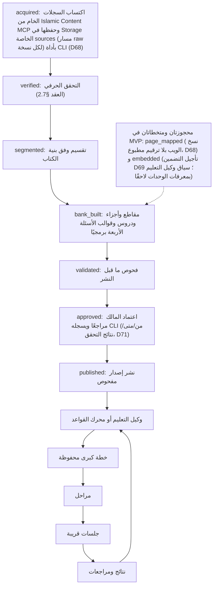
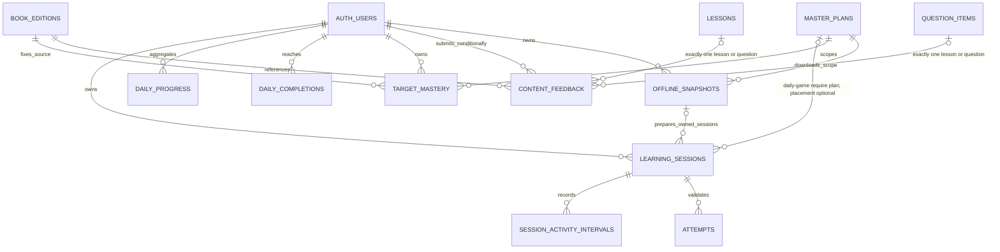

# قطرة غيث — البنية ومخطط البيانات

الإصدار ١٣ · ٤ أكتوبر ٢٠٢٦. يسجل قرارات D66 وD68 وD69 التي اعتمدها المالك في ٤ أكتوبر ٢٠٢٦ (حسم مدخلات الإتقان، وصفحات النسخ الويب ومصدر المحتوى، وتأجيل التضمين، وإبقاء دور قاعدة البيانات المقيد)، ويواءم الوصف المنطقي مع المخطط الفيزيائي الكامل: المصدر الفيزيائي للجداول والأنواع والمفاتيح والقيود والفهارس وRLS والأدوار ودوال SECURITY DEFINER وترتيب الترحيلات هو [Database-schema.md](Database-schema.md) (الإصدار ١، Needs Review، ينتظر اعتماد المالك)، وتبقى جداول هذه الوثيقة وصفًا منطقيًا. ويسجل أثر D71 والتوجيهات المعمارية لـ ٤ أكتوبر ٢٠٢٦ (Needs Review): إسقاط جدول reviews من المخطط الفيزيائي (سلم المراجعة في target_mastery)، وعمومية GET /api/catalog بالبيانات الوصفية وحدها، وخطوات سير محتوى نسخ MCP، ودليل المراجعة واعتماد المالك قبل النشر، وخيار plan_order (D72). يؤكد D65 حزمة D36 ومسؤولية كل خدمة: Next.js/Vercel للواجهة، FastAPI/Render لسير عمل AI، وSupabase للبيانات والمصادقة والتخزين وقاعدة المعرفة. تفاصيل التصميم Needs Review حيث يذكر؛ هذا التأكيد لا يتجاوز بوابات التحليل والمعمارية والواجهات ولا يصرح بالتنفيذ. جميع مسارات التطبيق Planned، والتنفيذ غير مصرح به قبل أن يعتمد المالك صراحة مخرجات المعمارية (ومنها ERD والمخطط الكامل في Database-schema.md وصلاحيات كل endpoint) (D69). المتابعة في Readiness.tracker.md.

## الاستضافة والمسؤوليات

الحزمة التقنية وفق D36 (حلت محل D10)، على خطط استضافة مجانية فقط وفق D48؛ حدود الخطط المجانية ومعالجاتها في «التشغيل».

| المكون | التقنية والدور |
|---|---|
| واجهة الويب | Next.js (App Router، TypeScript) على Vercel Hobby (D48)، عربية/إنجليزية؛ الأصل الوحيد الذي يخاطبه المتصفح؛ لا أسرار فيها |
| API ووكيل التعليم | FastAPI (Python) على خدمة ويب مجانية في Render (D48): عقود API المخططة والمصادقة والتخطيط والتحقق وحفظ النتائج. وكيل التعليم (D38) دور تخطيط للمتعلم، يقرأ المحتوى المنشور وتقدمه ويقترح معرفات وتوقيتًا؛ يستدعي النموذج المسموح عبر واجهة داخلية، مع محرك القواعد بديلًا دائمًا |
| سير عمل المحتوى | Background Workflow لإعداد المصدر مرة لكل إصدار: أداة CLI (qatra-app/backend/scripts/content_tools.py ← app/workflow/runner.py) أو داخل عملية خادم FastAPI (job_execution_mode=in_process)، دون عامل خلفي منفصل (D48)؛ يقوده جدول content_jobs ويستأنف من cursor في Supabase؛ مرحلتا «إدارة المحتوى» و«إعداد الدروس والأسئلة» اسمان لمسؤوليات برمجية محددة، وليستا خدمتي LLM مستقلتين (D37، D43، D65) |
| البيانات والمصادقة والملفات | Supabase Free (D48): PostgreSQL و Auth؛ Storage بحاوية خاصة sources للنسخ الأصلية حسب حقوقها (السجلات الخام لنسخ MCP تحت المسار raw لكل نسخة، تكتبها أداة CLI بمفتاح service_role لنطاق النشر فقط ولا تدخل git؛ توجيه ٥)، ولا ملفات محلية على Render؛ امتداد pgvector لقاعدة المعرفة (ينشأ جدولها ولا يعبأ في MVP، D69) |
| خدمة النموذج | واجهة مزود داخلية عامة؛ OpenRouter الأساسي من الخادم بنماذج ذات أهلية مجانية متحققة فقط (D60)، ميزانية مالية 0 ولا بديل مدفوع؛ Gemini/OpenAI اختياريان عند الضرورة وبعد إثبات رصيد/حصة مجانية فعلية وشروط مناسبة؛ محرك القواعد بديل دائم |
| نموذج التضمين | نموذج متعدد اللغات يدعم العربية داخل مسار مجاني متحقق أو تشغيل محلي ملائم؛ الاختيار والقدرة/الترخيص Needs Review، ولا رسوم مفترضة حتى لمرة واحدة (D60)؛ لا يفهرس نص المتعلم؛ مؤجل في MVP (D69): لا يحسب أي embedding ولا يلزم مزود تضمين في هذا البناء، ويبقى ما سبق تصميمًا لما بعده |
| قاعدة المعرفة والاسترجاع | فهرس كتاب/نسخة/صفحة/فصل/سورة/آية/حديث، و unit_embeddings في pgvector؛ كل استعلام مقيد بـ edition_id واحد؛ دون دمج كتب أو توليد محتوى (D11، D37)؛ في MVP ينشأ unit_embeddings ولا يعبأ (D69) |
| نسخة الجهاز و PWA | D06 و D46: manifest أصلي و Service Worker بقائمة موارد build عامة وغلاف /offline ثابت، و IndexedDB للجزء المحمل من الخطة النشطة والجلسات والألعاب والأحداث؛ إعادة فتح كاملة دون شبكة بعد تنزيل ناجح؛ الدخول والخطط الجديدة والمزامنة تحتاج إنترنت؛ تصميم التفاصيل Needs Review في PWA-design.md |

مسار الطلب: يخاطب المتصفح أصل Vercel وحده؛ تمرر rewrites في Next.js الطلبات /api/* إلى خدمة FastAPI على Render، فتبقى Cookie الجلسة __Host-qatra_session من الطرف الأول على أصل الواجهة، ويفحص الخادم Origin مقابل أصل Vercel، ولا حاجة إلى CORS. أسماء المسارات في «عقود API المخططة» لا تتغير وتخدمها FastAPI. الواجهة لا تخاطب Supabase مباشرة. IP العميل لتحديد المحاولات يؤخذ من القيمة التي يضيفها الوكيل الموثوق لا من ترويسة يتحكم فيها العميل، ويثبت ذلك باختبار قبل البناء.

أسرار التشغيل في متغيرات بيئة Render فقط، ونسخة المطور المحلية لتشغيل أداة CLI لسير عمل المحتوى (D48) في ملف .env محلي مستبعد من المستودع، لا في المتصفح أو Vercel أو ملفات التسليم: OPENROUTER_API_KEY، و SUPABASE_SERVICE_ROLE_KEY (لنطاق Admin API وحده وفق D34)، و QATRA_SERVER_DB، ومفتاح تشفير الجلسات، ومفاتيح HMAC للاسترجاع وتحديد المحاولات، ومفتاح مزود التضمين (لا يلزم في MVP لتأجيل التضمين، D69). لا تحمل Vercel أسرارًا (هدف وكيل API فقط)، ولا سر في المتصفح أو المستودع. الواجهة لا تملك كتابة في المحتوى ولا مفاتيح إدارة. بيانات المستخدم تصل إلى API التطبيق، ويمنع مسار النقل الخارجي إرسالها إلى النموذج خلال التحدي (D17).

المسارات المقترحة تحت الجذر النظيف D61: qatra-app/frontend/ المخطط (Next.js App Router و TypeScript: src/app/، src/components/، src/lib/)، و qatra-app/backend/ المخطط (FastAPI: app/{routers,services,domain,repositories,providers,workflow}/). مسؤوليات المصادقة والتخطيط والقواعد موزعة على services/auth.py و services/planner.py و domain/planning_rules.py، والوصول للبيانات عبر repositories و providers/database.py؛ لا app/auth أو app/agent أو app/rules أو app/db بديلة. مدخل سير العمل CLI المخطط backend/scripts/content_tools.py يستدعي app/workflow/runner.py. مسارات PWA المقترحة تحت frontend/: src/app/manifest.ts و src/app/offline/page.tsx، src/components/pwa/OfflineShell.tsx، src/lib/offline/{types,db,plan-cache,outbox,sync}.ts، src/lib/pwa/{register,update}.ts، scripts/build-sw.mjs مصدر المولد المراجع و public/sw.js ناتج build. المسارات المشتركة الوحيدة تحت qatra-app/: supabase/migrations/، fixtures/{demo_scenarios,demo_simulations}.json، frontend/tests/ و backend/tests/؛ لا backend/migrations أو backend/fixtures أو tests/ جذرية إضافية. لا إنشاء مشروع web/ أو api/ جديد. اتجاه اعتماد backend/: router/DTO → service → domain policy + repository/provider؛ domain لا يعتمد FastAPI أو عميل قاعدة؛ repositories تحفظ الحقائق و providers تتصل بالخدمات، مع workflow.validation.validate_plan_proposal قبل حفظ خطة. هذه مسارات تصميم Needs Review، لا دليل إنشاء ملفاتها؛ التفاصيل في Programming-guide.md. لوحة المدير تبقى إضافة شرطية D43.

## دورة المحتوى والخطة

سير عمل المحتوى (D37، D43، D65) يعالج اكتساب سجلات المصدر (Islamic Content MCP، D68) ثم التحقق الحرفي والتقسيم وإعداد الدروس والأسئلة برمجيًا، ثم اعتماد المالك ونشر إصدار مفحوص. مسميا «وكيل إدارة المحتوى» و«وكيل إنشاء الدروس والأسئلة» يحددان مرحلتين ومسؤوليتين لهذا المسار؛ لا يشيران إلى خدمات LLM مستقلة ولا يمنحان LLM إنشاء المصدر أو نص السؤال أو إجابته. يقوده content_jobs، ويشغل بأداة CLI أو داخل عملية خادم FastAPI على Render (in_process) دون عامل خلفي منفصل (D48)، بالخطوات acquired → verified → segmented → bank_built → validated → approved → published لنسخ MCP الشبكية (توجيه معماري ٥، Needs Review)؛ وتتخطى المهمة خطوتي page_mapped (لا ترقيم مطبوع، D68) و embedded (تأجيل التضمين، D69) فيبقى unit_embeddings غير معبأ، وتبقى uploaded و extracted محجوزتين لنسخ الرفع والصفحات لاحقًا. تحفظ السجلات الخام لنسخ MCP كما وردت في حاوية Storage الخاصة sources (مسار raw لكل نسخة) بواسطة أداة CLI بمفتاح service_role لنطاق النشر فقط، ولا تدخل git. وخطوة approved اعتماد المالك مراجعًا (D71) تسجل CLI فيها من اعتمد ومتى ونتائج التحقق في book_editions.review_record و content_jobs.validation_summary، ولا ينشر إصدار قبلها. تكرار أي خطوة لـ (edition_id، bank_version، step) لا يكرر أثرها، ويحفظ cursor في Supabase ليستأنف التشغيل عند استدعائه مجددًا؛ وفشل أي خطوة يبقي الإصدار draft. لا وعد بأن المهمة تستمر أثناء تعليق خدمة Render أو إعادة تشغيلها. وكيل التعليم (D38) منفصل: يستهلك المحتوى المنشور وتقدم المتعلم لبناء خطته وتحديثها بمرور الوقت، ويختار معرفات وتوقيت مراجعتها؛ يعمل أثناء التحدي على حالات العرض الاصطناعية فقط (D17). محرك القواعد هو البديل الدائم. التفصيل في AI-agent.md.

## الأدوار

المتعلم يملك حسابه وخططه ونتائجه فقط. مدير المحتوى يشغل سير عمل المحتوى (رفع المصدر والتحقق والنشر) من أدوات المطور (مدخل CLI المخطط qatra-app/backend/scripts/content_tools.py الذي يستدعي app/workflow/runner.py)، وصحة المراجع ومطابقة النسخة التي يضيفها مسؤوليته (D25)؛ لا يقرأ حسابات المتعلمين لمجرد إدارة كتاب. المراجع يوثق مقابلة النص أو المراجعة التي أجراها فعلًا ولا يحتاج تقدم المتعلمين؛ ويحفظ دليله في book_editions.review_record و content_jobs.validation_summary، ولا ينشر إصدار دون خطوة اعتماد المالك التي تسجلها CLI (من/متى/نتائج التحقق؛ توجيه معماري ٤، D71). اللجنة تستخدم حساب عرض ينشأ من رابط العرض ويوسم is_demo، وتمر برحلة المتعلم كاملة على سيناريوهات هدف اصطناعية (D29)؛ رابط العرض عام والمحتوى غير المصرح به غير منشور.

الإضافة والعرض والتعديل والحذف لإدارة المحتوى تعتمد أدوات المطور أساسًا (D43، D44). صفحة إضافة رابط/رفع ملف جزء من إدارة المحتوى وليست ميزة مستقلة. واجهة المدير وزر ملاحظات الدرس/السؤال وصندوق المدير إضافات اختيارية/مستقبلية، كلها مشروطة بإنجاز معظم مهام البرمجة الأساسية خلال اليوم الأول؛ الملاحظات أعلى أولوية من واجهة إدارة المحتوى (D45). لا نسبة رقمية لكلمة «معظم»، ولا إثبات لتحقق الشرط الآن. راجع [Additional-features.md](Additional-features.md)؛ العقود الشرطية أدناه لا تحولها إلى شرط تسليم أساسي.

## المخطط المنطقي: المحتوى المشترك

المصدر الفيزيائي لهذه الجداول — الأنواع والقيود والمفاتيح والفهارس وRLS والأدوار وترتيب الترحيلات — هو [Database-schema.md](Database-schema.md) (الإصدار ١، Needs Review، ينتظر اعتماد المالك)؛ والجدول أدناه وصف منطقي، وتسجل Database-schema.md §3.5 كل فرق بين الاسم المنطقي والفيزيائي.

المعرفات UUID أو مفاتيح مستقرة من المصدر، والأوقات timestamptz. النص الأصلي وحروفه تحفظ منفصلة عن حقول البحث والتطبيع. لكل إصدار حالة draft/validated/published/superseded/revoked فقط؛ لا تعرض المسودة أو الإصدار المسحوب. bank_version إصدار بنك النسخة، و catalogVersion في الكتالوج ومخرجات المخطط هو bank_version المنشور للنسخة المستخدمة.

الأرشفة الإدارية (D44) علم catalog_hidden/archived_at مستقل لإخفاء المادة من الاختيار الجديد، وليست حالة إصدار جديدة تسمح بعرض أصل غير صالح. تبقى بيانات الخطط والتاريخ عند أرشفة مادة منشورة مستخدمة؛ ولا تعرض نصوص نسخة revoked أو ذات حقوق مسحوبة حتى داخل خطة مثبتة أو نسخة جهاز مؤقتة. تصحيح الأصل ينشئ نسخة جديدة مقابلة للمصدر، ولا يعيد كتابة النسخة المستخدمة. الحذف المادي لمسودة غير مستخدمة فقط؛ النشر السابق أو أي مرجع خطة/جلسة/تقدم يمنع الحذف المادي.

| الجدول | الحقول الأساسية | العلاقات والقيود |
|---|---|---|
| categories | id، slug، label_ar، label_en، display_order | قائمة قابلة للإضافة؛ ليست enum مغلقة لثلاثة أبواب |
| approved_source_rules | id، policy_version، domain_or_book_family، field، eligibility_rule، policy_reference | مأخوذ من المرجعية العلمية (challenge/Scientific-source-reference.pdf، الأصل Source bathel ai.pdf) ص٣–٤؛ لا يعد الموقع كله أو جميع طبعاته معتمدة |
| sources | id، approved_rule_id، title، provider، source_url، eligibility_record، license_url، license_record، checked_at، rights_status | أهلية موثقة وحقوق مستقلة؛ لا مصدر يضيفه النموذج |
| books | id، category_id، title_ar، title_en، author، content_format | category_id إلى categories؛ لا ينشأ نص ديني فيه |
| book_editions | id، book_id، source_id، edition_label، language، version، raw_storage_path، content_hash، pagination_record، status، review_record، catalog_hidden، archived_at | كتاب/مصدر؛ نسخة مستقلة وبصمة؛ raw_storage_path مسار في حاوية Storage الخاصة sources؛ الترجمة سجل نسخة مستقل بلغته (D27) في توسع لاحق، ولا نسخة مترجمة في نسخة التحدي (D49)؛ لا ربط ترجمة أو إثراء بنسخة أخرى؛ version فريد للكتاب؛ catalog_hidden boolean=false و archived_at timestamptz اختياري للأرشفة الإدارية؛ لا يتجاوزان status أو rights_status (تصميم Needs Review، D44)؛ review_record دليل المراجعة (مقابلة النص والتحقق) وفيه خطوة اعتماد المالك التي تسجلها CLI (من/متى/نتائج التحقق) ولا ينشر إصدار دونها (توجيه ٤، D71) |
| edition_pages | id، edition_id، printed_page_label، file_page_no، page_hash، validation_record | الرقم المطبوع منفصل عن رقم صفحة الملف؛ لا أرقام مخمنة؛ ربط فريد للصفحة داخل النسخة؛ في النسخ الويب لا ترقيم مطبوع (D68) فيبقى الجدول فارغًا والمرجع هو الرابط الأصلي (canonical URL) |
| book_sections | id، edition_id، parent_id، ordinal، reference، title | فصول/أبواب/سور مرتبة؛ parent_id للتدرج داخل النسخة |
| units | id، edition_id، section_id، ordinal، canonical_text، char_start، char_end، token_spans، reference، text_hash | مواضع من النسخة الأصلية؛ حفظ النص والهوامش كما وردت، بما فيها تخريج المؤلف ودرجته للحديث في موضعهما (D25)؛ ترتيب فريد داخل النسخة؛ مرجع الموضع في النسخ الويب هو الرابط الأصلي لا رقم صفحة (D68) |
| unit_page_spans | unit_id، edition_id، page_id، start_offset، end_offset، ordinal | صفحة/نطاق صفحات من النسخة نفسها؛ تدقيق علاقة الوالد؛ إعادة التحقق عند تغير الترقيم؛ يبقى فارغًا للنسخ الويب (D68) |
| lessons | id، edition_id، bank_version، ordinal، duration_estimate، status | درس ثابت قابل للاستخدام لكل متعلم؛ لا user_id |
| lesson_units | lesson_id، unit_id، ordinal، start_offset، end_offset | ترتيب ومقاطع من وحدات الإصدار نفسه؛ دون نص مولد |
| question_items | id، edition_id، lesson_id، unit_id، bank_version، type، token_refs، option_refs، correct_ref، reference، status، validation_record | أسماء وحقول مقترحة لا schema معتمدة. أربعة قوالب؛ كل المراجع من النسخة نفسها وصفحاتها. وفق D64 يقبل قالب `word_choice` خيار كلمة أو جزء متصل، لكن شكل مراجع/خيارات الجزء متعدد الكلمات وكيفية وصل الإجابة به Needs Review؛ لا يفرض `target_word_index` أو إجابة كلمة واحدة للاختيار، ولا يضيف هذا قرارًا بعمود/عقد جديد. لا نص سؤال مولد أو حكم مضاف؛ لا يخزن نص خيار الخطأ في تمييز المتشابه (D31) |
| unit_embeddings | unit_id، edition_id، bank_version، embedding vector، model، created_at | unit_id إلى units مع تطابق edition_id؛ مفتاح (unit_id، bank_version، model)؛ فهرس HNSW على embedding؛ كل استعلام يقيد بـ edition_id (لا استرجاع عابر للكتب، D11)؛ التضمين لنص النسخة وحده، ولا يحول نص المتعلم إلى تضمين أثناء التحدي (D17)؛ قراءة وكتابة للخادم فقط؛ في MVP (D69) ينشأ الجدول ولا يعبأ بأي embedding |
| content_jobs | id، edition_id، bank_version، pipeline_version، step، cursor، status، validation_summary، published_at | يقود الوحدتين التشغيليتين لسير عمل المحتوى (D37، D43)؛ step لنسخ MCP الشبكية: acquired/verified/segmented/bank_built/validated/approved/published (تتخطى page_mapped و embedded، D68، D69، توجيه ٥)، وتبقى uploaded/extracted/page_mapped/embedded محجوزة لنسخ لاحقة؛ validation_summary نتائج التحقق وخطوة اعتماد المالك (D71)؛ تكرار (edition_id، bank_version، step) لا يكرر أثره؛ استئناف من cursor؛ الفشل يبقي الإصدار draft؛ تحقق كامل قبل النشر؛ يفصل عن خطط الأفراد |
| generic_plan_templates | id، catalog_version، scenario_key، policy_json، generator_version، status | قوالب تخطيط عامة من حالات اصطناعية؛ catalog_version هو bank_version المنشور الذي بني عليه القالب؛ لا معرف حساب أو سجل شخص حقيقي |

تفاصيل الحقول الفيزيائية الإضافية للمحتوى — جدولا passages و passage_parts (مقاطع الحفظ وأجزاء التغطية، D66)، وحقلا units.kind و units.source_url (الرابط الأصلي للنسخ الويب، D68)، وإضافات question_items و lessons.passage_id — محددة في [Implementation-contract.md](Implementation-contract.md) §3؛ أما الأسماء والحقول في الجدول أعلاه فمنطقية مقترحة، والمخطط الفيزيائي الكامل و ERD بالمفاتيح في [Database-schema.md](Database-schema.md) (Needs Review).

لا يوجد جدول إثراء أو أحكام حديث خارجية أو شروح أو ترجمة موازية مرتبط بوحدات الكتاب؛ تخريج المؤلف ودرجته جزء من النص الأصلي للوحدة أو هامشها في النسخة نفسها (D25). ولا تخزن ولا تعرض شروح HadeethEnc وفوائده ولا ترجمات QuranEnc وتفسيره (D68، مع بقاء D20 وD26 وD49). ترجمة مجمع الملك فهد الإنجليزية لمعاني القرآن (D27) مؤجلة خارج نسخة التحدي إلى توسع لاحق (D49): لا يعرض نص مترجم ولا اختيار نسخة مترجمة في نسخة التحدي. وتبقى قاعدة D27 للمستقبل: سجل book_editions مستقل بلغته ومصدره وحقوقه وصفحاته، يختاره المتعلم كنسخة مستقلة، وينشر بعد توثيق الطبعة والحقوق مثل أي نسخة؛ لا ترتبط وحداته بوحدات النص العربي ولا يظهر داخل جلسته، وهدف الحفظ والاختبار يبقى النص العربي الأصلي. أي كتاب مترجم مستقبلًا يختار نسخة مستقلة بخطتها وبنكها وفق المرجعية، ولا يضاف إلى كتاب آخر. فرض تطابق edition_id بمفاتيح أجنبية مركبة/تحقق خادمي على الدروس والوحدات والصفحات وكل مراجع السؤال والخيارات؛ لا يكفي الاعتماد على مخرج النموذج. القوالب العامة لا تحمل معلومات متعلم.

خيار الخطأ في لعبة تمييز المتشابه (D31) يركب برمجيًا عند توليد سؤال الجلسة ويبقى عابرًا في لقطة السؤال المعروضة: الأصل الصحيح مع كلمة من الموضع المتشابه الصحيح في النسخة نفسها (مرجعها في option_refs)، أو مع الكلمة الخاطئة التي سجلها المتعلم نفسه إذا كانت كلمة موجودة في النسخة نفسها، فيحفظ مرجعها فقط في attempts.wrong_token_ref لا نصها؛ والكلمة غير الموجودة في النسخة لا تستعمل بعد الجلسة الجارية، لأن نص الإجابة الحرة لا يحفظ سحابيًا. لا يكتبه AI، ولا يحفظ أو ينشر كنص في question_items أو attempts أو أي جدول، ويوسم بعد الإجابة بأنه خطأ مع عرض الأصل ومرجعه.

قاعدة المعرفة unit_embeddings (D37) تستعمل في ثلاثة مواضع فقط، وكلها داخل edition_id واحد: (أ) مرشحو المواضع المتشابهة للعبة تمييز المتشابه وقت بناء البنك، ثم تؤخذ الكلمة برمجيًا من الموضع المرشح بعد فحص مطابقته (D31)؛ (ب) البحث عن الوحدات داخل نسخة واحدة لتحديد نطاق الهدف في السيناريوهات الاصطناعية وحسابات العرض؛ (ج) سياق وكيل التعليم بمعرفات الوحدات. التغطية والترتيب يثبتان من الفهرس وبنية الكتاب لا من التشابه الدلالي. التصفية بـ edition_id مع فهرس HNSW قد تعيد نتائج أقل من المطلوب وفق وثائق Supabase؛ يستعمل المسح التكراري للفهرس (iterative index scan) أو بحث دقيق داخل النسخة الصغيرة كالعينة، ويثبت ذلك باختبار.

تأجيل التضمين في MVP (D69، يعدل D37 وD65 لهذا البناء وحده): ينشأ unit_embeddings ولا يعبأ، وتتخطى خطوة embedded، وتوجد مرشحات المواضع المتشابهة للعبة D31 (الاستعمال أ) بمطابقة النص المطبّع داخل نسخة واحدة؛ ويبقى الاستعمالان (ب) و(ج) تصميمًا مؤجلًا مع التضمين.

## المرجعية والعرض

مصادر المحتوى محصورة في المرجعية العلمية كما في Content-and-sources.md (D19، D27)، ويعدلهما D68 في هذا البناء: مصدر الكتابين Islamic Content MCP (نص جزء عم من QuranEnc، وأحاديث الأربعين من سجلات HadeethEnc بصياغة الأربعين)، مع قبول المالك خطر أن يقبل التحدي المصادر المدرجة في مرجعيته العلمية فقط؛ المصدر المسموح وحقوق النسخة وخريطة الصفحات شروط مستقلة. واجهة الحفظ تعرض الأصل وعنوان الكتاب والطبعة والصفحة والمرجع فقط، دون معلومات مقتبسة من كتاب آخر؛ وفي النسخ الويب لا ترقيم مطبوع (D68) فيعرض الرابط الأصلي (canonical URL) بجانب النص مرجعًا. مستويات المرجعية العلمية A/B/C/D (المرجعية ص٢) سياسة نطاق: الأصل المنقول يظل أصله؛ لا يولد التطبيق شرح B أو ترجيح C أو فتوى D، وطلب الفتوى أو الشرح يعرض الرسالة الثابتة في D26. شرط «لا ينسب حديث دون مصدر وحكم معتمد في البيانات» (المرجعية ص٣) يعالج من نص الكتاب نفسه (D25): ما كتبه المؤلف من تخريج الحديث ودرجته يحفظ ويعرض ضمن النص الأصلي للوحدة أو هامشها كما ورد في النسخة، دون إضافة أو تعديل؛ وفي نسخة الويب يعرض حقلا HadeethEnc «Narrator» و«Grade» كما سجلا ويوسمان بأنهما سجل HadeethEnc (D68)؛ لا يؤخذ حكم من كتاب آخر، ولا ينشأ له جدول أو حقل خارجي أو عملية إثراء. لا يدعى بذلك اعتماد المنظمين (D23). يعرض تخريج الطبعة كما ورد؛ فإن نسبت الطبعة الحديث إلى البخاري أو مسلم أو كليهما (مثل «رواه البخاري ومسلم») أو ذكرت درجته يعرض ذلك النص فقط دون تنبيه، والحديث الذي لا تذكر طبعته نسبة إلى الصحيحين ولا درجة ينشر كما هو، ويعرض بجانبه تنبيه واجهة ثابت ظاهر (D50، D53): «تنبيه: نُقل هذا النص حرفيًا عن الكتاب، ولم يُتحقق من صحة الحديث.» التنبيه نص واجهة ثابت، لا حكم ولا حقل حكم من مصدر آخر (D20، D25)؛ تحديد الأحاديث التي يظهر معها جزء من مراجعة النشر في review_record للنسخة، وشكل تخزين هذه العلامة Needs Review. هذه الحالة لا تستوفي حرفيًا الشرط أعلاه (Competition-alignment.md). وقاعدة النسبة (D50): لا تعرض الواجهة أو عرض التسليم نسبة حديث أو مرجعًا من خارج نسخة منشورة.

## المخطط المنطقي: الحساب والتقدم الخاص

المصدر الفيزيائي لهذه الجداول — الأنواع والقيود والمفاتيح والفهارس وRLS والأدوار وترتيب الترحيلات — هو [Database-schema.md](Database-schema.md) (الإصدار ١، Needs Review، ينتظر اعتماد المالك)؛ والجدول أدناه وصف منطقي، وتسجل Database-schema.md §3.5 كل فرق بين الاسم المنطقي والفيزيائي.

| الجدول | الحقول الأساسية | العلاقات والقيود |
|---|---|---|
| auth.users | معرف المصادقة والتخزين الذي تديره الخدمة | ليس جدولًا لنسخ كلمات المرور في التطبيق |
| private.account_handles | user_id، username_display، username_normalized، internal_auth_alias، auth_epoch، is_demo | user_id إلى auth.users؛ تفرد username_normalized؛ lookup للخادم فقط؛ is_demo يضبطه الخادم عند إنشاء حساب العرض من رابط العرض ولا يغيره العميل |
| private.recovery_codes | id، user_id، code_hash، created_at، reserved_grant_id، reserved_until، consumed_at | رمز فعال واحد؛ حجز ذري ثم استهلاك بعد نجاح الاسترجاع |
| private.password_reset_grants | id، user_id، grant_hash، expires_at، status | تصريح مؤقت لإعادة التعيين فقط؛ منع تنفيذ متوازٍ |
| private.app_sessions | id، user_id، session_hash، auth_epoch، encrypted_auth_tokens، expires_at، revoked_at | لا وصول للمتصفح إلى هذه الجداول أو الرموز |
| private.auth_throttle | key_hash، window_start، attempts | مفتاح (key_hash، window_start)؛ key_hash بصمة HMAC لاسم المستخدم المطبع أو لبادئة IP (IPv4 /24، IPv6 /48)، لا نص اسم أو IP؛ تأخير تدريجي؛ تحذف الصفوف بعد ٢٤ ساعة |
| profiles | user_id، language، time_zone، session_minutes، reminder_settings، terms_version، terms_accepted_at، created_at | إعدادات الحساب اللازمة فقط؛ terms_version إصدار «شروط الاستخدام وبيان الخصوصية» الذي وافق عليه المستخدم و terms_accepted_at timestamptz بوقت الخادم، وهما وحدهما بيانات الموافقة المحفوظة (D52)؛ يكتبهما الخادم عند التسجيل، بما فيه حساب العرض is_demo، وعند موافقة جديدة يطلبها تغيير جوهري في الشروط عند الدخول التالي؛ عقد تسجيل إعادة الموافقة Needs Review؛ session_minutes أحد 5/10/15؛ time_zone منطقة IANA تؤخذ من المتصفح عند التسجيل وتعدل من الإعدادات وتحدد learning_date؛ reminder_settings في بناء التحدي تذكير داخل التطبيق فقط (تنبيه بالمراجعة المستحقة عند فتحه)، وإشعارات الدفع/البريد توسع لاحق |
| master_plans | id، user_id، edition_id، target_scope، paths، plan_order، session_minutes، preferred_date، agreed_estimate، current_version، status | الهدف الكلي والنسخة؛ agreed_estimate هو confirmedEstimate الذي أكده المتعلم؛ تقدير الموعد لا ضمان حفظ؛ في بناء التحدي خطة نشطة واحدة لكل حساب (فهرس فريد جزئي على user_id حيث status=active)؛ paths مسارات الحفظ المختارة (D66)، و plan_order يأخذ 'book' (ترتيب الكتاب، الافتراضي) أو 'reverse' («عكسي، من سورة الناس رجوعًا»، متاح لنسخة جزء عم وحدها)، يختاره المتعلم عند إنشاء الخطة وتغييره تنقيح خطة يسري من يوم التعلم التالي (D72) |
| plan_versions | id، plan_id، user_id، version_no، reason_code، policy_json، effective_learning_date، created_at | إصدار مضاف لا يستبدل القديم؛ unique(plan_id,version_no) |
| plan_phases | id، plan_version_id، user_id، ordinal، section_refs، unit_range، goal_size، estimated_window | نطاقات مرتبة تغطي الهدف؛ ليست تواريخ جميع الجلسات مقدمًا |
| learning_sessions | id، user_id، plan_id، plan_version_id، phase_id، edition_id، kind، learning_date، lesson_refs، question_refs، bank_version، self_rating، status، elapsed_ms، offline_snapshot_id | kind=daily/game/placement؛ plan_id و plan_version_id إلزاميان للتعلم/اللعبة الشخصية وخطتهما نشطة ومملوكة عند إنشاء جلسة جديدة؛ الأحداث السابقة تظل مثبتة لخطة الأصل وفق D59؛ جميع الأهداف المختبرة داخل target_scope و edition_id للخطة (D42)، وتاريخ الخطة لا يقفل لعبة يوم لاحق؛ الخطة اختيارية للاختبار الأولي placement فقط ولا يحتسب زمنه في الإنجاز اليومي؛ self_rating اختياري له فقط (none/some/most)؛ bank_version إصدار البنك المستخدم؛ لقطة الجلسة مثبتة؛ elapsed_ms وقت نشط متحقق منه، لا مدة فتح الصفحة (D40)؛ offline_snapshot_id اختياري إلى لقطة مملوكة بنفس الخطة/النسخة للجلسات المعدة مسبقًا (D46، Needs Review)، لا جلسة خادمية ينشئها المتصفح بلا شبكة |
| attempts | id، user_id، session_id، client_event_id، question_id، target_refs، correct، error_kind، wrong_token_ref، duration_ms، occurred_at | unique(user_id,client_event_id)؛ لا نص الإجابة الحرة في التخزين السحابي؛ wrong_token_ref اختياري: مرجع كلمة من النسخة نفسها طابقها جواب المتعلم الخاطئ، لاستعماله في لعبة تمييز المتشابه (D31) |
| reviews | (أُسقط من المخطط الفيزيائي، توجيه معماري ٣) | لا ينشأ جدول reviews: سلم المراجعة وتواريخ المستحق في target_mastery (status، review_stage، maintenance_stage، next_review_due، last_review_date، lapse_count، error_part_ids) وأدلة تغطية الأجزاء في target_part_evidence (العقد §3 و§4)؛ تستخرج المراجعات المستحقة بالاستعلام عن target_mastery وفهرسه الجزئي (user_id، plan_id، next_review_due) بدل فهرس reviews(user_id,due_at)؛ مراجعات ١/٢/٤ أيام وفق D66 تبقى مستقلة عن سلسلة النجاح الأولي (D41). تغيير معماري على المخطط المنطقي؛ التفصيل في [Database-schema.md](Database-schema.md) §3.4 |
| session_activity_intervals | id، user_id، session_id، client_event_id، started_at، ended_at، active_ms، learning_date | تصميم Needs Review (D40): UUID، مراجع مطلوبة إلى الجلسة المملوكة، timestamptz للبداية/النهاية، active_ms bigint غير سالب؛ unique(user_id,client_event_id)؛ تحقق الخادم من الفترة، استبعاد التوقف والخلفية و placement، ودمج التداخل بين الجلسات/الأجهزة قبل الجمع؛ ليس جمع duration_ms للمحاولات وحده |
| daily_progress | user_id، learning_date، active_ms، goal_ms، updated_at | تصميم Needs Review (D40): مفتاح(user_id,learning_date)، date بتاريخ منطقة الحساب، active_ms bigint>=0 و goal_ms bigint>0 لقطة الدقائق المختارة ×٦٠٠٠٠؛ تجمع التعلم والألعاب المؤهلة من فترات متحقق منها؛ لا يشترط نجاح جواب أو إكمال درس |
| daily_completions | user_id، learning_date، reached_in_plan_id، completed_at | unique(user_id,learning_date)؛ reached_in_plan_id مرجع الخطة عند بلوغ الهدف لا الجلسة التعليمية الوحيدة؛ يكتب ذريًا عند active_ms>=goal_ms بعد الجمع؛ لا إتمام ثان بتكرار الألعاب أو المزامنة (D40، تصميم Needs Review) |
| target_mastery | user_id، plan_id، edition_id، target_type، target_id، consecutive_correct، initial_success_at، review_evidence_refs، confirmed_at | قواعد الإتقان معتمدة بـ D66 ([Implementation-contract.md](Implementation-contract.md) §4)؛ أما الأسماء هنا (D41/D64) فحقول منطقية مقترحة وليست schema معتمدة، والحقول الفيزيائية في العقد §3 و[Database-schema.md](Database-schema.md)؛ مفتاح مركب للحساب/الخطة/النسخة/هدف محتوى أصلي ثابت؛ سلسلة integer>=0 default0؛ الخطأ في الهدف يصفر سلسلته؛ initial_success_at و confirmed_at timestamptz اختياريان؛ أدلة تغطية الأجزاء وربطها بالمحاولات المتحققة في target_part_evidence وتواريخ المراجعات في حالة المقطع (العقد §3 و§4)؛ >=٣ صحيح متوالٍ لنفس الهدف في لعبة أو أكثر دليل أولي لا حفظ مؤكد بمفرده؛ تتطلب التغطية المستهدفة للنص كاملًا تراكميًا ومراجعات ناجحة أيام ١/٣/٧. إجابة ما بعد التلميح تدريب بمساعدة ولا تثبت استرجاعًا مستقلًا؛ يلزم نجاح لاحق دون كشف التلميح، وتمثيل دليل المساعدة وربط الأسئلة بالأجزاء وحجم الجولات محددة في D66 والعقد §4 |
| content_feedback | id، user_id، client_feedback_id، edition_id، lesson_id، question_id، session_id، question_event_ref، reported_context_refs، category_code، message، status، acknowledged_at، result_note، closure_reason، created_at، updated_at | تصميم شرطي Needs Review (D45): UUID ومعرف الحساب والنسخة مطلوبان، lesson_id أو question_id واحد بالضبط مطلوب بمراجع نفس النسخة؛ session_id و question_event_ref اختياريان ومملوكان للمرسل ويتطابقان مع السؤال/النسخة؛ reported_context_refs JSONB إسقاط خادمي محدود من لقطة السؤال المبلغ عنه يشمل bank_version ومراجع الخيارات/موضع الهدف، لا نص الإجابة الحرة ولا كامل السجل؛ category_code text لنوع الملاحظة من قائمة ثابتة مقترحة قيمها Needs Review، و message text مطلوب؛ status محصور في submitted/in_review/resolved/closed default submitted؛ acknowledged_at مستقل عن الحالة؛ result_note مطلوب عند resolved و closure_reason مطلوب عند closed؛ unique(user_id,client_feedback_id)؛ قراءة المتعلم لملاحظاته فقط، تحديث الحالة/الإقرار/النتيجة للمدير المخول فقط؛ حذف CASCADE مع الحساب؛ فهرس(status,created_at,id) للصندوق؛ شكل تخزين لقطة السؤال وإحالتها Needs Review |
| offline_snapshots | id، user_id، plan_id، plan_version، edition_id، bank_version، client_operation_id، download_target_refs، schema_version، protocol_version، created_at | تصميم D46 Needs Review: UUID، ملكية ومراجع مطلوبة مطابقة للخطة/النسخة؛ unique(user_id,client_operation_id)، قائمة مراجع داخل target_scope، إصدارات integer>0، created_at timestamptz؛ سجل لقطة ثابت ومعرفات جلسات يعدها الخادم دون نسخ سجل تعلم كامل؛ حذف CASCADE مع الحساب؛ فهرس(user_id,plan_id,created_at)؛ لا offline lease أو مدة احتفاظ/صلاحية عددية معتمدة |

في الحساب والتقدم الخاص: جدول target_part_evidence (أدلة تغطية الأجزاء، D66)، وحقل profiles.pending_settings (تغييرات الدقائق والمنطقة الزمنية ليوم التعلم التالي، D57)، وحالة target_mastery لكل مقطع (D66) محددة في [Implementation-contract.md](Implementation-contract.md) §3 و§4؛ والمخطط الفيزيائي الكامل و ERD بالمفاتيح في [Database-schema.md](Database-schema.md) (Needs Review).

العلاقات الجديدة المقترحة فقط (Needs Review؛ بقية الجداول كما في المخطط أعلاه):

ترتيب التغيير المقترح عند اعتماد التصميم والتنفيذ لاحقًا: تثبيت هوية الهدف الأصلي، ثم قيود الخطة والجلسات والمراجعات، ثم فترات النشاط والمجاميع اليومية والإتمام و target_mastery، وأخيرًا content_feedback فقط إن فُعّل نطاق D45. مفاتيح المصدر/الخطة المركبة تمنع اختلاف النسخة والمالك، و ON DELETE CASCADE يقتصر على الصفوف الشخصية عند حذف الحساب؛ لا حذف أصل مستخدم بسبب حذف متعلم. ترتيب الترحيلات 0001_content إلى 0005_rls_functions (و0006_feedback الشرطي) محدد وصفًا في [Database-schema.md](Database-schema.md) §11. لا توجد migration أو قاعدة منشأة هنا.

فرض ملكية الوالد أيضًا: لا يكفي user_id في صف محاولة إذا كان session_id لحساب آخر. تستخدم مفاتيح أجنبية مركبة أو تحقق سياسة مطابق على الخطة/الجلسة/الإصدار. تفهرس مفاتيح الربط ومراجعات الحساب ومراحل الخطة المرتبة. تبقى العدادات قابلة لإعادة الاحتساب من أحداث متحقق منها، ولا يقبل الخادم correct=true من المتصفح دون تحقق مناسب.

حذف الحساب (DELETE /api/account) حذف فوري نهائي لمستخدم Auth وكل الصفوف الشخصية: private.account_handles و private.recovery_codes و private.password_reset_grants و private.app_sessions وصفوف private.auth_throttle لاسم المستخدم، و profiles و master_plans و plan_versions و plan_phases و learning_sessions و attempts و session_activity_intervals و daily_progress و daily_completions و target_mastery و target_part_evidence و offline_snapshots و content_feedback إن فُعّل (ولا جدول reviews، توجيه معماري ٣؛ القائمة التفصيلية والدالة srv_delete_personal_rows في [Database-schema.md](Database-schema.md) §12.1)؛ ثم تمسح النسخة المحلية على الجهاز الجاري وكل تبويباته. لا تحفظ نسخة نص الملاحظة في سجل إداري لتجاوز الحذف. الحذف النهائي يحتاج اتصالًا؛ جهاز آخر مغلق/غير متصل لا يمكن مسحه لحظيًا، ويتحقق عند إعادة الاتصال كما في PWA-design.md. النسخ الاحتياطية لدى المزود تنتهي وفق مدة الاحتفاظ لديه؛ توثق هذه المدة قبل النشر وتذكر في بيان الخصوصية، دون ادعاء مدة محددة الآن.

## RLS والحدود

على الجداول الشخصية قراءة/كتابة للحساب المطابق لـ auth.uid() باستخدام USING و WITH CHECK والتحقق من علاقات الوالد. المحتوى المشترك قراءة للمنشور المصرح به فقط؛ الكتابة للمشغل الخادمي المحدد. ويقتصر وصول الزائر غير المسجل (دور anon) على قراءة العرضين public.catalog_editions و public.catalog_sections بالبيانات الوصفية المنشورة وحدها (D71)، فلا وصول مجهول إلى الوحدات والمقاطع والدروس والأسئلة؛ والمتصفح لا يحمل JWT ولا يخاطب Supabase، فيستعمل الخادم وحده رمز المتعلم. الأدوار والمنح وسياسة كل جدول في [Database-schema.md](Database-schema.md) §5 و§6. unit_embeddings و content_jobs للخادم فقط، وحاوية Storage المسماة sources خاصة بلا قراءة عامة يصل إليها سير العمل الخادمي وحده. private غير مكشوف عبر API العامة. العمليات العادية تستخدم JWT المستخدم فتطبق RLS، ولا تنفذ جميع طلبات المتعلمين بمفتاح service_role الذي يتجاوزها. لا يفوض user_id يرسله العميل لتحديد الملكية.

لا يصل الخادم إلى private.* إلا عبر دوال SECURITY DEFINER خادمية فقط بمسار بحث (search_path) ثابت، لا ينفذها إلا دور قاعدة بيانات خادمي مقيد مخصص منفصل (اعتماده QATRA_SERVER_DB في أسرار Render، وأبقاه D69 محافظًا على D34)، وليس service_role؛ لا تمنح EXECUTE عليها لأدوار المتصفح أو المستخدمين. استخداماتها: البحث عن الحساب باسم الدخول، والبحث عن الجلسة والتحقق منها، والخروج، وتغيير كلمة المرور، وتدوير رمز الاسترجاع، وتحديد المحاولات؛ وأي قراءة أو كتابة أخرى على private.* في التسجيل والاسترجاع والحذف تمر بهذه الدوال. Supabase Admin API (service_role) يقتصر، وفق D69، على: إنشاء مستخدم Auth عند التسجيل، وإعادة تعيين كلمة المرور بالاسترجاع، وحذف الحساب، ونشر المحتوى (ويشمل كتابات سير عمل المحتوى، بأداة CLI أو داخل عملية الخادم على Render (D48)، في حاوية sources وجداول المحتوى و unit_embeddings و content_jobs، D37).

تدخل معاملات محدودة لتسجيل المحاولة وتحديث المراجعة والإتمام مرة واحدة. تضبط الدوال وأذونها و search_path، ولا ينفذ النموذج SQL أو يحدد صلاحيات حساب.

المجاميع الزمنية والإتمام وسلسلة target_mastery وحالة التأكيد كتابات خادمية بعد التحقق، لا حقولًا يختارها العميل رغم ملكيته للصف. عند تفعيل D45 تقيد سياسة content_feedback المتعلم بإنشاء/قراءة صفه فقط، وتمنع انتحال المالك أو تحديث status/result_note. المدير صاحب صلاحية معالجة الملاحظات يرى مضمونها ومرجعها ومعرف التواصل الداخلي اللازم للرد فقط؛ لا تمنح الصلاحية قراءة خطط المتعلم أو محاولاته. يتقرر دور المدير وآلية منحه خادميًا قبل تفعيل الواجهة، ولا يستخدم service_role لكل طلب مدير ولا يدخل النموذج في المعالجة.

## عقد الإنجاز ونطاق التدريب (D40–D42)

الإنجاز اليومي = min(١٠٠٪، مجموع الوقت النشط المتحقق منه في التعلم والألعاب داخل الخطة ÷ الدقائق اليومية المختارة ×١٠٠). يصل اليوم إلى الإتمام مرة واحدة عند بلوغ الوقت؛ ألعاب فقط تكفي، والإجابة الخاطئة لا تلغي الوقت. يحفظ الوقت الفعلي كاملًا وتعرض الزيادة منفصلة: extraActiveMs=max(0,dailyActiveMs-dailyGoalMs)؛ ١٢/١٠ دقيقة =١٠٠٪ ودقيقتان إضافيتان، دون إتمام ثان أو رصيد ليوم آخر. تستبعد فترات التوقف والخلفية والاختبار الأولي، وتستبعد الأحداث المكررة والفترات المتداخلة بين الجلسات والأجهزة. تعرض المدة المحلية بانتظار التحقق منفصلة حتى يقرها الخادم، ولا يحسب /complete مدة إضافية لمجرد إنهاء جلسة.

الإنجاز العام يقيس مادة هدف الخطة التي تأكد حفظها، مستقلًا عن الوقت اليومي. سلسلة ≥٣ صحيح متوالٍ متحقق لنفس الهدف دليل أولي؛ الخطأ يكسرها. تتطلب سياسة D64 تغطية المقطع المستهدف كاملًا على نحو تراكمي عبر التدريب والمراجعات، مع مراجعات ناجحة أيام ١/٣/٧ وفق D41؛ لا يلزم كل لعبة باختبار كل كلمة أو اختبار النص كله في جولة واحدة. الإجابة بعد كشف تلميح تدريب بمساعدة وتحتاج تحققًا لاحقًا ناجحًا دون كشفه لتكون دليل استرجاع مستقل؛ تمثيل هذا الدليل محدد في [Implementation-contract.md](Implementation-contract.md) §4. ترتيب الكلمات يختبر أجزاء أكبر، وword_choice يقبل كلمة أو جزءًا متصلًا من المصدر؛ خياراته وتفصيل تمثيلها محددان في [Implementation-contract.md](Implementation-contract.md) §2.4، ولا تتغير أسماء الألعاب القائمة. النص المعروض وحده ليس دليل تغطية للهدف المختبر. الأصل الكامل محفوظ كما هو، مع تدوير المواضع والألعاب وإعادة التدريب الموجهة للأخطاء لتقليل الملل والتكرار. كلمة ناجحة لا تثبت مقطعًا، والمادة لا تحتسب مرتين؛ لا قاعدة إنقاص جديدة مفترضة.

حسم D66 (تعديل صريح لـ D64 اعتمده المالك في ٤ أكتوبر ٢٠٢٦) ما كان Needs Input قبل حساب الإتقان، والقواعد التفصيلية في [Implementation-contract.md](Implementation-contract.md) §4. هوية الهدف وتجميعه: هدف الحفظ هو المقطع (passage)؛ للقرآن آيات كاملة من سورة واحدة (السورة حتى ٦٠ كلمة مقطع واحد، وغيرها مقاطع متتالية متوازنة بعدد الكلمات عند حدود الآيات)، وللأربعين مقطع المتن بين «…» ومقطع السند ومقطع الدرجة؛ وللمقطع أجزاء تغطية يغطى الجزء منها بإجابة صحيحة دون مساعدة عن سؤال يختبره، والنص المعروض وحده ليس تغطية. المقام والوزن: الإنجاز العام = floor(١٠٠ × كلمات المقاطع المؤكدة ÷ كلمات نطاق الخطة النشطة للمسارات المختارة). أثر الإخفاق اللاحق: تنجح المراجعة فقط بصحة كل أسئلة الجولة دون مساعدة من المحاولة الأولى (جولة من ١ أو ٢ أو ٣ أسئلة بحسب عدد الأجزاء)؛ والإخفاق قبل التأكيد يعيد السلسلة إلى المرحلة ١ مع بقاء التغطية والدليل الأولي، وبعد التأكيد (صيانة بعد ١٤ يومًا ثم ٣٠ ثم كل ٦٠) يجعل المقطع «يحتاج تحديثًا» فيخرج من النسبة العامة حتى يجتاز المراحل ١–٣ من جديد. فواصل المراجعة ١ ثم ٢ ثم ٤ أيام (١/٣/٧ عند الالتزام بالموعد)، والتأكيد باجتياز المرحلة ٣ مع تغطية كل الأجزاء، والمراجعات الفائتة تبقى مستحقة بلا عقوبة. يعدل D66 بند D64 «لا رقم ثابتًا جديدًا ولا نسبة نجاح عددية» لهذه القواعد وحدها؛ ويبقى: لا ادعاء حفظ حرفي كامل ولا شهادة حفظ حرفي، وD31 والألعاب الأربع والنص الأصلي كاملًا. D57 يحسم تغيير الدقائق اليومية والمنطقة الزمنية ليبدأ يوم التعلم التالي بلا أثر رجعي، مع حفظ تاريخ الخطة/إصداراتها واليوم السابق ومنع إعادة احتساب الحدث أو إتمام اليوم بسبب التغيير. تصميم حقول effective_learning_date ولقطة المنطقة/الهدف وربط فترات عبر منتصف الليل والأجهزة Needs Review؛ لا تتحول ساعة الجهاز وحدها إلى إثبات تاريخ أو وقت.

جميع جلسات التعلم والألعاب الشخصية تتطلب خطة نشطة؛ الأهداف المختبرة تتبع target_scope و edition_id لهذه الخطة حصريًا. خطة الأربعين لا تعرض هدف اختبار قرآنيًا أو من كتاب آخر. يمكن لعب مادة اليوم الثالث في اليوم الثاني داخل النطاق؛ ترتيب التواريخ تنظيم وليس قفلًا، ولا يشترط إكمال درس للعب. يتحقق الخادم من النطاق عند تقديم الألعاب المخصصة وإنشاء الجلسة واستقبال الأحداث واحتساب التقدم؛ لا تكفي تصفية الواجهة. يمكن للبنك العام الاحتفاظ بمراجع ومشتتات تقنية من النسخة نفسها وفق D31؛ ذلك لا يسمح باختبار هدف خارج نطاق الخطة. يبقى placement قبل إنشاء الخطة، دون أن يصبح طريقًا لألعاب شخصية بلا خطة.

D59 استثناء محدد للتحقق من الخطة النشطة عند replay: لا ينشئ جلسة جديدة في خطة متوقفة؛ يفحص الحدث القديم داخل جلسة وخطة وإصدار الأصل ويحتفظ به فقط إن كان قابلًا للتحقق. لا يمنع توقف الخطة حفظ دليل سابق صالح، ولا يتيح محتوى خارج نطاقها.

## أين تحفظ الخطة الكبيرة؟

في master_plans: الهدف والكتاب ونسخته والوقت والتقدير. في plan_versions: القرارات والمبررات وتاريخ التعديلات. في plan_phases: تقسيم الهدف حسب فصول الكتاب أو وحداته. في learning_sessions: تفاصيل جلسة اليوم والجلسات القريبة. يبنى افتراضيًا أفق سبعة أيام عند الحاجة؛ لا حاجة إلى آلاف الصفوف اليومية لحفظ البخاري كاملًا. يحتفظ البنك العام بترتيب الكتاب، وتثبت تغطية كل وحدات الهدف في المراحل. لا يدعي النظام وجود كتاب لم يستورد ويعتمد.

في بناء التحدي خطة كبرى نشطة واحدة لكل حساب، فيبقى إتمام اليوم الواحد (daily_completions) مرتبطًا بخطة واحدة. بدء خطة أخرى يوقف الحالية (paused) ويحفظ تقدمها؛ تعدد الخطط النشطة توسع لاحق.

خيار ترتيب الخطة (D72): plan_order = 'book' (ترتيب الكتاب، الافتراضي) أو 'reverse' («عكسي، من سورة الناس رجوعًا»)، ويتاح الثاني لنسخة جزء عم (القرآن) وحدها؛ يختاره المتعلم عند إنشاء الخطة، وتغييره تنقيح خطة يسري من يوم التعلم التالي. ضمن الترتيب المختار لا تسقط وحدة، ولا يعيد وكيل التعليم ترتيب المادة الجديدة؛ ويعدل هذا الخيار قاعدة ترتيب الكتاب في [AI-agent.md](AI-agent.md) لخيار المتعلم هذا وحده. القيد الفيزيائي (القيمتان المسموحتان وشرط نسخة القرآن) في [Database-schema.md](Database-schema.md).

تعديل المستقبل يضيف إصدارًا ويراجع المراحل والجلسات غير المفتوحة؛ المكتمل لا يمحى والجلسة المفتوحة لا تتغير. ترقية نسخة الكتاب تتطلب خريطة انتقال وتأكيدًا عند تغير المواضع، ولا تنقل الإتقان تلقائيًا إلى نص مختلف.

## IndexedDB والمزامنة

النسخة المؤقتة لكل حساب تحتوي contentCache و planSnapshots و activeRuns و pendingEvents و syncState و ownerState، بأسماء تصميم PWA-design.md. تحتفظ بالجزء الذي اكتمل تنزيله من الخطة النشطة ونسختها ولقطات جلسات أعدها الخادم. Cache Storage للغلاف وموارد build العامة فقط؛ لا حفظ عام لـ API أو Auth أو RSC/Flight أو SSR شخصي. لا كلمات مرور أو رموز استرجاع أو JWT أو مفاتيح أسرار في أي تخزين متصفح. تنزيل staging يثبت جاهزيته بعد اكتمال النصوص والمراجع وكل موارد الألعاب؛ لا «جاهز» جزئي. إزالة بيانات الموقع أو فقد الجهاز يمكن أن يمحو غير المتزامن؛ البيانات التي أقر الخادم حفظها تستعاد بعد الدخول من جهاز آخر.

لكل حدث client_event_id ثابت ومرجع تشغيل وجلسة/لقطة/خطة/إصدار، ويمنع الخادم التكرار. إعادة الاتصال تطابق المالك وتعيد التحقق ثم تصحح الأحداث. D59 يحفظ الأحداث السابقة القابلة للتحقق في الخطة الأصلية وإصدارها، حتى بعد تغير الخطة أو سحب المحتوى، دون نقلها للخطة الجديدة؛ تاريخ الجهاز وحده ليس إثباتًا أنها سبقت السحب/التغيير. المتنازع عليه يبقى pending بلا إنجاز حتى تحقق كافٍ؛ لا حذف صامت للطابور ولا إرسال نص المصدر المحظور. السحب يمنع العرض الجديد بعد اكتشافه، ولا يمحو دليلًا سابقًا صالحًا. الخروج/تبديل الحساب يمسح المحلي عبر جميع تبويبات الجهاز؛ معرفات/أجوبة الزمن والصحيح المحلية مؤقتة حتى إقرار الخادم. حدود تحقق الدليل والترتيب عبر الأجهزة Needs Review؛ لا وعد بإثبات نشاط صادق محليًا بمجرد activeMs.

وفق D46 تشمل PWA فتحًا كاملًا دون شبكة بعد تنزيل الغلاف والخطة والألعاب. الدخول والخطط الجديدة والمزامنة تحتاج شبكة. D58 يقبل وصول حامل الجهاز إلى النسخة الباقية وتأخر أثر الخروج/تغيير كلمة المرور/حذف الحساب أو سحب المحتوى عن بعد حتى إعادة الاتصال؛ لا قفل محلي أو انتهاء جديد. المحلي يمسح عند الخروج من الجهاز الجاري، وعند اكتشاف السحب يمنع عرض المادة ويمسح نصها؛ لا صلاحية خادم مثبتة دون شبكة. تفاصيل التحديث والتخزين والفشل في PWA-design.md.

## عقود API المخططة

| المسار | المدخل/الخرج الرئيسي |
|---|---|
| POST /api/auth/register | username/password/timeZone (من المتصفح) و termsAccepted=true و termsVersion المعروض (D52)؛ يسبقه عرض «شروط الاستخدام وبيان الخصوصية» ومربع إلزامي غير محدد مسبقًا «قرأت شروط الاستخدام وبيان الخصوصية وأوافق عليها» مع رابطيهما قبل زر إنشاء الحساب؛ يرفض الخادم الطلب دون الموافقة أو بإصدار غير الإصدار الحالي، ويحفظ terms_version و terms_accepted_at بوقته في profiles؛ ثم إنشاء حساب وعرض recoveryCode مرة واحدة؛ الحساب المنشأ من رابط العرض يوسم is_demo من الخادم ويمر بالموافقة نفسها |
| POST /api/auth/login | username/password؛ Cookie جلسة آمنة ورسالة عامة عند الفشل |
| POST /api/auth/recovery/verify | username/recoveryCode بعد تطبيعه (Authentication-and-privacy.md)؛ تصريح إعادة تعيين قصير، لا بيانات تعلم |
| POST /api/auth/recovery/reset | التصريح/newPassword؛ زيادة auth_epoch وإلغاء الجلسات وإصدار رمز جديد |
| POST /api/auth/recovery/rotate | password الحالي من جلسة موثقة؛ إلغاء القديم وإصدار بديل |
| POST /api/auth/password | جلسة موثقة وكلمة حالية وجديدة؛ تغيير ثم زيادة auth_epoch وإلغاء كل جلسات التطبيق ثم دخول جديد |
| GET /api/me | بيانات الحساب الحالي وتفضيلاته؛ لتقسيم النسخة المحلية حسب الحساب |
| PATCH /api/me | language/time_zone/session_minutes/reminder_settings، مع التحقق من كل حقل (session_minutes أحد 5/10/15، time_zone منطقة صالحة، reminder_settings داخل التطبيق فقط)؛ تعديل الدقائق اليومية/المنطقة يسجل تغييرًا مؤرخًا ليوم التعلم التالي D57، لا يكتب فوق إعداد اليوم السابق. تعديل وقت خطة قائمة عبر /revise يلتزم السياسة نفسها؛ شكل الحقول والاستجابة والانتقال يحتاج إكمال مراجعة |
| POST /api/auth/logout | إلغاء الجلسة ومسح بيانات الجهاز |
| DELETE /api/account | كلمة المرور وتأكيد حذف؛ حذف فوري نهائي لمستخدم Auth وكل الصفوف الشخصية ومسح النسخة المحلية، كما في «المخطط المنطقي: الحساب والتقدم الخاص» |
| GET /api/catalog | عام بلا جلسة ويعيد بيانات وصفية فقط (D71): عناوين الكتب والطبعات وأسماء الأقسام ومراجعها وعدد الكلمات والمقاطع والمسارات المتاحة، دون نص ديني أو دروس أو أسئلة؛ يقرأ الخادم عرضي public.catalog_* بدور anon؛ المعرفات المنشورة المصرح بها غير المخفية و catalogVersion لكل نسخة لاختيار المصدر؛ عند عرض الألعاب الشخصية تقيد الخوادم الأهداف المختبرة بالخطة النشطة و target_scope و edition_id، لا بمجرد النسخة (D42) |
| POST /api/plans/estimate | قراءة فقط: editionId/targetScope/sessionMinutes/preferredDate/placementSessionId؛ الخرج estimate وبديلان أصغر/أطول و reasonCode؛ لا يكتب شيئًا |
| POST /api/plans | editionId/targetScope/sessionMinutes/preferredDate/placementSessionId/confirmedEstimate؛ يتحقق الخادم من ملكية جلسة placement ونسختها واتساق التقدير؛ يحفظ confirmedEstimate في master_plans.agreed_estimate؛ خطة كبرى ومراحل وأول جلسة؛ توقف الخطة النشطة السابقة (paused) مع حفظ تقدمها |
| POST /api/plans/:id/revise | expectedVersion وتعديل محدود؛ إصدار ثابت جديد أو 409؛ لا إعادة كتابة التاريخ. تغييرات الدقائق اليومية/المنطقة الزمنية تسري من يوم التعلم التالي D57؛ شكل effective-date/منع تعارض الأيام يحتاج إكمال مراجعة |
| GET /api/today | قراءة الخطة النشطة والجلسة والمستحقات؛ dailyActiveMs/dailyGoalMs/dailyPercent/dailyCompleted من المجاميع المتحقق منها (D40)، و extraActiveMs=max(0,dailyActiveMs-dailyGoalMs) للزيادة المعروضة منفصلة دون إتمام ثان أو ترحيل ليوم آخر؛ لا كتابة تلقائية عبر GET |
| GET /api/progress | قراءة فقط للحساب: فصل الوقت الفعلي والإنجاز اليومي المحدود بـ١٠٠٪ و extraActiveMs المعروض منفصلًا دون رصيد يوم آخر، عن نجاح أهداف أولي ومادة مؤكدة للإنجاز العام لكل خطة/نسخة؛ الأخطاء والمراجعة القادمة والاستمرار؛ لا يعد كل صحيح حفظًا مؤكدًا (D40، D41)؛ الإنجاز العام محسوم بـ D66: floor(١٠٠ × كلمات المقاطع المؤكدة ÷ كلمات نطاق الخطة النشطة للمسارات المختارة) ويعرض معه المؤكد والجاري و«يحتاج تحديثًا» وتاريخ المراجعة القادم ([Implementation-contract.md](Implementation-contract.md) §4) |
| POST /api/sessions | kind ومراجع محتوى و expectedPlanVersion؛ daily/game يتطلبان planId مملوكًا ونشطًا، وفحص جميع أهداف السؤال/الدرس داخل target_scope والنسخة؛ مواعيد الأيام ليست قفلًا؛ placement يسمح editionId و targetScope و self_rating اختياريًا دون خطة (D42) |
| POST /api/sessions/:id/events | أحداث معرفات وإجابة عابرة وفترات نشاط عند اللزوم؛ الخادم يتحقق من المالك والخطة/الإصدار ونطاق الهدف والنسخة والإجابة والفترة؛ الطلبات الجديدة تتطلب الخطة النشطة، وأحداث الطابور السابقة تعالج D59 داخل الخطة الأصلية بعد إثبات أهليتها؛ يسجل مرة لكل client_event_id، يدمج التداخل ويحدث الوقت وسلسلة الهدف والمراجعات والإتمام ذريًا؛ correct والزمن والإنجاز المرسل من العميل ليست حقائق موثوقة (D40–D42) |
| POST /api/sessions/:id/complete | إغلاق جلسة متحقق منها وإقرار المجاميع؛ لا يجعل إكمال الدرس شرطًا لإتمام اليوم ولا يضيف وقتًا ثانيًا؛ المراجعات وفق أدلة المحاولات، والإتمام اليومي مرة واحدة عند بلوغ الوقت (D40، D41) |
| POST /api/plans/:id/offline-snapshots | مقترح D46 Needs Review: clientOperationId/expectedPlanVersion/downloadTargetRefs؛ تحقق الحساب والخطة النشطة والحقوق والنطاق، ثم إعداد لقطة ثابتة وجلسات خادمية؛ 201 أو 200 لإعادة العملية نفسها، و 409 عند اختلاف المدخل؛ PlanSnapshot وتفصيل DTO في PWA-design.md |
| GET /api/offline-snapshots/:snapshotId | استرجاع لقطة مملوكة/استكمال تحميلها مع البصمات؛ قراءة فقط دون إنشاء جلسة بـ GET؛ no-store ولا SW/API cache؛ شكل الأجزاء وحدودها Needs Review |
| POST /api/offline/revalidate | snapshotId/expectedPlanVersion/editionId/bankVersion؛ فحص المالك والصلاحية الحالية قبل replay؛ available/stale/revoked/expired مع المراجع المسموحة؛ لا مدة offline lease مخترعة؛ العقد Needs Review في PWA-design.md |
| POST /api/demo/plans | لحسابات is_demo فقط: scenarioId من fixtures المطور و placementSessionId؛ يثبت الخادم الوضع synthetic_demo، ويطبق حد الاستخدام والميزانية، ويستدعي وكيل التعليم (المخطط المقيد) بنص السيناريو وملخص الاختبار الأولي فقط (معرفات وحدات وأعداد صحيح/خطأ؛ لا معرف حساب أو نص حر)، ويحفظ الخطة في حساب العرض |
| GET /api/demo/simulations | قراءة فقط؛ نتائج محاكاة متعددة الأيام حسبها المطور مسبقًا، مع تعديل الخطة |
| GET /api/health | دون مصادقة؛ حالة مختصرة للخدمة فقط لفحص الإتاحة قبل التسليم وأثناء التحكيم، ولإيقاظ الخادم المجاني من الواجهة بطلبات قصيرة متكررة مع تراجع (D48، «التشغيل»)؛ لا بيانات حساب أو أسرار أو تفاصيل داخلية |

تمرر rewrites في Next.js على Vercel هذه المسارات إلى FastAPI على Render، كما في «الاستضافة والمسؤوليات». لا يقبل أي مسار علم وضع (mode) من العميل. الأوضاع shared_catalog و synthetic_demo و private_learner فقط؛ يثبت الخادم وضع synthetic_demo لحسابات العرض (is_demo) وحدها، وتعالج حسابات المتعلمين في private_learner ضمن حدود AI-agent.md. الأهداف الحرة في حساب العرض لا ترسل إلى النموذج؛ تختار اللجنة سيناريو هدف اصطناعيًا (D29). نشر المحتوى يشغله مدير المحتوى من أدوات المطور أساسًا؛ واجهة المدير الموثقة والمقيدة بالصلاحية إضافة شرطية D43، وليست واجهة نشر عامة للمتعلمين.

### عقد الملاحظات الشرطي (D45 — Needs Review)

لا ينفذ إلا إذا فُعلت الإضافة تحت شرط اليوم الأول في [Additional-features.md](Additional-features.md). مسارات مقترحة ضمن المصادقة والـ Cookie و Origin وحدود الملكية الحالية، وليست APIs منشأة. المتعلم لا يحدد user_id أو status؛ والمدير يحتاج صلاحية معالجة ملاحظات يمنحها الخادم، دون صلاحية عامة لسجلات المتعلمين.

| المسار | العقد المقترح |
|---|---|
| POST /api/feedback | متعلم موثق؛ JSON: clientFeedbackId UUID، editionId UUID، lessonId أو questionId UUID واحد بالضبط، categoryCode لنوع الملاحظة من قائمة ثابتة مقترحة قيمها Needs Review، message نص غير فارغ؛ sessionId و questionEventRef اختياريان لسياق السؤال المعروض، يفحص الخادم ملكيتهما للمرسل وتطابق الهدف/النسخة ويستخرج مراجع اللقطة محدودة الحقول دون قبول سياق منسوخ حرًا من العميل؛ 201: id/status=submitted/createdAt، أو 200 عند إعادة نفس المعرف ونفس المدخل؛ تعارض المدخل لنفس المعرف 409؛ حدود النص ومعدل الإرسال وتصميم مرجع اللقطة Needs Review قبل التفعيل |
| GET /api/feedback | ملاحظات الحساب فقط؛ فلتر status من submitted/in_review/resolved/closed و cursor/limit محدودان، ترتيب createdAt ثم id؛ 200: items(id، reference، reportedContextRefs، status، acknowledgedAt، resultNote، closureReason، createdAt)، nextCursor؛ لا كشف صف حساب آخر |
| GET /api/content/feedback | مدير مخول فقط؛ صندوق حسب status و editionId مع cursor/limit محدودين وترتيب createdAt ثم id؛ 200: مضمون الملاحظة ومرجعها ومراجع سياق السؤال المبلغ عنه وبيانات الرد الدنيا؛ لا وصول كامل للخطة أو المحاولات أو اسم شخص حقيقي |
| PATCH /api/content/feedback/:id | مدير مخول فقط؛ expectedUpdatedAt مطلوب، status عند تغييره من submitted/in_review/resolved/closed، و acknowledge=true للإقرار المستقل الذي يثبت الخادم وقته؛ resultNote إداري غير فارغ مطلوب عند resolved و closureReason غير فارغ مطلوب عند closed؛ 200: الحالة و acknowledgedAt/resultNote/closureReason/updatedAt؛ تعارض نسخة 409؛ لا تعديل نص المصدر أو إجابة المتعلم عبر هذا المسار |

أخطاء موحدة لهذه العقود: 401 غياب جلسة صالحة، 403 صلاحية مدير غير متاحة، 404 مرجع غير متاح دون كشف وجود صف متعلم آخر، 422 مدخل/نسخة/هدف أو سياق غير متوافق، 409 تعارض أو إعادة معرف بمدخل مختلف، 429 تجاوز الحد المعتمد لاحقًا. الأعداد القصوى لـ limit والنص ومعدل الإرسال، ومدة الاحتفاظ العددية ومصفوفة انتقال الحالة التفصيلية Needs Review؛ لا يصبح النقص موافقة ضمنية على تفعيلها. تظهر الحالة والإقرار والنتيجة وسبب الإغلاق للمرسل نفسه؛ الإقرار لا يعني الحل، والإغلاق يتطلب توضيحًا. لا بريد أو رسالة خارج التطبيق. نص الملاحظة و resultNote و closureReason لا يرسلون لنموذج خارجي أو مزود تضمين ولا يدخلون فهرس المعرفة أو سجلات الطلبات/التشخيص؛ تحفظ البيانات في الجدول الخاص فقط وتخضع لحذف الحساب كما في Authentication-and-privacy.md.

## التشغيل

يعمل وكيل التعليم عند محفزات D38 ويقرأ الحالة من DB؛ النموذج ليس ذاكرة دائمة. أعمال الكتب الكبيرة توزع على دفعات مع cursor محفوظ في Supabase ضمن content_jobs، ولا يرسل الكتاب كاملًا إلى نموذج أو طلب واحد. في التحدي يشغل المطور سير عمل المحتوى المخطط qatra-app/backend/app/workflow/runner.py (بمدخل CLI في backend/scripts/content_tools.py أو داخل عملية خادم FastAPI بوضع job_execution_mode=in_process، دون عامل خلفي منفصل، D48) على عينة التحدي (جزء عم كاملًا والأربعون النووية كاملة، D24؛ ووفق D68 يبلغ عن حديث بلا سجل بصياغة الأربعين كفجوة ويستبعد، وقد ينشر ٤١ من ٤٢). يمكن استئنافه عند تشغيل لاحق من cursor؛ لا يضمن وضع in_process استمرار المهمة إذا عُلقت خدمة Render أو أعيد تشغيلها. تفاصيل التشغيل في Qatra-build-plan.md؛ جدولة العمال للأحجام الكبيرة توسع لاحق. D46 يضيف الغلاف والخطة المحملة دون اتصال وفق PWA-design.md؛ لا وعد أول زيارة بلا شبكة، ولا ضمان انعدام فقد البيانات غير المتزامنة. خطة التنفيذ التفصيلية في Programming-guide.md ولا تعني إنجاز هذه الخدمات.

الإتاحة (الدليل ص٣٣) وخطط الاستضافة المجانية (D48): الخطط مجانية فقط، Vercel Hobby للواجهة، وخدمة ويب مجانية على Render لـ FastAPI، و Supabase Free؛ لا مثيل Render مدفوع ولا عامل خلفي منفصل. حدود موثقة من صفحات المزودين بتاريخ ٣ أكتوبر ٢٠٢٦، وتراجع قبل النشر لأنها قد تتغير: خدمة Render المجانية تتوقف بعد ١٥ دقيقة بلا طلبات وتستيقظ في نحو دقيقة، و٧٥٠ ساعة شهريًا، ولا Background Worker ولا Cron، ونظام ملفاتها مؤقت، ولا يوصى بها للإنتاج؛ Supabase Free قاعدة ٥٠٠ MB وتخزين ١ GB و٥٠ ألف مستخدم نشط ومشروعان نشطان، ويتوقف المشروع بعد أسبوع خمول؛ Vercel Hobby للمشاريع الشخصية غير التجارية. المعالجات:

- (أ) سير عمل المحتوى يعمل بأداة CLI (qatra-app/backend/scripts/content_tools.py ← app/workflow/runner.py) أو داخل عملية الخادم (job_execution_mode=in_process)، قابلًا للاستئناف من cursor في content_jobs؛ لا عامل خلفي منفصل.
- (ب) لا ملفات محلية على Render؛ الملفات في حاوية Supabase Storage الخاصة sources.
- (ج) الإيقاظ: الواجهة على Vercel، ومنها غلاف PWA ‎/offline (D46)، تظهر فورًا؛ عند الفتح تستدعي GET /api/health بطلبات قصيرة متكررة مع تراجع (backoff)، لا طلبًا واحدًا طويلًا، حتى يستيقظ الخادم، وتعرض: «جارٍ تشغيل الخادم المجاني، قد يستغرق ذلك دقيقة.» مهلة الإيقاظ لا تجعل لقطة الخطة المحملة stale أو revoked أو expired؛ يستمر العمل دون اتصال وفق D46، والتفصيل في PWA-design.md. README ورابط العرض ينبهان إلى تأخر أول طلب؛ تسخين يدوي قبل جلسة العرض الحية؛ مراقبة خفيفة اختيارية لـ/api/health خلال فترة التحكيم فقط (حتى ١٥ أكتوبر، أو ٢٢ أكتوبر عند التأهل، الدليل ص٢٤)؛ ويمتد توافر التطبيق بعدها حتى ٣١ أكتوبر ٢٠٢٦ مع فحص أسبوعي يلمس قاعدة البيانات، وإبقاء الخادم دافئًا طوال فترة التحكيم (D70) ضمن ٧٥٠ ساعة وفي حدود شروط المزود. لا يدعى توافر فوري دائم (الدليل ص٣٣). يتحقق أثناء البناء من أن مهلة إعادة التوجيه (rewrites) في Vercel لا تقطع طلب الإيقاظ؛ خطر غير متحقق.
- (د) Supabase: نشاط وفحص قبل ٧ أكتوبر ثم أسبوعيًا خلال التحكيم كي لا يتوقف المشروع.
- (هـ) Vercel Hobby مناسب للتحدي غير التجاري؛ التبني المؤسسي لاحقًا قد يتطلب خططًا مدفوعة (مسودة خطة الاستمرار D33).
- (و) embeddings مؤجلة في MVP (D69)؛ وعند تفعيلها لاحقًا تكون ضمن مسار مجاني متحقق أو خيار محلي مناسب، وإذا تعذر المسار المجاني يوقف النطاق المتأثر ويبلغ المالك، ولا شراء تلقائي أو رسوم لمرة واحدة (D60).

يفحص GET /api/health قبل التسليم وأثناء التحكيم. توثق الخطط الفعلية وحدودها والنسخ الاحتياطي في سجل الأدوات (Delivery-and-baseline.md) قبل النشر، ولا تعني هذه الوثيقة أن الحسابات أنشئت أو أن الحدود اختبرت.

## التكلفة وميزانية AI

D60 يحل محل الاستثناء المدفوع السابق في D54 ونصوص تكلفة Claude/D39/D48: **الميزانية المالية 0، جميع استدعاءات AI والتضمين مجانية فقط**. لا أسعار أو معرف نموذج ثابت مفترض، ولا رصيد مدفوع أو اشتراك أو تجاوز حصص بتدوير مفاتيح. OpenRouter الأساسي؛ يختار النموذج بعد فحص مجانيته الحالية، العربية، المخرجات المنظمة وشروط البيانات، ثم قياس السيناريوهات الاصطناعية. المجانية لا تعني توافرًا أو جودة أو حصة غير محدودة.

يفحص الخادم أهلية المجانية والحصة الفعلية للمزود/النموذج قبل الاستدعاء، ويمنع أي مسار محتمل الرسوم؛ عند غياب إثبات الأهلية أو الحصة يمنع الطلب ويطبق محرك القواعد. بعد الاستجابة يسجل لكل استدعاء المزود والنموذج وإصدار التعليمات ورموز الإدخال/الإخراج والتكلفة الفعلية من بيانات الاستخدام، مع الحصة المتحققة، ولا يسجل محتوى شخصيًا أو أسرارًا. التكلفة أو الرموز غير المتاحة تسجل غير معروفة ولا تحول إلى صفر؛ لا يسجل الصفر بوصفه تكلفة مقيسة إلا إذا أثبتته بيانات الاستخدام. تشمل محاسبة التضمين المزود والنموذج وحصته وتكلفته الفعلية، ولا يبدأ إلا عبر مسار مجاني متحقق. المهلة أو نفاد الحصة أو إخفاق الشكل/المراجع يعيد محرك القواعد؛ لا ينتقل إلى مزود مدفوع. التخزين المؤقت/الدفعات يستخدمان فقط إن دعمهما المسار المجاني المتحقق ولا يبدلان ضابط D17.

يسجل تقرير استخدام AI والتضمين منفصلًا عن تكلفة الاستضافة؛ لا يفترض ترتيبًا عامًا بين تكلفتيهما. تبقى الميزانية الصافية صفرًا، وتتحقق المجانية الفعلية قبل كل مسار.

عند الضرورة القصوى يمكن إضافة Gemini أو OpenAI بمفاتيح خادمية فقط إذا كان الحساب يملك أهلية/رصيدًا مجانيًا فعليًا وكافيًا؛ ليس فتح مفتاح دليلًا على المجانية. حصص Gemini للمشروع لا للمفتاح، فلا تدوير مفاتيح لتجاوزها. OpenAI API لا يفترض مجانيًا للجميع؛ الرصيد المجاني إن وجد في الحساب وحده صالح لهذا القيد. كل اتصال إضافي يوثق شروطه وحصته وتاريخ التحقق قبل الإتاحة؛ لا مزود إضافي متصل بهذه الحزمة.

المراجع: [OpenRouter free variants](https://openrouter.ai/docs/guides/routing/model-variants/free)، [OpenRouter usage accounting](https://openrouter.ai/docs/cookbook/administration/usage-accounting)، [Gemini rate limits](https://ai.google.dev/gemini-api/docs/rate-limits)، [OpenAI billing and free credits](https://help.openai.com/en/articles/8264644-setting-up-and-managing-prepaid-api-billing). هذه مراجع سياسة المزود، لا شهادة رصيد حساب المشروع. المصادر التقنية: [Next.js rewrites](https://nextjs.org/docs/app/api-reference/config/next-config-js/rewrites)، [FastAPI](https://fastapi.tiangolo.com/)، [Render Free](https://render.com/docs/free)، [Vercel Hobby](https://vercel.com/docs/plans/hobby)، [Supabase](https://supabase.com/pricing)، [RLS](https://supabase.com/docs/guides/database/postgres/row-level-security)، [Supabase vector columns](https://supabase.com/docs/guides/ai/vector-columns)، [pgvector](https://supabase.com/docs/guides/database/extensions/pgvector)، [Browser storage](https://developer.mozilla.org/en-US/docs/Web/API/Storage_API/Storage_quotas_and_eviction_criteria).
