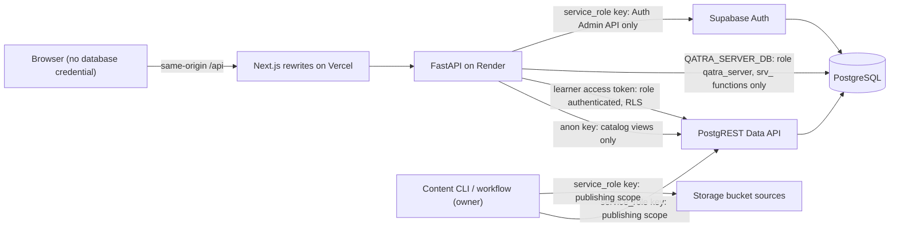
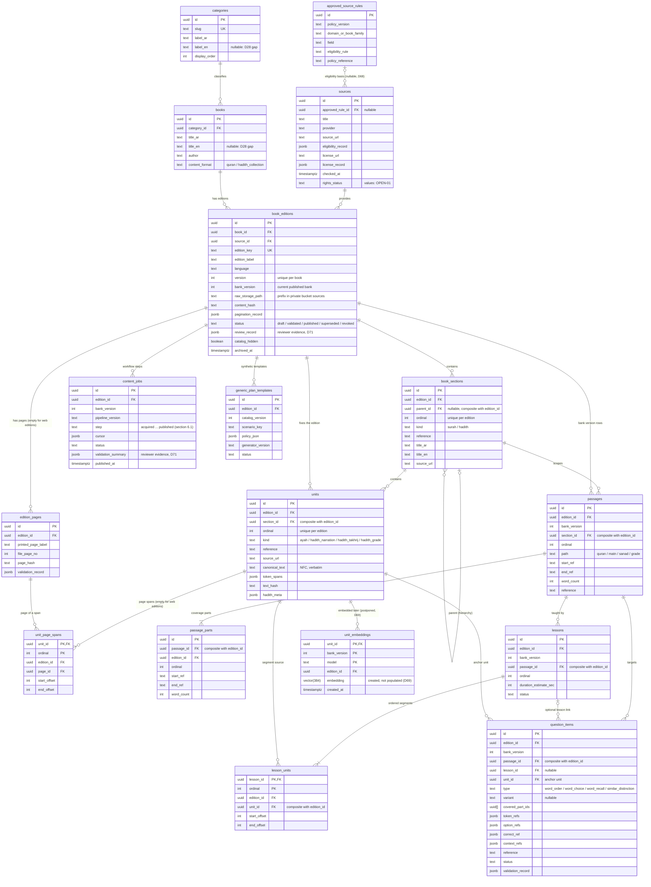
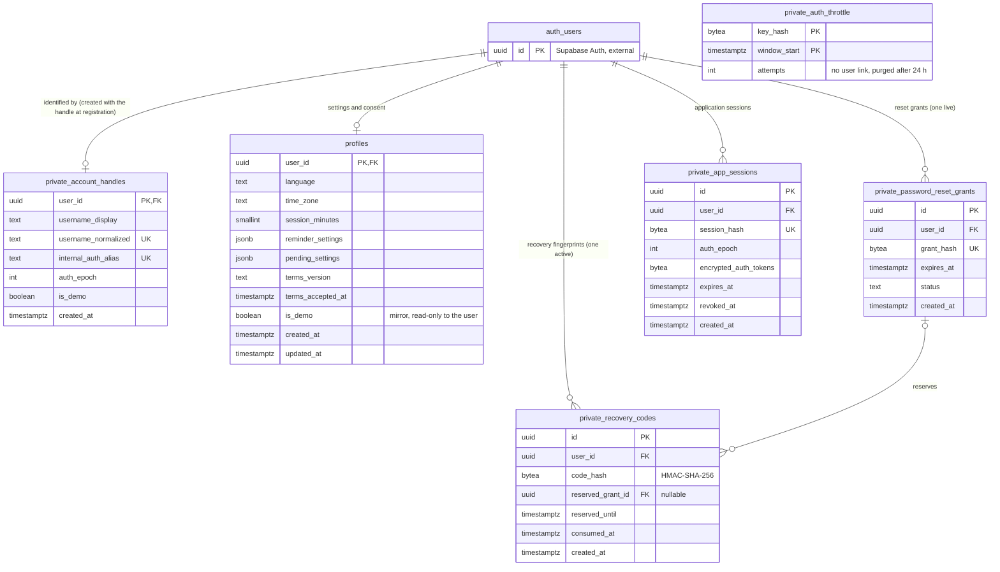
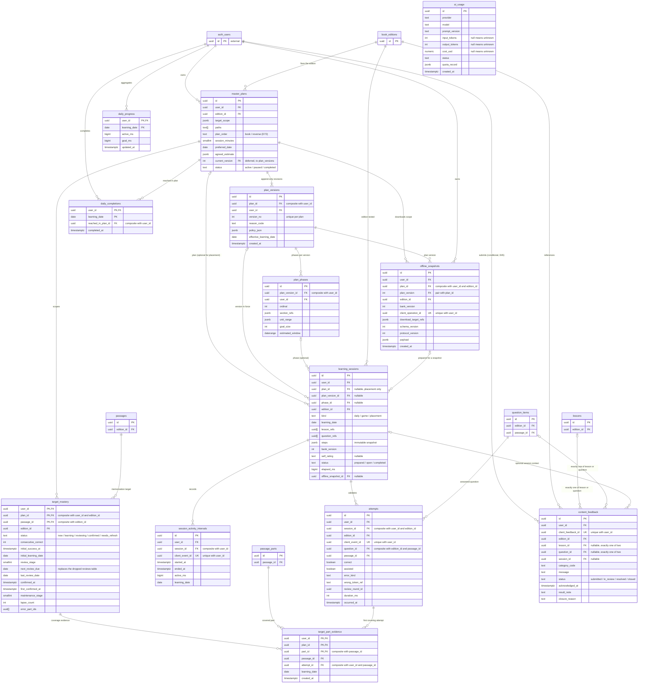

# Qatra — Database Schema (physical design)

Version 1 · 2026-10-04 · Status: Needs Review — awaiting owner approval (architecture phase)

Prepared by the Solutions Architect role (Role 3) for the root coordinator's review. Approval evidence: none yet (the owner approved the analysis deliverables and the architecture decisions D66–D72; this schema is a new architecture deliverable that the owner has not yet reviewed). Nothing in this file has been built or tested: no SQL file, migration, role, bucket, policy or function exists anywhere.

## 1. Scope, authority and status

This document is the **physical source** for the tables, columns, keys, constraints, indexes, delete behaviour, row-level security (RLS), database roles and grants, `srv_*` functions, the `sources` storage bucket and the migration order of Qatra's Supabase database. [Architecture-and-data.md](Architecture-and-data.md) keeps the logical description and points here for every physical detail.

It is documentation only (AGENTS.md: schema design may be documented, but no runnable implementation file may exist before the owner approves analysis and architecture for the affected scope). The definitions below are Markdown descriptions, not DDL.

Inputs, read on 2026-10-04:

- [Decision-register.md](Decision-register.md) D01–D71 (register v14). **D72** (plan order option, answer keys accepted for the MVP, GitHub scheduled keep-awake) and the seven architect directives come from the coordinator's decision record of 2026-10-04; D72 is not yet in register v14 (see §16).
- [Implementation-contract.md](Implementation-contract.md) v1.2, §2–§4, §6, §8 (physical additions, mastery state, authentication, configuration).
- [Architecture-and-data.md](Architecture-and-data.md) v12 (logical schema, RLS and role text), [Authentication-and-privacy.md](Authentication-and-privacy.md) v11, [PWA-design.md](PWA-design.md) v11 (offline snapshot fields), [AI-agent.md](AI-agent.md) (AI usage record), [Additional-features.md](Additional-features.md) (conditional feedback, D45), [PRD.md](PRD.md) v14 (modules M1–M12, R and NFR identifiers).

Reading guide:

- **OPEN-nn** marks anything that could not be derived from approved documents. Each is listed in §15 and none was invented as a business rule.
- **proposed** marks a design choice made here for integrity or security that no approved document states. It becomes part of the architecture only if the owner approves this document.
- Every column, FK, unique key, check, index, policy and trigger below is a design proposal (status Needs Review).

At a glance: **36 application tables** (35 unconditional plus the conditional `content_feedback`) created by five migrations (`0001_content` to `0005_rls_functions`) and one conditional migration (`0006_feedback`); the external `auth.users`; one logical table dropped (`reviews`); 2 catalog views; 18 `srv_*` functions; 5 trigger functions; the 4 database roles of directive 7 plus the migration owner; 1 private storage bucket; 17 open points (§15).

## 2. Access paths and ownership boundaries

The browser never holds a database credential or a Supabase token (D36, directive 7). Only the backend and the owner's content tool reach the database, over four distinct paths.

| Boundary | Contents | Written by | Read by |
|---|---|---|---|
| A. Shared published content | 14 catalog and bank tables (`categories`, `sources`, `books`, `book_editions`, `edition_pages`, `book_sections`, `units`, `unit_page_spans`, `passages`, `passage_parts`, `lessons`, `lesson_units`, `question_items`, `generic_plan_templates`) | `service_role`, publishing scope only (CLI or workflow, D48) | `authenticated`: published rows only; `anon`: only the two `public.catalog_*` views (D71) |
| B. Server-only content operations | `approved_source_rules`, `content_jobs`, `unit_embeddings`, Storage bucket `sources` | `service_role`, publishing scope only | nobody through learner roles |
| C. Private identity | `private.account_handles`, `private.recovery_codes`, `private.password_reset_grants`, `private.app_sessions`, `private.auth_throttle` | `srv_*` functions run by `qatra_server` | nobody directly; only `srv_*` functions |
| D. Personal learning rows | `profiles`, `master_plans`, `plan_versions`, `plan_phases`, `learning_sessions`, `attempts`, `session_activity_intervals`, `daily_progress`, `daily_completions`, `target_mastery`, `target_part_evidence`, `offline_snapshots`, and conditionally `content_feedback` | the backend with the learner's access token (RLS), after server-side validation (D40–D42) | the owning learner only (`user_id = auth.uid()`) |
| E. Server metering | `ai_usage` (no learner reference) | `srv_record_ai_usage` run by `qatra_server` | the owner through the Supabase dashboard (not through any application role) |

Counts: A 14, B 3, C 5, D 12 (plus one conditional), E 1, which is 35 tables plus the conditional one. Boundary A and B tables carry no `user_id`. Boundary C and D rows cascade on account deletion; published content is never deleted because a learner was deleted (contract §3).

## 3. Entity-relationship diagrams

Notation: crow's foot (`||` exactly one, `o|` zero or one, `}o` zero or many, `|{` one or many). Diagrams show keys and discriminating columns; §6 lists every column. Entities in the `private` schema are written `private_<name>` in the diagrams (Mermaid entity names cannot contain a dot) and `auth_users` stands for the external `auth.users` table managed by Supabase Auth. Where a foreign key is composite, the attribute comment names the pair (§4.3). `reviews` is not an entity: it is dropped (§3.4). Every table in boundaries C and D also has a direct `user_id` foreign key to `auth.users` with `ON DELETE CASCADE`; only the main ones are drawn to keep the diagrams readable.

### 3.1 Content (boundaries A and B, 17 tables)

### 3.2 Identity (boundary C plus `profiles`, 6 tables and the external `auth.users`)

### 3.3 Learning (boundaries D and E: 12 tables, plus the conditional `content_feedback`)

Content entities that learner rows reference are shown with their key only (their full definition is in §3.1). `ai_usage` has no relationship by design (D17: no account identifier ever reaches the model or its usage record). `content_feedback` is **conditional** (D45, migration `0006_feedback`): it exists only if the owner activates the feedback feature after the first-day gate.

### 3.4 `reviews` is dropped

Architect directive 3: the logical `reviews` table (Architecture-and-data v12; contract §3.2, which allowed "unused rows") is **not created**. The review ladder of D66 lives entirely in `target_mastery` and its evidence in `target_part_evidence`; due reviews are derived by a query on `target_mastery`. This is an architecture change to the logical schema (recorded in Architecture-and-data v13).

| Logical `reviews` field | Where it lives now |
|---|---|
| `due_at` | `target_mastery.next_review_due` (a learning date, D66 intervals are whole days) |
| `interval_days`, `stage` | `target_mastery.review_stage` (0–3) and `maintenance_stage`; the intervals 1, 2, 4 and 14, 30, 60 days are constants of the mastery policy (contract §4), not stored per row |
| `last_result`, `priority` | `target_mastery.status`, `lapse_count`, `last_review_date`, `error_part_ids`; priority is derived at query time (overdue first, contract §5) |
| index `(user_id, due_at)` | partial index on `target_mastery (user_id, plan_id, next_review_due)` (§6.3) |
| deletion-list entry | removed from the account-deletion list (§12.1) |

### 3.5 Logical to physical change log

| Logical (Architecture v12 and contract) | Physical (this document) | Reason |
|---|---|---|
| `reviews` | dropped | directive 3 (§3.4) |
| `target_mastery.target_type`, `target_id`, `review_evidence_refs` | key `(user_id, plan_id, passage_id)`, ladder columns, and table `target_part_evidence` | D66, contract §3.2 and §4: the target is the passage |
| `attempts.target_refs` | `passage_id` plus the question link; covered parts come from `question_items.covered_part_ids`; added `edition_id`, `assisted`, `review_round_id` | contract §3.2; same-edition composite keys |
| `lessons.duration_estimate` | `duration_estimate_sec` and `passage_id` | contract §2.6 bundle (`durationEstimateSec`, `passageId`) |
| `book_sections.title` | `title_ar`, `title_en`, plus `kind`, `source_url` | contract §3.1 |
| `lesson_units` | added `edition_id` | composite same-edition keys (Architecture: edition match enforced by composite keys) |
| `question_items` | added `variant`, `passage_id`, `covered_part_ids`, `context_refs`; `lesson_id` nullable; `unit_id` is the anchor unit | contract §3.1, §2.4 |
| `master_plans` | added `paths`, `plan_order` (`book` or `reverse`) | contract §3.2, D72 |
| `profiles` | added `pending_settings`, `is_demo` mirror | contract §3.2, D57 |
| `learning_sessions` | added `steps` (immutable snapshot); `status` is `prepared`, `open` or `completed` | contract §3.2 |
| `offline_snapshots` | added `payload` | contract §3.2, PWA-design §4 |
| `content_jobs.step` | vocabulary of directive 5; one row per `(edition_id, bank_version, step)` | directive 5, Architecture idempotency rule |
| `generic_plan_templates` | added `edition_id` | `catalog_version` is meaningful only together with an edition |
| `ai_usage` | defined from contract §3.2 plus `quota_record` | AI-agent: the checked free-tier quota is recorded per call |

## 4. Conventions

### 4.1 Types and naming

- **Schemas.** `public` is exposed through the Data API and every table in it has RLS enabled in the migration that creates it (contract §3). `private` is never exposed. `auth` and `storage` belong to Supabase.
- **Identifiers.** `uuid` primary keys. Rows created at run time (personal rows, `content_jobs`, `categories`, `approved_source_rules`, `generic_plan_templates`, `ai_usage`) default to `gen_random_uuid()`. Content rows produced by the workflow carry no default: the workflow supplies deterministic UUIDv5 ids (contract §2.4, §2.6) so that rebuilds are idempotent.
- **Time.** `timestamptz` (UTC) for instants. `date` columns named `learning_date`, `effective_learning_date`, `next_review_due` and similar hold learning dates in the account's time zone effective that day (D57). Durations are integer milliseconds (`bigint` where they accumulate) or seconds where the contract says so.
- **Text.** `text` with `CHECK` constraints instead of `varchar(n)`. No numeric maximum length is invented here; limits that approved documents state (username 3–24 characters) are the only bounded text lengths. Free-text limits for feedback are OPEN-13.
- **Value sets.** `text` plus `CHECK`, never PostgreSQL enum types, so that a value can be added by an ordinary migration (§4.4).
- **JSON.** `jsonb` with a `jsonb_typeof` check on the expected container. Shapes that approved documents fix are quoted; the others are OPEN-04.
- **Booleans** are `NOT NULL` with an explicit default. Nullable columns are marked in each table; `NULL` is used only where "absent", "unknown" or "not yet" is a real state.
- **Names.** `snake_case`; constraint and index names derive from table and columns; policy names are `<table>__<role>__<operation>`. Trigger and helper functions live in schema `private` (§10).

### 4.2 Delete behaviour classes

Every foreign key in §6 names its class and the resulting `ON DELETE` action.

| Class | Used for | ON DELETE |
|---|---|---|
| A | every personal row to `auth.users (id)` | `CASCADE` (account deletion removes personal rows) |
| B | personal child to personal parent through a composite key `(id, user_id)` | `CASCADE` |
| C | personal row to published content (edition, passage, part, question) | `RESTRICT` (published content is never deleted because of, or while referenced by, a learner) |
| D | content child to its parent inside one edition subtree | `CASCADE` (only a draft edition can be deleted; trigger `private.guard_edition_delete` blocks every other deletion, D44) |
| E | content row to catalog parents (`sources`, `books`, `categories`, `approved_source_rules`) | `RESTRICT` |
| F | optional link | `SET NULL` on the link column only (column-list form of `ON DELETE SET NULL`, PostgreSQL 15 or later; OPEN-15) |
| G | cyclic key `master_plans (id, current_version)` to `plan_versions (plan_id, version_no)` | `NO ACTION`, `DEFERRABLE INITIALLY DEFERRED` (checked at commit, so plan and first version are inserted together) |

Learner deletion therefore never touches content: foreign keys point from learner rows to content rows only (class C), never the other way.

### 4.3 Composite parent-ownership keys

Foreign-key checks run without RLS. Because a policy forces every inserted row's `user_id` to `auth.uid()` (§4.5, `P-OWN`), a composite foreign key `(parent_id, user_id)` proves that the parent belongs to the same account, and a composite key that includes `edition_id` proves that the content referenced belongs to the same edition (Architecture: parent ownership and edition match are enforced by composite keys, not by the client or the model). Each referenced unique key below exists only to serve those foreign keys.

| Referenced unique key | Referenced by |
|---|---|
| `book_sections (id, edition_id)` | `book_sections (parent_id, edition_id)`, `units (section_id, edition_id)`, `passages (section_id, edition_id)` |
| `edition_pages (id, edition_id)` | `unit_page_spans (page_id, edition_id)` |
| `units (id, edition_id)` | `unit_page_spans`, `lesson_units`, `unit_embeddings`, `question_items` (each on `(unit_id, edition_id)`) |
| `passages (id, edition_id)` | `passage_parts (passage_id, edition_id)`, `target_mastery (passage_id, edition_id)` |
| `passages (id, edition_id, bank_version)` | `lessons (passage_id, edition_id, bank_version)`, `question_items (passage_id, edition_id, bank_version)` (a lesson or question can only belong to a passage of its own bank version) |
| `passage_parts (id, passage_id)` | `target_part_evidence (part_id, passage_id)` |
| `lessons (id, edition_id)` | `lesson_units (lesson_id, edition_id)`, `question_items (lesson_id, edition_id)`, `content_feedback (lesson_id, edition_id)` |
| `question_items (id, edition_id, passage_id)` | `attempts (question_id, edition_id, passage_id)` |
| `question_items (id, edition_id)` | `content_feedback (question_id, edition_id)` |
| `master_plans (id, user_id)` | `plan_versions (plan_id, user_id)`, `daily_completions (reached_in_plan_id, user_id)` |
| `master_plans (id, user_id, edition_id)` | `learning_sessions`, `target_mastery`, `offline_snapshots` (each on `(plan_id, user_id, edition_id)`) |
| `plan_versions (plan_id, version_no)` | `master_plans (id, current_version)` (class G), `offline_snapshots (plan_id, plan_version)` |
| `plan_versions (id, user_id)` | `plan_phases (plan_version_id, user_id)` |
| `plan_versions (id, plan_id, user_id)` | `learning_sessions (plan_version_id, plan_id, user_id)` |
| `plan_phases (id, plan_version_id, user_id)` | `learning_sessions (phase_id, plan_version_id, user_id)` |
| `offline_snapshots (id, user_id)` | `learning_sessions (offline_snapshot_id, user_id)` |
| `learning_sessions (id, user_id)` | `session_activity_intervals (session_id, user_id)` |
| `learning_sessions (id, user_id, edition_id)` | `attempts (session_id, user_id, edition_id)`, `content_feedback (session_id, user_id, edition_id)` |
| `attempts (id, user_id, passage_id)` | `target_part_evidence (attempt_id, user_id, passage_id)` |
| `target_mastery (user_id, plan_id, passage_id)` (primary key) | `target_part_evidence (user_id, plan_id, passage_id)` |

Nullable composite keys use the default `MATCH SIMPLE`: when the nullable member is `NULL` (for example `plan_id` of a placement session) the key is not checked, which is intended.

### 4.4 Value sets

| Column | Values | Basis |
|---|---|---|
| `book_editions.status` | draft, validated, published, superseded, revoked | Architecture (fixed) |
| `books.content_format` | quran, hadith_collection | contract §2.6 |
| `book_sections.kind` | surah, hadith | contract §2.6 |
| `units.kind` | ayah, hadith_narration, hadith_takhrij, hadith_grade | contract §2.2 |
| `passages.path` and elements of `master_plans.paths` | quran, matn, sanad, grade | contract §2.3 |
| `question_items.type` | word_order, word_choice, word_recall, similar_distinction | D04, contract §2.4 |
| `question_items.variant` | word, segment (choice); keyword, continuation (recall); null | contract §2.6 |
| `content_jobs.step` | acquired, verified (the step identifier fixed by directive 5, not a document status), segmented, bank_built, validated, approved, published (web editions, directive 5); uploaded, extracted, page_mapped, embedded reserved for later editions and skipped in the MVP (D68, D69) | directive 5, Architecture |
| `learning_sessions.kind` | daily, game, placement | Architecture, contract §7 |
| `learning_sessions.status` | prepared, open, completed | contract §3.2 |
| `learning_sessions.self_rating` | none, some, most (placement only) | contract §5 |
| `master_plans.status` | active, paused, completed | contract §7 (`Plan.status`) |
| `master_plans.plan_order` | book, reverse | D72 |
| `target_mastery.status` | new, learning, reviewing, confirmed, needs_refresh | contract §4 |
| `profiles.language` | ar, en | PRD R11 |
| `profiles.session_minutes` | 5, 10, 15 | R01, D34 |
| `content_feedback.status` | submitted, in_review, resolved, closed | D45 |
| `password_reset_grants.status` | active, executing, consumed, cancelled | **proposed**, from the flow in Authentication-and-privacy (steps 2–5: no parallel execution, cancellation on expiry) |
| `content_jobs.status` | pending, running, succeeded, failed, skipped | **proposed**, from the Architecture rules (resume, failure keeps the edition draft, skipped steps) |
| `lessons.status`, `question_items.status` | draft, validated, published, revoked | **proposed**, mirrors the edition vocabulary (OPEN-01) |
| `generic_plan_templates.status` | draft, published, retired | **proposed** (OPEN-01) |

No `CHECK` is written for `sources.rights_status` (the contract names only `owner_accepted_pending_verification`), `attempts.error_kind`, `ai_usage.status` and `content_feedback.category_code`, because no approved document lists their values (OPEN-01).

### 4.5 RLS predicate catalogue

Policies use `(select auth.uid())` so that the planner evaluates it once per statement. A predicate may read another table; that read runs with the caller's rights and is itself subject to that table's RLS.

| Name | Predicate | Used by |
|---|---|---|
| `P-OWN` | `user_id = (select auth.uid())`, as both `USING` and `WITH CHECK` | every personal table |
| `P-ED` | `book_editions.status = 'published'` (catalog hiding and archiving do not apply here: a hidden or archived edition stays readable for pinned plans, D44) | `book_editions` |
| `P-PUB-CHILD` | an edition row with `id = <table>.edition_id` and `status = 'published'` exists | `edition_pages`, `book_sections`, `units`, `unit_page_spans` |
| `P-PUB-BANK` | `P-PUB-CHILD` and `<table>.bank_version = book_editions.bank_version` | `passages` |
| `P-PUB-ITEM` | `P-PUB-BANK` and `<table>.status = 'published'` | `lessons`, `question_items` |
| `P-VIA-PARENT` | a visible parent row exists (`passages` for `passage_parts`; `lessons` for `lesson_units`); the parent's own policy applies inside the check | `passage_parts`, `lesson_units` |
| `P-BOOK` | a `published` edition of the book exists | `books` |
| `P-CAT` | a book of the category has a `published` edition | `categories` |
| `P-SRC` | a `published` edition uses the source | `sources` |
| `P-TPL` | `generic_plan_templates.status = 'published'` | `generic_plan_templates` |

`P-ED` reads `status = 'published'` only; whether `superseded` editions and older bank versions remain readable for pinned plans is OPEN-03.

## 5. Roles, grants and access matrix

### 5.1 Roles

| Role | Kind | How it is reached | Privileges (target posture) |
|---|---|---|---|
| `anon` | Supabase built-in | publishable key, used by the backend for `GET /api/catalog` only | `SELECT` on `public.catalog_editions` and `public.catalog_sections` only (directive 2, D71). No table, function or storage access. |
| `authenticated` | Supabase built-in | the learner's access token, held and used only by the backend (the browser never receives it) | own rows through RLS (`P-OWN`); `SELECT` on published content through the predicates of §4.5; the `INSERT` and `UPDATE` grants listed in §5.2; `EXECUTE` on learner commit functions only if OPEN-02 is approved |
| `qatra_server` | **new** login role, created in `0002_identity` | direct database connection whose credential is the Render secret `QATRA_SERVER_DB` | `USAGE` on schema `public`, `EXECUTE` on the `srv_*` functions of §8 and nothing else: no table, view, sequence or storage privilege, not a member of any other role, `NOSUPERUSER NOCREATEDB NOCREATEROLE NOREPLICATION NOBYPASSRLS` |
| `service_role` | Supabase built-in (bypasses RLS) | secret key used only for (1) the Auth Admin API (create user, reset password, delete account) and (2) content publishing: content tables and bucket `sources` (directive 7, D69) | full access to boundary A and B tables and the `sources` bucket; **no** privilege on private or personal tables (revoked, §5.2). It never runs `srv_*` functions and never serves learner requests. |
| migration owner (`postgres`) | platform owner | migrations and the Supabase dashboard only, never the running application | owns every object including the `srv_*` functions (which run with the owner's rights, `SECURITY DEFINER`) |

The password of `qatra_server` is set by the owner out of band (Supabase SQL editor or dashboard), stored only as the Render secret `QATRA_SERVER_DB`, and never appears in migrations, git, logs, the frontend or delivery files (directive 7, D69). The credential format (connection string or password) is a backend configuration detail. Role-level settings proposed for `qatra_server`: `search_path` empty, a small `CONNECTION LIMIT` and a `statement_timeout`, with values chosen at provisioning (OPEN-15; the owner expects at most 10 users, D72).

### 5.2 Grant posture

1. **Defaults are revoked first.** Supabase grants broad default privileges on new `public` objects to `anon`, `authenticated` and `service_role`. Each table-creating migration revokes them for `anon` and `authenticated` immediately and enables RLS in the same migration; private and personal tables also revoke them from `service_role`. The reviewed grants and policies are then issued in `0005_rls_functions` (OPEN-15: confirm the defaults on the real project).
2. **Schema `private`**: no privilege for `PUBLIC`, `anon`, `authenticated` or `service_role`; `qatra_server` has no `USAGE`. `srv_*` functions reach it because they run as the owner.
3. **Schema `public`**: `qatra_server` receives `USAGE` only (it needs it to call the functions).
4. **`authenticated` read grants**: table-level `SELECT` on the content tables of §5.3 (policies decide the rows), except column lists on `book_editions` (all columns except `raw_storage_path` and `review_record`) and on `sources` (`id`, `title`, `provider`, `source_url`: eligibility and licence records stay internal). The backend must name columns explicitly for these two tables.
5. **`authenticated` write grants** (the backend writes under the learner's token, after validation; there is no direct browser path):
   - `INSERT` only (append-only rows): `plan_versions`, `plan_phases`, `attempts`, `session_activity_intervals`, `daily_completions`, `target_part_evidence`, `offline_snapshots` (and `content_feedback` if enabled).
   - `INSERT` and column-limited `UPDATE`: `master_plans` (all columns except `id`, `user_id`, `edition_id`, `created_at`), `learning_sessions` (only `status`, `elapsed_ms`), `daily_progress` (only `active_ms`, `goal_ms`), `target_mastery` (the state columns, never the key or `edition_id`).
   - Column-limited `UPDATE` only, no `INSERT`: `profiles` (only `language`, `time_zone`, `session_minutes`, `reminder_settings`, `pending_settings`; the row is created by `srv_register_account`, and `terms_version`, `terms_accepted_at` and `is_demo` are never writable by the learner).
   - No `DELETE` on any table: personal rows are removed only by account deletion (§12.1).
   - No grant at all on `ai_usage`, `unit_embeddings`, `content_jobs`, `approved_source_rules` and every `private.*` table.
6. **Functions.** The default `EXECUTE` for `PUBLIC`, `anon`, `authenticated` and `service_role` is revoked for the owner's `public` schema (so new functions are closed by default); `srv_*` functions are granted to `qatra_server` only (contract §3.2).
7. **Views.** `SELECT` on the two `catalog_*` views to `anon` and `authenticated`, nothing else (§7).
8. **Sequences**: none exist (all ids are UUIDs).
9. **`FORCE ROW LEVEL SECURITY` is not used**, because `srv_*` functions rely on the owner bypassing RLS; direct access by every other role stays subject to RLS and grants.
10. **Realtime**: no table is added to the Realtime publication (nothing in the approved documents needs it); the Data API exposes `public` only (OPEN-15).

### 5.3 Access matrix

`S` select, `I` insert, `U` update, `D` delete; `—` none. `qatra_server` has no table privilege anywhere; its only path to data is `EXECUTE` on `srv_*` (§8). `service_role` on content tables bypasses RLS (publishing scope only).

| Table | anon | authenticated | qatra_server | service_role |
|---|---|---|---|---|
| `categories` | — | S (`P-CAT`) | — | S I U D |
| `approved_source_rules` | — | — | — | S I U D |
| `sources` | — | S (`P-SRC`, columns) | — | S I U D |
| `books` | — | S (`P-BOOK`) | — | S I U D |
| `book_editions` | — | S (`P-ED`, columns) | — | S I U D |
| `edition_pages` | — | S (`P-PUB-CHILD`) | — | S I U D |
| `book_sections` | — | S (`P-PUB-CHILD`) | — | S I U D |
| `units` | — | S (`P-PUB-CHILD`) | — | S I U D |
| `unit_page_spans` | — | S (`P-PUB-CHILD`) | — | S I U D |
| `passages` | — | S (`P-PUB-BANK`) | — | S I U D |
| `passage_parts` | — | S (`P-VIA-PARENT`) | — | S I U D |
| `lessons` | — | S (`P-PUB-ITEM`) | — | S I U D |
| `lesson_units` | — | S (`P-VIA-PARENT`) | — | S I U D |
| `question_items` | — | S (`P-PUB-ITEM`) | — | S I U D |
| `unit_embeddings` | — | — | — | S I U D |
| `content_jobs` | — | — | — | S I U D |
| `generic_plan_templates` | — | S (`P-TPL`) | — | S I U D |
| `private.account_handles` | — | — | — (functions only) | — |
| `private.recovery_codes` | — | — | — (functions only) | — |
| `private.password_reset_grants` | — | — | — (functions only) | — |
| `private.app_sessions` | — | — | — (functions only) | — |
| `private.auth_throttle` | — | — | — (functions only) | — |
| `profiles` | — | S, U (columns) (`P-OWN`) | — (functions only) | — |
| `master_plans` | — | S, I, U (`P-OWN`) | — | — |
| `plan_versions` | — | S, I (`P-OWN`) | — | — |
| `plan_phases` | — | S, I (`P-OWN`) | — | — |
| `learning_sessions` | — | S, I, U (columns) (`P-OWN`) | — | — |
| `attempts` | — | S, I (`P-OWN`) | — | — |
| `session_activity_intervals` | — | S, I (`P-OWN`) | — | — |
| `daily_progress` | — | S, I, U (columns) (`P-OWN`) | — | — |
| `daily_completions` | — | S, I (`P-OWN`) | — | — |
| `target_mastery` | — | S, I, U (columns) (`P-OWN`) | — | — |
| `target_part_evidence` | — | S, I (`P-OWN`) | — | — |
| `offline_snapshots` | — | S, I (`P-OWN`) | — | — |
| `ai_usage` | — | — | — (`srv_record_ai_usage`) | — |
| `content_feedback` (conditional) | — | S, I (`P-OWN`; insert forced to `submitted`) | — | — |

## 6. Table definitions

Each definition lists columns (type, nullability, default, checks), keys, foreign keys with their delete class (§4.2) and `ON DELETE` action, unique constraints, indexes with purpose, RLS with the policy of each role, and triggers. "Supplied" means the content workflow provides the value (deterministic UUIDv5 ids, contract §2.4). A "Rules" entry of "non-empty" means `btrim(column) <> ''`. In every RLS line, an operation not listed for a role is denied (there is neither a policy nor a grant for it).

### 6.1 Content tables (boundaries A and B)

Common to all 17 tables: no `user_id`; RLS enabled in `0001_content`; written only through `service_role` in the publishing scope (CLI or workflow, D48); learner reads follow §5.3. For child tables the `edition_id` column is constrained by the composite foreign keys listed (class D: `CASCADE` inside one edition subtree), so no separate foreign key to `book_editions` is declared on them.

#### `categories`

Open list of subject areas (D01); not a closed enumeration.

| Column | Type | Null | Default | Rules |
|---|---|---|---|---|
| `id` | uuid | no | `gen_random_uuid()` | primary key |
| `slug` | text | no | — | unique; lower-case letters, digits, `_` and `-`, starting with a letter |
| `label_ar` | text | no | — | non-empty |
| `label_en` | text | yes | — | `NULL` means the English label is not yet sourced from the Jamhara dictionary (D28, OPEN-10) |
| `display_order` | integer | no | `0` | `>= 0` |
| `created_at` | timestamptz | no | `now()` | |
| `updated_at` | timestamptz | no | `now()` | maintained by trigger |

- **PK:** `id`. **FKs:** none. **Unique:** `slug`. **Indexes:** none beyond the keys (tiny table).
- **RLS:** enabled · anon: none · authenticated: select (`P-CAT`) · qatra_server: none · service_role: select, insert, update, delete (publishing scope).
- **Triggers:** `set_updated_at`.

#### `approved_source_rules`

Eligibility rules taken from the scientific reference (`challenge/Scientific-source-reference.pdf`, pp. 3–4). A row never approves a whole site or all editions of a book family (Architecture).

| Column | Type | Null | Default | Rules |
|---|---|---|---|---|
| `id` | uuid | no | `gen_random_uuid()` | primary key |
| `policy_version` | text | no | — | non-empty |
| `domain_or_book_family` | text | no | — | non-empty |
| `field` | text | no | — | non-empty |
| `eligibility_rule` | text | no | — | non-empty |
| `policy_reference` | text | no | — | non-empty; points to the reference page, never a copy of its text |
| `created_at` | timestamptz | no | `now()` | |

- **PK:** `id`. **FKs:** none. **Unique:** `(policy_version, domain_or_book_family, field)`. **Indexes:** none beyond the keys.
- **RLS:** enabled · anon: none · authenticated: none · qatra_server: none · service_role: select, insert, update, delete (publishing scope).
- **Triggers:** none.

#### `sources`

Documented eligibility and rights of a source, independent of any edition (D19, D62, D68).

| Column | Type | Null | Default | Rules |
|---|---|---|---|---|
| `id` | uuid | no | — (supplied) | primary key |
| `approved_rule_id` | uuid | yes | — | `NULL` for the D68 sources (QuranEnc, HadeethEnc through the Islamic Content MCP): their eligibility is the owner's recorded decision, kept in `eligibility_record` |
| `title` | text | no | — | non-empty |
| `provider` | text | no | — | non-empty |
| `source_url` | text | no | — | starts with `https://` |
| `eligibility_record` | jsonb | no | `'{}'` | object; shape OPEN-04 |
| `license_url` | text | yes | — | `NULL` or starts with `https://` |
| `license_record` | jsonb | no | `'{}'` | object; shape OPEN-04 |
| `checked_at` | timestamptz | yes | — | last rights or eligibility check, or retrieval time |
| `rights_status` | text | no | — | contract §2.1 names `owner_accepted_pending_verification`; the full value set is OPEN-01 (no `CHECK`) |
| `created_at` | timestamptz | no | `now()` | |
| `updated_at` | timestamptz | no | `now()` | maintained by trigger |

- **PK:** `id`. **FKs:** `approved_rule_id` to `approved_source_rules (id)` (class E, `ON DELETE RESTRICT`). **Unique:** none beyond the key. **Indexes:** `(approved_rule_id)` — foreign-key support.
- **RLS:** enabled · anon: none · authenticated: select (`P-SRC`; columns `id`, `title`, `provider`, `source_url` only) · qatra_server: none · service_role: select, insert, update, delete (publishing scope).
- **Triggers:** `set_updated_at`.

#### `books`

| Column | Type | Null | Default | Rules |
|---|---|---|---|---|
| `id` | uuid | no | — (supplied) | primary key |
| `category_id` | uuid | no | — | |
| `title_ar` | text | no | — | non-empty |
| `title_en` | text | yes | — | `NULL` means the English title is not yet sourced (D28, OPEN-10) |
| `author` | text | no | — | non-empty |
| `content_format` | text | no | — | `quran` or `hadith_collection` |
| `created_at` | timestamptz | no | `now()` | |
| `updated_at` | timestamptz | no | `now()` | maintained by trigger |

- **PK:** `id`. **FKs:** `category_id` to `categories (id)` (class E, `ON DELETE RESTRICT`). **Unique:** none beyond the key. **Indexes:** `(category_id)` — foreign-key support and catalog grouping.
- **RLS:** enabled · anon: none · authenticated: select (`P-BOOK`) · qatra_server: none · service_role: select, insert, update, delete (publishing scope).
- **Triggers:** `set_updated_at`.

#### `book_editions`

One immutable-text edition of a book with its own fingerprint, status and reviewer evidence. A translation would be an independent edition (D27, postponed by D49); no edition links to another.

| Column | Type | Null | Default | Rules |
|---|---|---|---|---|
| `id` | uuid | no | — (supplied) | primary key |
| `book_id` | uuid | no | — | |
| `source_id` | uuid | no | — | |
| `edition_key` | text | no | — | unique; lower-case letters, digits and `-`, 3–64 characters (for example `quran-hafs-quranenc`, `nawawi40-hadeethenc`) |
| `edition_label` | text | no | — | non-empty |
| `language` | text | no | — | two or three lower-case letters |
| `version` | integer | no | — | `>= 1`; unique per book |
| `bank_version` | integer | no | — | `>= 1`; the bank version learners use for this edition (catalog version) |
| `raw_storage_path` | text | yes | — | `NULL` before acquisition; otherwise exactly `edition_key` followed by `/raw/` (the prefix inside the private bucket `sources`, directive 5) |
| `content_hash` | text | yes | — | `NULL` or 64 lower-case hexadecimal characters (SHA-256) |
| `pagination_record` | jsonb | no | `'{}'` | object; contract §2.6 uses `{"kind": "web_edition"}` for web editions |
| `status` | text | no | `'draft'` | `draft`, `validated`, `published`, `superseded` or `revoked` |
| `review_record` | jsonb | no | `'{}'` | object; reviewer evidence (directive 4, D71); contract §2.6 fixes `knownGaps` and `suspectedErrors`, the keys `acquisition`, `verification` and `approval` are proposed (OPEN-04) |
| `catalog_hidden` | boolean | no | `false` | administrative hiding from new selection (D44); never overrides `status` |
| `archived_at` | timestamptz | yes | — | administrative archive time (D44) |
| `created_at` | timestamptz | no | `now()` | |
| `updated_at` | timestamptz | no | `now()` | maintained by trigger |

- **Checks (beyond the value rules above):** `status = 'draft'` or `content_hash` is not null (a fingerprint exists before validation); `status` in (`draft`, `validated`) or `review_record` has the top-level key `approval` (**proposed**, directive 4: nothing is published without the owner's recorded approval step); `jsonb_typeof(review_record) = 'object'`.
- **PK:** `id`. **FKs:** `book_id` to `books (id)` (class E, `ON DELETE RESTRICT`); `source_id` to `sources (id)` (class E, `ON DELETE RESTRICT`). **Unique:** `edition_key`; `(book_id, version)`.
- **Indexes:** `(book_id)` where `status = 'published'` — catalog views and `P-BOOK`; `(source_id)` — foreign-key support and `P-SRC`.
- **RLS:** enabled · anon: none · authenticated: select (`P-ED`; all columns except `raw_storage_path` and `review_record`) · qatra_server: none · service_role: select, insert, update, delete (publishing scope).
- **Triggers:** `set_updated_at`; `guard_edition_delete` (before delete: only a never-published `draft` edition may be deleted, D44).

#### `edition_pages`

Printed-page records of a paginated edition. Stays **empty for web editions** (D68: the canonical URL is the page-level reference).

| Column | Type | Null | Default | Rules |
|---|---|---|---|---|
| `id` | uuid | no | — (supplied) | primary key |
| `edition_id` | uuid | no | — | |
| `printed_page_label` | text | yes | — | printed number, kept separate from the file page number (never guessed) |
| `file_page_no` | integer | yes | — | `>= 1` |
| `page_hash` | text | no | — | 64 lower-case hexadecimal characters |
| `validation_record` | jsonb | no | `'{}'` | object |

- **Checks:** `printed_page_label` or `file_page_no` is present.
- **PK:** `id`. **FKs:** `edition_id` to `book_editions (id)` (class D, `ON DELETE CASCADE`). **Unique:** `(id, edition_id)`; `(edition_id, printed_page_label)`; `(edition_id, file_page_no)` (a page binds once inside an edition).
- **Indexes:** the unique keys serve all lookups.
- **RLS:** enabled · anon: none · authenticated: select (`P-PUB-CHILD`) · qatra_server: none · service_role: select, insert, update, delete (publishing scope).
- **Triggers:** none.

#### `book_sections`

Surahs, hadith numbers, chapters; a hierarchy through `parent_id`.

| Column | Type | Null | Default | Rules |
|---|---|---|---|---|
| `id` | uuid | no | — (supplied) | primary key |
| `edition_id` | uuid | no | — | |
| `parent_id` | uuid | yes | — | parent section of the same edition |
| `ordinal` | integer | no | — | `>= 1`; unique per edition (plan scopes use these ordinals, contract §5) |
| `kind` | text | no | — | `surah` or `hadith` |
| `reference` | text | no | — | non-empty (for example `78`) |
| `title_ar` | text | no | — | non-empty; a UI label, never unit text (contract §2.2) |
| `title_en` | text | no | — | non-empty; numeric label (`Surah 78`, `Hadith 1`) until Jamhara terms are sourced (D28, OPEN-10) |
| `source_url` | text | yes | — | `NULL` or starts with `https://` (canonical URL of the section) |

- **PK:** `id`. **FKs:** `edition_id` to `book_editions (id)` (class D, `CASCADE`); `(parent_id, edition_id)` to `book_sections (id, edition_id)` (class D, `CASCADE`). **Unique:** `(id, edition_id)`; `(edition_id, ordinal)`.
- **Indexes:** `(parent_id)` where `parent_id` is not null — hierarchy walks and foreign-key support.
- **RLS:** enabled · anon: none · authenticated: select (`P-PUB-CHILD`) · qatra_server: none · service_role: select, insert, update, delete (publishing scope).
- **Triggers:** none.

#### `units`

The verbatim positions of the original text (an ayah, or for each hadith up to three units: narration, takhrij, grade; contract §2.2).

| Column | Type | Null | Default | Rules |
|---|---|---|---|---|
| `id` | uuid | no | — (supplied) | primary key |
| `edition_id` | uuid | no | — | |
| `section_id` | uuid | no | — | |
| `ordinal` | integer | no | — | `>= 1`; unique per edition (token references use it) |
| `kind` | text | no | — | `ayah`, `hadith_narration`, `hadith_takhrij` or `hadith_grade` |
| `reference` | text | no | — | non-empty (`78:1`, `nawawi40:1`) |
| `source_url` | text | yes | — | `NULL` or starts with `https://`; web editions carry the canonical URL here (D68) |
| `canonical_text` | text | no | — | non-empty; **stored NFC-normalized** (`is_normalized(canonical_text, 'NFC')`, contract §2.7); zero-width characters of the publisher text are preserved |
| `char_start` | integer | yes | — | `NULL` for web editions; both or neither of `char_start`, `char_end`; `0 <= char_start <= char_end` |
| `char_end` | integer | yes | — | |
| `token_spans` | jsonb | no | — | array of token objects `{i, s, e, k, n, a?}` (contract §2.2) |
| `text_hash` | text | no | — | 64 lower-case hexadecimal characters (SHA-256 of `canonical_text`) |
| `hadith_meta` | jsonb | yes | — | `NULL` for `ayah`; object for hadith units (contract §2.6 `hadithMeta`: Forty number, HadeethEnc id, Sahihayn citation flag, grade flag, D50 notice flag) |

- **PK:** `id`. **FKs:** `(section_id, edition_id)` to `book_sections (id, edition_id)` (class D, `ON DELETE CASCADE`). **Unique:** `(id, edition_id)`; `(edition_id, ordinal)`.
- **Indexes:** `(section_id, ordinal)` — reading a section's units in order.
- **RLS:** enabled · anon: none · authenticated: select (`P-PUB-CHILD`) · qatra_server: none · service_role: select, insert, update, delete (publishing scope).
- **Triggers:** `guard_unit_text` (before update: `canonical_text`, `token_spans` and `text_hash` cannot change once the edition has left `draft`; correction means a new edition, D03, D20, D44).

#### `unit_page_spans`

Pages covered by a unit. Stays **empty for web editions** (D68).

| Column | Type | Null | Default | Rules |
|---|---|---|---|---|
| `unit_id` | uuid | no | — | part of primary key |
| `ordinal` | integer | no | — | `>= 1`; part of primary key |
| `edition_id` | uuid | no | — | |
| `page_id` | uuid | no | — | |
| `start_offset` | integer | no | — | `>= 0` |
| `end_offset` | integer | no | — | `>= start_offset` |

- **PK:** `(unit_id, ordinal)`. **FKs:** `(unit_id, edition_id)` to `units (id, edition_id)` (class D, `ON DELETE CASCADE`); `(page_id, edition_id)` to `edition_pages (id, edition_id)` (class D, `ON DELETE CASCADE`). **Unique:** none beyond the key.
- **Indexes:** `(page_id)` — foreign-key support.
- **RLS:** enabled · anon: none · authenticated: select (`P-PUB-CHILD`) · qatra_server: none · service_role: select, insert, update, delete (publishing scope).
- **Triggers:** none.

#### `passages`

The memorization target (D66): a fixed contiguous token range inside one section, on one path (contract §2.3).

| Column | Type | Null | Default | Rules |
|---|---|---|---|---|
| `id` | uuid | no | — (supplied) | primary key |
| `edition_id` | uuid | no | — | |
| `bank_version` | integer | no | — | `>= 1` |
| `section_id` | uuid | no | — | |
| `ordinal` | integer | no | — | `>= 1`; book order of the passages of one path within the edition and bank version |
| `path` | text | no | — | `quran`, `matn`, `sanad` or `grade` |
| `start_ref` | text | no | — | token reference `<unitOrdinal>:<tokenIndex>` (digits, colon, digits) |
| `end_ref` | text | no | — | same format |
| `word_count` | integer | no | — | `>= 1`; number of `word` tokens (the weight in overall progress, D66) |
| `reference` | text | no | — | non-empty (`78:1-5`) |

- **PK:** `id`. **FKs:** `(section_id, edition_id)` to `book_sections (id, edition_id)` (class D, `ON DELETE CASCADE`). **Unique:** `(edition_id, bank_version, path, ordinal)`; `(id, edition_id)`; `(id, edition_id, bank_version)`.
- **Indexes:** `(section_id)` — foreign-key support and per-section statistics; the unique key serves book-order scans.
- **RLS:** enabled · anon: none · authenticated: select (`P-PUB-BANK`) · qatra_server: none · service_role: select, insert, update, delete (publishing scope).
- **Triggers:** none.

#### `passage_parts`

The coverage unit inside a passage (D66, contract §2.3).

| Column | Type | Null | Default | Rules |
|---|---|---|---|---|
| `id` | uuid | no | — (supplied) | primary key |
| `passage_id` | uuid | no | — | |
| `edition_id` | uuid | no | — | |
| `ordinal` | integer | no | — | `>= 1` |
| `start_ref` | text | no | — | token reference format as in `passages` |
| `end_ref` | text | no | — | |
| `word_count` | integer | no | — | `>= 1` |

- **PK:** `id`. **FKs:** `(passage_id, edition_id)` to `passages (id, edition_id)` (class D, `ON DELETE CASCADE`). **Unique:** `(passage_id, ordinal)`; `(id, passage_id)`.
- **Indexes:** the unique keys serve all lookups.
- **RLS:** enabled · anon: none · authenticated: select (`P-VIA-PARENT`) · qatra_server: none · service_role: select, insert, update, delete (publishing scope).
- **Triggers:** none.

#### `lessons`

A fixed lesson for one passage, reusable by every learner; no `user_id` (Architecture).

| Column | Type | Null | Default | Rules |
|---|---|---|---|---|
| `id` | uuid | no | — (supplied) | primary key |
| `edition_id` | uuid | no | — | |
| `bank_version` | integer | no | — | `>= 1`; equals the passage's bank version (enforced by the composite key) |
| `passage_id` | uuid | no | — | |
| `ordinal` | integer | no | — | `>= 1` |
| `duration_estimate_sec` | integer | no | — | `> 0` (contract §2.6 `durationEstimateSec`) |
| `status` | text | no | `'draft'` | `draft`, `validated`, `published` or `revoked` (**proposed**, OPEN-01) |

- **PK:** `id`. **FKs:** `(passage_id, edition_id, bank_version)` to `passages (id, edition_id, bank_version)` (class D, `ON DELETE CASCADE`). **Unique:** `(edition_id, bank_version, ordinal)`; `(id, edition_id)`.
- **Indexes:** `(passage_id)` — lesson lookup by passage.
- **RLS:** enabled · anon: none · authenticated: select (`P-PUB-ITEM`) · qatra_server: none · service_role: select, insert, update, delete (publishing scope).
- **Triggers:** none.

#### `lesson_units`

Ordered segments of units that make up a lesson; no generated text (Architecture).

| Column | Type | Null | Default | Rules |
|---|---|---|---|---|
| `lesson_id` | uuid | no | — | part of primary key |
| `ordinal` | integer | no | — | `>= 1`; part of primary key |
| `edition_id` | uuid | no | — | added for the same-edition composite keys |
| `unit_id` | uuid | no | — | |
| `start_offset` | integer | no | — | `>= 0`; character offset inside the unit's `canonical_text` |
| `end_offset` | integer | no | — | `> start_offset` |

- **PK:** `(lesson_id, ordinal)`. **FKs:** `(lesson_id, edition_id)` to `lessons (id, edition_id)` (class D, `ON DELETE CASCADE`); `(unit_id, edition_id)` to `units (id, edition_id)` (class D, `ON DELETE CASCADE`). **Unique:** none beyond the key.
- **Indexes:** `(unit_id)` — foreign-key support.
- **RLS:** enabled · anon: none · authenticated: select (`P-VIA-PARENT`) · qatra_server: none · service_role: select, insert, update, delete (publishing scope).
- **Triggers:** none.

#### `question_items`

The deterministic question bank: four templates, every reference taken from the same edition; nothing is generated (D20, D22, D31, D64; contract §2.4). Distractor and wrong options are stored as token **references**, never as text (D31).

| Column | Type | Null | Default | Rules |
|---|---|---|---|---|
| `id` | uuid | no | — (supplied) | primary key |
| `edition_id` | uuid | no | — | |
| `bank_version` | integer | no | — | `>= 1`; equals the passage's bank version (enforced by the composite key) |
| `passage_id` | uuid | no | — | |
| `lesson_id` | uuid | yes | — | the lesson of the passage; derivable, so nullable (OPEN-09) |
| `unit_id` | uuid | no | — | the anchor unit: the unit of the first token of `token_refs` (OPEN-09) |
| `type` | text | no | — | `word_order`, `word_choice`, `word_recall` or `similar_distinction` |
| `variant` | text | yes | — | `NULL`, or `word` / `segment` for `word_choice`, or `keyword` / `continuation` for `word_recall` |
| `covered_part_ids` | uuid[] | no | — | at least one element; each id must be a part of `passage_id` (checked by the workflow, an array element cannot carry a foreign key) |
| `token_refs` | jsonb | no | — | array of token references |
| `option_refs` | jsonb | yes | — | array of arrays of token references; present exactly for `word_choice` and `similar_distinction` |
| `correct_ref` | jsonb | no | — | array of token references |
| `context_refs` | jsonb | no | `'[]'` | array; context shown around the blank is never coverage (D64, D66) |
| `reference` | text | no | — | non-empty (`78:1`) |
| `status` | text | no | `'draft'` | `draft`, `validated`, `published` or `revoked` (**proposed**, OPEN-01) |
| `validation_record` | jsonb | no | `'{}'` | object |

- **Checks:** `option_refs` is not null exactly when `type` is `word_choice` or `similar_distinction`; `variant` consistent with `type` as above; `cardinality(covered_part_ids) >= 1`; `jsonb_typeof` of `token_refs`, `option_refs`, `correct_ref`, `context_refs` is `array`.
- **PK:** `id`. **FKs:** `(passage_id, edition_id, bank_version)` to `passages (id, edition_id, bank_version)` (class D, `ON DELETE CASCADE`); `(lesson_id, edition_id)` to `lessons (id, edition_id)` (class D, `ON DELETE CASCADE`); `(unit_id, edition_id)` to `units (id, edition_id)` (class D, `ON DELETE CASCADE`). **Unique:** `(id, edition_id)`; `(id, edition_id, passage_id)`.
- **Indexes:** `(passage_id, type)` — choose questions of a passage by game type; GIN `(covered_part_ids)` — choose questions that cover a given part (uncovered-first selection, contract §4); `(edition_id, bank_version)` — bundle and policy scans.
- **RLS:** enabled · anon: none · authenticated: select (`P-PUB-ITEM`; the rows include `correct_ref` because answer keys travel to the device, accepted MVP risk D72) · qatra_server: none · service_role: select, insert, update, delete (publishing scope).
- **Triggers:** none.

#### `unit_embeddings`

Created but **not populated** in the MVP (D69; the workflow's `embedded` step is skipped and D31 candidates come from normalized text matching inside one edition).

| Column | Type | Null | Default | Rules |
|---|---|---|---|---|
| `unit_id` | uuid | no | — | part of primary key |
| `bank_version` | integer | no | — | `>= 1`; part of primary key |
| `model` | text | no | — | non-empty; part of primary key |
| `edition_id` | uuid | no | — | every query is limited to one edition (D11) |
| `embedding` | `vector(384)` | no | — | dimension from contract §3.1; model choice Needs Review (OPEN-12) |
| `created_at` | timestamptz | no | `now()` | |

- **PK:** `(unit_id, bank_version, model)`. **FKs:** `(unit_id, edition_id)` to `units (id, edition_id)` (class D, `ON DELETE CASCADE`). **Unique:** none beyond the key.
- **Indexes:** HNSW on `embedding` (cosine operator class **proposed**, OPEN-12); `(edition_id, bank_version)` — edition-restricted retrieval.
- **RLS:** enabled · anon: none · authenticated: none · qatra_server: none · service_role: select, insert, update, delete (publishing scope). Runtime reads are postponed with the feature (OPEN-12).
- **Triggers:** none.

#### `content_jobs`

Drives the Background Workflow (D37, D65): one row per `(edition, bank version, step)`, so repeating a step never repeats its effect, and a run resumes from `cursor` (Architecture).

| Column | Type | Null | Default | Rules |
|---|---|---|---|---|
| `id` | uuid | no | `gen_random_uuid()` | primary key |
| `edition_id` | uuid | no | — | |
| `bank_version` | integer | no | — | `>= 1` |
| `pipeline_version` | text | no | — | non-empty |
| `step` | text | no | — | `acquired`, `verified`, `segmented`, `bank_built`, `validated`, `approved`, `published` for web editions (directive 5); `uploaded`, `extracted`, `page_mapped`, `embedded` are reserved for later editions and skipped in the MVP (D68, D69) |
| `cursor` | jsonb | yes | — | resume position; `NULL` or object |
| `status` | text | no | `'pending'` | `pending`, `running`, `succeeded`, `failed` or `skipped` (**proposed**, OPEN-01); a failed step keeps the edition `draft` |
| `validation_summary` | jsonb | yes | — | `NULL` or object: verbatim-verification results (contract §2.7) and, for the `approved` step, who and when (reviewer evidence, directive 4, D71) |
| `published_at` | timestamptz | yes | — | only on the `published` step |
| `created_at` | timestamptz | no | `now()` | |
| `updated_at` | timestamptz | no | `now()` | maintained by trigger |

- **Checks:** `published_at` is null unless `step = 'published'`; `jsonb_typeof` object or null for `cursor` and `validation_summary`.
- **PK:** `id`. **FKs:** `edition_id` to `book_editions (id)` (class D, `ON DELETE CASCADE`; an edition that was ever published cannot be deleted at all). **Unique:** `(edition_id, bank_version, step)`.
- **Indexes:** `(edition_id, status)` — find unfinished steps for resume.
- **RLS:** enabled · anon: none · authenticated: none · qatra_server: none · service_role: select, insert, update, delete (publishing scope).
- **Triggers:** `set_updated_at`.

#### `generic_plan_templates`

Planning templates built from synthetic cases only; no account identifier or person record (D17, D29, Architecture).

| Column | Type | Null | Default | Rules |
|---|---|---|---|---|
| `id` | uuid | no | `gen_random_uuid()` | primary key |
| `edition_id` | uuid | no | — | added: `catalog_version` is meaningful only together with an edition (OPEN-09) |
| `catalog_version` | integer | no | — | `>= 1`; the published `bank_version` the template was built on |
| `scenario_key` | text | no | — | non-empty; key of a synthetic scenario |
| `policy_json` | jsonb | no | — | object |
| `generator_version` | text | no | — | non-empty |
| `status` | text | no | `'draft'` | `draft`, `published` or `retired` (**proposed**, OPEN-01) |
| `created_at` | timestamptz | no | `now()` | |

- **PK:** `id`. **FKs:** `edition_id` to `book_editions (id)` (class D, `ON DELETE CASCADE`). **Unique:** `(edition_id, catalog_version, scenario_key, generator_version)`. **Indexes:** the unique key serves lookups.
- **RLS:** enabled · anon: none · authenticated: select (`P-TPL`) · qatra_server: none · service_role: select, insert, update, delete (publishing scope). The runtime read path is not stated by approved documents; `authenticated` select is the only application path that exists (OPEN-09).
- **Triggers:** none.

### 6.2 Identity tables (boundary C, plus `profiles`)

The five `private.*` tables are reachable only through the `srv_*` functions of §8: RLS is enabled, no policy exists for any role (default deny), and privileges are revoked from `anon`, `authenticated` and `service_role`; `qatra_server` holds no table privilege. Every `private.*` and `profiles` row belongs to an Auth user and is removed with it (class A). The service layer, not the database, validates the full username character rule and all password rules (Authentication-and-privacy; passwords live only in Supabase Auth, no password column exists anywhere).

#### `private.account_handles`

| Column | Type | Null | Default | Rules |
|---|---|---|---|---|
| `user_id` | uuid | no | — | primary key |
| `username_display` | text | no | — | 3–24 characters, as the user typed it |
| `username_normalized` | text | no | — | unique; 3–24 characters; NFKC-normalized (`is_normalized(…, 'NFKC')`), equal to its own `lower()` (Latin letters lower-cased, no other folding, contract §6), no whitespace |
| `internal_auth_alias` | text | no | — | unique; the technical address `u.<uuid4>@qatra.invalid` (never a learner email, never used to send mail) |
| `auth_epoch` | integer | no | `0` | `>= 0`; incremented by password change and recovery, which invalidates older app sessions |
| `is_demo` | boolean | no | `false` | set only by the server when a demo account is created from the demo link (D29) |
| `created_at` | timestamptz | no | `now()` | |

- **PK:** `user_id`. **FKs:** `user_id` to `auth.users (id)` (class A, `ON DELETE CASCADE`). **Unique:** `username_normalized`; `internal_auth_alias`. **Indexes:** the unique keys serve login and registration lookups.
- **RLS:** enabled · anon: none · authenticated: none · qatra_server: none (functions only) · service_role: none (revoked).
- **Triggers:** none.

#### `private.password_reset_grants`

A short-lived permission that allows one password change and nothing else (Authentication-and-privacy, recovery steps 2–5).

| Column | Type | Null | Default | Rules |
|---|---|---|---|---|
| `id` | uuid | no | `gen_random_uuid()` | primary key |
| `user_id` | uuid | no | — | |
| `grant_hash` | bytea | no | — | unique; exactly 32 bytes: HMAC-SHA-256 under `QATRA_RECOVERY_HMAC_KEY`; the raw grant is never stored (contract §6) |
| `expires_at` | timestamptz | no | — | ten minutes after creation (contract §6); `expires_at > created_at` |
| `status` | text | no | `'active'` | `active`, `executing`, `consumed` or `cancelled` (**proposed**, OPEN-01) |
| `created_at` | timestamptz | no | `now()` | |

- **PK:** `id`. **FKs:** `user_id` to `auth.users (id)` (class A, `ON DELETE CASCADE`). **Unique:** `grant_hash`; partial unique `(user_id)` where `status` in (`active`, `executing`) — at most one live grant per account, so two simultaneous requests cannot hold two active grants (Authentication step 2).
- **Indexes:** the unique keys serve lookups.
- **RLS:** enabled · anon: none · authenticated: none · qatra_server: none (functions only) · service_role: none (revoked).
- **Triggers:** none. Retention of terminal grants is OPEN-06.

#### `private.recovery_codes`

| Column | Type | Null | Default | Rules |
|---|---|---|---|---|
| `id` | uuid | no | `gen_random_uuid()` | primary key |
| `user_id` | uuid | no | — | |
| `code_hash` | bytea | no | — | exactly 32 bytes: HMAC-SHA-256 under `QATRA_RECOVERY_HMAC_KEY`; the raw 128-bit code is never stored, logged or sent to a model (contract §6) |
| `created_at` | timestamptz | no | `now()` | |
| `reserved_grant_id` | uuid | yes | — | the grant that atomically reserved the code |
| `reserved_until` | timestamptz | yes | — | required when `reserved_grant_id` is set; a reservation whose time has passed counts as released |
| `consumed_at` | timestamptz | yes | — | set when the code is used by a recovery or replaced by a rotation; no separate revoked column |

- **PK:** `id`. **FKs:** `user_id` to `auth.users (id)` (class A, `CASCADE`); `reserved_grant_id` to `private.password_reset_grants (id)` (class F, `ON DELETE SET NULL` on that column only). **Unique:** partial unique `(user_id)` where `consumed_at` is null — exactly one active code per account.
- **Indexes:** `(reserved_grant_id)` where not null — foreign-key support.
- **RLS:** enabled · anon: none · authenticated: none · qatra_server: none (functions only) · service_role: none (revoked).
- **Triggers:** none.

#### `private.app_sessions`

| Column | Type | Null | Default | Rules |
|---|---|---|---|---|
| `id` | uuid | no | `gen_random_uuid()` | primary key |
| `user_id` | uuid | no | — | |
| `session_hash` | bytea | no | — | unique; exactly 32 bytes: HMAC-SHA-256 under `QATRA_SESSION_HMAC_KEY` of the 32-byte random cookie token (contract §6) |
| `auth_epoch` | integer | no | — | `>= 0`; the account's epoch at creation; a session is live only while it equals the account's current epoch |
| `encrypted_auth_tokens` | bytea | no | — | AES-256-GCM ciphertext (key `QATRA_SESSION_KEY`) of the Auth tokens; no browser role can read this table |
| `expires_at` | timestamptz | no | — | creation time plus 30 days (contract §6); `expires_at > created_at` |
| `revoked_at` | timestamptz | yes | — | set by logout, password change or recovery |
| `created_at` | timestamptz | no | `now()` | |

- **PK:** `id`. **FKs:** `user_id` to `auth.users (id)` (class A, `ON DELETE CASCADE`). **Unique:** `session_hash`.
- **Indexes:** `(user_id)` — revoke all sessions of an account; the unique key serves the per-request lookup.
- **RLS:** enabled · anon: none · authenticated: none · qatra_server: none (functions only) · service_role: none (revoked).
- **Triggers:** none. Retention of expired or revoked sessions is OPEN-06.

#### `private.auth_throttle`

Attempt counters for login and recovery. No user link by design: keys are fingerprints of the normalized username or of an IP prefix, never the clear value (Authentication-and-privacy).

| Column | Type | Null | Default | Rules |
|---|---|---|---|---|
| `key_hash` | bytea | no | — | part of primary key; exactly 32 bytes: HMAC-SHA-256 under `QATRA_THROTTLE_HMAC_KEY` of the normalized username, or of the client IP prefix (IPv4 /24, IPv6 /48) taken from the trusted proxy header |
| `window_start` | timestamptz | no | — | part of primary key; start of the counting bucket (granularity OPEN-05) |
| `attempts` | integer | no | `0` | `>= 0` |

- **PK:** `(key_hash, window_start)`. **FKs:** none (no user link). **Unique:** none beyond the key.
- **Indexes:** `(window_start)` — the 24-hour purge (§12.2).
- **RLS:** enabled · anon: none · authenticated: none · qatra_server: none (functions only) · service_role: none (revoked).
- **Triggers:** none. Thresholds (progressive delay after 5 failures in 15 minutes, HTTP 429 at 20) are policy applied by the service (contract §6), not stored here.

#### `profiles`

Account settings and the consent record; nothing else about the person (D15, D52).

| Column | Type | Null | Default | Rules |
|---|---|---|---|---|
| `user_id` | uuid | no | — | primary key |
| `language` | text | no | `'ar'` | `ar` or `en` |
| `time_zone` | text | no | — | IANA zone from the browser at registration; validated by trigger `validate_profile` against the server's zone list; defines every `learning_date` (D57) |
| `session_minutes` | smallint | no | `10` | 5, 10 or 15; the contract fixes only the set, the default is OPEN-09 |
| `reminder_settings` | jsonb | no | `'{}'` | object; an in-app reminder toggle only (contract `Profile`); default content OPEN-09 |
| `pending_settings` | jsonb | yes | — | `NULL`, or an object with an `effectiveDate`: minutes or time-zone changes that take effect on the next learning day (D57) |
| `terms_version` | text | no | — | version of «شروط الاستخدام وبيان الخصوصية» accepted (D52) |
| `terms_accepted_at` | timestamptz | no | — | server time of acceptance; with `terms_version` the only consent data stored (D52) |
| `is_demo` | boolean | no | `false` | mirror of `private.account_handles.is_demo`; read-only to the learner (no column grant) |
| `created_at` | timestamptz | no | `now()` | |
| `updated_at` | timestamptz | no | `now()` | maintained by trigger |

- **Checks:** `jsonb_typeof` is `object` for `reminder_settings`; `pending_settings` is null or an object containing the key `effectiveDate`.
- **PK:** `user_id`. **FKs:** `user_id` to `auth.users (id)` (class A, `ON DELETE CASCADE`). **Unique:** none beyond the key. **Indexes:** the key serves all lookups.
- **RLS:** enabled · anon: none · authenticated: select and update own row (`P-OWN`; update limited to the columns `language`, `time_zone`, `session_minutes`, `reminder_settings`, `pending_settings`; no insert, no delete) · qatra_server: none (functions `srv_register_account` and `srv_accept_terms` write it) · service_role: none (revoked).
- **Triggers:** `set_updated_at`; `validate_profile`.

### 6.3 Learning tables (boundaries D and E)

Common to the personal tables below (every table of this section except `ai_usage`): every row has `user_id` with a foreign key to `auth.users (id)` (class A, `ON DELETE CASCADE`) in addition to the composite keys listed; RLS enabled in the creating migration; policies for `authenticated` are named `<table>__authenticated__select`, `__insert` and `__update` where granted and use `P-OWN` (insert and update as `WITH CHECK`); `anon` and `qatra_server` have no access; privileges of `service_role` are revoked. Writes come from the backend after server-side validation, never from the browser, and never carry `correct`, mastery, daily totals or a mode flag chosen by the client (contract §7). The multi-table writes are atomic units whose mechanism is OPEN-02 (§8.3).

#### `master_plans`

The learner's overall goal for one edition (D09, R14). One active plan per account in the challenge build (D34).

| Column | Type | Null | Default | Rules |
|---|---|---|---|---|
| `id` | uuid | no | `gen_random_uuid()` | primary key |
| `user_id` | uuid | no | — | |
| `edition_id` | uuid | no | — | |
| `target_scope` | jsonb | no | — | object whose `sectionOrdinals` is an array (contract §5) |
| `paths` | text[] | no | — | at least one element, each one of `quran`, `matn`, `sanad`, `grade` (contract §2.3) |
| `plan_order` | text | no | `'book'` | `book` or `reverse` (D72); `reverse` only for a Quran edition (trigger `guard_plan_order`, OPEN-11); chosen at plan creation; a change is a plan revision effective the next learning day; within either order no unit is dropped and the Teaching Agent never reorders new material |
| `session_minutes` | smallint | no | — | 5, 10 or 15 |
| `preferred_date` | date | yes | — | |
| `agreed_estimate` | jsonb | no | — | the `confirmedEstimate` the learner confirmed (R02, D34); an estimate, never a memorization guarantee |
| `current_version` | integer | no | `1` | `>= 1`; the latest revision (class G key to `plan_versions`) |
| `status` | text | no | `'active'` | `active`, `paused` or `completed` |
| `created_at` | timestamptz | no | `now()` | |
| `updated_at` | timestamptz | no | `now()` | maintained by trigger |

- **Mirroring:** `target_scope`, `paths`, `plan_order` and `session_minutes` hold the values of `current_version`, the latest revision; a revision applies from its `effective_learning_date` (D57, D66, D72), so the values in force on a given date are read from the matching `plan_versions.policy_json` snapshot (OPEN-09).
- **PK:** `id`. **FKs:** `edition_id` to `book_editions (id)` (class C, `RESTRICT`); `(id, current_version)` to `plan_versions (plan_id, version_no)` (class G, `NO ACTION`, deferrable initially deferred). **Unique:** partial unique `(user_id)` where `status = 'active'` (one active plan per account; starting another pauses the current one in the same transaction); `(id, user_id)`; `(id, user_id, edition_id)`.
- **Indexes:** `(user_id, status)` — find the active plan and list plans; `(edition_id)` — foreign-key support.
- **RLS:** enabled · anon: none · authenticated: select, insert, update own rows (`P-OWN`; update excludes `id`, `user_id`, `edition_id`, `created_at`) · qatra_server: none · service_role: none (revoked).
- **Triggers:** `set_updated_at`; `guard_plan_order`.

#### `plan_versions`

Append-only revisions; never replaces history (D09, D57, D59).

| Column | Type | Null | Default | Rules |
|---|---|---|---|---|
| `id` | uuid | no | `gen_random_uuid()` | primary key |
| `plan_id` | uuid | no | — | |
| `user_id` | uuid | no | — | |
| `version_no` | integer | no | — | `>= 1` |
| `reason_code` | text | no | — | non-empty |
| `policy_json` | jsonb | no | `'{}'` | object: decisions and rationales of the version; carries the snapshot of scope, paths, plan order and minutes that apply from `effective_learning_date`, the known-passage set from the placement, and the planner source and model (`Plan.planner`, contract §7); shape OPEN-04 |
| `effective_learning_date` | date | no | — | first learning date the revision applies to (D57, D72) |
| `created_at` | timestamptz | no | `now()` | |

- **PK:** `id`. **FKs:** `(plan_id, user_id)` to `master_plans (id, user_id)` (class B, `ON DELETE CASCADE`). **Unique:** `(plan_id, version_no)`; `(id, user_id)`; `(id, plan_id, user_id)`.
- **Indexes:** `(user_id, plan_id)` — foreign-key support and per-account listing.
- **RLS:** enabled · anon: none · authenticated: select, insert own rows (`P-OWN`; no update, no delete: versions are append-only) · qatra_server: none · service_role: none (revoked).
- **Triggers:** none.

#### `plan_phases`

Ordered ranges that cover the goal; not the dates of every future session (Architecture).

| Column | Type | Null | Default | Rules |
|---|---|---|---|---|
| `id` | uuid | no | `gen_random_uuid()` | primary key |
| `plan_version_id` | uuid | no | — | |
| `user_id` | uuid | no | — | |
| `ordinal` | integer | no | — | `>= 1` |
| `section_refs` | jsonb | no | — | array; sections covered by the phase (shape OPEN-04) |
| `unit_range` | jsonb | no | — | object; ordered range of memorization targets (passages) of the phase; the logical name is kept (shape OPEN-04) |
| `goal_size` | integer | no | — | `> 0`; size of the phase goal in words, the weight used by D66 (unit OPEN-09) |
| `estimated_window` | daterange | no | — | not empty; an approximate window, not a promise (R02) |

- **PK:** `id`. **FKs:** `(plan_version_id, user_id)` to `plan_versions (id, user_id)` (class B, `ON DELETE CASCADE`). **Unique:** `(plan_version_id, ordinal)`; `(id, plan_version_id, user_id)`.
- **Indexes:** `(user_id, plan_version_id)` — foreign-key support.
- **RLS:** enabled · anon: none · authenticated: select, insert own rows (`P-OWN`; append-only) · qatra_server: none · service_role: none (revoked).
- **Triggers:** none.

#### `offline_snapshots`

A fixed record of a downloaded plan slice; the server prepares the sessions online and never creates one for an offline `GET` (D46, PWA-design §4–§5). No lease and no expiry are added (D58).

| Column | Type | Null | Default | Rules |
|---|---|---|---|---|
| `id` | uuid | no | `gen_random_uuid()` | primary key |
| `user_id` | uuid | no | — | |
| `plan_id` | uuid | no | — | |
| `plan_version` | integer | no | — | `>= 1`; the plan version the snapshot was prepared for |
| `edition_id` | uuid | no | — | |
| `bank_version` | integer | no | — | `>= 1` |
| `client_operation_id` | uuid | no | — | idempotency key of the download request |
| `download_target_refs` | jsonb | no | — | array; the accepted references of the memorization targets (passage ids, D66) inside the plan scope |
| `schema_version` | integer | no | — | `> 0` |
| `protocol_version` | integer | no | — | `> 0` |
| `payload` | jsonb | no | — | object; the snapshot as served (`PlanSnapshot`: content hashes, validity record, prepared sessions, lessons, game descriptors, references; contract §7); never contains credentials |
| `created_at` | timestamptz | no | `now()` | |

- **PK:** `id`. **FKs:** `(plan_id, user_id, edition_id)` to `master_plans (id, user_id, edition_id)` (class B, `ON DELETE CASCADE`); `(plan_id, plan_version)` to `plan_versions (plan_id, version_no)` (class B, `ON DELETE CASCADE`). **Unique:** `(user_id, client_operation_id)` (the same request returns the same snapshot, a changed input is a conflict); `(id, user_id)`.
- **Indexes:** `(user_id, plan_id, created_at)` — list and resume a plan's snapshots; the unique keys serve idempotency.
- **RLS:** enabled · anon: none · authenticated: select, insert own rows (`P-OWN`; no update, no delete) · qatra_server: none · service_role: none (revoked).
- **Triggers:** none. No retention period is added (D58, §12.3); the stored text copy after a revocation is OPEN-07.

#### `learning_sessions`

A server-prepared session (daily, game or placement) with an immutable snapshot of its steps (contract §3.2, §7).

| Column | Type | Null | Default | Rules |
|---|---|---|---|---|
| `id` | uuid | no | `gen_random_uuid()` | primary key |
| `user_id` | uuid | no | — | |
| `plan_id` | uuid | yes | — | required unless `kind = 'placement'` (the plan is optional only for the initial placement test, D42) |
| `plan_version_id` | uuid | yes | — | `NULL` exactly when `plan_id` is `NULL`; the plan version in force when the session was created |
| `phase_id` | uuid | yes | — | optional; requires `plan_version_id` |
| `edition_id` | uuid | no | — | for plan sessions equal to the plan's edition (composite key) |
| `kind` | text | no | — | `daily`, `game` or `placement` |
| `learning_date` | date | no | — | in the account's time zone effective that day (D57) |
| `lesson_refs` | uuid[] | no | `'{}'` | lessons shown |
| `question_refs` | uuid[] | no | `'{}'` | questions in the snapshot; the server validates every submitted answer against it (contract §7) |
| `steps` | jsonb | no | — | array; the immutable snapshot of learn and question steps, including answer keys that travel to the device (accepted MVP risk D72); excluded from the update grant |
| `bank_version` | integer | no | — | `>= 1`; the bank version used |
| `self_rating` | text | yes | — | `none`, `some` or `most`; only for `placement` |
| `status` | text | no | — (set explicitly) | `prepared`, `open` or `completed` |
| `elapsed_ms` | bigint | no | `0` | `>= 0`; server-validated active time, not the time the page was open (D40) |
| `offline_snapshot_id` | uuid | yes | — | the snapshot that prepared this session, if any (D46) |
| `created_at` | timestamptz | no | `now()` | |
| `updated_at` | timestamptz | no | `now()` | maintained by trigger |

- **Checks:** `kind` and `status` value sets; `(plan_id is null) = (plan_version_id is null)`; `kind = 'placement'` or `plan_id` is not null; `phase_id` is null or `plan_version_id` is not null; `self_rating` is null or `kind = 'placement'`; `jsonb_typeof(steps) = 'array'`.
- **PK:** `id`. **FKs:** `edition_id` to `book_editions (id)` (class C, `RESTRICT`); `(plan_id, user_id, edition_id)` to `master_plans (id, user_id, edition_id)` (class B, `CASCADE`); `(plan_version_id, plan_id, user_id)` to `plan_versions (id, plan_id, user_id)` (class B, `CASCADE`); `(phase_id, plan_version_id, user_id)` to `plan_phases (id, plan_version_id, user_id)` (class B, `CASCADE`); `(offline_snapshot_id, user_id)` to `offline_snapshots (id, user_id)` (class F, `ON DELETE SET NULL` on `offline_snapshot_id` only). **Unique:** `(id, user_id)`; `(id, user_id, edition_id)`.
- **Indexes:** `(user_id, learning_date)` — today's and nearby sessions; `(user_id, plan_id, learning_date)` — plan sessions by date; `(user_id)` where `status <> 'completed'` — open and prepared sessions; `(offline_snapshot_id)` where not null, `(plan_version_id)`, `(phase_id)` — foreign-key support. A uniqueness rule for the open daily session of a date is deliberately not added (OPEN-08).
- **RLS:** enabled · anon: none · authenticated: select, insert, update own rows (`P-OWN`; update only `status` and `elapsed_ms`) · qatra_server: none · service_role: none (revoked).
- **Triggers:** `set_updated_at`.

#### `attempts`

Immutable, server-graded answer events (D31, D41, D59, D64, D66). The free-text answer is never stored (Authentication-and-privacy).

| Column | Type | Null | Default | Rules |
|---|---|---|---|---|
| `id` | uuid | no | `gen_random_uuid()` | primary key |
| `user_id` | uuid | no | — | |
| `session_id` | uuid | no | — | |
| `edition_id` | uuid | no | — | added so the session and the question must belong to the same edition |
| `client_event_id` | uuid | no | — | idempotency key; unique with `user_id` |
| `question_id` | uuid | no | — | |
| `passage_id` | uuid | no | — | the memorization target; equals the question's passage (composite key) |
| `correct` | boolean | no | — | graded by the server (never accepted from the client, contract §7) |
| `assisted` | boolean | no | `false` | hint used; client-reported, accepted MVP risk D72 |
| `error_kind` | text | yes | — | value set OPEN-01 |
| `wrong_token_ref` | text | yes | — | reference of an edition word that matched the learner's wrong answer (D31); `NULL` or the format `<unitOrdinal>:<tokenIndex>`; the word text itself is never stored |
| `review_round_id` | uuid | yes | — | groups the questions of one review round (contract §3.2); no table, no foreign key |
| `duration_ms` | integer | no | — | `>= 0`; client-reported, never a trusted clock |
| `occurred_at` | timestamptz | no | — | client-reported; the device clock is not proof (D59) |
| `created_at` | timestamptz | no | `now()` | server receipt time |

- **PK:** `id`. **FKs:** `(session_id, user_id, edition_id)` to `learning_sessions (id, user_id, edition_id)` (class B, `ON DELETE CASCADE`); `(question_id, edition_id, passage_id)` to `question_items (id, edition_id, passage_id)` (class C, `RESTRICT`). **Unique:** `(user_id, client_event_id)` (duplicate events never count twice, NFR-08); `(id, user_id, passage_id)`.
- **Indexes:** `(session_id, created_at)` — a session's answers in order; `(user_id, passage_id, created_at)` — streak and first-attempt checks per passage; the unique keys serve idempotency.
- **RLS:** enabled · anon: none · authenticated: select, insert own rows (`P-OWN`; no update, no delete) · qatra_server: none · service_role: none (revoked).
- **Triggers:** none.

#### `session_activity_intervals`

Server-validated active-time intervals; the daily total is the union of overlapping intervals of the same account and date, never a sum of `duration_ms` (D40, contract §7).

| Column | Type | Null | Default | Rules |
|---|---|---|---|---|
| `id` | uuid | no | `gen_random_uuid()` | primary key |
| `user_id` | uuid | no | — | |
| `session_id` | uuid | no | — | |
| `client_event_id` | uuid | no | — | idempotency key; unique with `user_id` |
| `started_at` | timestamptz | no | — | |
| `ended_at` | timestamptz | no | — | `>= started_at` |
| `active_ms` | bigint | no | — | between 0 and 1,800,000 (at most 30 minutes per event) and at most `ended_at − started_at` plus 1,000 ms (contract §7) |
| `learning_date` | date | no | — | from `started_at` in the account time zone effective that day |
| `created_at` | timestamptz | no | `now()` | |

- **PK:** `id`. **FKs:** `(session_id, user_id)` to `learning_sessions (id, user_id)` (class B, `ON DELETE CASCADE`). **Unique:** `(user_id, client_event_id)`.
- **Indexes:** `(user_id, learning_date, started_at)` — interval union per day; `(session_id)` — foreign-key support.
- **RLS:** enabled · anon: none · authenticated: select, insert own rows (`P-OWN`; no update, no delete) · qatra_server: none · service_role: none (revoked).
- **Triggers:** none. Placement sessions record no intervals (a service rule; D40).

#### `daily_progress`

| Column | Type | Null | Default | Rules |
|---|---|---|---|---|
| `user_id` | uuid | no | — | part of primary key |
| `learning_date` | date | no | — | part of primary key; the account's date (D57) |
| `active_ms` | bigint | no | `0` | `>= 0`; union of server-validated intervals, never the client's figure |
| `goal_ms` | bigint | no | — | `> 0`; snapshot of the chosen minutes times 60,000 (D40) |
| `updated_at` | timestamptz | no | `now()` | maintained by trigger |

- **PK:** `(user_id, learning_date)`. **FKs:** none beyond `user_id`. **Unique:** none beyond the key. **Indexes:** the key serves reads and history.
- **RLS:** enabled · anon: none · authenticated: select, insert, update own rows (`P-OWN`; update only `active_ms`, `goal_ms`) · qatra_server: none · service_role: none (revoked).
- **Triggers:** `set_updated_at`.

#### `daily_completions`

| Column | Type | Null | Default | Rules |
|---|---|---|---|---|
| `user_id` | uuid | no | — | part of primary key |
| `learning_date` | date | no | — | part of primary key: one completion per account and date (D40) |
| `reached_in_plan_id` | uuid | no | — | the plan active when the goal was reached |
| `completed_at` | timestamptz | no | `now()` | |

- **PK:** `(user_id, learning_date)`. **FKs:** `(reached_in_plan_id, user_id)` to `master_plans (id, user_id)` (class B, `ON DELETE CASCADE`). **Unique:** none beyond the key. **Indexes:** `(reached_in_plan_id)` — foreign-key support.
- **RLS:** enabled · anon: none · authenticated: select, insert own rows (`P-OWN`; no update, no delete) · qatra_server: none · service_role: none (revoked).
- **Triggers:** none. Written once, when validated active time reaches the goal; repeating games or replays cannot create a second completion.

#### `target_mastery`

The memorization state per account, plan and passage (D41, D56, D64, D66; contract §4). It also carries the review ladder, replacing the dropped `reviews` table (§3.4).

| Column | Type | Null | Default | Rules |
|---|---|---|---|---|
| `user_id` | uuid | no | — | part of primary key |
| `plan_id` | uuid | no | — | part of primary key |
| `passage_id` | uuid | no | — | part of primary key |
| `edition_id` | uuid | no | — | |
| `status` | text | no | `'new'` | `new`, `learning`, `reviewing`, `confirmed` or `needs_refresh` |
| `consecutive_correct` | integer | no | `0` | `>= 0` |
| `initial_success_at` | timestamptz | yes | — | first time the passage reached 3 consecutive correct unassisted answers (D41) |
| `initial_learning_date` | date | yes | — | null exactly when `initial_success_at` is null |
| `review_stage` | smallint | no | `0` | 0 to 3 |
| `next_review_due` | date | yes | — | the next review or maintenance date; the due-review query reads this column |
| `last_review_date` | date | yes | — | |
| `confirmed_at` | timestamptz | yes | — | current confirmation; null again after a failed maintenance review |
| `first_confirmed_at` | timestamptz | yes | — | kept after a lapse |
| `maintenance_stage` | smallint | no | `0` | `>= 0` (14, 30, then every 60 days, contract §4) |
| `lapse_count` | integer | no | `0` | `>= 0` |
| `error_part_ids` | uuid[] | no | `'{}'` | parts that need focused practice |
| `created_at` | timestamptz | no | `now()` | |
| `updated_at` | timestamptz | no | `now()` | maintained by trigger |

- **Checks (state consistency from contract §4; the transitions themselves belong to the domain policy):** `(status = 'confirmed') = (confirmed_at is not null)`; `confirmed_at` null or `first_confirmed_at` not null; `status <> 'needs_refresh'` or `first_confirmed_at` not null; `status` in (`reviewing`, `needs_refresh`) implies `review_stage` between 1 and 3 and `next_review_due` not null; `(initial_success_at is null) = (initial_learning_date is null)`; `status` in (`reviewing`, `confirmed`, `needs_refresh`) implies `initial_success_at` not null.
- **PK:** `(user_id, plan_id, passage_id)`. **FKs:** `(plan_id, user_id, edition_id)` to `master_plans (id, user_id, edition_id)` (class B, `ON DELETE CASCADE`); `(passage_id, edition_id)` to `passages (id, edition_id)` (class C, `RESTRICT`). **Unique:** none beyond the key.
- **Indexes:** `(user_id, plan_id, next_review_due)` where `next_review_due` is not null — due and overdue reviews (replaces the `reviews (user_id, due_at)` index); `(passage_id)` — foreign-key support.
- **RLS:** enabled · anon: none · authenticated: select, insert, update own rows (`P-OWN`; update excludes the key and `edition_id`) · qatra_server: none · service_role: none (revoked).
- **Triggers:** `set_updated_at`.

#### `target_part_evidence`

Coverage evidence: a part is covered by a correct, unassisted answer to a question that tests it; displayed context is not coverage (D64, D66).

| Column | Type | Null | Default | Rules |
|---|---|---|---|---|
| `user_id` | uuid | no | — | |
| `plan_id` | uuid | no | — | |
| `passage_id` | uuid | no | — | |
| `part_id` | uuid | no | — | part of primary key |
| `attempt_id` | uuid | no | — | the first attempt that covered the part |
| `learning_date` | date | no | — | |
| `created_at` | timestamptz | no | `now()` | |

- **PK:** `(user_id, plan_id, part_id)` (a part is covered once per plan; contract §3.2). **FKs:** `(user_id, plan_id, passage_id)` to `target_mastery (user_id, plan_id, passage_id)` (class B, `ON DELETE CASCADE`); `(part_id, passage_id)` to `passage_parts (id, passage_id)` (class C, `RESTRICT`); `(attempt_id, user_id, passage_id)` to `attempts (id, user_id, passage_id)` (class B, `ON DELETE CASCADE`). **Unique:** none beyond the key.
- **Indexes:** `(user_id, plan_id, passage_id)` — coverage of one passage; `(attempt_id)` — foreign-key support.
- **RLS:** enabled · anon: none · authenticated: select, insert own rows (`P-OWN`; no update, no delete) · qatra_server: none · service_role: none (revoked).
- **Triggers:** none. Evidence is kept after later failures; a hadith path change leaves it in history (contract §4).

#### `ai_usage`

One record per model call (D39, D60, R09, NFR-05); **no learner, account, plan or free text is stored** (D17), so the table is outside the account-deletion cascade.

| Column | Type | Null | Default | Rules |
|---|---|---|---|---|
| `id` | uuid | no | `gen_random_uuid()` | primary key |
| `provider` | text | no | — | non-empty |
| `model` | text | no | — | non-empty |
| `prompt_version` | text | no | — | non-empty (instructions version) |
| `input_tokens` | integer | yes | — | `NULL` means unknown, never zero unless measured; `>= 0` |
| `output_tokens` | integer | yes | — | same rule |
| `cost_usd` | numeric | yes | — | `NULL` means unknown; zero only if the usage data prove it; `>= 0` |
| `status` | text | no | — | value set OPEN-01 (no `CHECK`) |
| `quota_record` | jsonb | yes | — | the checked free-tier quota evidence at call time (AI-agent: recorded with every call); shape OPEN-04 |
| `created_at` | timestamptz | no | `now()` | |

- **PK:** `id`. **FKs:** none. **Unique:** none. **Indexes:** `(created_at)` — usage reports by period.
- **RLS:** enabled · anon: none · authenticated: none · qatra_server: none (`srv_record_ai_usage` inserts) · service_role: none (revoked). The owner reads it through the Supabase dashboard.
- **Triggers:** none.

### 6.4 Conditional table (D45, migration `0006_feedback`)

#### `content_feedback`

Created only if the owner activates learner feedback after the first-day gate (Additional-features, D43–D45). All details remain Needs Review; the manager role, its granting mechanism and every limit are undecided (OPEN-13).

| Column | Type | Null | Default | Rules |
|---|---|---|---|---|
| `id` | uuid | no | `gen_random_uuid()` | primary key |
| `user_id` | uuid | no | — | |
| `client_feedback_id` | uuid | no | — | idempotency key; unique with `user_id` |
| `edition_id` | uuid | no | — | |
| `lesson_id` | uuid | yes | — | exactly one of `lesson_id` and `question_id` is set |
| `question_id` | uuid | yes | — | |
| `session_id` | uuid | yes | — | optional context; owned by the sender and of the same edition |
| `question_event_ref` | uuid | yes | — | optional reference to the reported question event; storage shape is Needs Review (OPEN-13) |
| `reported_context_refs` | jsonb | yes | — | bounded server-made projection of the reported question snapshot (bank version, option references, target position); never the free-text answer or the full history |
| `category_code` | text | no | — | fixed list proposed, values Needs Review (no `CHECK`, OPEN-01) |
| `message` | text | no | — | non-empty; upper limit Needs Review (OPEN-13) |
| `status` | text | no | `'submitted'` | `submitted`, `in_review`, `resolved` or `closed` |
| `acknowledged_at` | timestamptz | yes | — | independent of `status`; acknowledgement does not mean resolution |
| `result_note` | text | yes | — | required and non-empty when `status = 'resolved'` |
| `closure_reason` | text | yes | — | required and non-empty when `status = 'closed'` |
| `created_at` | timestamptz | no | `now()` | |
| `updated_at` | timestamptz | no | `now()` | maintained by trigger |

- **Checks:** `(lesson_id is null) <> (question_id is null)`; `status <> 'resolved'` or `result_note` non-empty; `status <> 'closed'` or `closure_reason` non-empty.
- **PK:** `id`. **FKs:** `edition_id` to `book_editions (id)` (class C, `ON DELETE RESTRICT`); `(lesson_id, edition_id)` to `lessons (id, edition_id)` (class C, `ON DELETE RESTRICT`); `(question_id, edition_id)` to `question_items (id, edition_id)` (class C, `ON DELETE RESTRICT`); `(session_id, user_id, edition_id)` to `learning_sessions (id, user_id, edition_id)` (class F, `ON DELETE SET NULL` on `session_id` only). **Unique:** `(user_id, client_feedback_id)`.
- **Indexes:** `(status, created_at, id)` — the inbox, ordered; `(user_id, created_at, id)` — a learner's own list.
- **RLS:** enabled · anon: none · authenticated: select and insert own rows (`P-OWN`; the insert `WITH CHECK` also requires `status = 'submitted'` and null `acknowledged_at`, `result_note` and `closure_reason`, so a learner cannot impersonate the owner or set processing fields; no update, no delete) · qatra_server: none · service_role: none (revoked). No manager policy is defined here (OPEN-13); the owner reads and answers feedback through developer tools until the feature is activated.
- **Triggers:** `set_updated_at`. Feedback text and results never reach a model or an embedding provider and are deleted with the account (Authentication-and-privacy).

## 7. Catalog views (the only anonymous surface)

`GET /api/catalog` needs no session and returns metadata only (D71, directive 2). The backend calls it with the `anon` key, and `anon` may read nothing except two views. Column-level grants on base tables are **not** used, because the counts a catalog shows (words, passages, paths) require reading `passages`, which `anon` must never touch (no anonymous access to units, passages, parts, lessons or questions).

How the views behave (created in `0005_rls_functions`, because they depend on the content tables):

- Owned by the migration owner and run with the owner's rights (not `security_invoker`), so they can aggregate `passages`; the view definition is therefore the access control. `security_barrier` is turned on (**proposed** hardening). `SELECT` is granted to `anon` and `authenticated` only on these two views; the Supabase advisor's warning about definer views is a deliberate, documented exception.
- Row filter: `book_editions.status = 'published'` and `catalog_hidden = false` and `archived_at` is null. A hidden or archived edition disappears from new selection but stays readable for pinned plans through the base-table policies (D44).
- The bank version counted is the edition's current `bank_version`.
- Never exposed: any text, token, unit, lesson, question, `source_url`, `raw_storage_path`, `content_hash`, `review_record`, `pagination_record` or source record.

| View | Columns |
|---|---|
| `public.catalog_editions` | `edition_id`, `edition_key`, `edition_label`, `language`, `catalog_version` (the edition's `bank_version`), `book_title_ar`, `book_title_en` (may be null, OPEN-10), `author`, `content_format`, `category_slug`, `category_label_ar`, `category_label_en` (may be null), `available_paths` (text array of the distinct paths of the current bank), `path_word_counts` (jsonb object, path to total words), `path_passage_counts` (jsonb object, path to passage count) |
| `public.catalog_sections` | `edition_id`, `section_id`, `ordinal`, `kind`, `reference`, `title_ar`, `title_en`, `available_paths`, `path_stats` (jsonb object, path to `{words, passages}` for the passages of that section in the current bank) |

`defaultPaths`, `defaultOrder`, `totalWords` and the per-section `wordCount` and `passageCount` of the API's `CatalogEdition` and `CatalogSection` are not stored: the service derives them from these per-path counts and the rules of contract §5 (the Forty defaults to the `matn` path; the plan order default is `book`, `reverse` is offered for the Juz' Amma edition only, D72).

## 8. SECURITY DEFINER functions (`srv_*`)

### 8.1 Common rules

- **Where and who.** All live in schema `public` as the contract states (§3.2), are owned by the migration owner, and run with the owner's rights (`SECURITY DEFINER`). They are the only way any application role touches `private.*`. `EXECUTE` is revoked from `PUBLIC`, `anon`, `authenticated` and `service_role` and granted to `qatra_server` only (§5.2). The Data API would otherwise expose public functions as RPC endpoints; the revocation is what closes that door (OPEN-16 notes the stricter option of a non-exposed schema).
- **Fixed search path.** Every function declares `search_path = ''` in its own definition and schema-qualifies every object it uses, so a caller cannot redirect it.
- **No secrets in the database.** The backend computes every HMAC fingerprint and ciphertext (keys live only in Render's environment). The database never receives a key, a raw recovery code, a raw reset grant, a raw cookie token or a password.
- **Identity.** A `p_user_id` argument is always derived by the backend from a live app session or from an Auth Admin result, never from client input. The functions do not call `auth.uid()`; `qatra_server` has no user token.
- **Atomic and race-safe.** Each function is one transaction; reservations and consumptions use a row lock or a conditional update so that two parallel requests cannot both succeed.
- **Quiet failures.** Lookups return zero rows rather than revealing why (unknown name, wrong state, expired, revoked and stale epoch look the same). Errors carry a SQLSTATE the backend maps to the API error codes of contract §7 (for example `unique_violation` to `username_taken`); messages never contain fingerprints.
- **No dynamic SQL**, and no function executes caller-supplied SQL.
- **Readiness check.** `GET /api/health/ready` (directive 1) runs a trivial query (`select 1`) over the `qatra_server` connection; it needs no table privilege and no function, so no object is added for it. The weekly call during the judging period and through 31 October keeps the free database project from pausing for inactivity (D70, D72).

### 8.2 Functions

| # | Function (arguments) | Returns | Behaviour | Used by (contract §7) |
|---|---|---|---|---|
| 1 | `srv_find_handle(p_username_normalized text)` | rows of (`user_id`, `username_display`, `internal_auth_alias`, `auth_epoch`, `is_demo`); zero rows if unknown | Looks up an account by its normalized username. | login, recovery start, registration pre-check |
| 2 | `srv_register_account(p_user_id uuid, p_username_display text, p_username_normalized text, p_internal_auth_alias text, p_is_demo boolean, p_terms_version text, p_language text, p_time_zone text, p_recovery_code_hash bytea)` | nothing | One transaction: inserts the handle, the profile (`terms_version` and `terms_accepted_at` at server time) and the first active recovery code. A duplicate username or alias raises `unique_violation` (`username_taken`); an invalid value raises `check_violation`; no partial rows remain. The Auth user already exists (Admin API); if this call fails the backend deletes it (OPEN-14). | `POST /auth/register`, `POST /demo/accounts` |
| 3 | `srv_accept_terms(p_user_id uuid, p_terms_version text)` | the acceptance timestamp | Sets `profiles.terms_version` and `terms_accepted_at` (server time); the backend has already checked the version equals the current `TERMS_VERSION`. | `POST /auth/consent` |
| 4 | `srv_recovery_active_code(p_user_id uuid)` | rows of (`code_id`, `code_hash`); zero rows if none | Returns the single active code (not consumed, and not under an unexpired reservation). The backend compares fingerprints in constant time: this is the verify step. | `POST /auth/recovery/verify` |
| 5 | `srv_recovery_reserve(p_user_id uuid, p_code_id uuid, p_grant_id uuid, p_grant_hash bytea, p_grant_expires_at timestamptz)` | boolean | Under a row lock: if the code is active and not reserved (or its earlier reservation has expired), sets the reservation and inserts the grant (`active`, ten-minute expiry set by the backend). Returns false when a parallel request already holds it; the partial unique index guarantees one live grant per account. | `POST /auth/recovery/verify` |
| 6 | `srv_recovery_begin(p_grant_hash bytea)` | rows of (`grant_id`, `user_id`); zero rows if invalid | If an unexpired `active` grant matches, sets it `executing` (blocks parallel execution) and returns it; the backend then asks the Auth Admin API to set the new password. | `POST /auth/recovery/reset` |
| 7 | `srv_recovery_release(p_grant_id uuid)` | nothing | Grant to `cancelled` and the reservation cleared: used when the grant expired before the change or the Auth call definitively failed. An uncertain outcome is reviewed before release (Authentication-and-privacy, step 5). | `POST /auth/recovery/reset` |
| 8 | `srv_recovery_consume(p_grant_id uuid, p_new_code_hash bytea)` | the new `auth_epoch` | After the Auth service confirmed the password change, and only for an `executing` grant: marks the reserved code consumed, the grant `consumed`, inserts the new active code, increments `auth_epoch` and revokes every app session of the account, all in one transaction. No automatic login follows. | `POST /auth/recovery/reset` |
| 9 | `srv_recovery_rotate(p_user_id uuid, p_new_code_hash bytea)` | nothing | Marks the active code consumed and inserts the new one (the backend has re-checked the current password through Auth). | `POST /auth/recovery/rotate` |
| 10 | `srv_create_app_session(p_user_id uuid, p_session_hash bytea, p_encrypted_auth_tokens bytea, p_auth_epoch integer, p_expires_at timestamptz)` | the session id | Inserts the session only if `p_auth_epoch` equals the account's current epoch; otherwise raises `epoch_mismatch`. | login, register, password change |
| 11 | `srv_read_app_session(p_session_hash bytea)` | rows of (`session_id`, `user_id`, `username_display`, `internal_auth_alias`, `auth_epoch`, `encrypted_auth_tokens`, `expires_at`, `is_demo`); zero rows if not live | Returns a session only if it is not revoked, not expired and its epoch equals the account's current epoch. Called on every authenticated request. | every authenticated endpoint |
| 12 | `srv_update_app_session_tokens(p_session_id uuid, p_encrypted_auth_tokens bytea)` | nothing | Stores the refreshed Auth tokens (access tokens refresh server-side, contract §6). | token refresh |
| 13 | `srv_revoke_app_session(p_session_hash bytea)` | nothing | Sets `revoked_at` (logout). | `POST /auth/logout` |
| 14 | `srv_bump_auth_epoch(p_user_id uuid)` | the new epoch | Increments `auth_epoch` and revokes all of the account's app sessions; the backend then creates a fresh session. | `POST /auth/password` |
| 15 | `srv_throttle_check(p_key_hashes bytea[])` | rows of (`key_hash`, `attempts`) | Attempts per key summed over the trailing 15 minutes. The thresholds (delay after 5, HTTP 429 at 20) stay in the service (contract §6). | login, recovery |
| 16 | `srv_throttle_record(p_key_hashes bytea[])` | nothing | Increments the current bucket of each key and deletes rows older than 24 hours in the same call (bounded; mechanism OPEN-05). | login, recovery |
| 17 | `srv_delete_personal_rows(p_user_id uuid, p_username_throttle_key_hash bytea)` | nothing | In one transaction deletes the account's rows from every private and personal table (list in §12.1) and the throttle rows of that username key. Content and `ai_usage` are untouched. The Auth user is deleted afterwards through the Admin API; every personal table also cascades from `auth.users` as a safety net. | `DELETE /account` |
| 18 | `srv_record_ai_usage(p_provider text, p_model text, p_prompt_version text, p_input_tokens integer, p_output_tokens integer, p_cost_usd numeric, p_status text, p_quota_record jsonb)` | nothing | Inserts one usage row; null token and cost arguments stay null (unknown, never zero); the row holds no learner data. **Proposed** write path: `ai_usage` has no other writer. | Teaching Agent calls |

Items 1–17 cover the groups the architecture needs: handle lookup (1); registration helpers (2, 3); verify, reserve and consume recovery (4–9); create, read and revoke sessions (10–14); throttle check and record (15, 16); personal-row deletion (17). Item 18 only gives `ai_usage` a closed write path.

### 8.3 Learner commit boundaries (proposed, OPEN-02)

The Data API cannot open a multi-statement transaction, yet six learner operations must commit several rows together. Proposed mechanism: `SECURITY INVOKER` functions in `public`, executed by `authenticated` with the learner's token, so RLS and the grants of §5.2 stay in force and neither `qatra_server` nor `srv_*` is involved. They persist results already computed by the Python domain policies (mastery, time, answer) and contain integrity checks only, no business rules. Names and signatures belong with the API contract; none is fixed here.

| Boundary | Rows committed together | Endpoint |
|---|---|---|
| create plan | pause the account's active plan; insert `master_plans`, `plan_versions` (version 1) and `plan_phases`; prepared sessions if any | `POST /plans`, `POST /demo/plans` |
| revise plan | check `expectedVersion`; insert `plan_versions` (next number) and `plan_phases`; update `master_plans` | `POST /plans/:id/revise` |
| open session | insert `learning_sessions` with its `steps` snapshot | `POST /sessions` |
| apply events | insert `attempts` and `session_activity_intervals` once per `client_event_id`; upsert `target_mastery`; insert `target_part_evidence`; update `daily_progress`; insert `daily_completions` once | `POST /sessions/:id/events` |
| complete session | set `status` and `elapsed_ms` | `POST /sessions/:id/complete` |
| create offline snapshot | insert `offline_snapshots` and the prepared `learning_sessions` | `POST /plans/:id/offline-snapshots` |

The alternative is a backend-side sequence of single-table writes made safe by idempotent retry on `client_event_id`; it is not atomic. The choice is OPEN-02.

## 9. Storage

One bucket, **`sources`** (directive 5, D37, D48):

- **Visibility.** Private (`public = false`), created in `0001_content`. No public URL and no signed URL for learners.
- **Layout.** Objects live under `<editionKey>/raw/` inside the bucket; `book_editions.raw_storage_path` stores that prefix and a check ties it to `edition_key` (§6.1). The file naming inside `raw/` is OPEN-17.
- **Content.** The unmodified raw records acquired through the Islamic Content MCP: Quran records `{surah, ayah, text, url}` and hadith records `{hadeethencId, fortyNumber, title, narration, narrator, grade, url, languages}`, each saved with tool name, arguments, retrieval time and canonical URL (contract §2.7). They never go to git (`backend/.content-build/` is the gitignored local build area).
- **Writer.** The CLI or workflow with the `service_role` key, publishing scope only. No other role writes.
- **Access policy.** No `storage.objects` policy exists for this bucket, so `anon` and `authenticated` are denied; `service_role` bypasses RLS and is the only role that reads or writes; `qatra_server` has no storage privilege. This is confirmed by the absence of any such policy in `0005_rls_functions` and by the storage check (11) in §14.
- **Limits.** Maximum file size and an allowed type of JSON only are set when the bucket is provisioned; the values are OPEN-17. The Supabase Free quota is 1 GB (Architecture, operations); the raw records of the 564 ayat and up to 42 hadiths are small.
- **Retention.** Kept with the edition as evidence of acquisition; never deleted because of a learner; withdrawing an edition does not delete them.
- **Rights.** The owner accepted the D68 rights status pending verification; the bucket stays private until the publisher's terms are recorded.

## 10. Triggers and helper functions

All trigger functions live in schema `private`, declare `search_path = ''`, are not callable through the Data API and are created in the migration that creates the table they serve. Business rules do not live in triggers: mastery, time and planning stay in the Python domain policies (Programming-guide layering).

| Function (trigger) | Table | When | Purpose | Security | Basis |
|---|---|---|---|---|---|
| `private.set_updated_at` | `categories`, `sources`, `books`, `book_editions`, `content_jobs`, `profiles`, `master_plans`, `learning_sessions`, `daily_progress`, `target_mastery`, `content_feedback` | before update | sets `updated_at = now()` | invoker | standard |
| `private.guard_edition_delete` | `book_editions` | before delete | rejects the delete unless the edition is `draft` and no `content_jobs` row of step `published` exists | invoker | D44, Content-and-sources |
| `private.guard_unit_text` | `units` | before update | rejects a change of `canonical_text`, `token_spans` or `text_hash` once the edition has left `draft` | invoker | D03, D20, D44 |
| `private.validate_profile` | `profiles` | before insert or update | `time_zone`, and `pending_settings.timeZone` when present, must be a known IANA zone | definer | D57, R10 |
| `private.guard_plan_order` | `master_plans` | before insert or update of `plan_order`, `edition_id` | rejects `reverse` unless the edition's book has `content_format = 'quran'` | definer | D72, OPEN-11 |

## 11. Migration plan (description only)

No migration file is created now; the SQL names and order below are the proposal the owner reviews (Programming-guide lists the same file names). Each table-creating migration enables RLS and revokes default privileges immediately; the reviewed policies, grants, views and functions arrive in `0005_rls_functions`, before any application access (contract §3, Programming-guide). Every migration only references objects created by itself or by an earlier migration.

### `0001_content`

1. Extension `vector` (installed if absent). Schema `private`, locked (§5.2).
2. Trigger helpers: `private.set_updated_at`, `private.guard_edition_delete`, `private.guard_unit_text`.
3. Tables, in dependency order: `categories`, `approved_source_rules`, `sources`, `books`, `book_editions`, `edition_pages`, `book_sections`, `units`, `unit_page_spans`, `passages`, `passage_parts`, `lessons`, `lesson_units`, `question_items`, `unit_embeddings`, `content_jobs`, `generic_plan_templates` (every composite-key target exists before the tables that reference it).
4. For each table: checks, unique keys, indexes, triggers of §6.1, RLS enabled, default privileges revoked from `anon` and `authenticated`.
5. Storage: the private bucket `sources`, no policy.
6. No seed rows: content, categories and rules come from the workflow's bundles.

### `0002_identity`

1. Role `qatra_server` (login, attributes of §5.1, no password in the migration; created only if absent).
2. Tables, in dependency order: `private.account_handles`, `private.password_reset_grants`, `private.recovery_codes`, `private.app_sessions`, `private.auth_throttle`, `public.profiles`.
3. Checks, unique and partial unique keys, trigger `private.validate_profile`, `set_updated_at` on `profiles`.
4. RLS enabled; every privilege of `anon`, `authenticated` and `service_role` revoked on these tables (the owner-run functions of `0005` are the only access).

### `0003_plans_sessions`

1. Tables, in dependency order: `master_plans`, `plan_versions`, the deferred key from `master_plans (id, current_version)` to `plan_versions`, `plan_phases`, `offline_snapshots`, `learning_sessions` (after `offline_snapshots`, which it references), `attempts`, `session_activity_intervals`.
2. The partial unique index for one active plan, all composite keys of §4.3, trigger `private.guard_plan_order`, `set_updated_at` where listed.
3. RLS enabled; privileges revoked.

### `0004_progress`

1. Tables, in dependency order: `daily_progress`, `daily_completions`, `target_mastery`, `target_part_evidence`, `ai_usage`. There is no `reviews` table (§3.4).
2. State-consistency checks of `target_mastery`, the due-review index, RLS enabled, privileges revoked.

### `0005_rls_functions`

1. Policies of §5.3 and §4.5 for every table of `0001`–`0004` (content `select` policies; own-row policies for learner tables).
2. Table and column grants for `authenticated` (§5.2); revocation of the default privileges; `service_role` revocations on private and personal tables; `USAGE` on `public` for `qatra_server`.
3. Views `public.catalog_editions` and `public.catalog_sections` and their grants (§7).
4. The 18 `srv_*` functions (§8.2) with `EXECUTE` for `qatra_server` only; default function privileges closed.
5. Learner commit functions only if OPEN-02 is approved (§8.3).
6. A check that no `storage.objects` policy exists for `sources`.
7. The schema checks of §14 are run before any production use (Programming-guide: not before security review).

### `0006_feedback` (conditional, D45)

`content_feedback`, its indexes, trigger and policies, only after the first-day gate and an approved feedback contract; any manager access path is designed then (OPEN-13).

## 12. Data lifecycle

### 12.1 Account deletion (`DELETE /api/account`)

Immediate and permanent (D34). Order: the backend checks the password and the confirmation; `srv_delete_personal_rows` removes the rows below in one transaction; the Auth Admin API deletes the Auth user (idempotent and retried if it fails, because every personal table also cascades from `auth.users` as a safety net); the client clears the local copy of the current device (PWA-design; another offline device cannot be cleared at once).

| Removed | Mechanism |
|---|---|
| `private.app_sessions`, `private.password_reset_grants`, `private.recovery_codes`, `private.account_handles` | explicit delete by `user_id` |
| `private.auth_throttle` rows of the account's username key | explicit delete by the HMAC key the backend passes; IP-prefix rows are not linked to the account and expire by the 24-hour purge |
| `content_feedback` (only if enabled), `target_part_evidence`, `target_mastery`, `daily_completions`, `daily_progress`, `session_activity_intervals`, `attempts`, `learning_sessions` (including placement sessions without a plan), `offline_snapshots`, `plan_phases`, `plan_versions`, `master_plans`, `profiles` | explicit delete by `user_id`, backed by class A and B cascades |

Not removed: `ai_usage` (it holds no account link), all content tables, objects in `sources`, and the provider's own backups, which follow the provider's retention; that period must be documented before publication and stated in the privacy statement, and no figure is claimed now (Architecture, Authentication-and-privacy). `reviews` is not in the list because the table does not exist (§3.4).

### 12.2 `auth_throttle` purge

Rows are deleted 24 hours after `window_start` (Authentication-and-privacy). Render's free plan has no scheduler, so the proposed mechanism is an opportunistic, bounded purge inside `srv_throttle_record`; the residue after an idle period is fingerprints only. A scheduled database job is the alternative (OPEN-05).

### 12.3 Offline snapshots

No retention period, lease, lock or expiry is added (D58): a snapshot row lives until the account is deleted, and local copies are cleared on the device by the client (PWA-design). What happens to the stored text copy after an edition is revoked is OPEN-07.

### 12.4 Backups

None downloadable: the free database tier offers no downloadable backup, the owner accepted this for demo data and accepted the risk of data loss, and no recovery-point promise exists (D70). The schema adds no export table, dump job or backup process.

### 12.5 Sessions and grants

An app session expires 30 days after creation (contract §6); revoked and expired sessions and terminal grants are retained until account deletion unless OPEN-06 decides a purge.

### 12.6 Content

Published content is never deleted because of a learner (class C). A draft edition can be deleted; a published one is withdrawn, hidden or archived, never physically deleted (D44).

## 13. Traceability

Modules are those of [PRD.md](PRD.md) v14: M1 account and privacy; M2 catalog and sources; M3 goal, placement test and plan; M4 daily session; M5 four games and hint; M6 progress and memorization; M7 offline and PWA; M8 Teaching Agent and rules engine; M9 demo and committee path; M10 settings; M11 content workflow for the operator; M12 conditional additions. R and NFR identifiers are those of the PRD requirement tables.

| Object | Decisions | Modules | Requirements |
|---|---|---|---|
| `categories` | D01, D24 | M2 | R01, R03 |
| `approved_source_rules` | D19, D62, D68 | M2, M11 | R03, R08, R13 |
| `sources` | D19, D25, D62, D68 | M2, M11 | R03, R08, R13 |
| `books` | D01, D02, D24 | M2, M3 | R01, R03 |
| `book_editions` | D03, D07, D21, D27, D44, D68, D71 | M2, M11 | R03, R08, R13, R21, NFR-11 |
| `edition_pages` | D21, D68 | M2, M11 | R08 |
| `book_sections` | D01, D11, D68 | M2, M3 | R01, R08 |
| `units` | D03, D20, D25, D68 | M2, M4, M5 | R03, R08, NFR-11 |
| `unit_page_spans` | D21, D68 | M2 | R08 |
| `passages` | D64, D66 | M3, M4, M5, M6 | R05, R19 |
| `passage_parts` | D64, D66 | M5, M6 | R05, R19 |
| `lessons` | D07, D22 | M4, M11 | R04, R13 |
| `lesson_units` | D07, D22 | M4, M11 | R04, R13 |
| `question_items` | D04, D20, D22, D31, D64, D66, D72 | M5, M11 | R05, R13, R20 |
| `unit_embeddings` | D11, D37, D65, D69 | M11 | R13 |
| `content_jobs` | D37, D43, D48, D65, D69, D71 | M11 | R13, R21 |
| `generic_plan_templates` | D17, D29, D38 | M8, M9 | R09 |
| `private.account_handles` | D14, D15, D29, D34, D69 | M1, M9 | R10, NFR-06 |
| `private.recovery_codes` | D14, D34, D69 | M1 | R10, NFR-06 |
| `private.password_reset_grants` | D14, D34 | M1 | R10, NFR-06 |
| `private.app_sessions` | D34, D36, D69 | M1 | R10, NFR-06 |
| `private.auth_throttle` | D34 | M1 | R10, NFR-06, NFR-07 |
| `profiles` | D12, D46, D52, D57 | M1, M10 | R10, R11, NFR-07 |
| `master_plans` | D09, D34, D42, D66, D72 | M3 | R01, R02, R14, R20 |
| `plan_versions` | D09, D57, D59, D72 | M3, M10 | R14 |
| `plan_phases` | D09 | M3 | R14 |
| `learning_sessions` | D34, D40, D42, D46 | M4, M5, M7 | R04, R05, R20, R23 |
| `attempts` | D31, D40, D41, D59, D64, D66, D72 | M4, M5, M6, M7 | R05, R16, R19, NFR-08 |
| `session_activity_intervals` | D40, D57, D59 | M6, M7 | R06, NFR-08 |
| `daily_progress` | D40, D57 | M6 | R06 |
| `daily_completions` | D40 | M6 | R06 |
| `target_mastery` | D41, D56, D64, D66 | M6 | R15, R19 |
| `target_part_evidence` | D64, D66 | M6 | R19 |
| `offline_snapshots` | D46, D58, D59 | M7 | R16, R23 |
| `ai_usage` | D17, D39, D60, D65 | M8 | R09, NFR-05, NFR-13 |
| `content_feedback` (conditional) | D45 | M12 | R22 |
| Storage bucket `sources` | D37, D48, D68, D69 | M11 | R13, NFR-11 |
| Views `catalog_editions`, `catalog_sections` | D71 | M2 | R03, R08 |
| Roles and `srv_*` functions | D34, D36, D69, D71 | M1 | R10, NFR-06, NFR-07 |
| Dropped `reviews` | D41, D56, D66 (directive 3) | M6 | R19 |

## 14. Planned schema checks (not run)

Nothing exists to test yet; these are the checks the later security review and the backend tests must run against the approved schema. None has been run.

1. **Account isolation.** For every personal table, account A cannot select, insert or update rows of account B, including forged parent identifiers (an `attempts` row of A naming B's `session_id`; an `offline_snapshots` row of A naming B's `plan_id`).
2. **Anonymous surface.** `anon` can select only the two catalog views; every base table, function and storage object is denied; draft, validated, revoked, hidden and archived editions never appear in the views; the views expose no text, lesson or question column.
3. **Learner reads.** `authenticated` reads published rows only; cannot select `book_editions.raw_storage_path`, `book_editions.review_record` or the eligibility and licence columns of `sources`; cannot select any `private.*` table, `ai_usage`, `content_jobs`, `unit_embeddings` or `approved_source_rules`.
4. **`qatra_server`.** Holds no privilege on any table or view and can execute only the `srv_*` functions.
5. **Closed functions.** `anon`, `authenticated` and `service_role` cannot execute any `srv_*` function.
6. **`service_role` limits.** Cannot read or write personal or private tables; can publish content and use bucket `sources`.
7. **Idempotency.** A repeated `(user_id, client_event_id)` is rejected or ignored without changing totals; the same offline `client_operation_id` returns the same snapshot.
8. **One active plan.** A second `active` plan fails; pausing and inserting in one transaction succeeds; `current_version` must name an existing version at commit.
9. **Content immutability.** Changing `canonical_text` of a unit of a non-draft edition fails; deleting a published edition fails; deleting a never-published draft edition removes its whole subtree.
10. **State integrity.** The `target_mastery` checks reject inconsistent states; `target_part_evidence` rejects a part or an attempt of a different passage.
11. **Storage.** No policy exists for bucket `sources`; anonymous and learner requests to it are denied.
12. **Deletion.** After `srv_delete_personal_rows` no row referencing the account remains in any table of §12.1 and `ai_usage` is unchanged; a cascade from `auth.users` alone removes the same rows.
13. **Plan order.** `reverse` is rejected for a hadith edition and accepted for the Quran edition.
14. **`srv_*` behaviour.** A stale epoch, an expired session and a revoked session return zero rows; parallel recovery reservations produce exactly one winner; a second consume fails.
15. **Throttle purge.** Rows older than 24 hours are gone once the chosen purge mechanism has run.

## 15. Open points

Everything here is listed instead of being decided. Each item names what is open, how this document currently handles it, and who must decide.

| ID | Open point | Handling in this document | Decider |
|---|---|---|---|
| OPEN-01 | **Value sets not fixed by approved documents:** `sources.rights_status` (only `owner_accepted_pending_verification` is named, contract §2.1), `lessons.status`, `question_items.status`, `generic_plan_templates.status`, `content_jobs.status`, `password_reset_grants.status`, `ai_usage.status`, `attempts.error_kind`, `content_feedback.category_code` | Proposed sets are shown where a flow implies them (§4.4); no `CHECK` for `rights_status`, `error_kind`, `ai_usage.status`, `category_code` | owner (architecture approval) |
| OPEN-02 | **Atomic learner commits:** mechanism and signatures for the six multi-table operations (§8.3) | Proposed: `SECURITY INVOKER` functions run with the learner's token; alternative: non-atomic backend sequences with idempotent retry | owner, with the API contract |
| OPEN-03 | **Visibility of `superseded` editions and non-current bank versions** for pinned plans (D44: a used edition is not rewritten; contract §3.1 says "published and not revoked") | Learner policies read `status = 'published'` and the current `bank_version` only; a one-line predicate change if superseded editions must stay readable. Irrelevant while the MVP has one bank version and no supersession | owner |
| OPEN-04 | **JSON shapes** not fixed by approved documents: `book_editions.review_record` keys `acquisition`, `verification`, `approval` (directive 4 gives intent: who, when, verification results); `sources.eligibility_record` for the D68 sources; `sources.license_record`; `plan_versions.policy_json`; `plan_phases.section_refs` and `unit_range`; `ai_usage.quota_record`; `content_feedback.reported_context_refs` | Described by intent only; columns are `jsonb` with a container check | coordinator and backend design |
| OPEN-05 | **`auth_throttle` window granularity and 24-hour purge mechanism** (contract §6 fixes thresholds only; Render's free plan has no scheduler) | Proposed: one-minute buckets so "5 in 15 minutes" is a sliding sum, and an opportunistic bounded purge inside `srv_throttle_record`; a scheduled database job is the alternative and would be an extension decision | owner |
| OPEN-06 | **Retention of terminal private rows** (consumed or cancelled grants, revoked and expired sessions) | Kept until account deletion; no purge defined | owner |
| OPEN-07 | **Stored text copies after revocation:** `offline_snapshots.payload` and `learning_sessions.steps` contain source text and answer keys, while D44 and D58 say revoked text must not be shown | Assumed blocked at the API; a physical purge at withdrawal is not designed, and `service_role` has no privilege on those tables (a function or the dashboard would be needed) | owner |
| OPEN-08 | **Unopened (prepared) sessions at plan revision** (Architecture: revised, not how) and uniqueness of the open daily session per date | No `DELETE` grant and no uniqueness rule, because offline prepared sessions may legitimately coexist (PWA-design, Needs Review); the narrowest delete policy would be `status = 'prepared'` with no snapshot | owner, with the PWA design |
| OPEN-09 | **Logical-to-physical decisions to confirm:** `question_items.lesson_id` (derivable, nullable) and `unit_id` (anchor unit); `attempts.target_refs` replaced by `passage_id`; `lessons.duration_estimate` renamed `duration_estimate_sec`; `plan_phases.goal_size` unit (words) and `estimated_window` type (`daterange`); `profiles.session_minutes` default 10 and `reminder_settings` default; mirrored plan columns versus the version in force; `generic_plan_templates.edition_id` added and its runtime read path | Stated in §3.5 and §6 as proposals | coordinator |
| OPEN-10 | **English label gaps (D28):** `categories.label_en`, `books.title_en` are nullable until sourced from the Jamhara dictionary; sections carry numeric English labels (`Surah 78`, `Hadith 1`) | As stated | owner (content package) |
| OPEN-11 | **Scope of the reverse order:** D72 says "Juz' Amma (Quran) edition only"; the trigger uses `books.content_format = 'quran'` as the proxy. A later full-Mushaf edition would need an explicit decision | As stated | owner |
| OPEN-12 | **Embeddings (postponed, D69):** dimension 384 (contract), operator class (cosine proposed), the model, and how the backend would read `unit_embeddings` at run time (`service_role` is limited to publishing and `qatra_server` to `srv_*`, so a reviewed function would be needed) | Table created, empty, no policy for learners | owner (when embeddings are reactivated) |
| OPEN-13 | **Feedback feature (D45):** manager role and how it is granted, text limits, category list, `question_event_ref` shape, retention period | No manager policy; table defined only as a conditional design | owner (at activation) |
| OPEN-14 | **Partial failure between the Auth service and the database:** an Auth user created by the Admin API but never registered (process stopped between the two steps) has no app rows; an account deletion that removed the app rows but failed to delete the Auth user leaves an unreachable Auth record (alias address only); no cleanup process is specified for either | `srv_register_account` is atomic and the backend deletes the Auth user on failure; the Admin deletion is idempotent and retried (§12.1) | backend design |
| OPEN-15 | **Facts to confirm on the real project, not checked now:** Supabase Free allows a custom login role through the pooler (D69 assumes it); the platform default grants to `anon`, `authenticated`, `service_role`; the PostgreSQL major version (the column-list form of `ON DELETE SET NULL` and `security_invoker` views need version 15 or later); Data API exposes `public` only; the GraphQL extension's schema introspection for `anon`; no table in the Realtime publication; the values for `qatra_server` connection limit and statement timeout | Stated as targets | owner, at provisioning |
| OPEN-16 | **`srv_*` functions live in the exposed `public` schema** (contract §3.2); a non-exposed schema would add a second barrier against a wrongly granted `EXECUTE` | Contract kept; `EXECUTE` revocation and check 5 of §14 are the controls | coordinator |
| OPEN-17 | **Storage details:** bucket file-size and MIME limit values, and the file naming inside `raw/` | Not set | content workflow design |

Open risk carried from D69 and D72 (accepted for the MVP, not a schema defect): answer keys travel to the device (`question_items.correct_ref`, `learning_sessions.steps`) and `attempts.assisted` is client-reported; the server grades every submitted answer and never accepts correctness or mastery from the client.

## 16. Conflicts and alignment notes

Found while preparing this document; none is resolved by guessing.

1. **`reviews`.** Implementation-contract v1.2 §3.2 ("unused rows allowed") and the Programming-guide row for `0004_progress.sql` ("Reviews/time evidence/…") still name it; Architecture-and-data v13 aligns to the drop; the contract and the guide are being updated by other workers.
2. **Plan order.** Implementation-contract §2.3, §5, §7 (`PlanOrder = 'book'`) and §11 still treat the reverse order as an open question; D72 now offers both, book order by default.
3. **Decision register.** Register v14 ends at D71; D72 and the seven architect directives are not yet recorded there.
4. **Workflow steps.** PRD M11 lists `uploaded → extracted → segmented → page_mapped → verified → bank_built → validated → published`; directive 5 fixes `acquired → verified → segmented → bank_built → validated → approved → published` for web editions (`page_mapped` and `embedded` skipped).
5. **Edition visibility.** Contract §3.1 says learners read editions that are "published and not revoked"; this document reads `status = 'published'` only (OPEN-03).
6. **Source eligibility.** The logical `sources.approved_rule_id` implied an approved rule for every source; the D68 sources have none, so the column is nullable and the owner's decision is recorded in `eligibility_record`.
7. **Operations text.** Architecture-and-data, section on operations (item ج), still describes optional light monitoring of `/api/health`, while D72 fixes a GitHub scheduled workflow about every 14 minutes during the judging period only, plus a weekly `GET /api/health/ready`; its planned-contracts table does not list `/api/health/ready`. Not edited here (outside this task's alignment list).
8. **Publishing path.** Contract §2.6 has the workflow emit `publish.sql` (idempotent upserts), while contract §3.2 and directive 7 limit `service_role` to publishing calls. SQL files cannot run through the Data API, so either the owner applies them with the SQL tooling or the workflow upserts with the service key; the constraints and triggers of this schema apply identically to both, and the grants do not depend on the choice.
9. **Authentication.** Consistent with the approved design: Supabase Auth with the user's JWT held only by the backend, application-session cookies, no custom token service and no browser token storage (AGENTS.md reconciliation item).
