# Qatra — UI/UX design: screen inventory, navigation, flows and states

> Version 1.5 · 5 October 2026 (Asia/Dubai) · Status: Approved — D78 (owner, gate G1, 4 October 2026, about 19:12 Asia/Dubai), with one adjustment: S-08 uses cascading select lists, which reverses UA-12 for the scope part. Prepared by the Senior Product Designer role (Role 4); nothing here is implemented. Change note (v1.1, D78): G1 is granted and the 27 option-B screens are Approved; the S-08 rows, the goal sentence, the Status column and the approval record are updated; no API or database change. Editorial corrections of 4 October 2026 (no design change, version unchanged): the UQ-01 status line now cites D75, and the two contents labels for §6 and §7 name UI-screens.md and UI-tokens.md. Change note (v1.2, 5 October 2026; a dated note, no design change and no new owner approval in this file): D82 (the owner's choice «3: 2 and 3 together», applied by the coordinator) redefines Batch 1 as S-01 to S-04 and defers S-05 and S-06 until the core journey works (see the dated note in §8); the approved text and the batch lists are unchanged. The Conventions paragraph of §0 now names the current API-spec version (v1.4, which has the same 34 operations as v1.2); this is an editorial correction. Change note (v1.3, 5 October 2026; an editorial correction, no design change and no new owner approval): the Conventions paragraph of §0 names API-spec v1.5, the current version (the same 34 operations). Change note (v1.4, 5 October 2026, D88): the S-08 row of §1.1 follows the owner's amendment D88 (Quran: juz' then surahs; books of more than 10 sections: groups of 10 with «تخصيص»); the G1 row of §10 stays as the historical record of D78; no API or database change. Change note (v1.5, 5 October 2026, D92, owner, Approved): the tab bar has five destinations with the new Lessons tab (new screen S-35; UG-03 superseded for the Lessons tab within plan scope); the daily amount shows whole units (S-11 and the «الزمن اليومي» section); S-19 follows the D92 order and the source line appears only after an answer, without provider names; the question screens show the whole passage. Implementation facts: implemented locally on branch question-bank-fixes, local tests only, not deployed (not Verified); the Lessons screen is Approved by D92 and its implementation is in progress.

**Contents:** [0 Scope and reading guide](#0-scope-authority-and-reading-guide) · [1 Screen inventory](#1-screen-inventory) · [2 Navigation model](#2-navigation-model) · [3 Journeys and flows](#3-journeys-and-flows) · [4 Global states](#4-global-states-catalogue) · [5 Traceability E01–E34](#5-traceability-e01e34-to-screens-and-states) · [6 U2 (UI-screens.md)](#6-six-dimension-screen-specifications-u2) · [7 U3 (UI-tokens.md)](#7-design-tokens-u3) · [8 Screen batches](#8-the-four-screen-batches-r1-d74-q2) · [9 Assumptions and questions](#9-assumptions-and-open-questions-for-the-owner-at-g1) · [10 Approval record](#10-approval-record)

## 0. Scope, authority and reading guide

**Purpose.** Work package U1 of [Qatra-build-plan.md](Qatra-build-plan.md) v16: the screen inventory, navigation model, journeys, global states and API traceability that U2 (screen specifications) and U3 (tokens) build on. It is design documentation, approved by the owner with G1 (D78): the screens are built from F1 in the four batches, with the owner pause G2 after each batch, and no screen is implemented yet (the foundation F0 was started under D77). G5 and G6 are not granted.

**Phase and gate.** UI/UX design; gate **G1** (owner approval of the design) was granted on 4 October 2026 by D78, with one adjustment on S-08 (§10), after the owner had approved the foundation package F0 alone, which contains no real screen, by D77. The screens are built from F1 in the four batches (§8). Approval evidence for the inputs: analysis approved (PRD v14, D71); architecture approved (D74, 4 October 2026: Database-schema v1.1, API-spec v1.1, Qatra-build-plan v15, Implementation-contract v1.4; D75, A1, 4 October 2026: Plan-conversation v1.1, with Database-schema v1.2, API-spec v1.2, Qatra-build-plan v16 and Implementation-contract v1.5). **The approval of this document is the owner's, recorded in §10 (D78).**

**Scope option B (D74, Q1).** The full sample: Juz' Amma (37 surahs, 78–114) and the Forty (41 or 42 hadiths, D68). **In scope:** accounts, public catalog, goal, placement, the plan conversation (S-34), plan, daily session, four games, results, settings, sources. **Deferred to option C (package U4, F12, F13):** PWA offline, the demo path and the AI comparison. Their screens and states stay in the inventory, marked *Deferred*, so nothing is lost. The owner CLI and the content reviewer have **no screens** (M11, D70, D71); the conditional feedback and manager UI (M12, D43–D45) is out of scope.

**Governing sources (nothing in this document overrides them).**

| Source | Version and status | Used for |
|---|---|---|
| [UX.md](UX.md) | v11 | screens, elements, required states, fixed Arabic copy (the functional reference) |
| [Design-system.md](Design-system.md) | v10 | identity (#1D78B5), direction rule, reference images; decisions and text prevail over `visuals/*.png` (concept images only) |
| [PRD.md](PRD.md) | v14, Approved (D71) | modules M1–M12, NFR-01…14, roles matrix |
| [API-spec.md](API-spec.md) | v1.1, Approved (D74) | E01–E30, error codes (§1.5), wake-up contract (§1.11) |
| [Implementation-contract.md](Implementation-contract.md) | v1.4, Approved (D74) | planning rules §5, auth §6, DTOs §7, open items §11 |
| [Decision-register.md](Decision-register.md) | D66–D74 | mastery display, devices, sources, catalog and demo rights, plan order, architecture answers |
| [Qatra-build-plan.md](Qatra-build-plan.md) | v15 | gates G0–G8 and packages F0–F13 |
| [Programming-guide.md](Programming-guide.md) | v15 | planned file map (route names only, see UA-01) |
| [PWA-design.md](PWA-design.md) | v13 | names the deferred offline states only |
| [Plan-conversation.md](Plan-conversation.md) | v1.1, Approved (owner, 4 October 2026, A1; gate G0-A closed) | E31–E34 (§2.3), DTOs (§2.2), turn pipeline (§2.4), privacy (§2.6), UI changes (§2.7); amends the approved sources (applied as Approved, D75) |
| [Figma-prototype.md](Figma-prototype.md) | v6, Draft | a Draft prototype with construction blocked; **not approved and not a source of design decisions** |

**Revision note (4 October 2026, after the owner's answers).** This text was updated the same day to fold in the owner's decisions relayed by the coordinator: the plan is built and revised in a conversation with an external model (S-34, UQ-01 resolved); the goal box is editable free text (UQ-02 resolved); the plan-order control leaves S-08; the hadith category gets the «ما تريد تعلمه» path boxes; navigation aligns with [UI-tokens.md](UI-tokens.md) (rail from 1024 px). **These decisions are registered as D75 and the owner approved the amendment package [Plan-conversation.md](Plan-conversation.md) v1.1 on 4 October 2026 («A1 approved , best practice», §5 of the package).** D17, D26, D38 and D51 are amended as that package states; this document stayed Draft — Needs Review until the owner granted G1 (D78, 4 October 2026). Operations E31–E34 are those of the package §2.3 (E31 create conversation, E32 send message, E33 get conversation, E34 confirm plan), specified in API-spec v1.2 §4.10 (Approved, D75, A1). A later coordinator update (same day) records that S-10 is superseded by the S-34 plan card and that UG-15 to UG-19 are decided by the package.

**Conventions.** IDs: `S-nn` screens, `G-nn` global states (§4), `E01…E34` API operations (API-spec v1.5; E31–E34 are the plan conversation, package §2.3, Approved D75, A1), `UA-/UG-/UQ-` assumptions, gaps and owner questions (§9). **"proposed"** marks anything this document adds beyond the sources. **"owner-requested"** marks copy or behaviour the owner asked for in feedback on 4 October 2026. Status vocabulary follows AGENTS.md: Draft, Needs Input, Needs Review, Approved, Implemented, Verified. Arabic copy is quoted verbatim where [UX.md](UX.md), [Design-system.md](Design-system.md) or the PRD fix it. Light theme only, Arabic RTL first with English LTR (the original religious text stays RTL), phone 390×844 first (D67).

## 1. Screen inventory

Thirty-five rows (S-35 added by D92). Roles: **visitor** (no session), **learner**, **demo** (an `is_demo` account; it has learner rights, D71, and reuses the learner screens). Reference images are `docs/visuals/NN-*.png`, concept images only. Routes are Next.js App Router paths, all proposed.

| ID | Arabic name | English name | Route (proposed) | Module | Roles | Primary API operations | Ref. image | Package | Batch | Status |
|---|---|---|---|---|---|---|---|---|---|---|
| S-01 | الدخول | Login | `/login` | M1 | visitor | E04 (E01 wake-up) | none | F1 | 1 | Approved — D78 |
| S-02 | إنشاء الحساب | Register, with the mandatory unchecked consent box (D52) | `/register` | M1 | visitor | E03 | none | F2 | 1 | Approved — D78 |
| S-03 | شروط الاستخدام وبيان الخصوصية | Terms & privacy page (public) | `/terms` | M1 | visitor, learner, demo | none (static text) | none | F2 | 1 | Approved — D78 |
| S-04 | حفظ رمز الاسترجاع | Recovery-code save (one-time display) | `/recovery-code` | M1 | learner, demo; visitor mid-recovery | shows the code returned by E03, E07, E08 | none | F3 | 1 | Approved — D78 |
| S-05 | استرجاع الحساب | Account recovery (verify, reset, replacement code) | `/recovery` | M1 | visitor | E06, E07 | none | F4 | 1 | Approved — D78 |
| S-06 | موافقة جديدة على الشروط (proposed) | Terms re-consent gate | `/consent` | M1 | learner, demo | E05 (after E04 `reconsentRequired`) | none | F2 (proposed, UG-11) | 1 | Approved — D78 |
| S-07 | تصفّح الكتب (proposed) | Public catalog for visitors, metadata only (D71) | `/` | M2 | visitor | E14 | none | F5 | 2 | Approved — D78 |
| S-08 | ما هي خطتك؟ — البداية والهدف | Start & goal (title owner-requested) | `/start` | M2, M3, M10 | learner | E14, E12 (language); E31 starts the conversation (after S-09) with the goal text and options | 01 | F5 | 2 | Approved — D78 (with the cascade adjustment) |
| S-09 | الاختبار الأولي | Placement test: one question per step, skip, optional self-rating | `/placement` | M3 | learner, demo | E20 `placement`, E21, E22 | 02 | F6 | 2 | Approved — D78 |
| S-10 | شاشة التقدير | Estimate & confirm: **superseded by S-34 (D75)**; row kept for traceability | `/estimate` (not built) | M3 | learner | none (E15 runs inside E31–E32, E16 semantics inside E34) | none | none | none (superseded) | Superseded by S-34 (D75) |
| S-11 | الخطة واليوم | Plan & today | `/today` | M3, M4, M6 | learner, demo | E18 (incl. `openPlanChatId`), E20 `daily` | 03 | F7 | 2 | Approved — D78 |
| S-12 | الخطة الكبرى | Plan overview: labelled sections, other plans, resume | `/plan` | M3 | learner, demo (no resume) | E18, E19, E30 | 03 | F7 | 2 | Approved — D78 |
| S-13 | تعديل الوقت والهدف | Plan revision (opens S-34 with the plan id; structured fallback form) | `/plan/revise` | M3 | learner, demo | E31–E34 via S-34; fallback: E15, E17 | 03 | F7 | 2 | Approved — D78 |
| S-14 | صفحة الألعاب | Games hub | `/games` | M5 | learner, demo | E18, E20 `game` | 05 | F8 | 3 | Approved — D78 |
| S-15 | ترتيب الكلمات | Word order | `/games/word-order` | M5 | learner, demo | E20, E21, E22 | 08 | F8 | 3 | Approved — D78 |
| S-16 | اختيار كلمة أو جزء | Word choice, word or contiguous segment (D64) | `/games/word-choice` | M5 | learner, demo | E20, E21, E22 | 09 | F8 | 3 | Approved — D78 |
| S-17 | تمييز المتشابه | Similar distinction (D31) | `/games/similar-distinction` | M5 | learner, demo | E20, E21, E22 | 10 | F8 | 3 | Approved — D78 |
| S-18 | استرجاع كلمة | Word recall | `/games/word-recall` | M5 | learner, demo | E20, E21, E22 | 11 | F8 | 3 | Approved — D78 |
| S-19 | جلسة الحفظ | Memorization session | `/session/[id]` | M4, M6 | learner, demo | E20 `daily`, E21, E22 | 04 | F9 | 4 | Approved — D78 |
| S-20 | النتائج والتقدم — بعد الجلسة | Session result (end-of-session summary) | `/session/[id]/result` | M4, M6 | learner, demo | E22 (E19) | 06 | F10 | 4 | Approved — D78 |
| S-21 | النتائج والتقدم | Results & progress | `/progress` | M6 | learner, demo | E19 | 06 | F10 | 4 | Approved — D78 |
| S-22 | الإعدادات | Settings (account, sync state, logout, transparency line) | `/settings` | M10, M1 | learner, demo | E11, E12, E10 | 07 | F11 | 4 | Approved — D78 |
| S-23 | تغيير كلمة المرور | Change password | `/settings/password` | M1 | learner, demo | E09 | none | F11 | 4 | Approved — D78 |
| S-24 | إعادة توليد الرمز | Rotate recovery code (then S-04) | `/settings/recovery-code` | M1 | learner, demo | E08 | none | F11 | 4 | Approved — D78 |
| S-25 | المصادر | Sources | `/settings/sources` | M2, M10 | learner, demo | E14 (data gap UG-05) | 07 | F11 | 4 | Approved — D78 |
| S-26 | الخصوصية والبيانات | Privacy & data (in-app entry to the S-03 text) | `/settings/privacy` | M1 | learner, demo | none | none | F11 | 4 | Approved — D78 |
| S-27 | حذف الحساب | Delete-account confirmation | `/settings/delete-account` | M1, M10 | learner, demo | E13 | none | F11 | 4 | Approved — D78 |
| S-28 | رابط العرض التجريبي | Demo entry link and demo-account creation | `/demo` | M9 | visitor | E26 | none | F12 | Deferred (option C, U4) | Draft; Implemented locally (D93; branch option-c-demo; local tests only, not merged), note 2026-10-06 |
| S-29 | قائمة سيناريوهات أهداف اصطناعية | Demo scenario choice (replaces the goal box for demo accounts) | `/demo/scenario` | M9, M8 | demo | E27, E28 | none (01 is the base layout) | F12 | Deferred (option C, U4) | Draft; Implemented locally (D93; branch option-c-demo; local tests only, not merged), note 2026-10-06 |
| S-30 | محاكاة عدة أيام للقراءة فقط | Demo read-only simulations | `/demo/simulations` | M9 | demo | E29 | none | F12 | Deferred (option C, U4) | Draft; Implemented locally (D93; branch option-c-demo; local tests only, not merged), note 2026-10-06 |
| S-31 | غلاف دون اتصال | Offline shell | `/offline` | M7 | visitor, learner, demo | none (E01, E11 when online) | none | F13 | Deferred (option C, U4) | Draft; Implemented locally (D93; branch option-c-offline; local tests only, not merged), note 2026-10-06 |
| S-32 | الخطة جاهزة دون اتصال | Plan download and offline readiness (placement in S-11 or S-22 not designed) | n/a | M7 | learner, demo | E23, E24 | none | F13 | Deferred (option C, U4) | Draft; Implemented locally (D93; branch option-c-offline; local tests only, not merged), note 2026-10-06 |
| S-33 | — | Revalidation, install and update states | banners and dialogs | M7 | learner, demo | E25 (E11) | none | F13 | Deferred (option C, U4) | Draft; Implemented locally (D93; branch option-c-offline; local tests only, not merged), note 2026-10-06 |
| S-34 | مراجعة الخطة مع المساعد (proposed) | Plan review with the assistant (plan conversation: builds and revises the plan) | `/plan/chat/[chatId]` | M3, M8 | learner, demo | E31 create conversation, E32 send message, E33 get conversation, E34 confirm plan ([Plan-conversation.md](Plan-conversation.md) §2.3) | none | F14 ([Plan-conversation.md](Plan-conversation.md) §2.8); its plan card is built with F6 | 2 | Approved — D78 (the conversation was owner-decided and approved in D75, A1) |
| S-35 | الدروس | Lessons: read-only reader of the plan's sections (D92) | `/lessons` (proposed) | M4 | learner, demo | E14 and E18 for the plan scope; the text from the existing lesson content (the API detail belongs to API-spec.md) | none | after the D92 batch | 5 (D92) | Approved by D92; implemented locally on branch question-bank-fixes (local tests only, not deployed) |

**Notes on the inventory.**
- **Demo accounts** reuse S-09, S-11 to S-27 and S-34 unchanged except: no E16 and no E30 resume (`403 forbidden`). In S-34 a demo account's confirmation (E34) creates its plan in `synthetic_demo` mode with synthetic context only ([Plan-conversation.md](Plan-conversation.md) §1.3, §2.3); E28 and the scripted scenarios of S-29 stay for option C. They may revise the plan, change settings and password, and delete the account (D71).
- **Tab destinations (five since D92):** «اليوم» → S-11 (children S-12, S-13); «الدروس» → S-35; «الألعاب» → S-14 (S-15 to S-18); «التقدم» → S-21 (S-20 is reached at session end); «الإعدادات» → S-22 (S-23 to S-27). S-04 is a state of its host screens.
- **Not screens:** E02 (operators and the keep-awake job); the operator CLI; any manager or feedback UI; a translation toggle; an on/off switch for the assistant (D51: none; the owner decision for the conversation is approved (D75, A1)); a certificate; a leaderboard.

### 1.1 Row descriptions

| ID | Key content, rules and notes |
|---|---|
| S-01 | Username, password, show-password, login, link to S-02, «نسيت كلمة المرور» to S-05. States: generic failure, throttle delay, connectivity loss, wake-up (G-01, G-04, G-15). No demo link in option B (UA-08). |
| S-02 | Username (3–24), password and confirmation (at least 15 characters, at most 72 bytes), minimum-data statement, link «شروط الاستخدام وبيان الخصوصية» before the button, and the mandatory unchecked box «قرأت شروط الاستخدام وبيان الخصوصية وأوافق عليها» with both links (D52). No email, phone or birth fields. Time zone from the browser. Unchecked box: no account, error at the field (G-18). |
| S-03 | Static text page with its version (`TERMS_VERSION`); content owned by [Authentication-and-privacy.md](Authentication-and-privacy.md). Opens from S-02 and S-26. |
| S-04 | Code shown once in groups of four, copy and download, a «saved it» confirmation that gates the continue button, a note that losing the code and the password together cannot be recovered. Never shown again (UA-06). Hosts: after E03, after E07 (then S-01), after E08 (then S-22). |
| S-05 | Step 1 username and code (E06); step 2 new password and confirmation (E07, grant valid 10 minutes); step 3 replacement code (S-04), then S-01. No personal questions. Invalid code, used code and expired grant share one generic message. |
| S-06 | Same unchecked box as S-02, with the terms links, after a material terms change; also a log-out option. Records only the version and date (D52). |
| S-07 | Categories (an empty one shows a no-material notice, G-27), books and editions, section names and references, word and passage counts, available paths. **No religious text, lessons or questions.** Buttons to S-02 and S-01. |
| S-08 | **Title «ما هي خطتك؟» (owner-requested; the plan is not for one day).** Controls in order: language; **the cascading select lists (D78, the owner's adjustment at G1)**: «الباب» (the categories of E14), then, for the Quran, the single-choice list «الجزء» (only «الجزء ٣٠» in this build, preselected), or, for hadith and later fiqh, the list of books, then a **multi-select** of the surahs of that juz' or of the sections inside the book; since D88 a book of more than 10 sections shows groups of 10 consecutive sections as tri-state rows, each with a «تخصيص» button that reveals its sections (groups are display only: the selection stays a set of section ordinals, no API or database change; details in [UI-screens.md](UI-screens.md) S-08; no translated edition, D49); 5/10/15 minutes; goal date; **for the hadith category only** the checkbox group «ما تريد تعلمه» (below); the **editable** goal box «الهدف والموعد» whose initial value is the composed sentence (below). No plan-order control: the order is refined in the conversation (the second half of UA-12, still accepted). The scope picker of v1 returns as the multi-select (UA-12 reversed for the scope part by the owner, D78). When `Today.openPlanChatId` is set, a «متابعة المحادثة» entry (proposed) offers the open conversation; starting a new one replaces it (G-38). Transparency line (rewritten, below); no assistant toggle. Primary action **«ابدأ المحادثة»** (proposed), disabled until an edition and at least one section are chosen (D78) → S-09 → S-34. |
| S-09 | One question per step, skip, then an optional single self-rating step «لم أحفظ / بعضه / أغلبه». Up to 8 passages (D66), never counted in daily time (D42), no concept or recitation test. Whole-test skip allowed (UG-12) and then goes to S-34 without a placement summary. Nothing is saved to the plan here; the summary is handed to S-34 (its content is defined by the amendment package). |
| S-10 | **Superseded by S-34 (D75; UG-15 decided by [Plan-conversation.md](Plan-conversation.md) §2.7).** The six labelled sections (owner-requested) are the plan card inside S-34 (section map below). No separate estimate-and-confirm screen is built, the estimate is computed by the rules engine inside the conversation, and S-10 is not in Batch 2 or in F6. The row stays for traceability. |
| S-11 | Overall goal, stage progress, today's share and due reviews, «تعديل الوقت والهدف» to S-13, a link to S-12, the session button (start or continue), and, when `openPlanChatId` is set, a «متابعة المحادثة» entry (proposed). Uses the same six labels for the parts it shows (الهدف الكلي، الزمن اليومي، المراحل، المراجعات، الخطوة التالية). States: new plan, near horizon, return after absence, version conflict, revoked content (G-20), no plan (G-24). |
| S-12 | **The same six labelled sections in full (owner-requested).** Also the list of other plans (paused, completed) with «استئناف» on paused ones (E30, proposed placement, UG-08), a completed plan showing that only maintenance reviews continue, and a link to S-13. |
| S-13 | Opens S-34 with the plan id (a revision conversation, [Plan-conversation.md](Plan-conversation.md) §2.3): the learner asks for changes in the conversation (fewer minutes, a later date, hadith paths, reverse order for the Quran edition); effective from the next learning day (D57, D72); a completed plan cannot be revised (G-11). **Structured fallback form** when the model is unavailable (package §2.7): minutes, goal date, hadith paths (the three of S-08) and, for the Quran edition, the order; the learner confirms the new estimate first (E15, then E17). |
| S-14 | The four games; material inside the active plan's scope and edition including future days; no independent book picker; no plan → «go to create a plan»; replay always open. Picker granularity: UG-03 (since D92 the passage listing lives in the Lessons tab, S-35, not here). |
| S-15 | Larger parts ordered by tapping, with remove and undo. Since D92 the screen shows the whole passage with a dashed placeholder «الجزء الناقص» where the ordered part goes, and the tiles below. |
| S-16 | A word or a contiguous segment chosen from options in the same edition (D64). Since D92 every question shows the whole passage (all tokens of its passage outside the target, across ayat) with the blank in place, not ±6 words; Quran ayah ends are drawn as ﴿n﴾ decorations (Arabic-Indic digits, aria-hidden, never part of the text). After the answer the whole passage is shown with the expected words highlighted. Context is orientation, not coverage (unchanged). |
| S-17 | Hidden earlier passage and two options: the true original and a programmatic wrong one (D31). After the answer the wrong option is labelled a mistake (words and icon, not colour) with the original and its reference; never saved or shown as text. State: no similar position and no recorded error (G-26). |
| S-18 | One typed word, no options, graded with `arabic-norm-v1`; fixed hint = first letter; a hinted answer is assisted practice and covers no part (D66). UG-09 covers the hints of all games. |
| S-19 | Source line (D92): not shown under an unanswered question; after the answer, with the feedback, «<book title> · <referenceAr> · المصدر» where «المصدر» (English "Source") links to the canonical URL (new tab, rel noopener); a printed edition still shows its pages. `referenceAr`: hadith = the section title (e.g. «الحديث الأول»); Quran = «سورة الإخلاص، الآيات ١–٤» or «…، الآية ٣». Never shown to learners: provider names (HadeethEnc), technical codes (nawawi40:1), the edition label. The learn step (lesson card) shows `referenceAr`, no path chip («سند»/«متن» removed), «التخريج: …» and «درجة الحديث: …» without the provider name, with the D50/D53 notice when applicable (G-29). Order of the day (D92): the lesson first, then single-game training batches over all parts of the passage in the order word choice, word order, word recall, similar distinction (2 batches at 5 and 10 minutes, 3 at 15; topped up to the 3-correct streak), then due reviews (grouped by game type, the day's review game rotating), then quick drills, then the end test grouped by game; the stage indicator lists stages in order of first occurrence; pause and resume; per-answer feedback «correct / needs review» showing the whole passage with the expected words highlighted. Placement (S-09) shows no source line (no per-answer feedback). No translation button. This replaces the earlier text «before and after the answer» and «review first, then new». |
| S-35 | **Lessons (D92, owner: «هي جلسة دون العاب فقط للقراءة وتعرض الايات أو الاحاديث (قراءة فقط)»; Approved by D92; implementation in progress).** The fifth tab «الدروس». Lists the sections of the active plan's scope only («مقاطع خطتك فقط»); opening one shows a read-only reader of its ayat or hadiths (no questions, no games), with the same reference line and «المصدر» link as S-19 and, for hadith, takhrij and grade. Reading time counts toward the daily active time (D40). No plan: the empty state of G-24 (go to create a plan). |
| S-20 | Summary from E22 (answers, correct, new passages, reviews passed and failed, active time) and the daily indicator; buttons back to S-11 and «تدريب إضافي». |
| S-21 | Two independent indicators: daily active time against the goal, capped at 100 % (7 of 10 minutes = 70 %; 12 of 10 = 100 % plus 2 extra minutes shown separately); overall plan progress = floor(100 × confirmed words ÷ scope words). Lists of confirmed, in-progress and needs-refresh; next review date; neutral streak (UA-07). No certificate. |
| S-22 | Language; daily minutes and time zone (next learning day, D57); in-app reminder; account name and sync state; links to S-23, S-24, S-25, S-26, S-27; logout; the transparency line (rewritten text, owner-decided, approved (D75, A1)). |
| S-23 | Current password, new password and confirmation; the current session stays signed in, others end (E09). |
| S-24 | Current password first; then the new code through S-04; the old code is never shown. |
| S-25 | Fixed message «يعرض التطبيق الكتاب كما هو في نسخته الموثقة للحفظ، دون إضافة أو شرح.»; per book: edition label, reference method, takhrij note for the Forty. |
| S-26 | Renders the S-03 text inside the app shell. |
| S-27 | Explains the effect on unsynced events and cloud data, including the plan conversation messages, which are deleted with the account ([Plan-conversation.md](Plan-conversation.md) §2.1); current password and the literal «DELETE» (E13). Needs connectivity. |
| S-28 to S-33 | Deferred rows (option C, U4); content as in UX.md and PWA-design.md. Offline strings: «الخطة جاهزة دون اتصال»، «غير متصل — النتائج بانتظار التحقق»، «افتح في المتصفح». |
| S-34 | **Real conversation, owner-decided (UQ-01); approved by the owner (D75, A1, 4 October 2026; [Plan-conversation.md](Plan-conversation.md) §5); operations and DTOs from [Plan-conversation.md](Plan-conversation.md) §2.2–§2.3.** E31 creates the conversation and its first assistant turn, which is a plan proposal built by the rules engine; E32 sends one learner turn (free text or quick reply) and returns the assistant reply; E33 restores the thread on reload; E34 confirms the current proposal. A message thread; assistant messages render the proposal as a **card with the six labelled sections** (الهدف الكلي، الزمن الكلي، الزمن اليومي، المراحل، المراجعات، الخطوة التالية) and **all numbers come from the rules engine**, never from the model. Quick replies come from the server (`quickReplies`, with Arabic and English labels); examples: «أقل دقائق»، «هدف أصغر»، «موعد أبعد»، «الترتيب العكسي للقرآن» (Quran edition only), «اعتماد». Free-text input, at most 500 characters, with a helper line against typing personal data (proposed). Button **«اعتماد الخطة»**, enabled when a proposal exists. Status line «يرد المساعد…» while a reply is pending. A calm notice when the model is unavailable or a cap is reached: rules replies and quick replies continue (G-35). Religious questions get the fixed D26 message and other off-topic text a fixed redirect line, both before any model call (G-28, G-39). Entry: from S-09 for a new plan, or from S-13 with the plan id for a revision. The URL carries `chatId`. The conversation is limited to plan logistics and **no account identifier or personal data reaches the model**: only the goal text and conversation messages, the plan options, catalog metadata, the placement summary and the interface language ([Plan-conversation.md](Plan-conversation.md) §1.1 R27). |

**S-08, the editable goal box (owner decision, UQ-02; composed sentence wording proposed).** The «الهدف والموعد» box is **editable free text** (owner: «يُسمح بتعديله نصًا حرًا»). Its initial value is a readable sentence composed from the selections (language, category, book and edition, the selected sections, minutes, hadith paths, goal date) and rebuilt whenever a selection changes **until the learner edits the text**; after a manual edit, selection changes no longer overwrite it and a small «استعادة الجملة المقترحة» action (proposed) restores the sentence (UA-13). Template (Arabic, proposed): «أريد حفظ {ما أحفظ} من {الكتاب} ({الطبعة}) من باب {الباب}، {ما أتعلمه}بمعدل {n} دقائق يوميًا، وأن أنهيه بحلول {الموعد}، بواجهة {اللغة}.» where {ما أتعلمه} is «وأتعلم {المتن والسند}، » for the hadith category only, and {ما أحفظ} is the selection (D78): one to three section names joined by «و», «كل الأقسام» when all are selected, otherwise «{n} من {m} {سورة/حديث}». English (proposed): "I want to memorize {what} of {book} ({edition}) from {category}, {what I learn}at {n} minutes a day, and finish by {date}, with the {language} interface." Here {what} is one to three section names, "all sections", or "{n} of {m} surahs" or "{n} of {m} hadiths". Unset parts are left out (no date: «دون موعد محدد»). The sentence follows the interface language; book names stay as in the catalog. **The text is sent to the plan conversation (S-34, E31) together with the structured options, and never to E15 or E16 directly.** Length limit as in S-34 (500 characters, proposed).

**S-08, hadith paths (owner decision; the owner declined takhrij as a path on 4 October 2026: «لا داعي للتخريج» — takhrij is displayed, never tested).** Only for the hadith category: a checkbox group titled **«ما تريد تعلمه»** with three boxes: **«متن»** (checked by default), **«سند»**, **«الدرجة»** (the owner's list «سند, متن, تخريج, صحة» minus takhrij, which the owner declined). At least one box stays checked (proposed). Other categories show no extra field; specialised requests go to the conversation. The Quran edition has a single path and shows no group. The `Path` type stays `matn`, `sanad`, `grade` ([Plan-conversation.md](Plan-conversation.md) §2.2; UG-16 decided: takhrij is display-only, approval A2 declined). The label of the third box is «الدرجة» (the package and UI-screens).

**Plan order (D72) moves into the conversation.** S-08 no longer has a plan-order control (owner: «ترتيب جزء عم ليس حقلا ضروريا وانما يختاره المتعلم ضمن المحادثة»). For the Quran edition the learner chooses the order inside S-34 (quick reply «الترتيب العكسي للقرآن» or free text; the default stays the book order); the reverse order «من الناس رجوعًا» (label fixed by [UX.md](UX.md)) is offered for the Quran edition only and the server rejects it for hadith (`order_not_available`). Inside a surah the mushaf order is kept (D74 Q4).

**Transparency line (owner-approved wording, D75/A3, 4 October 2026).** Shown on S-08, S-34 and S-22 in place of the D51 line: «تُبنى خطتك وتُعدَّل في محادثة مع مساعد ذكاء اصطناعي يستقبل وصف هدفك وخيارات الخطة، وعند التعديل ملخص تعلمك وإجاباتك، تحت معرّف مؤقت لا يكشف حسابك؛ وتُحسب الأرقام بمحرك القواعد داخل التطبيق.» Until D75 is recorded, the approved line is still the D51 text («تُبنى خطتك أثناء التحدي بمحرك قواعد داخل التطبيق دون إرسال بياناتك إلى نموذج خارجي؛ وكيل التعليم يعمل في حساب العرض على حالات اصطناعية.»). There is still no assistant on/off switch.

**S-34, S-11, S-12, the six labelled sections (owner-requested).** Headings in this fixed order, one or two plain lines each, no dense tables. In S-34 they form the plan card inside each assistant proposal (`PlanSections`, server-built, package §2.2) with numbers from the rules engine.

| Section | Content (data source) | S-34 card | S-11 | S-12 |
|---|---|---|---|---|
| الهدف الكلي | book, edition, scope, paths, order, goal date (`Plan`) | full | one line | full |
| الزمن الكلي | days to finish and end date (`Estimate.days`, `endDate`; plan `agreedEstimate`) | full | omitted | full |
| الزمن اليومي | minutes per day and the new amount in whole units (D92): «١٥ دقيقة يوميًا، ونحو ٣ آيات جديدة في اليوم», «… وآية جديدة في اليوم», «… وحديث جديد كل يوم», «… وحديث جديد كل يومين» (English "about 3 new ayat a day", "a new hadith every 2 days"), with correct Arabic number agreement; the internal pacing stays in words (`sessionMinutes`, `newWordsPerDay`) and plans stored before D92 still show the old words text | full | full | full |
| المراحل | stages in plan order with status (UG-14) | preview | current stage | full |
| المراجعات | review rhythm as fixed text (the 1, 2, 4-day ladder, D66; wording proposed); due reviews and next review date (E18, E19) | rhythm | due now | full |
| الخطوة التالية | S-34: what happens on «اعتماد الخطة»; S-11: next passage and the session button; S-12: next stage or review date | full | full | full |

### 1.2 Where the concept images must not be followed

| Image | Element | Rule |
|---|---|---|
| 01 | headline «ابدأ بخطوة صغيرة»; checkbox «استخدام مساعد التخطيط»; line «يرسل وصف الهدف دون بيانات تعريفية»; goal box; «استخدم خطة جاهزة» link | headline replaced by «ما هي خطتك؟» (owner-requested); checkbox removed (no toggle, D51); the line is replaced by the rewritten transparency line; the box is editable free text with the composed sentence as its initial value; the preset-plan link is not in UX.md and is not copied |
| 04 | «عرض الترجمة» | removed (D49) |
| 05 | footer «سلسلة الأيام تُحسب من الجلسة اليومية»; book drop-down | not copied: games count toward the daily goal (D40); no independent book picker |
| 06 | «٧ من ١٠ استرجاع الكلمات» partial indicator | not one of the two approved indicators (D66); not copied |
| 07 | toggle «مساعد التخطيط»; «ربط حساب» backup row | both removed (no toggle, D51); replaced by account and sync state and the transparency line |
| 02, 03, 10, 11 | progress and back arrows point to varying edges | the direction rule of §2.2 prevails |

## 2. Navigation model

### 2.1 Shells and tab bar

| Shell | Screens | Navigation |
|---|---|---|
| Public shell | S-01, S-02, S-03, S-05, S-07 (S-31 deferred) | header with the drop logo, a language switch «العربية \| EN» (proposed, UA-11), and Login or Register actions; no tab bar |
| Focus flows | S-06, S-08, S-09, S-34, S-19, S-15 to S-18 | header with back arrow and title; **no tab bar** (concept images 01, 02, 04, 08–11 show none) |
| App shell | S-11 to S-14, S-20 to S-27, S-35 | tab bar (concept images 03, 05, 06, 07 show it) |

The tab bar has five destinations since D92, exactly as [UX.md](UX.md): **«اليوم، الدروس، الألعاب، التقدم، الإعدادات»** (it had four before D92). The first item sits at the start edge in both directions (rightmost in RTL, leftmost in LTR). The active tab shows a label, an icon and a state that does not rely on colour alone. Personal play and games need an active plan; the tabs stay reachable without one and show empty states (G-24).

| Width (D67; aligned with [UI-tokens.md](UI-tokens.md)) | Navigation (proposed, UA-03) |
|---|---|
| 320–1023 px (phone 390×844 first, and tablet 768–1023) | bottom tab bar, five items (D92), targets at least 44×44 px, no horizontal scroll from 320 px |
| 1024 px and wider (desktop) | start-edge side rail with the same five destinations, logo above, account state below; content in a centred reading column; focus flows hide the rail |

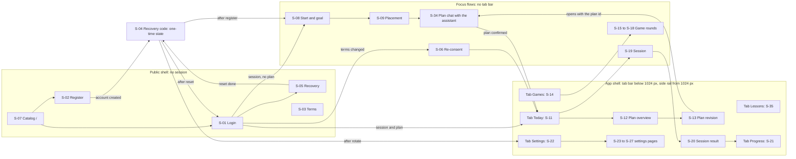

### 2.2 Direction rule (Design-system.md; it prevails over the concept images)

| Element | RTL (Arabic) | LTR (English) |
|---|---|---|
| Progress bars fill from | the start edge (right) | the start edge (left) |
| Back arrow points to | the start edge (right) | the start edge (left) |
| Forward arrow or chevron points to | the end edge (left) | the end edge (right) |
| Tab order (proposed) | first tab at the right | first tab at the left |
| Religious text | always RTL, in either UI direction | always RTL |

Switching the language changes the interface only; the book keeps its original language (UX.md). No translated text or translated edition is shown (D49).

### 2.3 Route guards

| # | Condition | Behaviour (proposed unless sourced) |
|---|---|---|
| 1 | No session on an app route (`401 unauthenticated`) | `/login?next=<path>`; the return path is kept (same-origin app paths only); G-03 if a session ended mid-use |
| 2 | Session valid on `/`, `/login`, `/register` | `/today`; when there is no plan, `/start` |
| 3 | `reconsentRequired` after E04, or any `400 terms_required` | `/consent`, then back to the kept path (G-18) |
| 4 | Session but no active plan | landing after login or registration is `/start`; S-11, S-14, S-21 stay reachable with empty states (G-24); the session and game buttons become «go to create a plan» to `/start` (UX.md) |
| 5 | `/placement` | reachable only from `/start` with the in-memory selection; a direct visit goes to `/start` |
| 5a | `/plan/chat/[chatId]` | the conversation belongs to the account (E33 answers `404` otherwise, G-07 and G-36); a reload restores the thread (E33); from S-09 for a new plan or from S-13 for a revision; an unknown id goes to `/start` or `/plan`; a closed conversation is read-only (G-38); one open conversation per account, resumed from S-08 or S-11 through `Today.openPlanChatId` |
| 6 | `/plan/revise` | only for an active or paused plan; a completed plan shows G-11; opens S-34 (structured fallback when the conversation is unavailable) |
| 7 | `/games/*` | needs an active plan and an in-memory round; a reload goes to `/games` (UG-02) |
| 8 | `/session/[id]` | needs an active plan, or a completed plan in maintenance mode (UG-04); the id must match the open daily session, else `/today` |
| 9 | `/recovery-code` | renders only while the in-memory code exists; otherwise it returns to the host screen with a note that a new code can be created in Settings (UA-06) |
| 10 | Plan status | active: everything; paused: S-12 banner (G-31) and «استئناف» (learner only); completed: maintenance reviews only, no revision, no resume (A-08) |
| 11 | Demo account | no resume (E30 `403`); plans are built in S-34 and E34 creates them in `synthetic_demo` mode (package §1.3, §2.3); S-29 (scripted scenarios) is deferred; same shell otherwise |
| 12 | Revoked or withdrawn edition | G-20 on S-11, S-12, S-14 with a path to `/start` |
| 13 | `/terms`, `/settings/privacy` | always open |
| 14 | Unknown route | a 404 page in the public shell with a link to `/` or `/today` |

### 2.4 Back behaviour

The header back arrow goes to the **logical parent**, never blindly to history, and points to the start edge (§2.2).

| From | Back goes to | Notes |
|---|---|---|
| S-01, S-02, S-05 | S-07 | |
| S-03 | the opener (S-02, S-06 or S-26) | entered form values are kept |
| S-04 | no back control | a one-time state: the code is never shown again, so there is nothing to go back to (UA-06); only the continue action after the «saved it» confirmation |
| S-06 | no back control | a gate after a terms change; it offers «log out» (E10) instead |
| S-08 | none | first step of the plan flow |
| S-09 | S-08 | selections kept; no step back between questions (answers are final); leaving asks for confirmation |
| S-34 | S-08 for a new plan, S-13 or S-12 for a revision | the conversation stays on the server; leaving without «اعتماد الخطة» saves no plan |
| S-12, S-13 | S-11, S-12 | |
| S-15 to S-18, S-19 | leave sheet (§2.5) | |
| S-20 | S-11 | |
| S-23 to S-27 | S-22 | |

### 2.5 Browser back inside a session or a game (proposed, UA-09)

On entering S-19 or a game round the screen pushes one history entry. The browser back button, the iOS edge swipe and the Android back gesture all open a bottom sheet instead of leaving: **continue** or **«إيقاف مؤقت والخروج»**.
- **S-19:** pause flushes the activity interval (E21), keeps the session open, completes nothing (E22 only when the learner finishes) and goes to S-11; the learner resumes from S-11, where E20 `daily` returns the same session (UG-01).
- **Game round (S-15 to S-18):** leaving flushes pending events (E21) and closes the round (E22); a round is not resumable (UG-02).
- **S-09:** leaving abandons the test; attempts already sent stay recorded and never count as daily time.
- **S-34:** nothing to flush; the thread persists on the server and a reload or a later return restores it (E33), while no plan is saved until «اعتماد الخطة».
- Pause time never counts (D40); a countdown is never used, the session length is an estimate (UX.md accessibility).

## 3. Journeys and flows

Screen IDs are from §1, state IDs (`G-nn`) from §4. Flows are online-only in option B; offline steps are shown only as deferred notes.

### 3.1 Registration and goal journey

[UX.md](UX.md) «رحلة التسجيل والهدف الأساسية», updated with the owner's decisions: register, save the code, content, time and goal, placement with an optional self-rating, **conversation with the assistant that builds the plan**, confirm, learn.

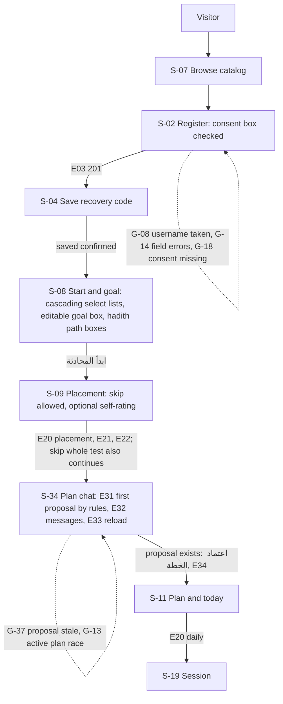

Notes: nothing is saved before «اعتماد الخطة» (R02). S-08 hands over the goal text and the structured options; S-34 starts from them and the placement summary (E31). The estimate (the E15 function) is computed by the server inside the conversation, so the numbers on the plan card always come from the rules engine; the first assistant turn is a rules proposal. E31–E34 are the operations of [Plan-conversation.md](Plan-conversation.md) §2.3, approved (D75, A1). S-10 is superseded by the S-34 plan card (D75) and is not in this flow.

### 3.2 Return journey

Login, latest plan, today's share; after 3 or more days of absence a light review without new material (R07). Syncing pending events is deferred in option B (nothing is persisted on the device).

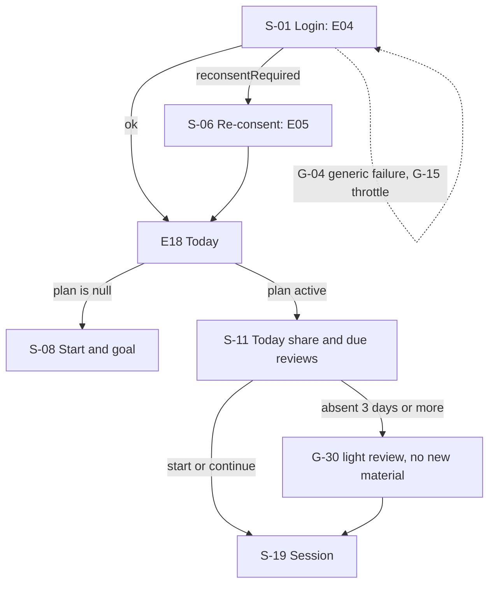

### 3.3 Account recovery and recovery-code rotation

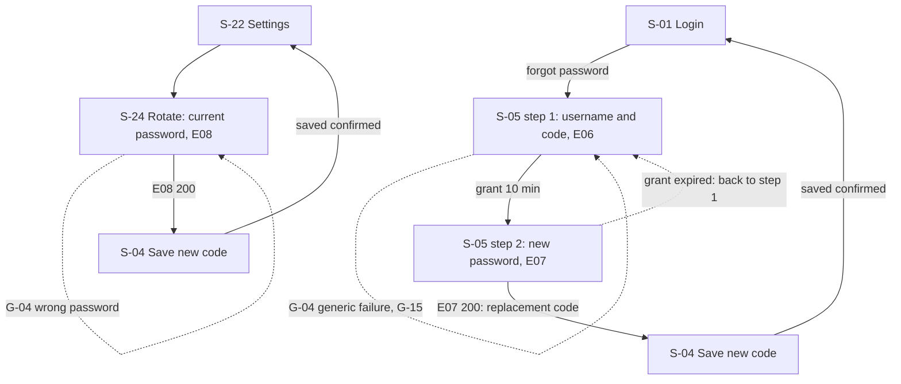

### 3.4 Re-consent after a terms change

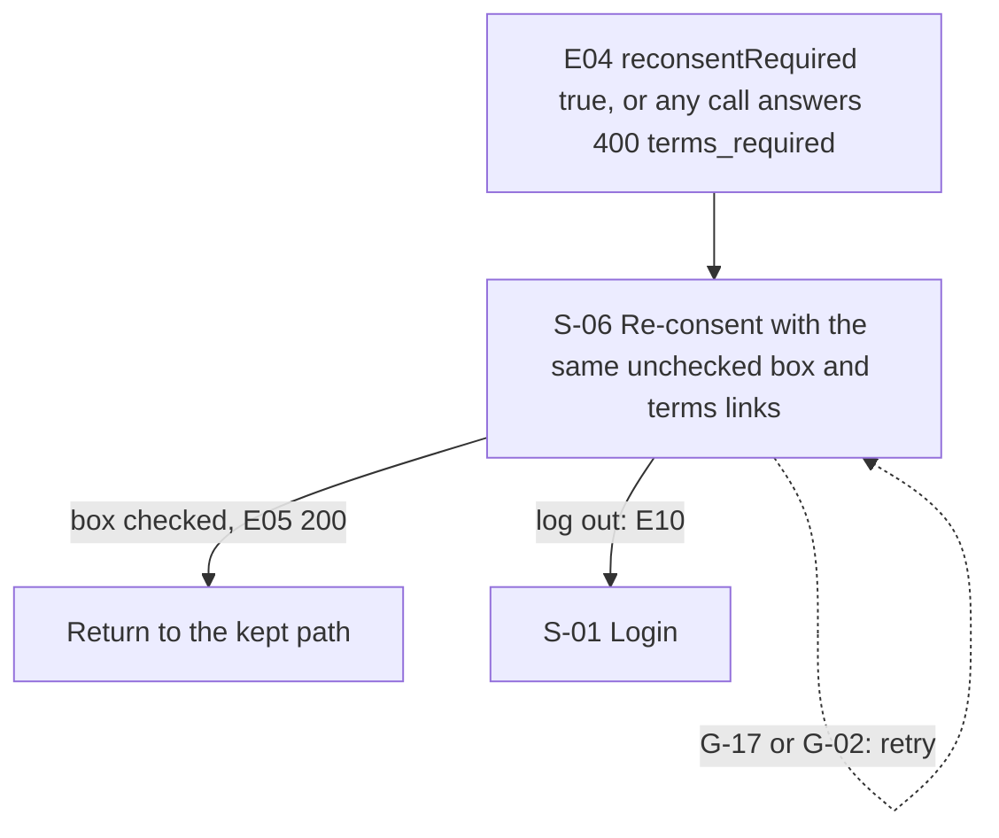

### 3.5 Plan lifecycle (A-08, D74 Q5; revision through S-34)

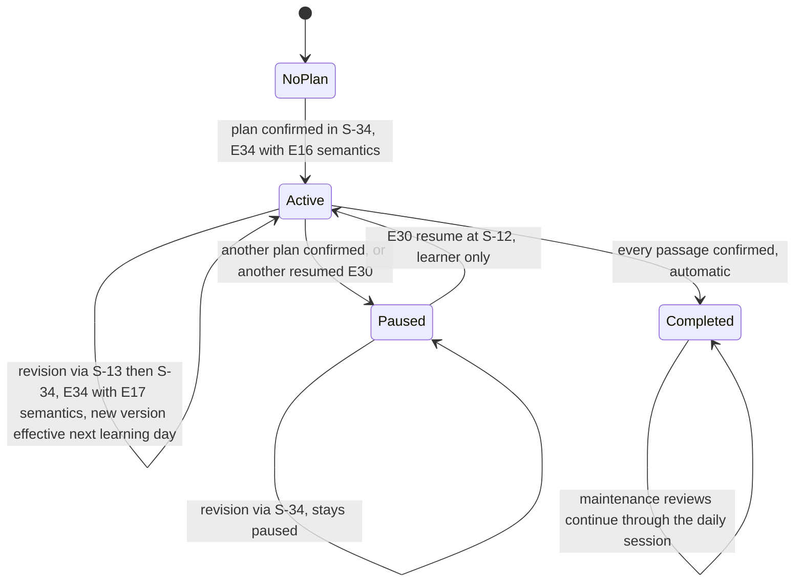

A revision opens S-34 with the plan id (from S-13); E34 applies the E16 semantics for a creation and the E17 semantics for a revision ([Plan-conversation.md](Plan-conversation.md) §2.3). When the model is unavailable, S-34 continues with rules replies, and S-13's structured fallback form calls E15 and E17 directly. A completed plan can be neither revised nor resumed (`409 plan_not_active`, G-11). One active plan per account.

### 3.6 Daily session

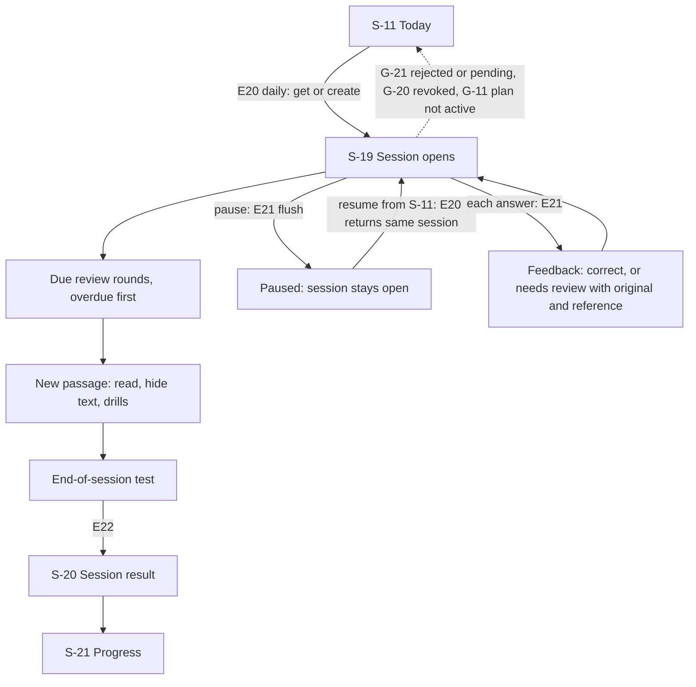

### 3.7 Games

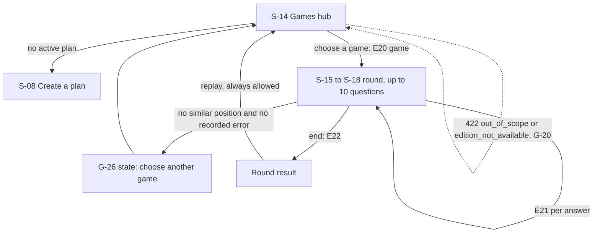

The server rejects material outside the active plan's scope or edition; the hub offers only plan material, so the rejection is a safety net, not a normal path.

### 3.8 Settings changes and effective date (D57)

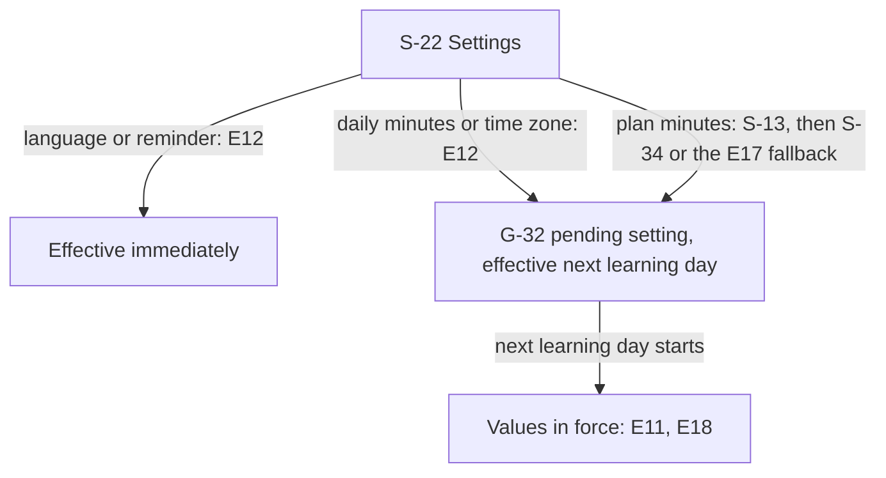

### 3.9 Logout and delete account

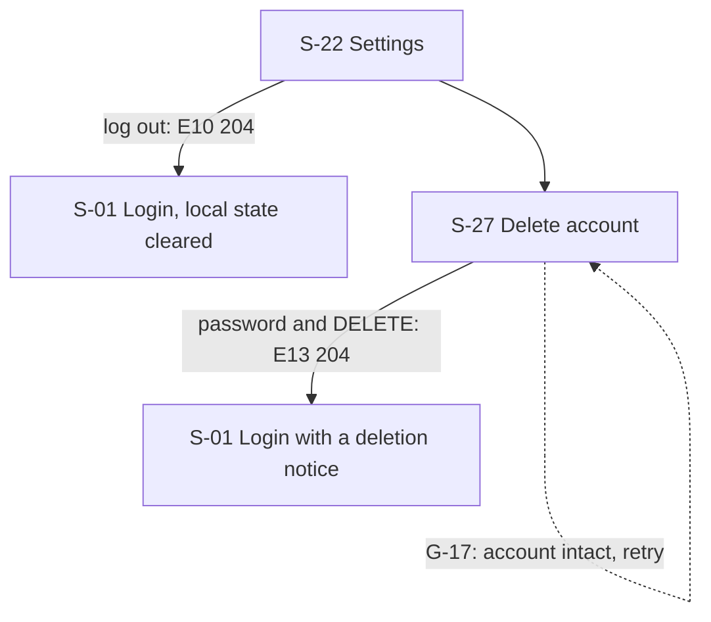

Delete explains the effect on unsynced events and cloud data first and needs connectivity (UX.md; no success is shown offline).

### 3.10 Plan conversation (S-34)

The turn pipeline of [Plan-conversation.md](Plan-conversation.md) §2.4, as the learner experiences it.

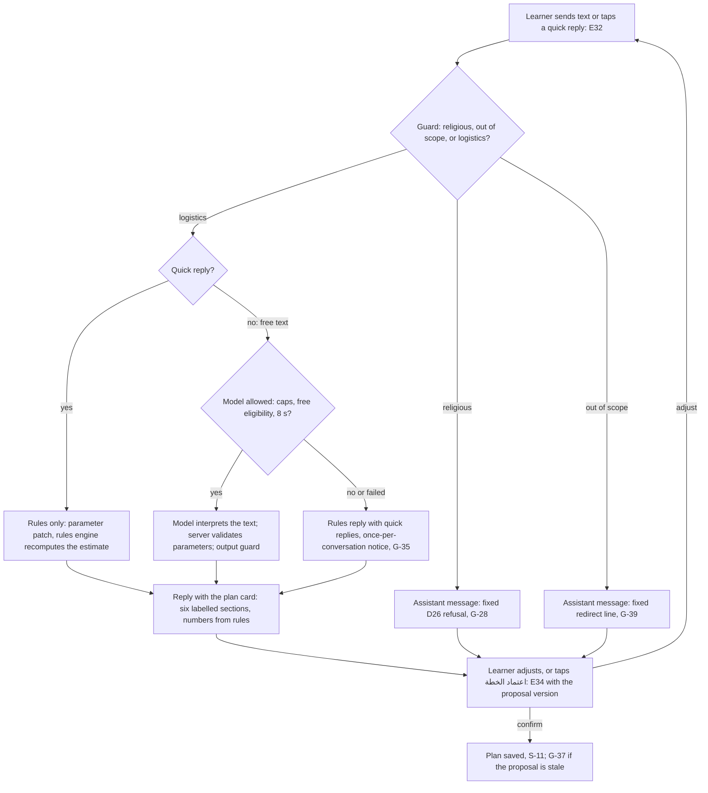

## 4. Global states catalogue

Fixed copy is quoted from the sources; everything marked "proposed" is new Arabic copy for U2 to settle (English wording follows in U2). Every error shows an icon and text, never colour alone. Error codes come from [API-spec.md](API-spec.md) §1.5; clients branch on `error.code`, not on status alone.

| ID | State | Trigger | Where it appears | Copy | Behaviour |
|---|---|---|---|---|---|
| G-01 | Free-server wake-up | **final rule (coordinator, 4 Oct 2026):** a request pending for 1 s starts a parallel E01 probe; if the probe fails or does not answer within 2 s, the line appears; a **failed** request or an **un-enveloped gateway answer** shows it immediately (§1.11, NFR-02 «slow or failed») | first load of any shell, S-01 | fixed: «جارٍ تشغيل الخادم المجاني، قد يستغرق ذلك دقيقة.» | Neutral loading style, not an error. When the line appears the client runs the §1.11 loop: short E01 requests at 1, 2, 4, 8 s, then every 10 s, up to 90 s, then a retry button «إعادة المحاولة»; when E01 answers: E11 (then, deferred, E25 and E21 replay). If the probe answers `200` while the original request is still pending, only the neutral busy indicator shows (throttle delay or slow response, G-15, G-23). Never clears local data, never asks for a new login, never marks anything stale (UG-06) |
| G-02 | Connectivity loss | timeout, offline browser, or an un-enveloped 5xx after the server is awake | all shells; inline in S-19 and rounds | proposed: reads «لا يوجد اتصال بالشبكة. سنعيد المحاولة تلقائيًا، أو اضغط «إعادة المحاولة».»; forms and writes «لا يوجد اتصال بالشبكة. لم يُرسل طلبك؛ اضغط «إعادة المحاولة» عندما يعود الاتصال.» | Banner with a retry button. **Automatic retry only for reads** (GET) and for E21 events, which are idempotent: in a session, unsent answers wait in a page-memory queue and are resent with the same `clientEventId`; lost on reload in option B. **Forms S-01 to S-07 never retry automatically**: E03 to E07 create rows, sessions or grants, so a failed submit keeps the entered values and waits for the learner's explicit retry. Other row-creating calls (E16, E20 `game` and `placement`, E26, E28, E31, E34) are never retried automatically either |
| G-03 | Session ended | `401 unauthenticated` (missing, expired or revoked session, or `auth_epoch` mismatch) | any app route | proposed: «انتهت جلستك. سجّل الدخول للمتابعة.» | Go to S-01 with the return path; in-memory state cleared. A password change on this device renews the cookie (E09), so no re-login |
| G-04 | Invalid credentials | `401 invalid_credentials`: E04; recovery code or grant (E06, E07); current password (E08, E09, E13) | S-01, S-05, S-23, S-24, S-27 | proposed: login «اسم المستخدم أو كلمة المرور غير صحيحة.»; recovery «بيانات الاسترجاع غير صحيحة أو لم تعد صالحة.»; re-authentication «كلمة المرور الحالية غير صحيحة.» | One generic message; never says which part is wrong and never reveals whether the account exists; the password field is cleared; counts toward G-15 |
| G-05 | Forbidden origin | `403 forbidden_origin` | any form | proposed: «تعذّر إكمال الطلب. أعد تحميل الصفحة ثم حاول مرة أخرى.» | Not expected in normal use; reload offered; nothing cleared |
| G-06 | Role denial | `403 forbidden`: a demo account on E16 or E30 (the UI offers neither; E34 creates demo plans) | S-12 | proposed: «هذا الإجراء غير متاح لحساب العرض.» | The UI never offers these actions to demo accounts; the code is a safety net |
| G-07 | Not found | `404 not_found` (unknown or not owned; never reveals existence) | any detail route | proposed: «لم نعثر على هذا العنصر.» | Back action; identical for unknown and foreign ids |
| G-08 | Username taken | `409 username_taken` (E03, E26) | S-02 | proposed: «اسم المستخدم غير متاح. اختر اسمًا آخر.» (UX: «اسم غير متاح») | Error under the username field; entered values kept |
| G-09 | Plan version conflict | `409 version_conflict`, `details.reason = plan_version` (E17, E20; E34 for a revision; `details.currentVersion`) | S-13, S-34, S-11, S-14 | proposed: «عُدّلت خطتك في مكان آخر. حدّث الصفحة ثم أعد المحاولة.» | Reload the plan (E18), keep the learner's input where possible, ask to confirm again |
| G-10 | Idempotency input conflict | `409 version_conflict`, `reason = idempotency_input` (E23 only) | S-32 (deferred) | proposed: «تعذّر إكمال التنزيل. أعد المحاولة.» | Deferred with the offline download |
| G-11 | Plan not active | `409 version_conflict`, `reason = plan_not_active` (E17, E30, E31 for a revision; E20 on an inactive plan) | S-12, S-13, S-34, S-11 | proposed: «هذه الخطة غير نشطة.»; completed: «اكتملت هذه الخطة؛ لا يمكن تعديلها أو استئنافها.» | Refresh; for a paused plan offer «استئناف» (learner only) |
| G-12 | Estimate changed | `409`, `reason = estimate_changed`; `details.estimate` holds the fresh one (E16, E17 in the S-13 fallback; in S-34 the equivalent is G-37) | S-13 | proposed: «تغيّر التقدير. راجع التقدير الجديد ثم أكّد.» | Show the fresh estimate and ask for confirmation again; nothing is saved |
| G-13 | Active-plan race | `409`, `reason = active_plan_conflict` (E16, E28, E34 for a creation) | S-34 | proposed: «بدأت خطة أخرى للتو. حدّث الصفحة ثم أعد المحاولة.» | Reload and re-evaluate; no automatic retry |
| G-14 | Validation errors | `422 validation_error`; `details.fields[].rule`, values never echoed | every form | proposed samples: `username_length` «اسم المستخدم من ٣ إلى ٢٤ حرفًا.»; `password_min_chars` «كلمة المرور ١٥ حرفًا على الأقل.»; client-only «كلمتا المرور غير متطابقتين.» | Message at the field, focus to the first error, summary announced. Other rules (`username_chars`, `password_max_bytes`, plan rules, and for the conversation `goal_text_length`, `path_not_available`, `one_of_text_or_quick_reply`) are worded in U2; `edition_not_available` is G-20 |
| G-15 | Throttled | `429 throttled` with `Retry-After` and `details.retryAfterSec` (20 failures → 15 min); progressive delay after the 5th failure (1, 2, 4, 8 s, then 10 s, cap 60 s) | S-01, S-05, S-23, S-24, S-27 | proposed, static wording frozen at receipt (UI-tokens §6.8): up to 60 s «محاولات كثيرة. انتظر {n} ثانية ثم أعد المحاولة.»; the 15-minute lock «محاولات كثيرة. يمكنك المحاولة بعد {mm:ss}.» | Warning banner (`role="status"`) with static text; the retry or submit button is `aria-disabled` until `Retry-After` has passed. The countdown is a visually present line that is `aria-hidden` and announced only at its start and end, never every second. During the progressive delay the request can take up to about 60 s (busy state, no double submit; UG-06). See [UI-screens.md](UI-screens.md) P-06 |
| G-16 | Internal error | `500 internal` | any | proposed: «حدث خطأ غير متوقع. حاول مرة أخرى.» | Retry; no technical detail |
| G-17 | Service unavailable | `503 unavailable` with the envelope (database or auth down) | any | proposed: «الخدمة غير متاحة مؤقتًا. حاول بعد قليل.» | Distinct from wake-up (it has the envelope); retry; E13: the account is intact; E07: repeat with the same grant |
| G-18 | Terms required | `400 terms_required` (E03 without the box or version; any call after a terms change); `details.requiredVersion` | S-02 field; S-06 | S-02 proposed: «يلزم الموافقة على شروط الاستخدام وبيان الخصوصية لإنشاء الحساب.»; S-06 proposed: «تغيّرت شروط الاستخدام وبيان الخصوصية. اقرأها ثم أكّد موافقتك للمتابعة.» plus the fixed box «قرأت شروط الاستخدام وبيان الخصوصية وأوافق عليها» | S-02: no account, error at the box. Elsewhere: go to S-06, then back to the kept path after E05 |
| G-19 | Payload too large | `413 payload_too_large` (64 KiB) | S-19, rounds | proposed: «تعذّر إرسال الطلب لأنه أكبر من الحد المسموح.» | The client batches events (at most 100) so this should not occur; resend in smaller batches |
| G-20 | Revoked or unavailable content | `422 edition_not_available` (E15, E16, E20); E21 `rejected` `edition_mismatch`; PRD: «غير متاح» | S-11, S-12, S-14, S-19 | fixed label «غير متاح»; proposed line «هذه النسخة لم تعد متاحة. يمكنك بدء خطة على نسخة أخرى.» | The text is never shown or guessed; a path to S-08; the plan and its history stay |
| G-21 | Per-event outcomes | E21 `rejected` (nine codes) or `pending` (four reason codes), listed in API-spec §4 E21 | S-19, rounds | proposed: rejected «لم تُحتسب هذه الإجابة.»; pending «ما زالت هذه الإجابة قيد التحقق.» | Calm, no blame; rejected is not resent; pending is kept without credit; `plan_not_active` or `session_closed` refreshes S-11. The server's `daily` figure is authoritative |
| G-22 | Pending sync (deferred) | answers stored on the device awaiting acknowledgement | S-22 account block, S-11, S-21 | fixed: «محفوظ على الجهاز، بانتظار المزامنة»; synced: «متزامن» | Option B shows only «متزامن» because nothing is stored on the device (UA-08); the pending state arrives with F13 |
| G-23 | Loading and busy | request in flight | every data screen | proposed accessible name: «جارٍ التحميل» | Skeleton in the final layout, no layout jump, no invented progress or completion, reduced motion respected. After 1 s a neutral busy indicator; the wake-up line (G-01) replaces it only under the G-01 rule, so a slow throttle delay (G-15) or a slow reply (G-34) never shows it |
| G-24 | Empty: no plan | E18 `plan` is null | S-11, S-14, S-21 | proposed: «لا توجد خطة نشطة بعد.» with the button «ابدأ خطتك» to S-08 | Tabs stay; the session and game buttons are replaced |
| G-25 | Empty: no reviews due | `dueReviews` = 0 | S-11 | proposed: «لا توجد مراجعات مستحقة اليوم.» | Shows the next review date from E19 when there is one |
| G-26 | Empty: no games material; no similar position | no eligible passage; no similar position and no learner-recorded error (D31) | S-14, S-17 | proposed: «لا توجد مادة للعب ضمن خطتك الآن.» / «لا يوجد موضع متشابه ولا خطأ مسجل لك في هذا المقطع؛ جرّب لعبة أخرى.» | Offers another game; never invents a question |
| G-27 | Empty category or unavailable edition | a published category without an available edition | S-07, S-08 | proposed: «لا تتوفر مادة» (UX.md fixes the need for a notice, not its wording) | Not selectable; no coverage claim for an unapproved book |
| G-28 | Fatwa or explanation refusal (D26) | the guard classifies a goal text or conversation message as religious (fatwa, ruling, explanation, meaning, translation); applied before any model call and again on the model's reply ([Plan-conversation.md](Plan-conversation.md) §2.4, R26) | S-34 thread (assistant message, `kind = refusal`); S-08 does not block typing | fixed: «نعتذر، التطبيق مخصص لحفظ الكتب كما هي ولا يقدم فتوى أو شرحًا. للفتوى أو الشرح يرجى مراجعة أهل العلم والاختصاص.» | Shown in full, no named authority, no generated religious content, no model call; the conversation stays limited to plan logistics and the learner can continue it |
| G-29 | Hadith record display (D50, D53, D68) | a hadith is shown; its edition neither attributes it to the Sahihayn nor records a grade | S-19 and hadith questions (beside the text) | fixed: «تنبيه: نُقل هذا النص حرفيًا عن الكتاب، ولم يُتحقق من صحة الحديث.»; proposed provenance labels «التخريج — من سجل HadeethEnc» and «الدرجة — من سجل HadeethEnc» (UG-10) | Secondary-text style with an info icon and text, not shown when an attribution (for example «رواه البخاري ومسلم») or a grade exists; takhrij and grade are shown as recorded; no outside ruling is added |
| G-30 | Return after absence | 3 or more days without a session (R07) | S-11, S-19 | proposed: «نبدأ اليوم بمراجعة خفيفة.» | Light review, no new material by default; missed days are neither stacked nor counted aloud; no blame, no ranking |
| G-31 | Plan status banners | plan `paused` or `completed` | S-12, S-11 | proposed: paused «هذه الخطة متوقفة مؤقتًا، وتقدمها محفوظ.»; completed «اكتملت هذه الخطة، وتستمر مراجعات الصيانة.» | Resume for learners only (E30); completed plans cannot be revised or resumed |
| G-32 | Pending setting (D57) | `Profile.pendingSettings` or `Plan.pendingSessionMinutes` is not null | S-22, S-13, S-11 | proposed: «يبدأ هذا التغيير من يوم التعلم التالي ({التاريخ}).» | The value in force stays visible until that date; no retroactive credit |
| G-33 | Offline states (deferred) | PWA-design §3–§8; E23, E24, E25 | S-31, S-32, S-33 | fixed: «الخطة جاهزة دون اتصال»، «غير متصل — النتائج بانتظار التحقق»، «افتح في المتصفح» (in-app browsers), «إعادة المحاولة»; E25 `stale`, `revoked`, `expired` | Option C only; a wake-up timeout is connectivity, never stale (D48) |
| G-34 | Assistant replying | a message sent in S-34 awaits its reply (E32) | S-34 | proposed status line: «يرد المساعد…» | Status line announced politely; the learner's message stays visible; quick replies and confirm wait for the reply (proposed); a reply that fails is G-02, G-16 or G-17 with a retry on the same message |
| G-35 | Model unavailable (fallback) | timeout (8 s), provider error, invalid output, ineligible model, exhausted free quota, or a daily or per-conversation cap; a reply with `kind = fallback` ([Plan-conversation.md](Plan-conversation.md) §2.4) | S-34 | proposed in the package: «المساعد غير متاح الآن؛ يمكنك متابعة التعديل بالخيارات أدناه.» (shown once per conversation) | Never an error: rules replies and quick replies continue and the plan card keeps rules-engine numbers; the journey completes without the model (NFR-16); the learner can still confirm. S-13 offers its structured form |
| G-36 | No proposal yet; conversation not found | S-34 before E31 has returned the first proposal; E33 answers `404` for an unknown or foreign conversation (own conversations only, [Plan-conversation.md](Plan-conversation.md) §2.3) | S-34, S-13 | proposed: «اعتماد الخطة» disabled until a proposal exists; «لم نعثر على هذه المحادثة.» | Confirm is enabled as soon as a proposal exists (the first assistant turn is a proposal); a missing conversation goes back to S-08 or S-12 (G-07 rules) |
| G-37 | Proposal stale | `409 version_conflict`, `details.reason = proposal_stale` with `details.proposal` (E34 with an old `proposalVersion`) | S-34 | proposed: «تغيّرت الخطة المقترحة. راجع البطاقة الجديدة ثم أكّد.» | The card is replaced by `details.proposal`; the learner confirms again; nothing was saved |
| G-38 | Conversation closed or replaced | E32 `409`, `reason = chat_closed`; E31 replaced an open conversation (`details.replacedChatId`) | S-34, S-08, S-11 | proposed: «أُغلقت هذه المحادثة.» | A closed thread is read-only; the learner starts a new one from S-08 or S-13; one open conversation per account, resumed from `Today.openPlanChatId` («متابعة المحادثة», proposed) |
| G-39 | Out-of-scope redirect | the guard classifies a message as not about the plan (`kind = redirect`) | S-34 | proposed in the package: «يمكنني مساعدتك في خطة الحفظ فقط: المدة والوقت اليومي والنطاق والترتيب والمراجعات.» | Fixed assistant message, no model call, no record of the text in logs |

## 5. Traceability: E01–E34 to screens and states

| Op | Operation | Screens | States and notes |
|---|---|---|---|
| E01 | `GET /api/health` | no screen of its own; runs behind every shell | G-01 wake-up loop; S-31 deferred |
| E02 | `GET /api/health/ready` | no screen: operators and the keep-awake job only | none |
| E03 | `POST /api/auth/register` | S-02, then S-04 | G-08, G-14, G-18, G-15 |
| E04 | `POST /api/auth/login` | S-01 | G-04, G-15; `reconsentRequired` leads to S-06 |
| E05 | `POST /api/auth/consent` | S-06 | G-18 |
| E06 | `POST /api/auth/recovery/verify` | S-05 step 1 | G-04, G-15 |
| E07 | `POST /api/auth/recovery/reset` | S-05 step 2, then S-04 | G-04, G-14, G-17 |
| E08 | `POST /api/auth/recovery/rotate` | S-24, then S-04 | G-04, G-15 |
| E09 | `POST /api/auth/password` | S-23 | G-04, G-14, G-15 |
| E10 | `POST /api/auth/logout` | S-22 (logout), S-06 (log out) | tolerates a missing session |
| E11 | `GET /api/me` | every app screen at boot (language, direction, account); S-22 | G-03, G-32; first step after G-01 |
| E12 | `PATCH /api/me` | S-22; S-08 (language) | G-32, G-14 |
| E13 | `POST /api/account/delete` | S-27 | G-04, G-14, G-17 |
| E14 | `GET /api/catalog` | S-07, S-08, S-25 | G-27; metadata only |
| E15 | `POST /api/plans/estimate` | called **by the server inside the conversation** (the numbers of the S-34 plan card, [Plan-conversation.md](Plan-conversation.md) §2.4); the client calls it directly only in the S-13 structured fallback | G-14, G-20; demo accounts may call it too (read-only) |
| E16 | `POST /api/plans` | no client call from a screen: S-34 «اعتماد الخطة» (E34) applies the E16 semantics for a creation ([Plan-conversation.md](Plan-conversation.md) §2.3) | G-06, G-13, G-14 |
| E17 | `POST /api/plans/:id/revise` | S-13 structured fallback; in S-34 E34 applies the E17 semantics for a revision | G-09, G-11, G-12, G-32 |
| E18 | `GET /api/today` | S-11, S-12, S-14; `openPlanChatId` (package §2.2) lets S-08 and S-11 resume an open conversation | G-24, G-25, G-30, G-31, G-38 |
| E19 | `GET /api/progress` | S-21, S-12 (`plans[]` lists every plan: active, paused, completed; used for the completed plan's id, UG-04), S-20 | G-24, G-31 |
| E20 | `POST /api/sessions` | S-09 (`placement`), S-11 and S-19 (`daily`), S-14 to S-18 (`game`) | G-09, G-11, G-14, G-20 |
| E21 | `POST /api/sessions/:id/events` | S-09, S-19, S-15 to S-18 | G-02, G-19, G-21 |
| E22 | `POST /api/sessions/:id/complete` | S-09, S-19 (then S-20), S-15 to S-18 | G-02 |
| E23 | `POST /api/plans/:id/offline-snapshots` | S-32 (Deferred) | G-10, G-33 |
| E24 | `GET /api/offline-snapshots/:id` | S-32 (Deferred) | G-33 |
| E25 | `POST /api/offline/revalidate` | S-33, S-31 (Deferred) | G-33 |
| E26 | `POST /api/demo/accounts` | S-28 (Deferred) | same states as E03 |
| E27 | `GET /api/demo/scenarios` | S-29 (Deferred) | G-06 |
| E28 | `POST /api/demo/plans` | S-29 (Deferred; scripted scenarios of option C; E34 creates demo plans in `synthetic_demo` mode, [Plan-conversation.md](Plan-conversation.md) §2.3) | G-13, G-15 |
| E29 | `GET /api/demo/simulations` | S-30 (Deferred) | label «محسوبة سلفًا لا تشغيلًا حيًا» (PRD M9) |
| E30 | `POST /api/plans/:id/resume` | S-12 | G-06, G-11, G-31 |
| E31 | `POST /api/plan-chats` create conversation ([Plan-conversation.md](Plan-conversation.md) §2.3) | S-34 (entered from S-09, or from S-13 with a plan id) | G-02, G-11, G-14, G-15, G-16, G-17, G-38 |
| E32 | `POST /api/plan-chats/{id}/messages` send message ([Plan-conversation.md](Plan-conversation.md) §2.3) | S-34 | G-14, G-15, G-28, G-34, G-35, G-38, G-39 |
| E33 | `GET /api/plan-chats/{id}` get conversation ([Plan-conversation.md](Plan-conversation.md) §2.3) | S-34 (reload), S-13 | G-03, G-36 |
| E34 | `POST /api/plan-chats/{id}/confirm` confirm plan ([Plan-conversation.md](Plan-conversation.md) §2.3) | S-34 «اعتماد الخطة» | G-09, G-11, G-13, G-36, G-37 |

E31–E34 are the operations of [Plan-conversation.md](Plan-conversation.md) §2.3 (API-spec v1.2 §4.10, Approved, D75, A1); this table cites their names, not their field-level shapes, which stay in that document. The 30 operations of API-spec v1.1 keep their rows (34 in v1.2). S-03 and S-26 are static text; S-25 shows E14 metadata only. G-05 (`forbidden_origin`) can follow any mutating operation and G-22 (pending sync) belongs to the deferred offline work, so neither is repeated per row.

## 6. Six-dimension screen specifications (U2)

See docs/UI-screens.md (U2, separate document).

## 7. Design tokens (U3)

See docs/UI-tokens.md (U3, separate document).

## 8. The four screen batches (R1, D74 Q2)

The owner pauses after each batch (gate G2, one summary and an explicit «تابع»), so four pauses replace sixteen. F0 (app foundation: shell, direction, wake-up state G-01, API client, mock data, tokens from U3) precedes all batches. The owner approved F0 alone by D77 and the design for the screens (G1) by D78, both on 4 October 2026 (§10), so the batches follow F0 with the owner pause G2 after each.

| Batch | Screens | Packages | Owner pause after the batch (G2) |
|---|---|---|---|
| 1 Account | S-01, S-02, S-03, S-04, S-05, S-06 | F1, F2, F3, F4 | G2: login, register with consent, terms, recovery code, recovery, re-consent |
| 2 Catalog and plan | S-07, S-08, S-09, S-11, S-12, S-13, **S-34** (S-10 is superseded and not built) | F5; F6 = placement (S-09) plus the plan card inside S-34; F7; **F14** (S-34 conversation screen, S-08 and S-13 changes, [Plan-conversation.md](Plan-conversation.md) §2.8; the build plan v16 will add it) | G2: catalog, start and goal, placement, plan chat with the assistant, plan and today, plan overview, revision |
| 3 Games | S-14, S-15, S-16, S-17, S-18 | F8 | G2: games hub and the four games |
| 4 Session, progress, settings | S-19, S-20, S-21, S-22, S-23, S-24, S-25, S-26, S-27 | F9, F10, F11 | G2: session, session result, progress, settings, password, code rotation, sources, privacy, delete |
| Deferred (option C, U4) | S-28 to S-33 | F12, F13 | outside option B |

**Dated note (5 October 2026; D82, applied by the coordinator; no design change).** The owner's choice «3: 2 and 3 together» (D82) redefines Batch 1 as S-01 to S-04, that is F1 to F3 (login, register with the terms page, recovery-code save), so the G2 pause follows S-04; S-05 (account recovery, F4) and S-06 (the re-consent gate that UG-11 attached to F2) are deferred until the core journey works. The core screens after G2 are S-08, S-09, S-34, S-11, S-19, S-20 and S-21, each behind its gates. The batch table above and the approved text of this document are unchanged.

The default grouping is kept. Reasons: F-packages are a chain (F1 to F11), the session (F9) embeds the four question templates built in F8, and results (F10) need session data. Additions to the F-packages, all proposed: S-06 (re-consent) joins F2 because no package names it (UG-11); S-12 and S-13 join F7 with S-11; S-20 joins F10; **S-34 is in Batch 2 as the owner asked and is delivered by F14 ([Plan-conversation.md](Plan-conversation.md) §2.8), with its plan card built under F6**; it depends on the conversation operations E31–E34, so it runs on a mock conversation in memory mode until the package is approved (A1) and the backend packages (B2b, B13) exist. S-10 is superseded by the S-34 plan card (D75) and leaves Batch 2 and the F6 mapping. Components built early are reused later: S-04 (Batch 1) serves S-24 (Batch 4) and S-03 serves S-26. Until Batch 2 ships, `/` redirects to `/login` and the post-register destination is a placeholder.

## 9. Assumptions and open questions for the owner at G1

None of the answers already given in D66–D74 is re-asked here. The owner's answers of 4 October 2026 (relayed by the coordinator) are recorded in §9.3 as answered; they are registered as D75 and approved with [Plan-conversation.md](Plan-conversation.md) v1.1 (A1, 4 October 2026), except UQ-03, which was answered later the same day by delegation and is registered as D76 ([Decision-register.md](Decision-register.md)).

G1 was granted on 4 October 2026 (D78). The assumptions UA-01 to UA-20 and the gap decisions UG-01 to UG-19 below are approved as recorded, except UA-12, which the owner reversed for its scope part. The status words in the tables are those recorded before the approval.

### 9.1 Assumptions the coordinator can confirm

| ID | Assumption (proposed) | Why | Status |
|---|---|---|---|
| UA-01 | Route names `/start`, `/session/[id]`, `/terms`, `/placement` and `/plan/chat/[chatId]` are adopted, and the Programming-guide file map is updated when implementation is authorized | The guide plans `/setup` (one PlanBuilder route), `/sessions/[id]`, `/privacy`; its names are proposals too. The alternative is to adopt the guide's names | Proposed |
| UA-02 | Visitors land on the public catalog at `/` with Login and Register in the header; signed-in users at `/` go to `/today`, or `/start` without a plan | D71 lets anyone browse titles before registering; login-first is the alternative | Proposed |
| UA-03 | Navigation is a bottom tab bar below 1024 px and a start-edge side rail from 1024 px (aligned with [UI-tokens.md](UI-tokens.md), proposed there as Q4) | Keeps «اليوم، الدروس، الألعاب، التقدم، الإعدادات» (five tabs since D92) on every device; tablets 768–1023 px keep the bottom bar | Proposed (aligned with UI-tokens.md) |
| UA-04 | Light theme only | [Design-system.md](Design-system.md) defines one light palette; no dark mode is specified, so none is designed | Proposed |
| UA-05 | The English interface uses numeric section labels (`Surah 78`, `Hadith 1`) until Jamhara terms are sourced | Interim rule of contract §2.2 and §11 (D28); see UQ-03 | Accepted (D76, owner delegation, 4 October 2026) |
| UA-06 | The recovery code of S-04 lives in memory only, navigation uses replace so back never re-shows it, and a reload loses it with a note that a new code can be made in Settings | The code is shown once and never retrievable (E03, E07, E08) | Proposed |
| UA-07 | S-21 shows `streakDays` (E18, image 06) as a neutral count; zero shows a neutral line; games count toward the day (D40) | UX.md: no ranking or blame for interruptions | Proposed |
| UA-08 | Option B has no demo link on S-01, no offline UI, and the account block shows only «متزامن» | Demo and PWA offline are deferred (D74 Q1) | Proposed |
| UA-09 | Back and leave behaviour as in §2.5 | No source defines it | Proposed |
| UA-10 | The tab bar is hidden in focus flows (S-06, S-08, S-09, S-34, S-19, rounds) | Concept images 01, 02, 04, 08–11 show none | Proposed |
| UA-11 | A language switch «العربية \| EN» sits in the public shell and sends `language` with E03; the browser language sets the default | E03 requires `language`; image 01 shows a switch | Proposed |
| UA-12 | S-08 has no scope picker and no plan-order control: the scope defaults to all sections and both are refined in the conversation (quick replies «هدف أصغر», «الترتيب العكسي للقرآن», or free text) | Owner: «no extra fields» for other categories and the order is chosen in the conversation; the v1 scope picker is dropped | Reversed for the scope part by the owner (D78); the plan-order part stands (accepted, coordinator, 4 October 2026) |
| UA-13 | After the learner edits the goal box, selection changes no longer overwrite it; «استعادة الجملة المقترحة» restores the composed sentence | An overwritten edit would lose the learner's text | Accepted (coordinator, 4 October 2026) |
| UA-14 | The conversation input and the goal box share one limit of 500 characters, with a helper line against personal data; quick replies that cannot apply are hidden (for example «أقل دقائق» at 5 minutes) | Keeps free text short; the owner asked for confidentiality | Accepted (coordinator, 4 October 2026) |
| UA-15 | The URL of S-34 carries `chatId`; a reload restores the thread (E33); leaving without «اعتماد الخطة» saves no plan | Matches E31–E34 of the package (E33 restores the thread; E34 saves the plan) | Accepted (coordinator, 4 October 2026) |
| UA-16 | The frontend holds `NEXT_PUBLIC_TERMS_VERSION`, equal to the backend `TERMS_VERSION` (checked when the environments are provisioned), and sends it with E03 and E05; `400 terms_required` with `details.requiredVersion` stays authoritative | Avoids a hard-coded version in the form while the server remains the judge of the current version | Accepted (coordinator, 4 October 2026) |
| UA-17 | The visitor's language choice is kept in `localStorage` (a per-visitor convenience, always wrapped for the case where storage is unavailable) and sent with E03 as `language` | Refines UA-11: the choice survives navigation and reload before an account exists | Accepted (coordinator, 4 October 2026) |
| UA-18 | The English product name is «Qatra» (Arabic «قطرة غيث»); the owner may change it at G1 | UX.md and Design-system.md fix only the Arabic name | Accepted (coordinator, 4 October 2026) |
| UA-19 | The English interface shows the Arabic book title beside the English one | The book keeps its original language (UX.md); English titles are labels only (D28) | Accepted (coordinator, 4 October 2026) |
| UA-20 | The downloaded recovery-code file omits the username | A file holding both parts of the recovery pair would weaken it if shared or lost | Accepted (coordinator, 4 October 2026) |

### 9.2 Gaps found in the sources (coordinator and architect)

"Decision" records the coordinator's answers of 4 October 2026.

| ID | Gap | Handling | Decision |
|---|---|---|---|
| UG-01 | No operation reports which steps of an open session are already answered; E20 `daily` returns the same snapshot | Keep the step index in per-tab session state; after a reload without it, restart from the first step (a re-answer is a new attempt, review rounds count the first attempt only) | Accepted as proposed |
| UG-02 | No `GET` for a session, so a game round cannot be resumed and E20 `game` must not run on page load | Rounds start only from an explicit action; a reload returns to S-14 | Accepted as proposed |
| UG-03 | The client cannot obtain passage ids (E14 has sections only), so S-14 cannot offer a finer picker than the game type | S-14 offers the four games; E20 without `passageIds` lets the server sample inside the plan scope. A finer picker needs an API addition. **D92 supersedes the ban on passage listing for the Lessons tab (S-35) within the plan's scope only:** S-35 lists the plan's sections and opens a read-only reader; S-14 itself stays without a picker | Accepted as proposed; amended by D92 (Lessons tab) |
| UG-04 | Maintenance reviews on a completed plan (E20 `daily`, A-08) need `planId` and `currentVersion`, and E18 `plan` is the active plan | Use E19 `plans[]`, which lists every plan (active, paused, completed), for the completed plan's id | Decided: E19 `plans[]`. `PlanProgress.currentVersion` is added by the v1.2/v1.5 amendments ([Plan-conversation.md](Plan-conversation.md) v1.1 §1.4; API-spec O-32) |
| UG-05 | E14 has no publisher or canonical URL, so S-25 can show only title, author, edition label and category | Show those plus the fixed message | Accepted |
| UG-06 | NFR-02(1) shows the wake-up line within 1 s of a slow or failed request, while a throttle delay can take up to 60 s | **Final rule:** a request pending for 1 s starts a parallel E01 probe; if the probe fails or does not answer within 2 s, the wake-up line and the §1.11 polling loop start; if the probe answers `200` while the original request is still pending, only a neutral busy indicator shows (throttle or slow response); a failed request or an un-enveloped gateway answer shows the line immediately (G-01, G-23). This satisfies NFR-02 «slow or failed» | Decided by the coordinator (final rule, replaces the earlier proposal) |
| UG-07 | E15 for a revision has no `placementSessionId`, so `knownWords` could differ from the agreed estimate | A revision conversation reuses the plan's original placement session for `knownWords`; E15 runs inside the conversation | Decided: [Plan-conversation.md](Plan-conversation.md) §2.3 (O-17 resolved) |
| UG-08 | UX.md places no resume action for paused plans | «استئناف» on paused plans in S-12 (E30) | Accepted as proposed |
| UG-09 | Contract §2.4 hints (recall first letter, choice and similar "remove one wrong option", order "place the first token"); similar distinction has only two options, so removing a wrong one leaves the answer | U2 specifies each hint and keeps the answer marked assisted | Accepted as proposed |
| UG-10 | No source fixes the wording of the HadeethEnc provenance labels (D68) | Labels in G-29 are proposed | Accepted as proposed |
| UG-11 | No F-package names the re-consent gate (S-06) | S-06 joins F2 | Accepted as proposed |
| UG-12 | UX.md says «تجاوز» per question; image 02 shows «تخطي الاختبار» for the whole test | Both allowed; skipping the whole test goes to S-34 with no placement summary | Accepted as proposed |
| UG-13 | `sectionOrdinals` was capped at 40 (A-12) while the Forty has 41 or 42 sections | The configuration default is raised to 60 (A-12 default, API-spec §1.7) so "all sections" works for the Forty. The hadith path control now sits on S-08 (owner decision) | Decided by the coordinator; applied in [Plan-conversation.md](Plan-conversation.md) §4 (API-spec v1.2) |
| UG-14 | No DTO exposes phases (the «المراحل» section) | Stage = section in plan order, status from E19 `sections[]` | Accepted for option B |
| UG-15 | After S-34 builds and confirms the plan, the role of S-10 (estimate and confirm) and the relation of E34 to E16 | S-10 is superseded by the S-34 plan card and leaves Batch 2 and F6; E15 runs inside the conversation; E34 applies the E16 semantics for a creation and the E17 semantics for a revision | Decided: [Plan-conversation.md](Plan-conversation.md) §2.3 and §2.7 (D75) |
| UG-16 | `takhrij` as a fourth hadith path was a coordinator reading of the owner's checkbox list | Declined by the owner (4 October 2026, «لا داعي للتخريج»): the `Path` type and every paths field keep `matn`, `sanad`, `grade`; takhrij stays display-only (D68) | Decided: Plan-conversation v1.1 §0, §2.2 |
| UG-17 | The server-side guard and the model instruction for D26, the model data limits and the wording of D17, D38, D51 and PRD M3/M8 change with UQ-01 | S-34 follows the owner's answer in Draft; fixed texts stay as in the register until D75 | Decided: wording changes listed in [Plan-conversation.md](Plan-conversation.md) §4 (D75 with D17, D38, D51, D72, contract §2.3, PRD v15); guard in §2.4 |
| UG-18 | Demo accounts appear among S-34's roles, but their plans came from E28 scenarios (D29, deferred) | Demo accounts use the conversation; E34 creates their plan in `synthetic_demo` mode; E28 and S-29 stay for option C scripted scenarios | Decided: [Plan-conversation.md](Plan-conversation.md) §1.3 and §2.3 |
| UG-19 | The conversation keeps the learner's free text on the server so a reload can restore it: retention, deletion with the account (E13) and the privacy-page text (S-03, S-26, S-27) | Messages live with the account and are deleted with it; an abandoned conversation (superseded or older than 7 days) may be purged; the privacy paragraph is in the package; S-03, S-26 and S-27 copy follow it | Decided: [Plan-conversation.md](Plan-conversation.md) §2.1 (retention and deletion) and §2.6 (privacy paragraph, transparency line, approval A3) |

### 9.3 Questions only the owner can answer

| ID | Question | Status | Answer (owner, 4 October 2026, relayed by the coordinator) and what is pending |
|---|---|---|---|
| UQ-01 | Plan review before final confirmation (S-34): the owner had asked for a chat-like screen where the learner discusses the plan with the Teaching Agent. | **RESOLVED: option (2)** | Owner's words: «المطلوب ذكاء اصطناعي يبني ويعدل الخطة لكن مع الحفاظ على سرية المتعامل … تقتصر المحادثة على لوجستيات الخطة ويلتزم بالقاعد عند الاسئلة الدينية». Recorded effect: a **real conversation with an external model** (free OpenRouter models; the rules engine first to reduce model use; rules fallback) **builds and revises the plan for all learners**; the conversation is limited to plan logistics; religious questions get the fixed D26 refusal (server-side guard plus model instruction); no account identifier or personal data is sent to the model, only the goal text, the plan options, catalog metadata and the placement summary. The v1 draft had listed the conflict with D17, D26, D38 and D51 and three options (rules-driven quick replies; free-text chat for all learners, which reopens analysis and architecture; free-text chat for demo accounts only); the owner chose the second. **Registered as D75 and approved by the owner on 4 October 2026 («A1 approved , best practice»; [Plan-conversation.md](Plan-conversation.md) v1.1).** A2 (takhrij as a path) was declined; A3 (privacy and transparency wording) and A4 (model caps) are approved. D75 narrows D17 and amends the wording of D38 and D51; D26 stays as written. |
| UQ-02 | Are free-text edits of the «الهدف والموعد» box interpreted? | **RESOLVED** | Owner: «يُسمح بتعديله نصًا حرًا». The box is editable free text; the composed sentence is its initial value; the text goes to the plan conversation, never to E15 or E16 directly (S-08). Related owner answers recorded in S-08: the plan order is chosen in the conversation («ترتيب جزء عم ليس حقلا ضروريا وانما يختاره المتعلم ضمن المحادثة»); the hadith category offers the path boxes «سند, متن, تخريج, صحة» — of which takhrij was declined as a path (A2). Approved with UQ-01 (D75, A1). |
| UQ-03 | Is the numeric English section labelling (`Surah 78`, `Hadith 1`) acceptable for the build and for judging, or should English labels wait for terms from the Jamhara dictionary (D28)? | **RESOLVED by delegation** | Owner's words (4 October 2026, about 18:10 Dubai, Claude Code session): «use best practice for all for Q3: no code updates after 6 OCT». The coordinator applied best practice under that delegation: the numeric English section labels (`Surah 78`, `Hadith 1`) are used for the build and for judging until Jamhara (D28) terms are supplied (the interim rule of contract §2.2 and §11, which §11 now records as resolved for this build). Registered as D76 in [Decision-register.md](Decision-register.md). D28 is unchanged and the other English labels (categories, books, editions) stay listed gaps. Nothing is pending for UQ-03. |

## 10. Approval record

| Artifact or section | Version | Status | Owner approval evidence | Date |
|---|---|---|---|---|
| UI-design.md §0–§5, §8 (U1: inventory, navigation, flows, states, traceability, batches) | 1.1 | Approved — D78 (G1), with the S-08 cascade adjustment | owner's words quoted in the G1 row below (D78) | 4 October 2026 (prepared and updated the same day; approved at about 19:12 Asia/Dubai) |
| UI-design.md §9.1–§9.2 assumptions and gaps (UA-01 to UA-20, UG-01 to UG-19) | 1.1 | Approved — D78 (G1) as recorded, except UA-12, which the owner reversed for its scope part; the coordinator's decisions of 4 October 2026 recorded in §9.2 became owner-approved with G1 | owner's words quoted in the G1 row below (D78) | 4 October 2026 |
| Owner answers UQ-01 (plan conversation with an external model builds and revises the plan) and UQ-02 (editable goal box), with the related answers on plan order and hadith paths | — | answered by the owner on 4 October 2026 (relayed by the coordinator); **registered as D75 and approved with [Plan-conversation.md](Plan-conversation.md) v1.1 (A1, 4 October 2026)** | owner's words quoted in §9.3 | 4 October 2026 |
| Screen S-34 «مراجعة الخطة مع المساعد» and operations E31–E34 as named in [Plan-conversation.md](Plan-conversation.md) §2.3; S-10 superseded by S-34 (D75) | 1.1 | Approved — D78 (G1); the conversation itself was approved in D75 (A1) | owner's words quoted in the G1 row below (D78) | 4 October 2026 |
| Screens S-08 and S-13 as changed by those answers (no order control, hadith path boxes, editable box, conversation entry); S-08 also with the cascade adjustment (D78) | 1.1 | Approved — D78 (G1) | owner's words quoted in the G1 row below (D78) | 4 October 2026 |
| UI-design.md §9.3 UQ-03 | 1 | Resolved by delegation (registered as D76): numeric English section labels for the build and for judging until Jamhara (D28) terms are supplied | owner's words quoted in §9.3 (4 October 2026, Claude Code session) | 4 October 2026 |
| Owner feedback on the plan screens (title «ما هي خطتك؟», composed sentence, labelled plan sections) | — | received and recorded in S-08, S-34 and the section map; not an approval of this document | relayed by the coordinator, 4 October 2026 | 4 October 2026 |
| [docs/UI-screens.md](UI-screens.md) (U2 part A: S-01 to S-07) | 1.1 | Approved — D78 (G1) | owner's words quoted in the G1 row below (D78) | 4 October 2026 |
| [docs/UI-screens.md](UI-screens.md) parts B (plan, conversation, session, progress) and C (games, settings) | 1.1 | Approved — D78 (G1) for the 27 option-B screens of the 34 in the inventory (parts A, B and C), S-08 with the cascade adjustment; S-10 is superseded by S-34, and S-28 to S-33 stay deferred to option C and are not approved | owner's words quoted in the G1 row below (D78) | 4 October 2026 |
| [docs/UI-tokens.md](UI-tokens.md) (U3) | 1.2 | Approved — D78 (G1): v1.1 as approved, plus the new component 6.26 (cascading selection with a multi-select list); no token value changes | owner's words quoted in the G1 row below (D78) | 4 October 2026 |
| Package F0, frontend foundation only (row F0 of [Qatra-build-plan.md](Qatra-build-plan.md) and §8 above): a new `frontend/` project with Next.js, strict TypeScript and Tailwind; the tokens of [UI-tokens.md](UI-tokens.md) v1.1 and the self-hosted SIL OFL fonts (Cairo, Inter, Amiri Quran, Amiri); Arabic right-to-left by default and English left-to-right; the app shell with the four tabs leading to placeholders; the free-server wake-up state (G-01, UG-06); the API client with error handling and backoff; API types; a synthetic mock data layer; lint, typecheck, unit-test and Playwright tooling | — | **Approved — D77, foundation only.** Implementation has been started by a subagent and is not yet Implemented or Verified. These words do not approve any real screen (at that time each batch still needed G1, which D78 granted afterwards, see the G1 row), deployment or Vercel (G5), or content (G6). F0 accepts [UI-tokens.md](UI-tokens.md) v1.1 only as the starting point of the foundation's styling; the tokens were then still changeable at G1, and D78 has since approved UI-tokens.md v1.2 | owner's words «F0 approved» (Claude Code session, about 19:05 Asia/Dubai), answering the coordinator's explanation of F0; registered as D77 in [Decision-register.md](Decision-register.md) | 4 October 2026 |
| Gate G1 (design approval) | — | **Approved — D78**, with one adjustment: the options on S-08 are cascading select lists (category; then, for the Quran, by surah or by juz', or, for hadith and later fiqh, the list of books; then a multi-select of the surahs, the juz' or the sections inside the book), which reverses UA-12 for its scope part. It covers UI-design.md, UI-tokens.md and UI-screens.md as written in these files. It does not cover G5 (provisioning and deployment), G6 (content), the deferred option-C screens S-28 to S-33, or the Figma file, which stays a visual draft and not a design source. Screens are built from F1 in the four batches, with the owner pause G2 after each batch | owner's words, one message of two lines (Claude Code session, 4 October 2026, about 19:12 Asia/Dubai, after the coordinator explained G1 and offered approval batch by batch): «G1 is approved with one adjustment» and «the options in the interface should be cascading select lists (for now we have 2 subject only quran and hadith but later it will be more than that, if user selects quran 2 options appear (surah or juze) then he can have multiple selections, for hadith or fuquh list of books will appear then sections inside the books) like that»; registered as D78 in [Decision-register.md](Decision-register.md) | 4 October 2026 |
| Figma prototype ([Figma-prototype.md](Figma-prototype.md)) | 7 | Draft / Needs Review; Figma access is available and conformance with UI-screens.md is incomplete; not approved, not a design source (G1, D78, approves the written documents and not the Figma file) | none | — |
